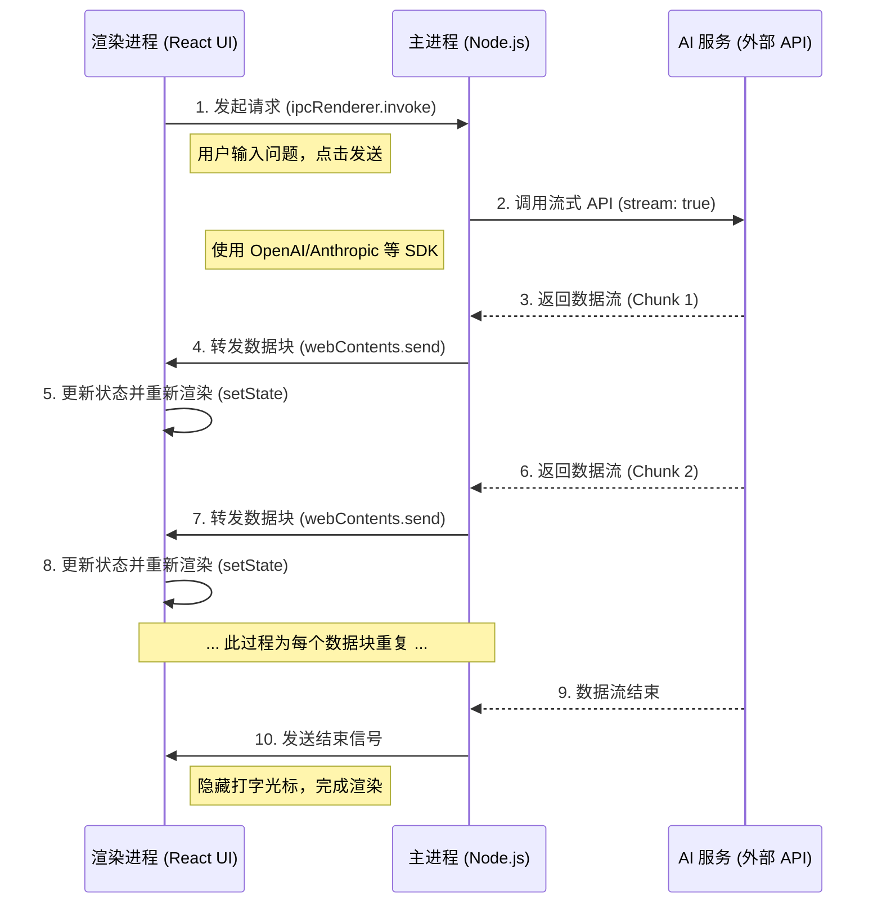

# 技术揭秘：Cherry Studio AI 回复流式渲染架构

本文档旨在详细解析 Cherry Studio 应用中，从用户提问到 AI 模型返回内容，再到界面上实时渲染出格式化 Markdown 的完整技术流程。

## 1. 核心目标

实现一种高效、流畅的用户体验：当 AI 模型以数据流（Stream）的形式返回内容时，应用界面能够实时地、增量地将这些 Markdown 格式的文本渲染为最终用户所见的美观、可读的格式（如代码块高亮、列表、表格等），而不是等待所有内容返回后再统一渲染。

## 2. 关键技术组件

整个流程依赖于项目中的以下核心技术：

-   **Electron**: 作为应用的基础框架，其**主进程 (Main Process)** 与 **渲染进程 (Renderer Process)** 的分离是实现该功能的核心。
-   **React**: 用于构建渲染进程中的用户界面。其组件化的思想和状态驱动的更新机制是实现实时渲染的基础。
-   **Electron IPC (Inter-Process Communication)**: 主进程与渲染进程之间通信的桥梁，用于传递用户输入和 AI 返回的数据块。
-   **AI SDK (如 `openai`, `@google/genai`等)**: 在主进程中调用，并配置为以**流式 (Streaming)** 模式接收响应。
-   **`react-markdown`**: 在渲染进程中使用的关键库，负责将 Markdown 文本字符串动态地转换为格式化的 HTML。

## 3. 详细流程分解

整个过程可以分解为以下五个关键步骤，数据流向为：`渲染进程 -> 主进程 -> AI 服务 -> 主进程 -> 渲染进程`。

### 流程图



---

### 步骤 1: 前端发起请求 (渲染进程)

当用户在聊天界面完成输入并点击发送按钮时，一个 React 组件的事件处理器被触发。此处理器并不直接访问网络，而是通过 Electron 的预加载脚本 (`preload`) 暴露的安全接口，向主进程发送一个 IPC 调用。

-   **通道 (Channel)**: 使用 `ipcRenderer.invoke` 发送一个异步请求，例如在 `'ask-ai-stream'` 通道上。
-   **载荷 (Payload)**: 将用户的提问内容、会话历史等作为参数传递。

**示例代码 (概念性):**
```typescript
// 位置: 某个 React 组件, e.g., /src/renderer/src/components/ChatInput.tsx

const handleSendMessage = async (promptText: string) => {
  const payload = {
    prompt: promptText,
    // ... 其他可能需要的上下文
  };

  // 通过预加载脚本暴露的接口，向主进程发起调用
  // 'ask-ai-stream' 是一个双方约定好的通道名
  await window.electron.ipcRenderer.invoke('ask-ai-stream', payload);
};
```

### 步骤 2: 后端处理 API 请求 (主进程)

主进程中有一个对应的 `ipcMain.handle` 监听器，它会捕获 `'ask-ai-stream'` 通道上的请求。接收到请求后，主进程会执行以下操作：

1.  从安全的配置中获取 AI 模型的 API Key。
2.  初始化对应的 AI SDK (例如 `OpenAI`)。
3.  调用聊天接口 (例如 `openai.chat.completions.create`)，其中最关键的参数是 `stream: true`，这告诉 AI 服务端不要一次性返回所有结果，而是以 Server-Sent Events (SSE) 的形式分块返回。

**示例代码 (概念性):**
```typescript
// 位置: 主进程的某个服务文件, e.g., /src/main/services/AIHandler.ts
import { ipcMain } from 'electron';
import { OpenAI } from 'openai';

const openai = new OpenAI({ apiKey: process.env.OPENAI_API_KEY });

ipcMain.handle('ask-ai-stream', async (event, payload) => {
  const { prompt } = payload;

  const stream = await openai.chat.completions.create({
    model: 'gpt-4o',
    messages: [{ role: 'user', content: prompt }],
    stream: true, // <--- 核心配置：请求流式响应
  });

  // 下一步：处理这个 stream 对象
  // ...
});
```

### 步骤 3: 数据流转发 (主进程 -> 渲染进程)

主进程拿到的 `stream` 是一个可异步迭代的对象。主进程会使用 `for await...of` 循环来消费这个流。

-   **循环读取**: 每当一个新的数据块 (`chunk`) 从 AI 服务端到达，循环就会执行一次。
-   **提取内容**: 从 `chunk` 中解析出实际的文本内容 (`delta.content`)。
-   **立即转发**: 使用 `event.sender.send` (注意是 `.send` 而不是 `.invoke` 的回复)，将这个微小的文本片段立刻发送回发起请求的渲染进程。这通常在一个新的、专门用于流式推送的通道上，例如 `'ai-stream-chunk'`。
-   **结束信号**: 当流处理完毕后，再发送一个明确的结束信号，例如在 `'ai-stream-end'` 通道上，通知前端停止等待。

**示例代码 (概念性):**
```typescript
// 接上一步 ...
ipcMain.handle('ask-ai-stream', async (event, payload) => {
  // ... (API 调用代码)

  try {
    for await (const chunk of stream) {
      const content = chunk.choices[0]?.delta?.content || '';
      if (content) {
        // 将每个文本片段立即发回渲染进程
        event.sender.send('ai-stream-chunk', { content });
      }
    }
  } catch (error) {
    console.error('Stream processing error:', error);
    event.sender.send('ai-stream-error', { message: error.message });
  } finally {
    // 无论成功还是失败，都发送结束信号
    event.sender.send('ai-stream-end');
  }
});
```

### 步骤 4: 前端实时更新状态 (渲染进程)

在渲染进程的 React 组件中，使用 `useEffect` 钩子来设置对主进程推送事件的监听。

-   **状态变量**: 组件内有一个 `useState` 变量，例如 `const [markdown, setMarkdown] = useState('')`，用于存储和累积接收到的 Markdown 文本。
-   **监听数据**: 通过 `ipcRenderer.on('ai-stream-chunk', ...)` 监听数据块。每当接收到一个 `chunk`，就调用 `setMarkdown(prevMarkdown => prevMarkdown + chunk.content)`，将新内容追加到现有状态的末尾。
-   **监听结束**: 同时监听 `'ai-stream-end'`，收到后可以更新一个 `isStreaming` 的状态，例如用于隐藏“打字中”的光标。
-   **清理工作**: `useEffect` 的返回函数中必须包含清理逻辑 (`ipcRenderer.removeListener`)，以防止组件卸载后发生内存泄漏。

**示例代码 (概念性):**
```typescript
// 位置: 某个 React 组件, e.g., /src/renderer/src/components/MessageBlock.tsx
import { useState, useEffect } from 'react';

function MessageBlock() {
  const [markdown, setMarkdown] = useState('');
  const [isStreaming, setIsStreaming] = useState(true);

  useEffect(() => {
    const handleChunk = (_event, { content }) => {
      setMarkdown(prev => prev + content);
    };
    const handleEnd = () => setIsStreaming(false);

    window.electron.ipcRenderer.on('ai-stream-chunk', handleChunk);
    window.electron.ipcRenderer.on('ai-stream-end', handleEnd);

    return () => {
      // 组件销毁时，务必移除监听器
      window.electron.ipcRenderer.removeListener('ai-stream-chunk', handleChunk);
      window.electron.ipcRenderer.removeListener('ai-stream-end', handleEnd);
    };
  }, []); // 空依赖数组确保只在组件挂载时设置监听

  // ... (渲染逻辑见下一步)
}
```

### 步骤 5: 实时 Markdown 渲染 (渲染进程)

这是将数据呈现给用户的最后一步，也是视觉效果最关键的一步。

-   **渲染库**: 项目使用 `react-markdown` 库。
-   **状态驱动渲染**: 该库的组件被放置在 React 组件的 JSX 中，并直接消费 `markdown` 状态变量。
-   **自动更新**: 由于 React 的特性，每当 `setMarkdown` 被调用导致 `markdown` 状态更新时，`MessageBlock` 组件就会自动重新渲染。`react-markdown` 会接收到新的、更长的字符串，并立即将其解析为更新后的 HTML 格式。

这个过程非常快，给用户的感觉就是文字和格式是“凭空出现”并逐渐完成的。

**示例代码 (概念性):**
```typescript
// 接上一步 ...
import ReactMarkdown from 'react-markdown';
import remarkGfm from 'remark-gfm'; // 引入 GFM 插件以支持表格、删除线等

function MessageBlock() {
  const [markdown, setMarkdown] = useState('');
  const [isStreaming, setIsStreaming] = useState(true);

  // ... (useEffect 监听逻辑)

  return (
    <div className="prose"> {/* 使用 TailwindCSS Prose 来美化 */}
      <ReactMarkdown
        remarkPlugins={[remarkGfm]}
        // 可以配置其他插件，例如代码高亮
      >
        {markdown}
      </ReactMarkdown>
      {isStreaming && <span className="typing-cursor">▍</span>}
    </div>
  );
}
```

通过以上五个步骤的紧密协作，Cherry Studio 成功地构建了一个健壮、高效且用户体验极佳的 AI 流式响应渲染系统。