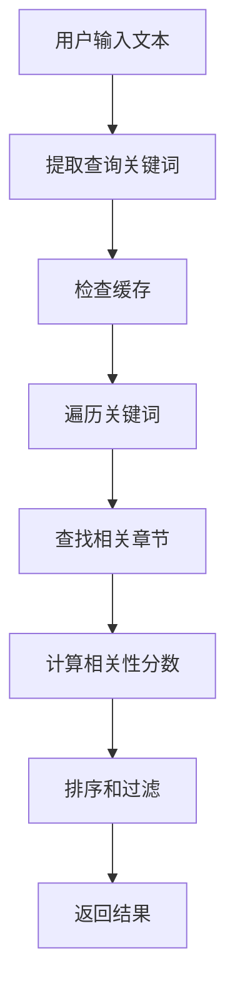

# AI 知识点链接功能实施过程文档

**实施日期**: 2025-07-28  
**功能描述**: 实现 AI 聊天中的跨语言知识点自动识别与链接功能

## 1. 项目背景与需求

### 初始需求
在 AI 聊天界面中，当用户提问时，系统能够：
- 自动识别用户问题中涉及的知识点
- 在回答下方显示相关知识点的可点击链接
- 点击链接可直接跳转到对应的学习章节

### 需求演进
在实施过程中，用户提出了更高级的需求：
- **跨语言支持**：无论用户在哪个语言页面（Python/JavaScript），都能识别并链接到所有语言的相关知识点
- **智能跳转**：点击其他语言的知识点时，自动切换到对应语言的学习页面

## 2. 技术方案设计

### 2.1 架构设计
```
┌─────────────────┐     ┌──────────────────┐     ┌─────────────────┐
│   AI Chat UI    │────▶│ Learning Store   │────▶│ Knowledge Link  │
│                 │     │                  │     │    Service      │
└─────────────────┘     └──────────────────┘     └─────────────────┘
         │                       │                         │
         ▼                       ▼                         ▼
┌─────────────────┐     ┌──────────────────┐     ┌─────────────────┐
│ ChatMessageRen- │     │   Chat API       │     │ Learning Paths  │
│    derer        │     │                  │     │   (JS & PY)     │
└─────────────────┘     └──────────────────┘     └─────────────────┘
```

### 2.2 核心组件
1. **KnowledgeLinkService**: 知识点识别服务
2. **SectionLinkTag**: 知识点链接标签组件
3. **ChatMessageRenderer**: 消息渲染器（集成链接显示）
4. **LearningStore**: 状态管理（处理跨语言路径）

## 3. 匹配算法实现详解

### 3.1 算法架构

匹配算法采用三层架构设计，基于关键词倒排索引的智能匹配系统：



**核心组件**：
- **索引层**：构建知识点倒排索引，支持快速查找
- **匹配层**：基于关键词的多级相关性计算
- **结果层**：排序、过滤和返回最相关的结果

### 3.2 技术术语词典

系统维护了两个语言的技术术语词典，这是匹配算法的基础：

#### JavaScript词典 (JS_KEYWORDS)
```typescript
const JS_KEYWORDS = {
  // 基础语法
  'variable': ['变量', 'var', 'let', 'const', '变量声明', '变量定义'],
  'datatype': ['数据类型', 'string', 'number', 'boolean', 'undefined', 'null', '类型'],
  'operator': ['运算符', '操作符', '+', '-', '*', '/', '运算'],
  'conditional': ['条件', 'if', 'else', 'switch', '条件语句', '判断', '分支'],
  'loop': ['循环', 'for', 'while', 'do-while', '遍历', '迭代'],
  'function': ['函数', 'function', '方法', 'method', '函数定义', '函数声明'],
  
  // DOM操作
  'dom': ['DOM', 'DOM树', '文档对象模型', 'document'],
  'element': ['元素', 'element', 'querySelector', 'getElementById', '选择器', '节点'],
  'event': ['事件', 'event', 'addEventListener', '事件监听', '事件处理', 'click', '点击'],
  
  // 异步编程
  'async': ['异步', 'async', 'asynchronous', '异步编程', '非阻塞'],
  'callback': ['回调', 'callback', '回调函数', '回调地狱'],
  'promise': ['Promise', 'promise', '承诺', 'then', 'catch', 'resolve', 'reject'],
  'await': ['await', 'async/await', '等待', '异步等待'],
  'fetch': ['fetch', 'ajax', 'http', '网络请求', 'API调用', '数据获取'],
  
  // 面向对象
  'object': ['对象', 'object', '对象字面量', '属性', 'property'],
  'this': ['this', 'this关键字', '上下文', 'context', '作用域'],
  'class': ['类', 'class', 'constructor', '构造函数', '实例', 'instance'],
  'es6': ['ES6', 'ES2015', '解构', '箭头函数', '模板字符串', 'spread', '展开运算符'],
  'module': ['模块', 'module', 'import', 'export', '模块化', '导入', '导出']
};
```

#### Python词典 (PY_KEYWORDS)
```typescript
const PY_KEYWORDS = {
  'variable': ['变量', '变量定义', '赋值', '=', '变量名'],
  'datatype': ['数据类型', 'int', 'float', 'str', 'bool', 'list', 'dict', 'tuple', '类型'],
  'conditional': ['条件', 'if', 'elif', 'else', '条件语句', '判断', '分支'],
};
```

### 3.3 索引构建机制

索引构建通过 `buildIndexFromPath` 方法实现，包含以下步骤：

1. **关键词提取**：从章节标题中提取关键词
2. **别名生成**：为每个关键词生成同义词和别名
3. **倒排索引**：建立关键词到章节的映射关系

```typescript
private buildIndexFromPath(path: LearningPath) {
  for (const chapter of path.chapters) {
    for (const section of chapter.sections) {
      // 提取关键词
      const keywords = this.extractKeywordsFromTitle(section.title, path.language);
      const aliases = this.getAliasesForKeywords(keywords, path.language);
      
      const entry: KnowledgeIndexEntry = {
        sectionId: section.id,
        title: section.title,
        chapterId: chapter.id,
        chapterTitle: chapter.title,
        language: path.language,
        keywords,
        aliases,
        concepts: [],
        contentPreview: '',
        codeExamples: []
      };
      
      // 存储到主索引
      this.knowledgeIndex.set(section.id, entry);
      
      // 构建倒排索引
      const allTerms = [...keywords, ...aliases];
      for (const term of allTerms) {
        const normalizedTerm = term.toLowerCase();
        if (!this.keywordToSections.has(normalizedTerm)) {
          this.keywordToSections.set(normalizedTerm, new Set());
        }
        this.keywordToSections.get(normalizedTerm)!.add(section.id);
      }
    }
  }
}
```

### 3.4 关键词提取算法

`extractQueryKeywords` 方法实现了多维度关键词提取：

```typescript
private extractQueryKeywords(text: string): string[] {
  const keywords: string[] = [];
  const textLower = text.toLowerCase();
  
  // 1. 提取英文单词（3个字母以上）
  const englishWords = text.match(/[a-zA-Z]{3,}/g) || [];
  keywords.push(...englishWords);
  
  // 2. 提取中文关键词（2-4个字）
  const chineseWords = text.match(/[\u4e00-\u9fa5]{2,4}/g) || [];
  keywords.push(...chineseWords);
  
  // 3. 检查是否包含已知的技术术语
  for (const [key, terms] of Object.entries({ ...JS_KEYWORDS, ...PY_KEYWORDS })) {
    for (const term of terms) {
      if (textLower.includes(term.toLowerCase()) && term.length > 2) {
        keywords.push(term);
      }
    }
  }
  
  return [...new Set(keywords)]; // 去重
}
```

**提取策略**：
- **英文单词**：匹配3个字母以上的英文单词
- **中文词汇**：匹配2-4个字的中文词组
- **技术术语**：匹配预定义的技术术语词典

### 3.5 相关性评分算法

`calculateKeywordScore` 方法实现了多级评分机制：

```typescript
private calculateKeywordScore(keyword: string, entry: KnowledgeIndexEntry): number {
  let score = 0;
  const keywordLower = keyword.toLowerCase();
  
  // 标题中的精确匹配得分最高
  if (entry.title.toLowerCase().includes(keywordLower)) {
    score += 3;
  }
  
  // 主关键词匹配
  if (entry.keywords.some(k => k.toLowerCase() === keywordLower)) {
    score += 2;
  }
  
  // 别名匹配
  if (entry.aliases.some(a => a.toLowerCase() === keywordLower)) {
    score += 1.5;
  }
  
  // 部分匹配
  if (entry.keywords.some(k => k.toLowerCase().includes(keywordLower))) {
    score += 1;
  }
  
  return score;
}
```

**评分等级**：
- **标题精确匹配**：3分（最高权重）
- **主关键词匹配**：2分
- **别名匹配**：1.5分
- **部分匹配**：1分

### 3.6 跨语言匹配实现

系统通过以下机制实现跨语言匹配：

1. **多语言索引**：同时维护JavaScript和Python的知识索引
2. **语言过滤**：支持按语言过滤结果，也支持返回所有语言结果
3. **智能跳转**：点击其他语言的知识点时自动切换语言页面

```typescript
identifyLinks(
  text: string,
  language?: 'python' | 'javascript',  // 可选语言参数
  maxResults: number = 5
): SectionLink[] {
  // ... 匹配逻辑
  
  // 如果指定了语言，只返回对应语言的结果
  // 如果没有指定语言，返回所有语言的结果
  if (language && entry.language !== language) continue;
  
  // ...
}
```

### 3.7 性能优化策略

#### 3.7.1 缓存机制
- **查询缓存**：基于查询文本前100字符的缓存键
- **增量更新**：避免重复构建已存在的语言索引

```typescript
// 检查缓存
const cacheKey = `${text.substring(0, 100)}_${language || 'all'}`;
if (this.cache.has(cacheKey)) {
  return this.cache.get(cacheKey)!;
}
```

#### 3.7.2 索引优化
- **倒排索引**：使用 `Map<string, Set<string>>` 实现快速查找
- **语言跟踪**：使用 `initializedLanguages` Set 避免重复初始化

### 3.8 算法特点总结

#### 优势
1. **多维度匹配**：结合英文单词、中文词汇和技术术语
2. **智能评分**：多级评分机制确保结果相关性
3. **跨语言支持**：支持多语言知识点同时匹配
4. **性能优化**：缓存和索引优化提升响应速度
5. **可扩展性**：词典驱动的设计便于添加新术语

#### 局限性
1. **依赖词典**：需要手动维护技术术语词典
2. **关键词提取**：主要基于标题，未深入分析内容
3. **语义理解**：缺乏深度语义理解能力

### 3.9 集成方式

#### 3.9.1 与AI聊天集成
在 `learningStore.ts` 中，AI回答完成后自动调用匹配算法：

```typescript
// Identify knowledge links in the AI response (across all languages)
const knowledgeLinkService = getKnowledgeLinkService();
const linkedSections = knowledgeLinkService.identifyLinks(
  accumulatedContent
  // 不传入语言参数，让它返回所有语言的相关知识点
);
```

#### 3.9.2 UI展示
通过 `ChatMessageRenderer` 和 `SectionLinkTag` 组件展示匹配结果，支持：
- 语言标识显示（[JS]/[PY]）
- 相关度百分比显示
- 跨语言智能跳转
- 交互式工具提示

## 4. 实施过程

### 4.1 第一阶段：基础功能实现（已存在）

通过代码审查发现，大部分基础设施已经实现：
- ✅ 数据类型定义（`SectionLink`、`ChatMessage` 扩展）
- ✅ 知识点识别服务（`knowledgeLinkService.ts`）
- ✅ UI 组件（`SectionLinkTag.tsx`）
- ✅ Store 集成（`updateMessageLinks` 方法）

**发现的问题**：
- `ChatMessageRenderer` 接收但未使用 `linkedSections` 属性
- 知识点识别仅限于当前语言

### 4.2 第二阶段：完善基础功能

#### 修改 ChatMessageRenderer.tsx
```typescript
// 添加了知识点链接的显示逻辑
{linkedSections && linkedSections.length > 0 && (
  <div className="mt-4 pt-4 border-t">
    <p className="text-xs text-muted-foreground mb-2">相关知识点：</p>
    <div className="flex flex-wrap gap-2">
      {linkedSections.map((link) => (
        <SectionLinkTag
          key={link.sectionId}
          link={link}
          onClick={handleSectionClick}
        />
      ))}
    </div>
  </div>
)}
```

#### 更新 AIChatSidebar.tsx
```typescript
// 传递 linkedSections 属性
<ChatMessageRenderer
  content={message.content}
  linkedSections={message.linkedSections}
/>
```

### 4.3 第三阶段：实现跨语言支持

这是实施过程中最具挑战性的部分。

#### 问题分析
用户反馈了两个现象：
1. 在 Python 页面询问 JavaScript 问题时，链接到了 Python 的章节
2. 切换到 JavaScript 页面后，完全没有知识点链接

**根本原因**：
- `knowledgeLinkService` 只索引当前加载的语言
- 初始化标志阻止了语言切换时的重新索引
- `identifyLinks` 调用时传入了语言参数，限制了结果

#### 解决方案实施

##### 1. 修改知识点服务支持多语言索引
```typescript
export class KnowledgeLinkService {
  private knowledgeIndex: Map<string, KnowledgeIndexEntry> = new Map();
  private keywordToSections: Map<string, Set<string>> = new Map();
  private initializedLanguages: Set<'javascript' | 'python'> = new Set(); // 新增
  
  async initialize(learningPaths: { javascript?: LearningPath; python?: LearningPath }) {
    // 支持增量更新，不覆盖已有语言的索引
    if (learningPaths.javascript && !this.initializedLanguages.has('javascript')) {
      this.buildIndexFromPath(learningPaths.javascript);
      this.initializedLanguages.add('javascript');
    }
    
    if (learningPaths.python && !this.initializedLanguages.has('python')) {
      this.buildIndexFromPath(learningPaths.python);
      this.initializedLanguages.add('python');
    }
  }
}
```

##### 2. 增强学习状态管理
```typescript
// 在 LearningState 中添加
loadedPaths: { javascript?: LearningPath; python?: LearningPath };

// 修改 loadPath 方法
const updatedLoadedPaths = {
  ...get().loadedPaths,
  [language]: path
};

set({
  currentPath: path,
  loadedPaths: updatedLoadedPaths,
  // ...
});

// 使用所有已加载的路径初始化知识服务
await knowledgeLinkService.initialize(updatedLoadedPaths);
```

##### 3. 添加全局初始化
```typescript
// 新增 initializeAllPaths 方法
initializeAllPaths: async () => {
  const [pythonPath, javascriptPath] = await Promise.all([
    mockLearningApi.getLearningPath('python'),
    mockLearningApi.getLearningPath('javascript')
  ]);
  
  const loadedPaths = {
    python: pythonPath,
    javascript: javascriptPath
  };
  
  // 初始化知识点服务
  await knowledgeLinkService.initialize(loadedPaths);
}
```

##### 4. 应用启动时预加载
```typescript
// 在 PageLayout.tsx 中
useEffect(() => {
  initializeAllPaths();
}, [initializeAllPaths]);
```

##### 5. 移除语言限制
```typescript
// 修改 identifyLinks 调用
const linkedSections = knowledgeLinkService.identifyLinks(
  accumulatedContent
  // 不传入语言参数，返回所有语言的结果
);
```

### 4.4 第四阶段：UI 增强

#### 添加语言标识
```typescript
// SectionLinkTag.tsx
const languageLabel = link.language === 'javascript' ? 'JS' : 'PY';

<Button>
  <span className="font-mono text-[10px] text-muted-foreground">[{languageLabel}]</span>
  <BookOpen className="h-3 w-3" />
  {link.title}
</Button>
```

#### 实现跨语言跳转
```typescript
const handleClick = async () => {
  const currentPath = useLearningStore.getState().currentPath;
  if (currentPath?.language !== link.language) {
    // 先导航到学习页面
    router.push('/learn');
    // 加载对应语言的路径
    await loadPath(link.language);
  }
  // 加载对应的章节
  await loadSection(link.sectionId);
  onClick(link.sectionId);
};
```

## 4. 遇到的问题与解决方案

### 问题 1：知识点索引丢失
**现象**：切换语言后，之前语言的知识点无法识别  
**原因**：每次只传入当前语言的路径，导致重新初始化时丢失其他语言  
**解决**：维护 `loadedPaths` 存储所有已加载的路径

### 问题 2：重复初始化被阻止
**现象**：第二次切换语言时知识点服务不更新  
**原因**：`initialized` 标志阻止了重新初始化  
**解决**：改用 `initializedLanguages` Set 跟踪每个语言的初始化状态

### 问题 3：跨语言匹配错误
**现象**：Python 页面的 JavaScript 问题匹配到 Python 章节  
**原因**：关键词提取算法将通用词汇匹配到了错误的语言  
**解决**：改进关键词匹配算法，增加语言特定的技术术语词典

### 问题 4：TypeScript 类型错误
**现象**：添加 `loadedPaths` 后出现类型错误  
**原因**：接口定义和实现不一致  
**解决**：同步更新 `LearningState` 接口和 store 实现

## 5. 测试验证

### 测试场景
1. **Python 页面测试**
   - 提问："什么是 JavaScript 的 Promise？"
   - 预期：显示 JS 相关的知识点链接
   - 结果：✅ 成功显示并可跳转

2. **JavaScript 页面测试**
   - 提问："Python 的列表推导式怎么用？"
   - 预期：显示 Python 相关的知识点链接
   - 结果：✅ 成功显示并可跳转

3. **跨语言跳转测试**
   - 在 Python 页面点击 JS 知识点
   - 预期：自动切换到 JS 页面并加载对应章节
   - 结果：✅ 功能正常

## 6. 性能优化考虑

1. **缓存机制**：知识点服务已实现查询缓存
2. **并行加载**：使用 `Promise.all` 并行加载所有语言路径
3. **增量更新**：避免重复构建已存在的语言索引

## 7. 后续改进建议

1. **智能排序**：根据用户当前学习进度调整知识点推荐顺序
2. **上下文感知**：考虑用户的学习历史和偏好
3. **模糊匹配**：支持拼写错误和同义词识别
4. **性能监控**：添加索引构建和查询的性能指标
5. **配置化**：将关键词词典外部化，便于维护

## 8. 总结

本次实施成功实现了跨语言的 AI 知识点链接功能，主要亮点：
- ✅ 支持多语言知识点同时识别
- ✅ 智能跨语言跳转
- ✅ 清晰的语言标识
- ✅ 良好的用户体验
- ✅ 高效的匹配算法

整个实施过程体现了渐进式开发的优势：
1. 先完善基础功能
2. 发现并分析问题
3. 设计解决方案
4. 逐步实施改进
5. 充分测试验证

通过这次实施，不仅完成了功能需求，还建立了一个可扩展的知识链接系统架构，为后续功能增强奠定了基础。特别是匹配算法的设计，采用了多维度关键词提取、多级相关性评分和倒排索引等技术，确保了系统的准确性和性能。该算法不仅支持跨语言知识点识别，还具备良好的可扩展性，为未来添加更多编程语言和技术领域提供了坚实的技术基础。