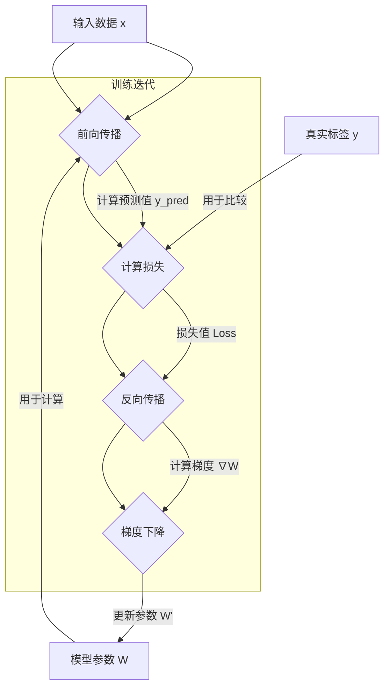

好的，作为一位致力于启发与教育的作家，我将为您精心撰写这一章节。我们的目标不仅是传递知识，更是点燃您对这个领域深刻理解的火花。

---

### 1.2 核心构件(一)：深度神经网络与反向传播

在上一节中，我们站在高处俯瞰了生成模型的宏伟版图。我们知道，这些模型的魔力源于其从数据中学习“创造”的能力。现在，是时候深入其内部，探寻驱动这一切的引擎了。这个引擎，就是**深度神经网络 (Deep Neural Network, DNN)**。

想象一下，我们要创造一个能够模仿任何艺术风格的数字画家。这位“画家”需要具备两个核心能力：首先，它需要一个极其灵活的“大脑”和“手”，能够理论上绘制出任何可能的图像；其次，它需要一个学习机制，让它在看过无数名画后，能不断修正自己的技法，从笨拙的涂鸦者成长为技艺精湛的大师。

深度神经网络，就是那个“大脑”与“手”；而我们即将探讨的**反向传播**与**梯度下降**，则是它自我完善、臻于化境的学习心法。

#### **前馈网络 (FFN): 搭建一个通用学习机器**

在深度学习的庞大家族中，前馈网络（Feedforward Network），特别是其最经典的形式——**多层感知机 (Multilayer Perceptron, MLP)**，是最基础也是最核心的构件。它如同一块块乐高积木，虽然单体简单，却能搭建出令人惊叹的复杂结构。

**问题背景：寻找一个“万能函数”**

在人工智能的早期，研究者们面临一个根本性问题：我们如何构建一个系统，它不必为每个特定任务都从头设计，而是能像生物大脑一样，通过“学习”来适应各种任务？无论是识别猫狗、预测股价还是生成图像，本质上都是在寻找一个复杂的函数 $f$，使得 $y = f(x)$，其中 $x$ 是输入（如一张图片），$y$ 是输出（如标签“猫”）。世界是复杂的，这个函数 $f$ 的形式几乎不可能是简单的线性关系。我们需要一个“万能函数逼近器”（Universal Function Approximator）——一个可以模拟出任何复杂函数的机器。

**解决方案：层层抽象的神经元结构**

MLP的诞生，正是对这个问题的优雅回答。它的灵感来源于生物神经系统。

*   **神经元 (Neuron)**: 想象一个最小的决策单元。它接收来自多个上游单元的信号（输入），每个信号的重要性不同（由**权重 (weights)**决定）。它将所有加权后的信号汇总，并加上一个自身的固有偏好（**偏置 (bias)**）。最后，它通过一个决策规则（**激活函数**）来决定自己向外输出多强的信号。这个过程就像一个委员会成员听取多方意见（输入），根据自己对每个人意见的看重程度（权重）和自己的立场（偏置），最终决定是投赞成票、反对票还是弃权票（输出）。

*   **层 (Layer)**: 单个神经元能力有限，但将它们组织成“层”便能产生强大的集体智慧。
    *   **输入层 (Input Layer)**: 负责接收最原始的数据，比如一张图像的所有像素值。它像公司的前台，只负责接收信息，不做处理。
    *   **隐藏层 (Hidden Layers)**: 这是魔法发生的地方。信息从输入层流向第一个隐藏层，该层的每个神经元都对输入信息进行一次加工，提取出一些初级特征（比如图像中的边缘、角落）。然后，这些初级特征作为输入，被传递给下一个隐藏层，后者则组合这些初级特征，形成更复杂的特征（比如眼睛、鼻子）。随着层数的加深，网络能学习到越来越抽象和复杂的概念（比如人脸）。这就是“深度”学习中“深”的含义——通过层层递进的抽象来理解世界。
    *   **输出层 (Output Layer)**: 最后一层，负责整合所有高级特征，并给出最终的答案。比如，在图像分类任务中，输出层可能会有10个神经元，分别对应0-9这10个数字的概率。

*   **激活函数 (Activation Function)**: 这是整个结构中至关重要的“非线性”开关。
    *   **问题所在**：如果神经元只是简单地将输入加权求和，那么无论网络有多少层，其整体效果都等同于一个单层的线性模型。一个线性模型只能解决线性问题（比如画一条直线来分割数据），却无法学习曲线、边界等现实世界中无处不在的复杂模式。
    *   **解决方案**：在每个神经元的加权和之后，引入一个非线性函数——激活函数。它打破了线性，赋予了网络学习复杂模式的能力。
    *   **常见的激活函数**：
        *   **Sigmoid**: 它能将任何输入值压缩到 (0, 1) 区间，常用于表示概率。它的形状像一个平滑的“S”曲线。在早期，它非常流行，但由于其两端梯度趋近于0（梯度消失问题），在深层网络中容易导致学习停滞。
        *   **Tanh (双曲正切)**: 与Sigmoid类似，但将输出压缩到 (-1, 1) 区间，通常比Sigmoid表现更好，因为其输出是零中心的。但它同样存在梯度消失的问题。
        *   **ReLU (Rectified Linear Unit, 修正线性单元)**: 这是目前最受欢迎的激活函数，其形式极其简单：$f(x) = \max(0, x)$。如果输入大于0，就原样输出；如果小于0，就输出0。它就像一个单向阀门。其优点是计算高效，且在正区间内不会饱和，有效缓解了梯度消失问题，使得训练深层网络成为可能。

通过这种方式，一个前馈网络就搭建完成了。数据像水流一样，从输入层单向地流向输出层，中间经过隐藏层的层层处理，故名“前馈”。它就是我们那位数字画家的“大脑”和“手”，拥有理论上模拟任何复杂功能（画出任何画）的潜力。

#### **损失函数: 为学习指明方向的“罗盘”**

现在，我们的“画家”拥有了身体，但它还不知道什么是“好”，什么是“坏”。当它随机涂鸦一幅画（做出一次预测）后，我们需要给它一个明确的反馈：你这次画得离目标（真实图像）有多远？

这个反馈机制，就是**损失函数 (Loss Function)**。

**类比：玩“冷热”游戏**

想象一下你在一个房间里找一个看不见的宝藏。你的朋友会根据你离宝藏的距离，不断提示你“冷了”（离远了）或者“热了”（离近了）。损失函数就扮演着这个朋友的角色。它计算模型预测值与真实值之间的差距，并输出一个单一的数值——**损失值 (Loss)**。这个值越高，代表模型的预测越离谱（“冰冷”）；这个值越低，代表预测越准确（“滚烫”）。

学习的目标，就是不断调整模型的参数（权重和偏置），使得这个损失值尽可能地小。

*   **均方误差 (Mean Squared Error, MSE)**: 常用于回归任务（预测连续值，如房价）。它计算的是预测值与真实值之差的平方的平均值。平方操作使得所有误差都为正，并且对较大的误差给予更重的“惩罚”。
*   **交叉熵 (Cross-Entropy)**: 常用于分类任务（从多个类别中选择一个，如识别数字）。它衡量的是模型预测的概率分布与真实的概率分布之间的“距离”。如果模型对正确答案给出了极低的概率，那么它的“惊讶程度”会很高，交叉熵损失也就会非常大。

损失函数为我们混乱的参数空间提供了一个清晰、可优化的目标。它将“学习”这个模糊的概念，转化为了一个明确的数学问题：**找到一组参数，使得损失函数的值最小。**

#### **梯度下降与反向传播: 大师的自我修炼心法**

我们有了目标（最小化损失函数），但如何实现它？一个拥有数百万甚至数十亿参数的神经网络，其参数构成的“可能性空间”比宇宙中的原子还要多。我们不可能靠穷举来找到最优解。

**梯度下降 (Gradient Descent): 在迷雾中下山**

**类比：夜间在雾中山中寻找谷底**

想象你身处一座浓雾弥漫的巨大山脉中，你的任务是尽快到达最低的山谷（损失函数的最小值点）。你看不到整个山脉的地形图，唯一能获得的信息就是你脚下这片土地的坡度。你会怎么做？

最直观的策略是：环顾四周，找到最陡峭的下坡方向，然后朝着这个方向迈出一小步。接着，在新的位置重复这个过程：感受坡度，迈出下一步。一步一步，你最终会走到一个山谷。

这个过程就是梯度下降：
*   **山脉的地形**: 就是由所有参数构成的多维损失函数空间。
*   **你所在的位置**: 代表模型当前的一组参数值。
*   **脚下的坡度**: 就是损失函数在当前参数位置的**梯度 (Gradient)**。在数学上，梯度是一个向量，指向函数值增长最快的方向。
*   **最陡峭的下坡方向**: 就是梯度的反方向 (`-gradient`)。
*   **迈出的一小步**: 这一步的“大小”由**学习率 (Learning Rate)**控制。步子太小，下山太慢；步子太大，可能会直接跨过山谷，跑到对面的山坡上，导致无法收敛。

**反向传播 (Backpropagation): 高效分配“改进责任”的艺术**

梯度下降的策略很清晰，但面临一个巨大的技术挑战：在一个拥有数百万参数的深层网络中，如何高效地计算出损失函数对 *每一个* 参数的梯度（即每个参数需要为最终的总误差承担多少“责任”）？

**问题背景：责任的链式分配**

在反向传播算法被广泛应用之前，计算梯度是一件极其困难且计算成本高昂的事情，这极大地限制了神经网络的深度和规模。人们尝试过数值方法（对每个参数进行微小的扰动来估算梯度），但其效率之低，对于大型网络来说完全不可行。

**解决方案：基于微积分链式法则的优雅算法**

反向传播算法的出现，是深度学习发展史上的一个里程碑。它解决了这个效率难题，让训练深度网络成为现实。

**类比：一家公司的问责体系**

想象一个大公司完成了一个项目，但最终结果（总损失）非常糟糕。CEO（输出层）需要追究责任，以便改进。
1.  CEO首先评估与他直接对接的部门经理（最后一层隐藏层）的贡献。他会根据每个经理的工作成果与最终失败的关联度，来计算他们各自应该承担的责任（梯度）。
2.  然后，每个部门经理再用同样的方式，去评估他手下的团队负责人（倒数第二层隐藏层）。他会将CEO分配给自己的总责任，根据每个团队负责人的贡献，再分配下去。
3.  这个“问责”过程一层一层地向后传递，从公司高层一直传递到基层员工（第一层隐藏层），直到每个员工都明确了自己对最终项目失败所负的责任（即损失函数对该员工对应参数的梯度）。

这个从后往前的责任分配过程，就是**反向传播**。它利用微积分中的**链式法则 (Chain Rule)**，从最终的损失开始，逐层向后计算梯度。它首先计算出输出层参数的梯度，然后利用这个结果，高效地计算出前一层参数的梯度，依此类推，就像多米诺骨牌一样，直到计算完所有参数的梯度。

其美妙之处在于，整个过程只需要一次前向传播（计算预测值和损失）和一次反向传播，就能得到所有参数的梯度，计算量被极大地优化了。

下面是一个简化的流程图，展示了这个核心循环：



#### **简要代码示例: 一次完整的训练迭代**

理论是灰色的，而生命之树常青。让我们用PyTorch来将上述流程付诸实践。我们将构建一个最简单的MLP，来学习一个线性函数 `y = 2x + 1`。

```python
import torch
import torch.nn as nn

# 1. 准备数据
# 创建一些样本数据 X, 以及对应的真实标签 y
X = torch.tensor([[1.0], [2.0], [3.0], [4.0]], dtype=torch.float32)
y = torch.tensor([[3.0], [5.0], [7.0], [9.0]], dtype=torch.float32)

# 2. 定义模型结构
# 一个简单的MLP，包含一个输入层，一个隐藏层（4个神经元），一个输出层
class SimpleMLP(nn.Module):
    def __init__(self):
        super(SimpleMLP, self).__init__()
        self.layers = nn.Sequential(
            nn.Linear(1, 4),  # 输入维度1, 输出维度4
            nn.ReLU(),        # ReLU激活函数
            nn.Linear(4, 1)   # 输入维度4, 输出维度1
        )

    def forward(self, x):
        return self.layers(x)

# 3. 初始化模型、损失函数和优化器
model = SimpleMLP()
loss_function = nn.MSELoss()  # 使用均方误差作为损失函数
optimizer = torch.optim.SGD(model.parameters(), lr=0.01) # 使用随机梯度下降优化器，学习率为0.01

print("训练前的模型参数:")
for name, param in model.named_parameters():
    if param.requires_grad:
        print(name, param.data)

# 4. 执行一次完整的训练迭代
print("\n--- 开始一次训练迭代 ---")

# 步骤一: 前向传播 (Forward Pass)
# 将数据输入模型，得到预测结果
y_pred = model(X)
print(f"输入X:\n{X.T}")
print(f"模型预测 y_pred:\n{y_pred.T}")


# 步骤二: 计算损失 (Compute Loss)
# 比较预测结果和真实标签，计算损失值
loss = loss_function(y_pred, y)
print(f"计算出的损失 (Loss): {loss.item()}")

# 步骤三: 反向传播 (Backward Pass)
# PyTorch会自动执行反向传播，计算所有参数的梯度
optimizer.zero_grad() # 在计算梯度前，清空之前的梯度信息
loss.backward()
print("\n执行 loss.backward() 后，各参数的梯度:")
for name, param in model.named_parameters():
    if param.requires_grad:
        print(name, param.grad.data)


# 步骤四: 更新参数 (Update Parameters)
# 优化器根据计算出的梯度，更新模型的权重和偏置
optimizer.step()
print("\n执行 optimizer.step() 后，更新后的模型参数:")
for name, param in model.named_parameters():
    if param.requires_grad:
        print(name, param.data)

print("\n--- 训练迭代结束 ---")
```
这段代码完美地封装了我们讨论的所有核心概念。通过反复执行这个“前向-计算损失-反向-更新”的循环，模型的参数会逐渐被优化，使得 `y_pred` 无限逼近真实的 `y`。我们的“数字画家”也正是在这样一个循环中，通过亿万次的迭代，从无序的噪声中学会了描绘世间万物。

#### **总结与展望**

在这一节中，我们拆解了深度学习的计算基石：

*   **前馈网络 (FFN/MLP)**: 它是一个由神经元和层构成的通用函数逼近器，通过非线性激活函数获得拟合复杂模式的能力。它是我们实现一切学习任务的“躯体”。
*   **损失函数**: 它量化了模型的表现好坏，为学习过程提供了一个明确的优化目标，如同黑暗中的“罗盘”。
*   **梯度下降与反向传播**: 这是学习的“灵魂”。梯度下降提供了“如何改进”的策略（沿着梯度反方向走），而反向传播则提供了“高效计算梯度”的工具，使得大规模深度学习成为可能。

我们已经理解了机器如何“学习”一个给定的任务，即如何调整自己去**拟合**数据。但我们的最终目标是**生成**。一个只会模仿、拟合的模型，还称不上是创造者。

这就引出了一个更深层次的问题：我们如何利用这个强大的函数逼近器，不仅仅是去复制现有的数据分布，而是去学习这个分布本身，并从中**采样**出全新的、前所未见的数据呢？如何将一个“判别者”转变为一个“创造者”？

这个问题的答案，将引导我们进入下一章，真正踏入深度生成模型的奇妙世界。我们将看到，今天所学的这些基础构件，如何被巧妙地重组成各种精妙的生成式架构，如变分自编码器（VAEs）和生成对抗网络（GANs）。准备好，真正的创造之旅，即将开始。