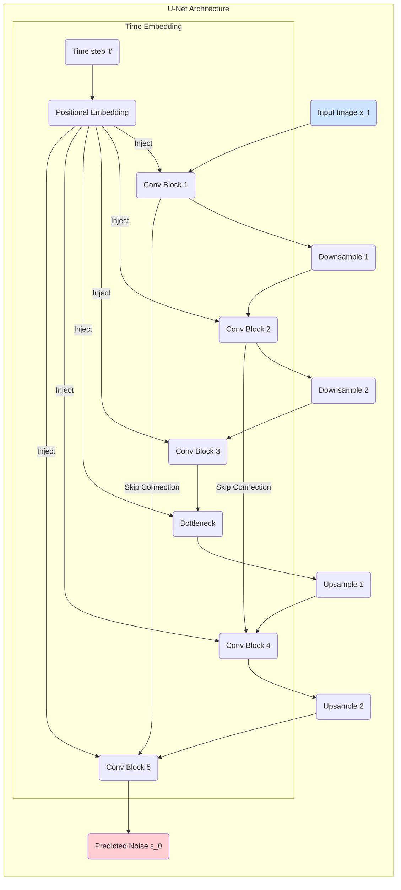

好的，我们已经理解了扩散模型宏观上的双向过程——一个固定的“风化”过程和一个学习的“修复”过程。我们知道，其核心学习任务被巧妙地简化为预测噪声。现在，是时候戴上工程师的放大镜，深入这个“数字修复师”——我们的神经网络——的内部，去探究其运作的每一个齿轮和杠杆。我们必须回答以下几个关键问题：这个预测噪声的目标是如何从复杂的概率理论中推导出来的？我们应该选用什么样的网络结构来完成这个“图像到噪声”的任务？具体的训练和采样算法又是如何一步步执行的？

让我们正式进入扩散模型的技术心脏。

---

### **4.2 核心机制：去噪扩散概率模型 (DDPM)**

在4.1节中，我们建立了宏大的概念框架。现在，我们将聚焦于将这一框架付诸实践的奠基性工作——2020年发布的《Denoising Diffusion Probabilistic Models》（DDPM）。这篇论文不仅极大地提升了扩散模型的生成质量，使其首次能够与顶级的GANs相媲美，更重要的是，它提出了一系列深刻的简化和洞见，为后续所有扩散模型的发展铺平了道路。

#### **训练目标简化: 从建模概率到预测噪声的“神来之笔”**

**问题背景：** 我们之前提到，反向过程的目标是学习 `p_θ(x_{t-1} | x_t)`，即在给定 `t` 时刻噪声图像的条件下，推断出 `t-1` 时刻图像的概率分布。从贝叶斯定理的角度看，这个 `p(x_{t-1} | x_t)` 是一个非常棘手的后验概率，直接对其进行建模非常困难。早期的扩散模型尝试用神经网络去参数化这个分布的均值和方差，但这依然是一个复杂的任务。整个生成模型领域，从变分自编码器（VAE）到流模型（Flow-based Models），都在与如何有效建模复杂概率分布作斗ăpadă。

**DDPM的解决方案：** DDPM的作者们发现，通过一系列精妙的数学推导，这个复杂的后验概率 `p(x_{t-1} | x_t, x₀)`（如果我们知道初始图像`x₀`）可以被表示为一个高斯分布。更令人惊喜的是，这个高斯分布的均值 `μ` 可以用 `x_t` 和 `x₀` 来表示。

回忆一下我们的前向过程公式：`x_t = √(ᾱ_t) * x₀ + √(1 - ᾱ_t) * ε`。
通过简单的代数变换，我们可以反过来用 `x_t` 和 `ε` 来表示 `x₀`：
`x₀ = (x_t - √(1 - ᾱ_t) * ε) / √(ᾱ_t)`

这个公式给了我们一个惊人的启示：**如果我们能在任意时刻 `t`，根据噪声图像 `x_t` 准确地预测出当时添加的噪声 `ε`，我们就能估算出原始的清晰图像 `x₀`！**

一旦我们有了对 `x₀` 的估计（我们称之为 `x̂₀`），我们就可以利用它来计算后验分布 `p(x_{t-1} | x_t, x₀)` 的均值和方差，从而完成去噪的一步。DDPM的作者们进一步证明，如果我们将神经网络的目标设定为直接预测噪声 `ε`，那么整个模型的损失函数可以被极大地简化。

**最终的简化目标：** 模型的训练目标不再是去拟合一个复杂的概率分布，而是变成了一个极其直观的回归问题：
`L_simple = E_{t, x₀, ε} [ ||ε - ε_θ(x_t, t)||^2 ]`

让我们来解读这个“神来之笔”般的简化：

*   `E_{t, x₀, ε}`：表示我们对所有可能的时间步 `t`、所有训练数据 `x₀` 以及所有可能采样的噪声 `ε` 取期望。
*   `ε`：是我们随机采样并添加到 `x₀` 上的“真实噪声”。
*   `ε_θ(x_t, t)`：是我们的神经网络（参数为 `θ`），输入 `t` 时刻的噪声图像 `x_t` 和时间步 `t`，输出它所预测的噪声。
*   `|| ... ||^2`：是均方误差（MSE），衡量真实噪声和预测噪声之间的像素级差异。

**影响：** 这一简化是革命性的。它将一个高深的概率建模问题，转化为了一个深度学习研究者们最熟悉的“图像到图像”的监督学习任务。这就像教一个孩子画画，我们不告诉他“请画一幅具有莫奈风格的画”（一个模糊的目标），而是给他一张被弄脏的画，然后清晰地告诉他“请把这些污渍（噪声）擦掉”（一个明确、可度量的目标）。这种明确性使得训练过程异常稳定，彻底告别了GANs中模式崩溃和梯度消失的噩梦。

#### **网络架构：U-Net，为图像修复而生的完美工具**

现在我们有了一个明确的目标——预测噪声。接下来的问题是，什么样的神经网络架构最适合这个任务？

**问题背景：** 任务的输入是一张噪声图像 (`x_t`)，输出是另一张尺寸完全相同的图像（预测的噪声 `ε_θ`）。这是一种典型的“图像到图像”转换任务。此外，网络必须能够处理不同噪声水平下的图像。一张 `x₁` 的图像和一个 `x_T` 的图像，其内容结构和噪声强度截然不同，模型必须能够感知到它正在处理的是哪个阶段的“风化雕塑”。

**解决方案：U-Net。** U-Net架构最初诞生于生物医学图像分割领域，但事实证明，它几乎是为扩散模型量身定做的。



让我们来分析U-Net为何如此契合：

1.  **编码器-解码器结构（Encoder-Decoder）：**
    *   **编码器（下采样路径）**：网络的前半部分通过一系列卷积和下采样（池化）层，逐步缩小图像的空间尺寸，同时增加通道数。这使得网络能够捕捉从局部纹理到全局结构的**多尺度特征**。就像我们的雕塑修复师，她会先退后几步，眯着眼看清雕塑的整体轮廓和姿态（低分辨率的全局信息），然后再走近观察。
    *   **解码器（上采样路径）**：网络的后半部分则通过一系列上采样（如转置卷积）和卷积层，逐步恢复图像的空间尺寸，最终输出与输入同样大小的噪声预测图。这对应修复师开始着手于细节的精雕细琢。

2.  **跳跃连接（Skip Connections）：** 这是U-Net的灵魂所在。跳跃连接将编码器中对应层级的特征图直接“传送”到解码器中，与解码器的上采样特征图进行拼接。
    *   **类比：** 想象一位考古学家在修复一幅破碎的壁画。他在宏观上规划好了修复区域（解码器的工作），但在填充颜色和纹理时，他会不断地参照壁画的原始碎片（编码器中保存的高频信息），以确保细节的精确性。跳跃连接就是这个“参照原始碎片”的过程。它允许解码器直接利用编码器捕捉到的**高频空间信息**（如边缘、纹理），防止这些关键细节在下采样过程中被完全丢失。对于噪声预测任务而言，这意味着模型能够更精确地定位噪声，并保留原始图像的精细结构。

3.  **时间步 `t` 的嵌入（Time Embedding）：** 为了让模型知道当前的噪声水平，我们不能直接把整数 `t`（例如 583）输入网络。模型很难理解一个孤立数字的含义。
    *   **解决方案：** 借鉴于Transformer模型中的位置编码（Positional Encoding），我们将标量时间步 `t` 转换成一个高维的**时间嵌入向量**。这个向量通过三角函数（sin, cos）来编码时间信息。
    *   **注入方式：** 这个时间嵌入向量会被注入到U-Net的每一个残差块（Residual Block）中，通常是通过加法或拼接的方式。这相当于在修复师工作的每一步，我们都在她耳边轻声提醒：“注意，这块石头已经被风化了583年，噪声水平很高，你需要更大胆地去噪。” 或者 “这块只风化了10年，噪声很细微，小心不要破坏了原有的细节。”

通过这种方式，一个U-Net模型就能够处理从 `t=1` 到 `t=T` 的所有噪声水平，成为一个全能的、感知时间的去噪专家。

#### **训练与采样算法：理论的落地**

有了简化的目标和强大的网络，我们可以将整个DDPM的生命周期总结为两个核心算法：训练和采样。

##### **训练算法 (Algorithm 1: Training)**

训练过程的目标是教会U-Net `ε_θ` 如何精确地预测噪声。

1.  **循环开始**：从我们的训练数据集中，随机抽取一张清晰、真实的图像 `x₀`。
2.  **选择时间步**：从 `1` 到 `T` 之间，随机均匀地选择一个整数时间步 `t`。
3.  **生成噪声**：从标准高斯分布 `N(0, I)` 中，随机采样一个与 `x₀` 尺寸相同的噪声张量 `ε`。
4.  **前向加噪**：使用我们4.1节中提到的闭式解公式，一步到位地计算出 `t` 时刻的噪声图像 `x_t`：
    `x_t = √(ᾱ_t) * x₀ + √(1 - ᾱ_t) * ε`
5.  **预测噪声**：将 `x_t` 和时间步 `t` (经过嵌入处理后) 输入到U-Net模型中，得到预测的噪声 `ε_θ(x_t, t)`。
6.  **计算损失**：计算真实噪声 `ε` 和预测噪声 `ε_θ` 之间的均方误差损失 `L = ||ε - ε_θ(x_t, t)||^2`。
7.  **梯度下降**：根据损失 `L` 计算梯度，并更新U-Net的参数 `θ`。
8.  **重复**：回到第1步，直到模型收敛。

这个过程非常高效，因为每一步迭代都是独立的，我们可以用一个批次（Batch）的图像并行处理以上所有步骤。

##### **采样算法 (Algorithm 2: Sampling)**

当模型训练完成后，我们就拥有了一个强大的噪声预测器。现在，我们可以像我们的“数字修复师”一样，从一片混沌开始创作。

1.  **初始状态**：从标准高斯分布 `N(0, I)` 中采样一个完全随机的噪声图像，作为我们的初始画布 `x_T`。
2.  **迭代去噪循环**：从 `t = T` 开始，依次递减到 `t = 1`，执行以下操作：
    a. **预测噪声**：将当前的图像 `x_t` 和时间步 `t` 输入到我们训练好的U-Net `ε_θ` 中，得到对噪声的预测 `ε_θ(x_t, t)`。
    b. **计算 `x_{t-1}`**：使用下面的公式，从 `x_t` 和预测的噪声 `ε_θ` 中计算出上一步的图像 `x_{t-1}`。
       `x_{t-1} = (1/√α_t) * (x_t - ( (1-α_t) / √(1-ᾱ_t) ) * ε_θ(x_t, t)) + σ_t * z`
       其中，`z` 是一个新采样的标准高斯噪声（如果 `t > 1`），`σ_t` 是一个控制随机性的系数。这个公式的直观理解是：
       *   第一部分 `(1/√α_t) * (x_t - ... * ε_θ)` 是从 `x_t` 中减去我们预测的噪声，这是**去噪的核心**。
       *   第二部分 `σ_t * z` 是在每一步都加入一点点新的随机噪声。这至关重要，因为它确保了即使从同一个 `x_T` 出发，每次的生成结果也可能不同，保证了生成的多样性。它代表了反向过程本身固有的随机性。
3.  **最终结果**：当循环结束 (`t = 1` 完成) 后，我们得到的 `x₀` 就是一张由模型生成的、全新的、清晰的图像。

<br>

<div class="code_example">

**代码示例：DDPM训练与采样的伪代码**

为了让上述算法更加具体，下面是一个基于PyTorch风格的伪代码，展示了其核心逻辑。

```python
import torch

# 假设 unet_model 是一个已经实例化的U-Net模型
# 假设 get_beta_schedule 返回了预设的 beta 值列表
# 假设 get_image_dataloader 返回了数据加载器

# --- 超参数 ---
T = 1000
betas = get_beta_schedule(T)
alphas = 1. - betas
alphas_cumprod = torch.cumprod(alphas, axis=0) # ᾱ_t

# --- 训练循环 ---
def train_step(unet_model, image_batch, optimizer):
    optimizer.zero_grad()
    
    # 1. 随机抽取一张清晰图像 x₀ (这里是一个batch)
    x0 = image_batch
    batch_size = x0.shape[0]

    # 2. 随机选择时间步 t
    t = torch.randint(0, T, (batch_size,), device=x0.device).long()

    # 3. 生成噪声 ε
    epsilon = torch.randn_like(x0)

    # 4. 前向加噪，一步到位计算 x_t
    alpha_t_cumprod = alphas_cumprod.gather(-1, t).reshape(batch_size, 1, 1, 1)
    xt = torch.sqrt(alpha_t_cumprod) * x0 + torch.sqrt(1. - alpha_t_cumprod) * epsilon
    
    # 5. U-Net 预测噪声
    predicted_epsilon = unet_model(xt, t)
    
    # 6. 计算损失
    loss = torch.nn.functional.mse_loss(epsilon, predicted_epsilon)
    
    # 7. 梯度下降
    loss.backward()
    optimizer.step()
    
    return loss.item()

# --- 采样函数 ---
@torch.no_grad()
def sample(unet_model, image_size, batch_size=1):
    # 1. 初始状态 x_T
    xt = torch.randn((batch_size, 3, image_size, image_size), device=unet_model.device)
    
    # 2. 迭代去噪循环
    for i in reversed(range(0, T)):
        t = torch.full((batch_size,), i, device=xt.device, dtype=torch.long)
        
        # a. 预测噪声
        predicted_epsilon = unet_model(xt, t)
        
        # b. 计算 x_{t-1}
        alpha_t = alphas[i]
        alpha_t_cumprod = alphas_cumprod[i]
        
        # 提取公式中的系数
        coeff1 = 1 / torch.sqrt(alpha_t)
        coeff2 = (1 - alpha_t) / torch.sqrt(1 - alpha_t_cumprod)
        
        # 去噪核心
        xt = coeff1 * (xt - coeff2 * predicted_epsilon)
        
        # 添加随机噪声 (如果 t > 0)
        if i > 0:
            beta_t = betas[i]
            noise = torch.randn_like(xt)
            # σ_t^2 可以取不同的值，DDPM中设为β_t
            variance = torch.sqrt(beta_t) * noise 
            xt += variance
            
    # 3. 最终结果
    return xt
```
</div>

<br>

#### **优势与局限：权衡生成质量与速度**

DDPM的提出，为生成模型领域带来了新的范式，其优缺点也十分鲜明。

<div class="comparison">

| 特性 | 优势 | 局限 |
| :--- | :--- | :--- |
| **生成质量** | **极高**。DDPM及其后续变体生成的图像在保真度（Fidelity）和多样性（Diversity）上都达到了顶尖水平，细节丰富，伪影（artifacts）极少。 | - |
| **多样性** | **非常出色**。由于其概率模型的性质和采样过程中的随机性，扩散模型能够很好地捕捉数据的完整分布，有效避免了GANs中常见的模式崩溃问题。 | - |
| **训练过程** | **极其稳定**。基于简单的MSE损失函数进行监督学习，训练过程收敛平稳，对超参数不那么敏感，无需像GANs那样小心翼翼地平衡两个网络的博弈。 | 训练所需的计算资源依然很大，因为需要对一个大型U-Net进行长时间的训练。 |
| **采样速度** | **非常缓慢**。这是扩散模型最主要的缺点。生成一张图像需要进行`T`次（通常是1000次或更多）完整的神经网络前向传播。相比之下，GAN只需要一次前向传播即可生成图像。 | - |

</div>

**总结与展望**

在这一节中，我们拆解了DDPM的核心机械构造。我们理解了它如何通过一个巧妙的简化，将复杂的概率建模问题转化为一个简单的噪声预测任务。我们探究了U-Net架构为何是执行此任务的理想工具，特别是其跳跃连接和时间嵌入机制。最后，我们通过清晰的算法步骤和伪代码，明确了模型的训练和采样流程。

我们现在已经掌握了这位“数字修复师”的全部工作原理。她技艺高超，耐心细致，能够从纯粹的混沌中雕刻出令人惊叹的艺术品。然而，她目前的工作方式更像是一种“无意识的创作”。我们给她一块随机的石头（噪声），她便凭着在训练中形成的“肌肉记忆”去复原一件作品，但具体复原出什么，我们无法预知，也无法控制。

这引出了我们旅程的下一个关键问题：我们如何才能从一个被动的观察者，转变为一个主动的创作者？我们能否给这位修复师下达指令，告诉她我们想要一尊“猫的雕塑”而不是“狗的雕塑”？我们能否提供一张草图，让她在此基础上进行创作？

换言之，我们如何实现对生成过程的**条件控制（Conditional Generation）**？这正是我们将要在下一节中揭开的谜底，也是让扩散模型从一个有趣的玩具，真正蜕变为强大生产力工具的关键一步。