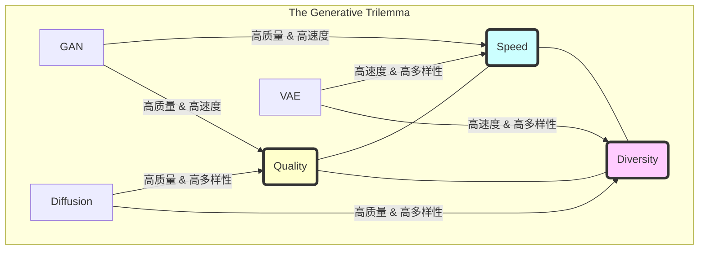

好的，作为一位世界级的教育家与作家，我将为您精心撰写这一章节。我将以引人入胜的叙事手法，结合精准的类比和深刻的技术洞察，带领读者探索生成模型世界中那个迷人而关键的“不可能三角”。

---

### 6.2 宏观视角：生成模型的“不可能三角”

在上一节中，我们已经深入探索了多种生成模型的内部机制。现在，让我们暂时从精密的数学公式和复杂的网络结构中抽身，像一位经验丰富的将军登上山顶，俯瞰整个战场的宏观态势。在生成式AI的广袤疆域中，存在着三股强大的、相互制衡的力量，它们分别是：**生成质量（Quality）**、**采样速度（Speed）**和**生成多样性（Diversity）**。

几乎所有主流的生成模型，都可以被看作是在这三个目标之间进行权衡与妥协的产物。它们如同在地图上选择自己的立足点，靠近一个目标，就必然会远离另一个。这种现象，我们称之为**生成模型的“不可能三角”（The Generative Trilemma）**。理解这个三角关系，不仅能帮助我们从宏观上把握各类模型的性格与特长，更能让我们在面对具体应用时，做出最明智的技术选型。

想象一下你是一位顶级大厨，正在为一场盛大的宴会准备菜肴。你面临三个核心目标：
1.  **菜品味道（质量）**：每一道菜都必须是珍馐美味，令人回味无穷。
2.  **上菜速度（速度）**：宾客满座，你必须在短时间内快速出餐。
3.  **菜单丰富度（多样性）**：你需要提供各式各样的菜品，满足不同宾客的口味，从法式大餐到日式料理，无所不包。

你很快会发现，要同时将这三点做到极致几乎是不可能的。精心烹制的分子料理（高质量）必然耗时良久（低速度）；快餐式的流水线作业（高速度）或许能保证种类繁多（高多样性），但风味上总会欠缺（低质量）。而如果你想在保证极高品质的同时提供丰富的菜品，那么上菜速度将成为巨大的瓶颈。

这，就是我们即将探讨的VAE、GAN和扩散模型所共同面对的困境。现在，让我们逐一审视这三位“风格迥异的艺术家”，看看它们各自是如何在这场权衡的游戏中做出抉择的。

#### VAE：富有创造力的印象派画家

变分自编码器（Variational Autoencoder, VAE）是这个舞台上最早登场的智慧体之一。它的核心使命，源于一个深刻的哲学问题：我们如何才能学会“创造”？

**背景与问题：** 在VAE之前，自编码器（Autoencoder）已经能很好地完成“压缩”与“复现”的任务。它就像一个技艺精湛的复印机，能将一张高清图片压缩成一段简洁的编码（我们称之为“潜在向量”），然后再从这段编码中完美地重建出原图。但问题在于，它的潜在空间是“支离破碎”的。如果你在两个图片的编码之间随便取一个中间点，然后让解码器去“复原”，你得到的很可能是一片毫无意义的混乱图像。这台复印机懂复印，却不懂创作。它缺乏对数据内在结构的“理解”。

**VAE的解决方案与影响：** VAE的革命性在于，它为这个破碎的潜在空间注入了“连续性”和“概率”的灵魂。它不再将一张图片粗暴地映射到一个孤立的点上，而是映射到一个**概率分布**（具体来说，是一个高斯分布的均值和方差）。

**类比：** 想象一下，传统的自编码器是在地图上用一个图钉标记“北京”的位置。而VAE则是画一个圈，说：“‘北京’大概在这个圈的中心，但具体位置可以在这个圈内有一定的浮动。”

这个看似微小的改动，带来了根本性的变化。为了让模型能够有效地重建图像，它必须学会将相似的图片所对应的“概率圈圈”在潜在空间中紧密地排列在一起，避免重叠和空隙。最终，整个潜在空间被这些连续、平滑的概率分布所填满，形成了一片肥沃的“创造力土壤”。现在，你可以在这片土壤上任意选择一个点，解码器都能为你生成一张看起来合理、全新的图像。

**在“不可能三角”中的定位：**

*   **采样速度（极快）：** VAE的生成过程极其高效。一旦模型训练完成，你只需从一个标准正态分布中随机采样一个点（一个潜在向量），然后通过解码器进行一次前向传播，即可得到一张图像。这个过程几乎是瞬时的。它就像那位印象派画家，灵感一来，挥笔即成。
*   **多样性（优秀）：** 得益于其连续、完整的潜在空间，VAE非常擅长捕捉数据分布的全貌。它很少会“忘记”训练数据中的某些类别或风格。只要你在潜在空间中探索，总能发现新奇且多样的组合。它的画风多变，能描绘从日出到星夜的万千景象。
*   **质量（一般）：** 这是VAE最大的软肋。为了维持潜在空间的规整和概率特性（技术上讲，是最小化KL散度），VAE在重建图像时倾向于做出“安全”的选择。它会优先保证生成的内容“看起来像那么回事”，而不是追求像素级别的锐利和真实。这导致其生成的图像常常带有一种标志性的“模糊感”，细节丢失严重。如同印象派的画作，重意境而轻细节，远看神似，近看则笔触模糊。

```mermaid
graph TD
    subgraph VAE (The Impressionist Painter)
        A[Random Latent Vector z] --> B{Decoder Network};
        B --> C[Generated Image (Often Blurry)];
    end
    style A fill:#f9f,stroke:#333,stroke-width:2px
    style C fill:#ccf,stroke:#333,stroke-width:2px
```

#### GAN：追求极致的超写实伪造大师

当人们对VAE的模糊感感到审美疲劳时，生成对抗网络（Generative Adversarial Network, GAN）以一种颠覆性的姿态横空出世，彻底改变了生成领域的游戏规则。

**背景与问题：** VAE的模糊，根源在于其损失函数（ELBO）倾向于像素级别的均值，这与人类的视觉感知系统格格不入。人类判断一张图片是否真实，看的是整体的纹理、结构和光影，而不是每个像素的平均误差。那么，我们能否设计一个能“模仿”人类鉴赏能力的损失函数呢？

**GAN的解决方案与影响：** Ian Goodfellow的天才之处在于，他没有去“设计”这个损失函数，而是让模型去“学习”它。GAN引入了一场永不休止的“猫鼠游戏”，参与者是两位：
1.  **生成器（Generator）：** 一位技艺高超的“伪造大师”，目标是创造出以假乱真的图像。
2.  **判别器（Discriminator）：** 一位眼光毒辣的“艺术评论家”，目标是准确地分辨出哪些是真实作品，哪些是生成器的伪作。

二者在对抗中共同进化。生成器为了骗过判别器，必须学习真实图像中所有复杂的模式和纹理，其作品的逼真度被逼到了前所未有的高度。判别器则不断提升自己的鉴赏水平，迫使生成器更上一层楼。这场博弈的终点，是生成器创造出的图像让判别器再也无法分辨真伪（准确率50%）。

**类比：** 这就像一场警匪追逐。伪钞制造者（生成器）不断提升伪钞的逼真度，而验钞专家（判别器）则不断升级验钞技术。最终，伪钞的质量被锤炼得炉火纯青。

**在“不可能三角”中的定位：**

*   **采样速度（极快）：** 与VAE一样，GAN的生成过程也是一次性的前向传播。从一个随机噪声向量出发，通过生成器网络，一张高清图像便应运而生。它的创作速度，堪比顶级商业摄影师按下快门的一瞬间。
*   **质量（极高）：** 这是GAN的王牌。对抗性训练机制迫使生成器产出在视觉上极具欺骗性的图像。GAN生成的图像以其惊人的清晰度、丰富的细节和逼真的纹理而闻名，长期以来都是高质量图像生成的黄金标准。
*   **多样性（较差）与训练稳定性（差）：** GAN的辉煌伴随着巨大的代价。这场对抗游戏极其脆弱，极难达到平衡，训练过程非常不稳定。更严重的问题是“模式崩溃”（Mode Collapse）。生成器可能会发现一两个“绝招”（例如，只生成特定品种的狗），就能稳定地骗过判别器。一旦如此，它就会失去探索其他可能性的动力，永远只画那几样东西，导致生成的多样性急剧下降。这位伪造大师或许能完美复制伦勃朗的风格，却画不出一幅毕加索。

```mermaid
graph TD
    subgraph GAN (The Hyper-realistic Forger)
        A[Random Noise Vector z] --> B{Generator Network};
        B --> C[Generated Image (High Quality)];
        D[Real Image] --> E{Discriminator Network};
        C --> E;
        E --> F[Real or Fake?];
    end
    style B fill:#9f9,stroke:#333,stroke-width:2px
    style E fill:#f99,stroke:#333,stroke-width:2px
```

#### 扩散模型：耐心雕琢的米开朗基罗

在VAE的模糊和GAN的尖锐之间，似乎存在着一条难以逾越的鸿沟。我们需要一种既能保证高质量，又能覆盖广泛多样性，并且训练稳定的方法。此时，扩散模型（Diffusion Models）以一种“返璞归真”的姿态，优雅地登上了历史舞台。

**背景与问题：** GAN的训练如同走钢丝，而VAE的质量上限又显而易见。研究者们开始思考：我们是否能将“生成”这个一步到位的复杂任务，分解成一系列更简单、更可控的小步骤？

**扩散模型的解决方案与影响：** 扩散模型的灵感来源于非平衡热力学。它的核心思想极其巧妙：
1.  **前向过程（加噪）：** 先学会如何“毁灭”。它从一张清晰的图像开始，在一个漫长的过程中，一步步、极其微量地向图像中添加高斯噪声，直到图像最终变成一片纯粹的、无意义的随机噪声。这个过程是固定的、无需学习的。
2.  **反向过程（去噪）：** 再学会如何“创造”。模型的核心任务是学习这个“毁灭”过程的逆过程。它需要看着一张带有少量噪声的图片，预测出它在上一步“更干净”时的样子（或者直接预测被添加的噪声）。

生成一张新图像时，我们从一片完全随机的噪声开始，然后反复调用这个训练好的“去噪”网络，一步步地、耐心地将噪声抹去，如同雕塑家从一块璞玉中逐渐显露出佛像的轮廓，最终得到一张清晰、完美的图像。

**类比：** 这就像观看一段视频的倒放。正放是冰块（清晰图像）在室温下逐渐融化成一滩水（随机噪声）。而扩散模型的生成过程，就是学会如何精确地控制温度和环境，让那滩水重新凝结成原来那块冰。每一步的凝结都非常微小和精确，最终的结果自然精美绝伦。

**在“不可能三角”中的定位：**

*   **质量（极高）：** 扩散模型通过迭代式的精细调整，能够生成细节极其丰富、构图极其自然的图像，其质量在许多任务上已经超越了最顶级的GAN。每一步去噪都只处理一个简单的小问题，累积起来便成就了惊人的整体效果。
*   **多样性（优秀）：** 由于生成过程始于纯粹的随机噪声，且每一步的去噪都受到随机性的轻微影响，扩散模型能够非常好地覆盖整个数据分布，几乎没有模式崩溃的困扰。它既能雕刻大卫像，也能塑造思想者。
*   **采样速度（极慢）：** 这是扩散模型目前最大的“阿喀琉斯之踵”。生成一张图像需要进行成百上千次的迭代，每一次迭代都需要完整地运行一次庞大的神经网络。这使得其采样速度比VAE和GAN慢上几个数量级。这位伟大的雕塑家，完成一件作品需要数周甚至数月的时间。

```mermaid
graph TD
    subgraph Diffusion Model (The Patient Sculptor)
        A[Pure Noise] -- Step 1: Denoise --> B(Slightly Less Noise);
        B -- Step 2: Denoise --> C(...);
        C -- ... --> D(Almost Clean Image);
        D -- Step N: Denoise --> E[Final High-Quality Image];
    end
    style A fill:#f9f,stroke:#333,stroke-width:2px
    style E fill:#ccf,stroke:#333,stroke-width:2px
```

#### 视觉化总结：不可能三角

为了更直观地理解三者的权衡，我们可以用一张图来描绘它们在“不可能三角”中的位置：



| 模型家族 | 核心思想 | 生成质量 | 采样速度 | 生成多样性 | 典型应用/特点 |
| :--- | :--- | :--- | :--- | :--- | :--- |
| **VAE** | 概率潜在空间+重建 | 一般（模糊） | **极快** | **优秀** | 图像编辑、风格迁移、数据插值 |
| **GAN** | 生成器与判别器对抗 | **极高**（清晰） | **极快** | 较差（模式崩溃） | 超高分辨率图像生成、人脸生成 |
| **Diffusion** | 迭代去噪 | **极高**（真实） | 极慢 | **优秀** | 文生图（DALL-E 2, Midjourney） |


#### 打破三角：融合与展望

这个“不可能三角”是描述当前技术现状的有力框架，但它并非牢不可破的物理定律。事实上，当前研究的前沿正是在于如何“打破”这个三角，或者说，创造出更靠近中心的、更全能的模型。

**技术融合的趋势**已然显现：

*   **VAE-GAN：** 结合VAE稳定的潜在空间和GAN强大的判别器，用判别器作为VAE重建损失的一部分，从而显著提升VAE生成图像的清晰度。
*   **Latent Diffusion（潜在扩散）：** 这是Stable Diffusion等模型的关键。它们并不直接在像素空间进行耗时的去噪，而是先用一个类似VAE的自编码器将图像压缩到低维的潜在空间，在这个小得多的空间里完成扩散过程，最后再用解码器还原。这是一种“VAE+Diffusion”的智慧融合，极大地提升了采样速度，使得扩散模型变得前所未有地实用。
*   **加速扩散采样：** 通过更智能的采样算法，或者训练一个模型来预测如何一次性跨越多步去噪（GAN有时也被用于此），研究者们正在努力将扩散模型的迭代次数从上千步减少到几十步甚至几步。

#### 结语与启发

我们从VAE的概率之美，走到GAN的对抗之巅，再到扩散模型的从容之境。这三大家族，以各自独特的哲学，在质量、速度与多样性的三元悖论中给出了自己的答案。它们没有绝对的优劣，只有在特定场景下的适与不适。

“不可能三角”为我们提供了一张宝贵的地图，指引我们在广阔的生成模型世界中航行。但更重要的是，它揭示了创新的方向。每一个试图打破这个三角的努力，都在推动着整个人工智能领域向前迈进。

当我们展望未来，不禁会问：

*   下一个颠覆性的生成范式会是什么？它会从哪个全新的角度来解决这个三元悖论？
*   除了这三个维度，未来我们是否会关注更多新的维度，比如可控性、可解释性、计算能效或是伦理安全性？
*   最终，我们能否创造出一个真正位于三角中心的“圣杯”模型——它既能瞬时挥洒，又能包罗万象，且每一笔都如神来之作？

对这些问题的探索，正是驱动我们不断前行的动力。而这趟旅程，才刚刚开始。