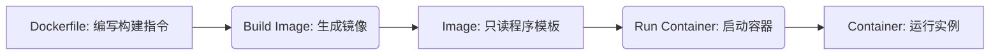

## 2.2 核心思想：软件的“集装箱”化——“一次构建，随处运行”的承诺

我们已经深入剖析了“在我电脑上明明是好的！”这一咒语背后的无奈，理解了应用程序对其运行环境的**隐式依赖**是如何悄无声息地制造混乱的。我们还看到了虚拟机（VM）虽然提供了解决方案，却因其“过重”的身躯，无法满足现代软件对效率和灵活性的极致追求。

现在，是时候揭开这场困境的终极解药了。想象一下，如果有一种技术，能够将你的应用程序——连同它运行所需的一切，从操作系统微小的配置差异，到所有依赖库的版本，再到环境变量的设置——全都打包在一个轻巧、自足、可移植的“盒子”里。这个“盒子”一旦被封装完成，无论你把它放在哪台服务器上，都能像在一个完美的、预设好的环境中一样，毫无偏差地启动和运行。

这并非天方夜谭，这正是**容器（Container）技术**的核心承诺：将软件及其运行环境进行“集装箱”化。它以一种革命性的方式，终结了环境不一致的噩梦，开创了“一次构建，随处运行”（Build Once, Run Anywhere）的全新范式。

### 2.2.1 核心类比：海运集装箱——软件世界的标准化运输革命

要理解容器的革命性，我们不妨回到开篇提到的那个意象：**海运集装箱**。

在集装箱发明之前，全球物流是一场混乱的噩梦。每一批货物都有其独特的形状、尺寸和包装，从港口装载到货轮，再到卸载和陆路运输，都需要定制化的处理和大量的体力劳动。装卸效率低下，货物损毁率高，运输成本居高不下，且难以规模化。例如，一艘船运载的散装小麦，需要特定的铲斗和存储方式；而同时运载的机械零件，则需要不同的吊具和固定方式。

直到上世纪中叶，马尔科姆·麦克莱恩（Malcom McLean）发明了标准化的海运集装箱。这个看似简单的铁皮箱子，尺寸统一，结构坚固，可以容纳各种形状和大小的货物。一旦货物被装入并密封在集装箱内，它就成了一个标准化的运输单元。

**这个类比，在软件世界中完美复现：**

1.  **货物（Cargo）即是你的应用程序及其运行时环境（Application & Runtime Environment）**：
    *   在传统模式下，你的应用程序就像那堆形状各异的散装货物。它依赖于特定的操作系统版本、Python解释器或Java虚拟机、各种库文件（`numpy`、`requests`、`Spring`等）、以及数据库连接字符串、API密钥等环境变量。这些都是应用程序“运行”所需的“包装”和“支撑”。
    *   **容器**的作用，就是将你的应用程序代码、它所需的所有依赖库、配置文件、以及它运行所必需的最小化操作系统环境（如一个精简的Linux文件系统）——所有这些**紧密捆绑、不可分割**地——封装到一个独立的、自给自足的单元中。

2.  **集装箱（Container Box）即是标准化的容器单元**：
    *   一旦你的应用程序及其所有依赖被完整地打包，它就成了一个**标准化的单元**。这个单元由**容器镜像 (Container Image)** 来定义其静态内容和结构，并以**容器实例 (Container Instance)** 的形式来运行。它拥有明确的接口（端口），可以被统一的“起重机”（容器引擎）识别和操作。
    *   这个单元被设计成**隔离**的。容器内的“货物”不会影响容器外的环境，反之亦然。无论容器内装着什么，它对外部而言，都只是一个符合标准的箱子。

3.  **货轮、卡车、火车（Ship, Truck, Train）即是你的服务器（Host Server）**：
    *   装载这些集装箱的可以是远洋巨轮，也可以是陆地上的卡车或火车。这些运输工具本身无需关心集装箱里装的是什么货物，它们只需要知道如何装载、运输和卸载标准尺寸的集装箱即可。
    *   同样，在软件世界中，无论你的应用集装箱是被部署到开发者的本地电脑、测试服务器、公司私有云，还是亚马逊AWS、阿里云、腾讯云等公有云的任何一台机器上，只要这台机器安装了**容器运行时（Container Runtime，如Docker）**，它就能以同样的方式被启动、运行和管理。

**“一次构建，随处运行”的革命性承诺**，正是源于这种高度的标准化和封装隔离。你只需在开发环境中精心打造和测试你的应用程序集装箱（即**容器镜像**），确保它在内部完美运行。一旦这个镜像构建完成并验证无误，它就成为了一个**不可变**的工件。之后，你可以将这个镜像分发到任何地方——测试环境、预发布环境、生产环境，甚至新同事的电脑——所有这些环境都将使用同一个镜像来启动应用程序。这意味着，应用程序运行的底层环境，从系统库到依赖版本，都将是**完全一致**的。

“在我电脑上明明是好的！”的问题，便烟消云散了。因为“你电脑上”的那个“集装箱”，就是“生产环境”将要运行的那个“集装箱”。

### 2.2.2 从“虚拟机”的重量到“容器”的轻盈：架构的革命性飞跃

既然虚拟机也能提供环境隔离和一致性，那么容器到底有何不同，能够被称为“轻量级”的革命？核心差异在于它们所处的**抽象层级**。

我们来回顾一下虚拟机的工作方式：它通过**Hypervisor**在物理硬件之上模拟出一个完整的虚拟硬件，然后在其上运行一个**完整的操作系统（Guest OS）**，包括其独立的内核、系统库和所有系统进程。应用程序则运行在这个Guest OS之上。

而**容器**，则采取了一种截然不同的策略。它直接在**宿主机操作系统（Host OS）的内核**之上运行，通过隔离技术（如Linux的命名空间 `namespaces` 和控制组 `cgroups`）在用户空间中创建出一个独立的运行环境。

我们可以通过下图来直观地对比两者：

```mermaid
graph TD
    subgraph 虚拟机 (Virtual Machine)
        A[应用 A] --- B[Guest OS A]
        C[应用 C] --- D[Guest OS C]
        E[应用 E] --- F[Guest OS E]
        subgraph Hypervisor
            G[虚拟化层]
        end
        B -- 运行在 --> G
        D -- 运行在 --> G
        F -- 运行在 --> G
        G -- 运行在 --> H[物理硬件]
    end

    subgraph 容器 (Container)
        I[应用 I]
        J[应用 J]
        K[应用 K]
        subgraph 容器引擎 (Container Engine/Runtime)
            L[Docker / containerd / CRI-O]
        end
        I -- 运行在 --> L
        J -- 运行在 --> L
        K -- 运行在 --> L
        L -- 利用 --> M[宿主机操作系统内核]
        M -- 运行在 --> N[物理硬件]
    end

    style A fill:#f9f,stroke:#333,stroke-width:2px;
    style B fill:#9f9,stroke:#333,stroke-width:2px;
    style C fill:#f9f,stroke:#333,stroke-width:2px;
    style D fill:#9f9,stroke:#333,stroke-width:2px;
    style E fill:#f9f,stroke:#333,stroke-width:2px;
    style F fill:#9f9,stroke:#333,stroke-width:2px;
    style G fill:#ccc,stroke:#333,stroke-width:2px;
    style H fill:#eee,stroke:#333,stroke-width:2px;
    style I fill:#f9f,stroke:#333,stroke-width:2px;
    style J fill:#f9f,stroke:#333,stroke-width:2px;
    style K fill:#f9f,stroke:#333,stroke-width:2px;
    style L fill:#9cc,stroke:#333,stroke-width:2px;
    style M fill:#9f9,stroke:#333,stroke-width:2px;
    style N fill:#eee,stroke:#333,stroke-width:2px;
```

从图中我们可以清晰地看到两者最核心的区别：

*   **虚拟机**：每个VM都拥有一个**完整的Guest OS**。这意味着它携带了自己的内核，消耗了大量的系统资源（CPU、内存、磁盘），并且启动时需要完整的操作系统引导过程。
*   **容器**：所有的容器都**共享宿主机的操作系统内核**。它们不需要独立的Guest OS，只需要在宿主机内核之上，通过容器引擎提供的隔离机制，运行应用程序及其所需的精简文件系统和依赖。

这种架构上的差异带来了容器的显著优势：

1.  **资源消耗极低**：由于不需要为每个应用复制一个完整的操作系统，容器只打包了应用本身及其必要的运行时环境。它共享宿主机的内核，这意味着每个容器只需占用几MB到几十MB的内存和极少的CPU开销。这使得在同一台物理服务器上，可以运行数十甚至数百个容器，从而极大地提高了硬件资源的利用率。
2.  **启动速度快如闪电**：启动一个容器，仅仅是启动一个或一组被隔离的进程，而不是启动一个完整的操作系统。因此，容器可以在毫秒级到秒级的时间内启动，这对于快速部署、弹性伸缩以及故障恢复至关重要。
3.  **高度可移植性**：容器镜像相对轻量（通常几十MB到几百MB），易于分发和存储。一个容器镜像可以在任何支持容器运行时的机器上无缝运行，无论是开发者的笔记本、测试服务器，还是云端的大规模集群。
4.  **一致的运行时环境**：这是容器解决“在我电脑上明明是好的！”的根本。容器确保了应用程序及其所有依赖都在一个预定义、一致的环境中运行，无论底层宿主机环境如何。
5.  **简化管理**：容器的生命周期管理相对简单。通过统一的容器引擎和工具，可以轻松地进行启动、停止、删除、升级和回滚操作。

容器的轻量级和高效性并非偶然，而是Linux内核深耕多年隔离技术的结晶。其核心在于两大支柱：

*   **命名空间（Namespaces）**：它提供了进程隔离，让每个容器“感觉”自己拥有独立的系统资源，如进程ID（PID）、网络接口、挂载点、用户ID等。例如，一个容器内的进程无法看到或影响另一个容器内的进程，它们都有自己的文件系统视图和网络配置。
*   **控制组（Control Groups, Cgroups）**：它限制和隔离了进程组的物理资源使用，如CPU、内存、磁盘I/O和网络带宽。这确保了一个容器不会耗尽宿主机的所有资源，影响到其他容器或宿主机本身的稳定性。

正是这些底层内核技术的巧妙结合，使得容器能够在共享宿主机内核的同时，实现近似虚拟机的隔离效果，但却以远低于虚拟机的资源开销和启动速度运行。我们不再需要为每一道“菜谱”都运送一套完整的厨房，而是为每一道菜，提供一个经过精心配置的、自足的“烹饪单元”，它能高效地在任何标准厨房（宿主机）中工作。

### 2.2.3 容器世界的三位一体：Dockerfile、镜像与容器实例

在容器技术的世界里，有三个核心概念如同三位一体，它们紧密协作，共同构成了从“代码”到“运行中程序”的完整生命周期。它们分别是：**Dockerfile、镜像（Image）和容器（Container）**。理解它们之间的关系，是掌握容器技术的关键。

#### 2.2.3.1 Dockerfile：构建镜像的蓝图与说明书

想象一下，你要批量生产标准化的集装箱。你需要一份详尽的**制造蓝图**。这份蓝图会精确定义从基础选材到最终成品的所有步骤，例如：使用何种规格的钢板作为基础（基础镜像），内部需要安装哪些固定装置（安装依赖），将什么货物封装进去（复制代码），以及在箱体外喷涂什么操作标识（配置启动命令）。

在容器世界中，这份制造蓝图就是**Dockerfile**。

**Dockerfile**是一个文本文件，其中包含了一系列指令，这些指令描述了如何一步步地构建一个**容器镜像**。它定义了以下关键内容：

*   **基础镜像（Base Image）**：你的应用将运行在什么之上？比如 `ubuntu:20.04` (一个精简的Ubuntu系统) 或 `python:3.9-slim` (预装了Python 3.9的精简系统)。这就像选择集装箱的“基础规格”。
*   **依赖安装（Dependencies Installation）**：需要安装哪些软件、库、工具？例如，`apt-get install`、`pip install`、`npm install` 等命令。
*   **代码复制（Code Copying）**：将你的应用程序源代码复制到镜像中。
*   **环境变量设置（Environment Variables Setting）**：定义应用运行时所需的变量，如数据库连接字符串、端口号。
*   **暴露端口（Exposing Ports）**：声明容器将监听哪些网络端口。
*   **启动命令（Startup Command）**：当容器启动时，应该执行什么命令来运行你的应用程序？例如 `CMD ["python", "app.py"]`。

**Dockerfile 的重要性在于：**
*   **可重复性（Reproducibility）**：每次根据同一个 Dockerfile 构建，都会得到相同的镜像。
*   **版本控制（Version Control）**：Dockerfile 可以像代码一样被版本控制，方便团队协作和历史追溯。
*   **自动化（Automation）**：它使得镜像的构建过程可以完全自动化，集成到持续集成/持续部署 (CI/CD) 流程中。

#### 2.2.3.2 镜像（Image）：预制好的、只读的程序模板

如果说 Dockerfile 是制造集装箱的**蓝图**，那么根据这份蓝图生产出来的、封装好货物、处于静态待运状态的集装箱本身，就是**镜像（Image）**。

在容器世界中，**镜像（Image）**就是那个“预制好的、只读的程序模板”。它是一个静态的、轻量级的、可执行的软件包，其中包含了运行一个应用程序所需的一切：

*   应用程序的代码。
*   运行时环境（例如Python解释器、Node.js运行时、JVM等）。
*   系统库、工具和依赖。
*   配置文件。

**镜像的几个关键特性：**
*   **只读性（Read-Only）**：一旦镜像构建完成，就不能再修改。这保证了它的不可变性，确保了在任何地方运行都是相同的。
*   **分层存储（Layered Storage）**：镜像是通过一系列只读层（layers）构建起来的。每一层代表Dockerfile中的一个指令。这种分层机制使得镜像的共享和存储更加高效。例如，多个基于相同Ubuntu基础镜像的应用程序，只需下载一次Ubuntu层。
*   **可移植性（Portability）**：由于其自包含和标准化，镜像可以在任何支持容器的操作系统上运行，无需担心环境差异。你可以把它上传到镜像仓库（如Docker Hub），然后从任何地方拉取（pull）下来使用。

可以把镜像看作是软件的“**集装箱模板**”或者“**集装箱蓝图**”——它定义了集装箱内部有什么，以及如何被包装，但它本身尚未被“启动”而成为一个运行中的实体。

#### 2.2.3.3 容器（Container）：镜像的运行实例

现在，你有了一个预制好的集装箱（镜像）。你需要把它吊上货轮（服务器），并启动其内部的温控或运转设备（运行程序），才能让它成为一个**正在运输途中的、发挥实际作用的集装箱**。

在容器世界中，**容器（Container）**就是**镜像的一个运行实例**。它是将镜像加载到内存中，并由容器引擎（如Docker）启动的**一个或一组被隔离的进程**。

**容器的关键特性：**
*   **隔离性（Isolation）**：每个容器都有自己独立的文件系统、网络接口、进程空间和资源限制。这得益于我们前面提到的Linux命名空间和控制组技术。
*   **生命周期（Lifecycle）**：容器有明确的生命周期：启动、运行、暂停、停止、重启、删除。当容器停止或删除时，它所做的任何写入文件系统的更改（除非被明确地持久化到外部存储）都会丢失，这强化了其“无状态”的特性，并鼓励开发者设计更健壮的应用。
*   **可伸缩性（Scalability）**：由于容器的轻量级和快速启动特性，你可以根据需求轻松地启动多个相同镜像的容器实例，以应对流量高峰。

**三者之间的演进关系：**

1.  **Dockerfile** 是起点，它是一份**文本描述**，告诉我们如何构建一个镜像。
2.  通过**容器引擎的构建命令**（如 `docker build -t myapp .`），根据 Dockerfile 的指示，我们得到一个**只读的、静态的容器镜像**。这个镜像被存储在本地或者镜像仓库中。
3.  通过**容器引擎的运行命令**（如 `docker run myapp`），我们用这个镜像启动一个或多个**运行中的容器实例**。每个容器都是一个独立的、隔离的应用程序运行时。

这个流程可以简洁地概括为：



### 2.2.4 容器化带来的深远影响

容器技术不仅仅是解决了“在我电脑上明明是好的！”这个恼人的问题，它还带来了对整个软件开发、部署和运维流程的革命性变革：

1.  **彻底解决环境一致性问题**：这是容器最直接、最核心的价值。无论是开发者的本地机器、测试环境、预发布环境还是生产环境，都运行着完全相同的容器镜像，从而彻底消除了因环境差异导致的各种问题。
2.  **加速开发与部署流程（CI/CD）**：由于镜像的不可变性和可移植性，自动化测试、部署和回滚变得异常简单和可靠。开发者可以在本地快速构建和测试容器，然后直接将这个容器镜像推送到中央仓库，供后续环境使用，大大缩短了从代码提交到上线的周期。
3.  **提升资源利用率与成本效益**：相较于虚拟机，容器的轻量级使得在单台物理服务器上可以运行更多应用，从而更有效地利用硬件资源，降低了基础设施成本。
4.  **增强可移植性与云原生（Cloud Native）**：容器是云原生时代的基础。它使得应用程序可以轻松地从本地环境迁移到任何云平台，或者在不同的云服务商之间自由迁移，实现了真正的云无关性（Cloud Agnostic）。这为构建高度弹性、可伸缩的分布式系统奠定了基础。
5.  **促进微服务架构**：容器的隔离特性使其成为实现微服务架构的理想选择。每个微服务可以被打包成一个独立的容器，拥有自己的生命周期和资源，便于独立开发、部署和伸缩。
6.  **简化运维与管理**：标准化让运维变得更加简单。运维人员无需深入了解每个应用的特定技术栈，只需掌握容器的基本操作和管理工具即可。这极大地降低了运维复杂性。

### 展望未来：迈向自动化管理的容器宇宙

至此，我们已经深入了解了容器化如何通过其核心类比、轻量级架构和三大核心概念（Dockerfile、镜像、容器），彻底革新了软件的构建、打包和运行方式。我们告别了“在我电脑上明明是好的！”的时代，迎来了“一次构建，随处运行”的曙光。

然而，当你的应用程序不再是单一的一个集装箱，而是由数十个、数百个甚至数千个相互协作的容器组成时，新的挑战也随之而来。如何高效地编排、调度、管理、监控和扩展这些庞大的容器集群？如何确保它们在高并发下的稳定运行，并在故障时自动恢复？

这些问题，正是下一阶段我们将要探讨的核心。容器的出现，为我们构建“云端未来”奠定了基石，但要真正驾驭这个由无数“标准集装箱”组成的动态宇宙，我们还需要更强大的工具和理念。

---

**本章要点回顾**：

*   **核心理念**：容器技术通过**软件的“集装箱”化**，实现了应用程序及其运行时环境的统一封装，践行了“一次构建，随处运行”的承诺，彻底解决了环境一致性问题。
*   **海运集装箱类比**：应用程序及其依赖是“货物”，容器是“标准集装箱”，服务器是“货轮/卡车”，确保了软件无论在哪里都能被标准、高效地处理。
*   **容器 vs. 虚拟机**：容器通过**共享宿主机操作系统内核**（利用命名空间和控制组）实现隔离，相比虚拟机运行完整Guest OS，具有**资源消耗低、启动速度快、可移植性高**的显著优势。
*   **三位一体**：
    *   **Dockerfile**：构建镜像的**蓝图**和**指令集**，确保构建过程的可重复性和自动化。
    *   **镜像（Image）**：根据Dockerfile构建的**只读、自包含、静态的应用程序模板**，包含了应用运行所需的一切。
    *   **容器（Container）**：镜像的**运行实例**，是隔离的、具有独立生命周期的应用程序进程。
*   **深远影响**：容器化加速了开发部署（CI/CD），提升了资源利用率，增强了应用的可移植性与云原生能力，并促进了微服务架构的发展，极大地简化了运维管理。

我们已经打开了软件集装箱的大门，看到了其内部的奥秘。接下来，我们将探索如何有效地管理这些集装箱，让它们在云端舞台上协同起舞。