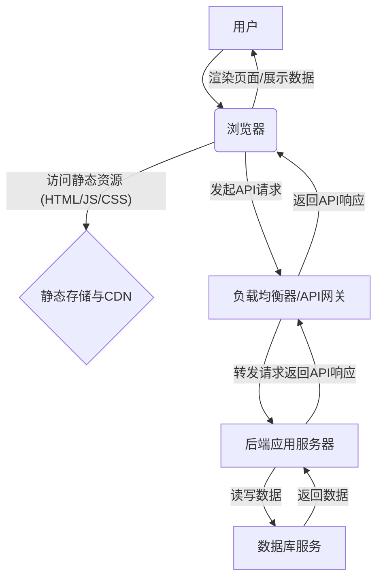

在本章中，我们将深入探讨如何在云端高效地构建一个完整的应用程序。我们不再满足于仅仅理解单个云服务的运作，而是要将视野拔高，将这些服务视为构建宏大云上应用的“积木”。本节将聚焦于一个核心问题：对于一个典型的前后端分离Web应用而言，它究竟需要哪些云端“积木”才能稳健运行？

想象一下，你正准备建造一座现代化的、功能齐全的城市。你不能仅仅买一堆钢筋水泥，然后期望它们能自动变成摩天大楼、高速公路和水电系统。你需要规划，需要选择不同的建筑材料和基础设施组件，并将它们巧妙地组合起来。同样，构建一个云上的应用，也需要我们像经验丰富的城市规划师一样，先解构应用的组成部分，再为每个部分找到最合适的云端“积木”。

### 1. 前后端分离：现代Web应用的基石与演进

在深入探讨云端“积木”之前，我们必须先理解现代Web应用为何普遍采用“前后端分离”的架构。

**背景与问题：**
回溯到Web开发的早期，我们通常采用“单体应用”的模式。这意味着一个应用的所有功能，包括用户界面（前端）、业务逻辑（后端）和数据访问层，都紧密耦合在一个巨大的代码库中。这种模式在项目初期简单高效，但随着业务的增长和团队规模的扩大，问题逐渐浮现：

*   **开发效率低下：** 前后端开发者常常相互依赖，任何改动都可能牵一发而动全身，导致开发周期变长，测试复杂性增加。
*   **技术栈限制：** 整个应用必须使用单一的技术栈，限制了前端和后端团队选择最适合其领域的最新技术。
*   **扩展性瓶颈：** 如果应用某个部分（如用户界面或某个特定API）流量激增，整个单体应用都必须进行扩展，效率低下且成本高昂。
*   **部署与维护困难：** 任何小改动都需要重新部署整个庞大的应用，风险高，回滚复杂。

**解决方案与影响：**
为了解决这些痛点，“前后端分离”架构应运而生。其核心思想是将用户界面与业务逻辑彻底解耦：

*   **前端（Frontend）：** 专注于用户体验和交互，通常由HTML、CSS和JavaScript（如React、Vue、Angular）构建，在用户的浏览器中运行。它通过调用后端提供的API来获取和提交数据。
*   **后端（Backend）：** 专注于业务逻辑、数据处理和API接口的提供，通常由Node.js、Python、Java、Go等语言构建。它不直接生成用户界面，而是处理前端的请求，并与数据库交互。

这种分离带来了革命性的影响：

*   **独立开发与部署：** 前后端团队可以并行开发，互不干扰，甚至可以独立部署。前端可以快速迭代UI，后端可以专注提升业务逻辑和API性能。
*   **技术栈自由：** 前后端团队可以根据各自领域的需求，自由选择最合适的技术栈和框架。
*   **弹性伸缩：** 前端和后端可以根据各自的负载独立进行扩展。例如，如果某个API请求量大，只需扩展后端服务；如果前端资源访问量大，只需优化前端部署。
*   **更好的用户体验：** 前端应用可以利用诸如单页应用（SPA）的技术，实现更流畅、响应更快的用户体验，减少页面刷新。

理解了前后端分离的优势，我们现在可以将其解构，映射到云端的具体“积木”上。

### 2. 应用架构解构：一个典型的Web应用之旅

让我们通过一个用户访问应用的典型场景，来解构一个前后端分离的Web应用架构。这就像观察水流如何经过不同的管道和处理站，最终流入水龙头一样。

**旅程解析：**

1.  **用户 (A) -> 浏览器 (B)：** 一切的起点。用户在浏览器中输入网址，试图访问你的应用。
2.  **浏览器 (B) -> 静态存储与CDN (C)：** 浏览器首先需要获取应用的前端代码，即HTML、CSS和JavaScript文件。这些是“静态资源”，不涉及后端业务逻辑，就像是商店的招牌、装修和商品目录。为了让用户无论身处何地都能快速加载，这些资源通常会通过全球分布的**内容分发网络（CDN）**从最近的边缘节点交付。CDN的背后，是**对象存储服务**作为这些静态文件的仓库。
3.  **浏览器 (B) -> 负载均衡器/API网关 (D)：** 当用户在前端界面进行操作（如登录、提交表单、查询数据）时，浏览器会向后端发起**API请求**。这些请求不会直接触达后端应用服务器，而是先经过一个“交通指挥中心”——**负载均衡器（Load Balancer）**或**API网关（API Gateway）**。它的作用是接收所有外部请求，并根据策略将请求分发给健康的后端服务实例，确保高可用性和可扩展性。
4.  **负载均衡器/API网关 (D) -> 后端应用服务器 (E)：** 接收到请求的后端应用服务器（如运行Node.js、Python、Java应用的服务器）开始处理业务逻辑。这就像商店的“后厨”和“办公室”，处理订单、库存管理、用户认证等核心业务。
5.  **后端应用服务器 (E) -> 数据库服务 (F)：** 后端在处理业务逻辑时，往往需要读写数据。例如，用户登录需要查询用户信息，提交订单需要写入订单数据。这些数据都存储在**数据库服务**中。后端与数据库交互，获取所需数据或将数据持久化。
6.  **数据库服务 (F) -> 后端应用服务器 (E)：** 数据库将查询结果返回给后端应用服务器。
7.  **后端应用服务器 (E) -> 负载均衡器/API网关 (D)：** 后端处理完成后，将API响应（通常是JSON格式的数据）返回给负载均衡器/API网关。
8.  **负载均衡器/API网关 (D) -> 浏览器 (B)：** 负载均衡器/API网关再将API响应转发给用户的浏览器。
9.  **浏览器 (B) -> 用户 (A)：** 浏览器接收到数据后，通过JavaScript动态更新页面，将处理结果（如登录成功、查询到的商品列表）展示给用户。

通过这个旅程，我们清晰地识别出了构成一个前后端分离Web应用的核心组件。接下来，我们将这些组件与云端提供的“积木”进行精确映射。

### 3. 组件映射到云服务需求：我的云端“积木”清单

现在，让我们将上文解构出的应用组件，与云服务提供商（如AWS、Azure、GCP）提供的具体服务类型进行一一对应。这就像为我们的城市规划挑选具体的建筑材料和基础设施供应商。

#### 3.1 前端代码 (HTML/JS/CSS)：静态文件存储与全球加速

*   **问题：** 你的前端代码（HTML、CSS、JavaScript文件以及图片、字体等静态资源）需要一个可靠的地方存放，并且能够被全球各地的用户快速访问。如果用户距离服务器太远，加载速度慢将严重影响用户体验。
*   **传统方案的挑战：** 早期会将这些文件放在与后端应用相同的服务器上，或者专门的静态文件服务器上。但这种方案往往面临单点故障、带宽限制以及全球访问延迟高等问题。
*   **云端“积木”：对象存储 + 内容分发网络 (CDN)**
    *   **对象存储 (Object Storage)：** 想象一个巨大、无限扩展的“文件仓库”，这就是对象存储服务（如AWS S3、Azure Blob Storage、Google Cloud Storage）。它不是传统的文件系统，而是以“对象”的形式存储数据，非常适合存放静态文件。
        *   **优势：** 极高的可用性、耐久性（数据冗余备份）、无限扩展性，按需付费，并且可以通过公开URL直接访问。
        *   **作用：** 它是你所有前端静态文件的最终归宿。你的前端构建产物（`dist` 或 `build` 文件夹下的所有文件）都会被上传到这里。
    *   **内容分发网络 (CDN)：** 想象一张遍布全球的“快递网络”，拥有无数个“前置仓库”（边缘节点）。当用户请求你的静态文件时，CDN会将这些文件从离用户最近的边缘节点直接交付，而不是每次都回源到你的主存储仓库。
        *   **优势：** 大幅减少内容加载延迟，提升用户体验；减轻源站压力；防御DDoS攻击；提供SSL/TLS加密。
        *   **作用：** CDN是提升前端访问速度的关键。它缓存了你对象存储中的静态文件，并根据用户的地理位置，将请求路由到最近的边缘节点，实现毫秒级的响应。

**小结：** 你的前端应用本质上是一组静态文件，部署在云上，意味着将它们上传到**对象存储**，并通过**CDN**进行全球加速分发。

#### 3.2 后端应用 (Node.js/Python/Java)：持续运行的计算环境

*   **问题：** 你的后端应用需要一个7x24小时不间断运行的环境，来接收和处理前端发来的API请求，执行复杂的业务逻辑，并与数据库交互。这个环境必须稳定、安全，并且能够根据流量变化弹性伸缩。
*   **传统方案的挑战：** 购买物理服务器，自行搭建操作系统、运行环境、部署应用，然后进行监控和维护。这需要大量的人力、时间和专业知识，扩展性差，成本高昂。
*   **云端“积木”：计算服务 (Compute Service)**
    *   **虚拟机 (Virtual Machines / VM)：** 这是云上最基础的计算单元（如AWS EC2、Azure VM、Google Compute Engine）。它模拟了一台物理计算机，你可以完全控制操作系统、软件栈和应用部署。
        *   **优势：** 灵活度高，你可以安装任何软件，配置各种网络和存储。
        *   **作用：** 适用于需要高度定制化环境、或者现有应用迁移到云端的情况。你可以将你的后端应用部署在这些VM上，并通过负载均衡器进行管理。
    *   **容器服务 (Container Services)：** 基于容器技术（如Docker），将应用及其所有依赖打包成一个轻量级、可移植的“容器”（如AWS ECS/EKS、Azure Kubernetes Service (AKS)、Google Kubernetes Engine (GKE)、或Fargate）。
        *   **优势：** 标准化、可移植性强、启动快、资源利用率高。Kubernetes等编排工具还能实现容器的自动化部署、扩展和管理。
        *   **作用：** 现代后端部署的首选。你的后端应用代码会被打包成Docker镜像，然后部署到容器服务中，由平台负责运行、监控和按需扩展。
    *   **无服务器函数 (Serverless Functions)：** 革命性的计算模式（如AWS Lambda、Azure Functions、Google Cloud Functions）。你只需上传代码，云服务商负责所有基础设施的维护、扩展和故障处理。你的代码只在被调用时运行，按实际执行时间和资源消耗计费。
        *   **优势：** 极致的弹性伸缩（自动从零扩展到高并发）、无需管理服务器、按需付费（成本效益高）。
        *   **作用：** 适用于事件驱动、短时执行的后端任务，如API网关后的微服务、数据处理函数等。对于某些API，你可以将后端逻辑直接作为无服务器函数部署。

**小结：** 后端应用需要一个持续运行的**计算环境**，云端提供了从底层虚拟机到高度抽象的无服务器函数等多种选择，你可以根据应用特性、运维能力和成本考量进行选择。

#### 3.3 数据库 (MySQL/PostgreSQL)：稳定、安全、可备份的数据存储

*   **问题：** 你的应用数据（用户数据、订单、商品信息等）是业务的核心资产，需要一个稳定、安全、高性能且易于管理的数据存储系统。数据丢失或访问缓慢是不可接受的。
*   **传统方案的挑战：** 自建数据库服务器意味着你需要处理硬件采购、操作系统安装、数据库软件配置、备份恢复策略、高可用性、性能优化、安全补丁等一系列复杂且专业的运维工作。这不仅耗时耗力，而且风险极高。
*   **云端“积木”：托管数据库服务 (Managed Database Services)**
    *   **关系型数据库服务 (Relational Database Services / RDS)：** 提供各种主流关系型数据库（如MySQL、PostgreSQL、SQL Server、Oracle）的完全托管服务（如AWS RDS、Azure SQL Database、Google Cloud SQL）。
        *   **优势：** 云服务商负责数据库的安装、补丁管理、备份恢复、高可用性配置、读写分离等繁重工作。你只需关注数据库的使用，而无需关心其运维。
        *   **作用：** 适用于绝大多数需要结构化数据存储和ACID事务特性的应用。
    *   **非关系型数据库服务 (NoSQL Databases)：** 适用于需要高吞吐量、低延迟、海量数据存储，并且数据结构灵活的场景（如AWS DynamoDB、Azure Cosmos DB、Google Cloud Firestore）。
        *   **优势：** 通常具有更高的扩展性和灵活性，能够更好地应对非结构化数据和高并发访问。
        *   **作用：** 适用于用户画像、日志存储、实时分析、物联网数据等场景。

**小结：** 你的应用数据需要一个可靠的“记忆库”。云端提供了**托管关系型数据库**和**非关系型数据库**，它们将复杂的运维工作交由云服务商处理，让你能够专注于业务逻辑。

#### 3.4 缓存服务 (Cache)：加速数据访问与减轻数据库压力

*   **问题：** 随着用户量增长，某些频繁读取的数据（如热门商品信息、用户会话、配置数据）会给数据库带来巨大压力。每次都从基于磁盘的数据库中读取数据会产生延迟，影响用户体验。如何为这些“热数据”提供一条高速公路，让应用能以微秒级速度获取它们？
*   **传统方案的挑战：** 自行搭建和维护缓存集群（如Redis或Memcached）是一项复杂的任务。你需要负责服务器配置、软件安装、集群管理、故障切换、数据持久化和扩展策略，这同样是一项繁重的运维工作。
*   **云端“积木”：托管内存缓存服务 (Managed In-Memory Cache Service)**
    *   云服务商提供了完全托管的内存数据存储服务（如AWS ElastiCache、Azure Cache for Redis、Google Cloud Memorystore），它们通常基于Redis或Memcached等成熟技术。
        *   **优势：** 极致的性能（读写延迟在微秒级别）、完全托管（无需关心运维）、弹性伸缩、高可用性。
        *   **作用：** 它像一个位于后端应用和数据库之间的高速“缓冲区”。对于频繁请求的数据，后端应用会先检查缓存。如果数据在缓存中，就直接返回，避免了对数据库的慢速查询，从而大幅提升应用响应速度并显著降低数据库负载。除了数据库查询缓存，它还常用于会话存储、实时排行榜、消息队列等场景。

**小结：** 你的应用需要一个“高速缓存区”来暂存热点数据。云端的**托管缓存服务**提供了一个开箱即用、高性能的解决方案，是构建高性能、高可扩展性应用的关键一环。

#### 3.5 互相连接：私有安全网络与按需暴露服务

*   **问题：** 你的所有云端“积木”——前端存储、后端计算、数据库——都需要在一个私密、安全且高效的网络环境中相互通信。同时，部分服务（如前端访问的CDN、后端API）需要能够安全地向公共互联网暴露，以供用户访问。
*   **传统方案的挑战：** 在物理数据中心，你需要精心规划网络拓扑、部署防火墙、路由器、交换机，并管理IP地址、子网和路由规则。这一切既复杂又成本高昂。
*   **云端“积木”：虚拟私有云 (Virtual Private Cloud / VPC) 与网络服务**
    *   **虚拟私有云 (VPC)：** 想象你在云中拥有自己专属的、逻辑隔离的“虚拟数据中心”（如AWS VPC、Azure VNet、Google VPC）。你可以在这个虚拟网络中定义自己的IP地址范围、子网、路由表和网络网关。
        *   **优势：** 提供了高级别的网络隔离和安全性。你的云资源在这个私有网络中，默认不直接暴露给公网。
        *   **作用：** 它是你所有云资源的网络基础。你的计算实例、数据库实例等都部署在VPC的子网中，实现内部安全通信。
    *   **安全组 (Security Groups) / 网络访问控制列表 (Network ACLs)：** 相当于每台服务器或子网的“虚拟防火墙”。你可以精细地控制进出流量。
        *   **优势：** 提供了网络层面的安全策略，可以限制哪些IP地址、端口和协议可以访问你的资源。
        *   **作用：** 确保只有授权的流量才能访问你的后端服务和数据库，防止未经授权的访问。
    *   **负载均衡器 (Load Balancer)：** 上文已提及，它不仅分发流量，也是将内部服务向公网暴露的重要组件。它接收外部请求，并将其转发到后端实例，同时提供SSL/TLS终止、健康检查等功能。
        *   **作用：** 作为应用入口，提高高可用性和可伸缩性。
    *   **API 网关 (API Gateway)：** 专门为API管理设计的服务（如AWS API Gateway、Azure API Management、Google Cloud Endpoints）。它提供API鉴权、请求限流、监控、缓存等功能。
        *   **作用：** 更高级的API流量管理，尤其适合微服务架构。
    *   **域名系统 (Domain Name System / DNS)：** 将易读的域名（如`your-app.com`）解析为IP地址的服务（如AWS Route 53、Azure DNS、Google Cloud DNS）。
        *   **作用：** 让用户能够通过友好的域名访问你的应用。

**小结：** 你的云端“积木”需要一个**虚拟私有网络**作为它们的“城市基础设施”，通过**安全组**和**负载均衡器/API网关**进行安全隔离与按需暴露，最终通过**DNS**让用户找到你的应用。

### 4. 总结与前瞻

至此，我们已经将一个典型的前后端分离Web应用解构为几个核心部分：前端静态资源、后端业务逻辑、数据存储和网络连接，并为它们找到了云上对应的“积木”：

*   **前端代码** -> **对象存储 (Object Storage) + 内容分发网络 (CDN)**
*   **后端应用** -> **计算服务 (Compute Service)，如虚拟机、容器服务或无服务器函数**
*   **数据缓存** -> **托管缓存服务 (Managed Cache Service)**
*   **数据持久化 (数据库)** -> **托管数据库服务 (Managed Database Services)，如关系型或非关系型数据库**
*   **互相连接** -> **虚拟私有云 (VPC) 及相关网络服务（如安全组、负载均衡器、API网关、DNS）**

这些“积木”在云上并非孤立存在，它们通过精心设计的网络基础设施相互协作，共同支撑起你的应用。云服务商将这些复杂的基础设施管理工作封装起来，使得开发者可以专注于业务逻辑的实现，而无需耗费大量精力在底层运维上。

然而，仅仅识别出这些“积木”只是第一步。在云计算的广阔世界里，每种“积木”都有多种形态和配置选项。我们面临的问题不再是“需要什么”，而是“**如何选择最合适的？**”以及“**如何将它们最有效地组合起来？**”

未来的章节中，我们将深入探讨这些具体的云服务，学习如何配置它们，如何确保它们的安全性、高可用性和成本效益。我们还将学习如何利用自动化工具，将这些“积木”以蓝图的方式快速、可靠地搭建起来。请带着这些疑问，继续你的云上架构师之旅，因为真正的挑战与乐趣，才刚刚开始。