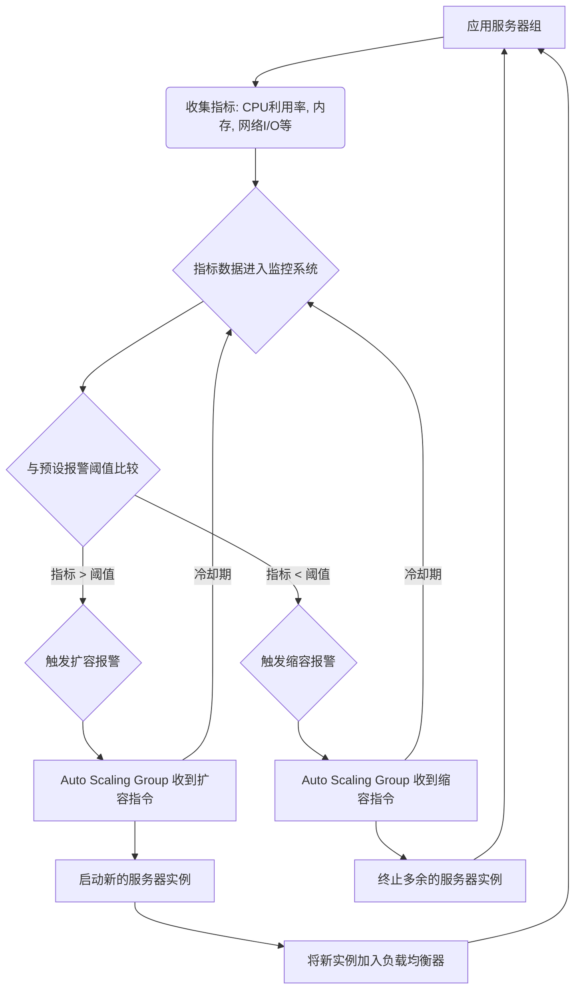

好的，作为一位世界级的教育家与作家，我将以引人入胜的叙事方式，为您详尽阐述云端服务器部署中的核心工具——自动伸缩（Auto Scaling）。

---

## 5.3 核心工具二：自动伸缩 (Auto Scaling) — 驾驭波动的云端需求

在构建强大、可靠的云端应用之旅中，我们已经见证了云如何通过虚拟化技术，将物理世界的硬件抽象成可编程的资源。然而，仅仅拥有这些资源还不足以应对真实世界中变幻莫测的应用负载。想象一下，一个流行的电商平台，在“双十一”购物节当天，流量瞬间暴增百倍；或是新闻网站，在突发重大事件时，访问量呈指数级增长。如果你的应用基础设施像一块未经雕琢的顽石，固定不变，那么在高峰期，用户将面临卡顿、报错甚至服务崩溃；而在低谷期，则会白白浪费大量计算资源，如同在午夜时分，整个商场却灯火通明、收银员全部待命。

**问题：僵硬的容量规划之困**

在自动伸缩出现之前，传统的IT基础设施管理面临一个两难困境：

1.  **过度配置 (Over-provisioning) 的浪费：** 为了应对最极端的峰值负载，企业往往需要提前采购并部署大量服务器。这些服务器在大部分时间里处于闲置状态，造成巨大的资源浪费和运营成本。这就像为了一年一度的狂欢节，你建造了一座能容纳十万人的体育馆，但在其余364天里，它可能只有寥寥数百人光顾。
2.  **配置不足 (Under-provisioning) 的风险：** 如果为了节省成本而仅按平均负载配置资源，那么在流量激增时，系统就会迅速达到饱和，导致用户体验极差，甚至服务中断，直接影响业务营收和品牌声誉。这如同一个餐厅，仅根据平日的客流量准备食材和人手，却在节假日毫无准备地被蜂拥而至的客人冲垮。

无论选择哪种策略，企业都难以在成本效益和性能表现之间找到完美的平衡点。这种僵硬的容量规划，成为了束缚应用弹性与效率的枷锁。云的出现，虽然提供了弹性的基础设施，但如何“自动化”地利用这种弹性，却成为了新的挑战。这就是**自动伸缩（Auto Scaling）**诞生的背景与意义。

### 核心类比：超市的智能收银台管理

要理解自动伸缩，我们可以把它想象成一个**高效而智能的超市经理**。这位经理深谙超市运营之道：既要保证顾客购物体验顺畅，不因排队过长而流失，又要控制运营成本，避免在顾客稀少时仍雇佣过多收银员。

*   **超市经理 (Auto Scaling Group, ASG)：** 这就是自动伸缩组，它是你的服务器实例（收银台）的智能管理者。它不会直接收钱，但它决定有多少收银台开着。
*   **收银台 (Server Instances / EC2 Instances)：** 它们是实际执行工作的计算资源，处理顾客（用户请求）。
*   **顾客流量 (Application Load / User Requests)：** 这就好比你的应用所接收到的用户请求数量，它决定了收银台的繁忙程度。
*   **排队长度 / 收银员忙碌程度 (CPU Usage, Memory, Network I/O, Latency)：** 这是经理用来判断当前客流状况的关键指标。当排队过长，收银员忙得不可开交（CPU 使用率高企）时，表明现有资源不足。当顾客稀少，收银员闲得发慌（CPU 使用率很低）时，表明资源过剩。

这位智能经理不会凭空猜测客流量，也不会固执地只开几个收银台。它会**实时监控**每个收银台的忙碌程度：

1.  **客流高峰期：** 假如超市在中午或周末迎来大量客流，顾客排起了长队，所有收银员都忙得不可开交（例如，所有服务器的平均CPU使用率持续超过80%）。这时，智能经理会**自动增开新的收银台**（增加服务器实例），以迅速分流顾客，缩短等待时间，确保服务质量。
2.  **夜间客流稀少期：** 当夜幕降临，顾客寥寥无几，大部分收银台都空闲着（例如，所有服务器的平均CPU使用率持续低于20%）。为了节省电费和人力成本，智能经理会**自动关闭多余的收银台**（减少服务器实例），只保留维持基本运营所需的数量。

通过这种“按需增减”的策略，超市经理实现了**成本效益与性能表现的最佳平衡**：既避免了不必要的开支，又保证了顾客在任何时间都能享受到高效的服务。这就是自动伸缩的核心理念。它让你的云端应用获得了前所未有的弹性，能够像生物体一样，根据环境的变化自我调节，以最经济的方式提供最优质的服务。

### 工作原理：监控-报警-行动的智能循环

自动伸缩并非魔法，它遵循一套清晰、可预测的逻辑，可以概括为“**监控 (Monitor) -> 报警 (Alarm) -> 行动 (Action)**”的三步闭环。

#### 第一步：无休止的监控 (Monitor)

自动伸缩的第一块基石是**持续、精密的监控**。你需要指定一系列关键指标，让系统像拥有无数双眼睛一样，密切关注你的服务器实例群体的运行状态。这些指标通常包括：

*   **CPU 利用率 (CPU Utilization)：** 这是最常用也最直观的指标。高CPU利用率通常意味着服务器正在努力处理大量请求。
*   **内存利用率 (Memory Utilization)：** 虽然不是所有云服务商都直接提供，但自定义监控可以获取。内存不足会严重影响应用性能。
*   **网络I/O (Network I/O)：** 输入/输出流量，反映了数据传输的繁忙程度。
*   **磁盘I/O (Disk I/O)：** 磁盘读写速度，对于数据库或文件密集型应用至关重要。
*   **队列深度 (Queue Depth)：** 对于消息队列服务，队列长度可以反映待处理任务的堆积情况。
*   **活跃会话数 (Active Sessions)：** 对于Web应用，活跃用户数量是直接的负载指标。
*   **延迟 (Latency)：** 请求处理时间，直接关系到用户体验。

**为什么这些指标很重要？** 它们是你的应用在“呼吸”的信号。通过观察这些生命体征，你才能判断应用是否健康、是否面临压力。例如，当CPU利用率长时间处于高位，这通常意味着现有服务器已无法及时处理所有请求，应用可能开始变慢。

#### 第二步：明确的报警阈值 (Alarm)

仅仅监控还不够，你需要告诉系统“什么是正常，什么是不正常”。这就需要设置**报警阈值 (Thresholds)**。一个报警规则由以下几个核心要素构成：

*   **监控指标：** 选择要关注的指标，例如“CPU Utilization”。
*   **比较运算符：** 例如“大于等于 (>=)”、“小于等于 (<=)”。
*   **阈值：** 具体数值，例如“80%”。
*   **持续时间 (Period)：** 指标需要在多长时间内持续超过或低于阈值才能触发报警。例如，“连续5分钟”。
*   **统计方式：** 平均值、最大值、最小值、总和等。

**例子：** “当 Auto Scaling Group 中所有实例的平均 CPU 利用率在连续 5 分钟内持续高于或等于 80% 时，触发报警。”

**设计报警阈值的考量：**
*   **上伸缩 (Scale-out) 阈值：** 通常设置在性能开始下降但尚未完全崩溃的点（例如 CPU 70%-80%）。太低会导致不必要的扩容，增加成本；太高则可能在扩容前就导致用户体验受损。
*   **下伸缩 (Scale-in) 阈值：** 通常设置在资源显著闲置的点（例如 CPU 20%-30%）。太高会导致频繁缩容，可能在流量回升时再次扩容，造成“振荡”；太低则可能浪费资源过久。
*   **持续时间：** 设定一个持续时间（如5分钟），是为了避免因瞬时流量抖动或数据采样误差而触发不必要的伸缩操作，防止系统频繁“抽搐”。

#### 第三步：果断的伸缩行动 (Action)

当报警条件被满足时，自动伸缩系统就会执行预先定义好的**行动 (Action)**。这些行动通常包括：

*   **增加实例 (Scale Out)：** 启动一个或多个新的服务器实例，并将其添加到自动伸缩组和负载均衡器中。
*   **减少实例 (Scale In)：** 从自动伸缩组中移除一个或多个服务器实例，并将其终止。

**Auto Scaling Group (ASG) 是如何管理的？**

自动伸缩组（ASG）是执行这些行动的核心实体。它是一个逻辑分组，用于管理一组共享相似特征并被视为逻辑单元的 EC2 实例。你需要为 ASG 定义：

*   **启动配置/模板 (Launch Configuration / Launch Template)：** 包含启动新实例所需的所有信息，如实例类型、AMI ID（操作系统镜像）、存储、安全组、用户数据脚本等。这确保了新增实例与现有实例保持一致。
*   **期望容量 (Desired Capacity)：** ASG 尝试维护的运行实例数量。
*   **最小容量 (Minimum Capacity)：** ASG 永远不会低于的实例数量。这确保了即使在流量最低时，也有足够的实例维持基本服务和高可用性。
*   **最大容量 (Maximum Capacity)：** ASG 永远不会超过的实例数量。这用于防止失控扩容带来的巨大成本，或超出后端依赖（如数据库连接数）的承受能力。

**冷却时间 (Cool-down Period)：**
在执行一次伸缩行动后，自动伸缩组通常会进入一段“冷却时间”。在此期间，它会暂停响应新的伸缩策略，让新启动的实例有足够的时间完成启动、预热并开始处理流量，同时让监控指标有时间稳定下来。这进一步防止了系统因过于频繁的伸缩而陷入不稳定状态（“伸缩振荡”）。

这张图清晰地展示了“监控-报警-行动”的闭环流程：

### Auto Scaling 的策略与模式

除了基于单一指标的简单伸缩，现代自动伸缩服务还提供了更高级、更智能的策略：

1.  **动态伸缩 (Dynamic Scaling)：** 这是最常见的类型，基于实时负载变化进行调整。
    *   **目标跟踪伸缩 (Target Tracking Scaling)：** 最推荐且易于使用的策略。你只需设定一个目标值（如“保持 CPU 利用率在 50%”），Auto Scaling 会自动创建并调整报警规则，以实现并维持这个目标。它会自动计算需要添加或删除的实例数量。
    *   **步进伸缩 (Step Scaling)：** 允许你更精细地控制伸缩行为。你可以定义多个报警阈值，每个阈值对应不同的“步长”操作。例如，CPU 达到 70% 时增加 1 个实例，达到 85% 时增加 3 个实例。
    *   **简单伸缩 (Simple Scaling)：** 较早期的策略，一个报警对应一个伸缩操作（如“增加 1 个实例”）。通常配合冷却时间使用，不如目标跟踪和步进伸缩灵活。

2.  **计划伸缩 (Scheduled Scaling)：** 如果你的应用负载具有可预测的周期性模式（例如，每天上午 9 点流量激增，下午 5 点回落；每周特定时间有促销活动），你可以预先设置计划任务，在特定时间点调整 ASG 的最小、最大或期望容量。这可以在负载真正到来之前就做好准备，提供更平滑的用户体验。

3.  **预测伸缩 (Predictive Scaling)：** 这是更高级的模式，通常结合机器学习技术。它通过分析历史负载数据，预测未来数小时或数天的流量趋势，并在实际负载到来之前主动进行容量调整。这进一步减少了对实时指标滞后性的依赖，实现了更超前的资源准备。

### Auto Scaling 的深远影响

自动伸缩的出现和普及，彻底改变了企业管理应用基础设施的方式，带来了多方面的深远影响：

1.  **成本效益的显著提升：** 这是最直接的效益。企业不再需要为峰值容量而过度配置资源。在流量低谷时自动缩减实例，意味着显著减少了不必要的云资源支出。**你真正做到了“按需付费”，每一分钱都花在刀刃上。**
2.  **性能表现的持续优化：** 无论流量如何波动，自动伸缩都能确保应用始终拥有足够的计算资源来响应用户请求，避免了因资源不足导致的延迟、错误和卡顿。这直接提升了用户体验和满意度。
3.  **高可用性与韧性增强：** 自动伸缩组不仅仅是增减实例的工具，它还是一个强大的自我修复机制。当 ASG 中的某个实例出现故障（例如，健康检查失败），它会自动将其标记为不健康，并启动一个新的健康实例来替代它。这极大地提高了应用的可用性和对故障的弹性。
4.  **运维效率的飞跃：** 传统上，运维团队需要花费大量时间手动监控负载、规划容量、部署和管理服务器。自动伸缩将这些繁琐、重复的工作自动化，解放了工程师的双手，让他们能够专注于更高价值的创新和优化工作。
5.  **业务创新的加速器：** 由于基础设施的弹性与自动化，企业可以更自信地推出新产品、新服务或进行大规模营销活动，而无需担心底层IT设施能否支撑。这种“无惧流量”的心态，极大地鼓励了业务的探索与创新。

### 结论与展望：走向自适应的云原生未来

自动伸缩，以其“监控-报警-行动”的简单而强大的逻辑，成为了云端服务器部署中不可或缺的核心工具。它将原本僵硬的基础设施，转化成了能够根据外部环境变化而“呼吸”、“伸展”的生命体，实现了成本效益与性能表现的完美统一。

然而，我们对极致弹性的追求永无止境。随着云原生技术，如容器化（Kubernetes）、无服务器（Serverless）计算的日益普及，自动伸缩的边界也在不断拓展。未来的自动伸缩将不仅仅是调整虚拟机数量，它将更精细地管理容器副本、无服务器函数的并发量，甚至能够根据业务指标（如订单量、注册用户数）进行更智能的伸缩。

想象一下，一个完全自适应的系统，它能够预测你的业务增长，提前为你准备好资源；它能在任何故障发生时，无感地进行自我修复；它甚至能根据用户体验指标，自主调整资源配置，以达到最优的服务质量。自动伸缩，正是我们迈向这样一个**自愈、自适应、自优化云原生未来**的关键一步。

我们现在所见的自动伸缩，只是冰山一角。它启发我们思考：当基础设施的弹性成为常态，当手动干预成为过去，我们又将如何利用这些解放出来的智慧和创造力，去构建下一个改变世界的应用？这无疑是一个令人兴奋且充满无限可能的问题。

---

### 要点回顾：

*   **痛点：** 传统容量规划面临过度配置（浪费）和配置不足（性能差）的两难。
*   **解决方案：** 自动伸缩根据实时负载动态调整计算资源数量。
*   **核心类比：** 超市智能经理根据客流增减收银台，实现成本与性能平衡。
*   **工作原理：**
    *   **监控：** 持续收集 CPU 利用率、内存、网络 I/O 等关键指标。
    *   **报警：** 当指标长时间超过或低于预设阈值时触发。
    *   **行动：** 自动伸缩组 (ASG) 启动新实例（扩容）或终止多余实例（缩容）。
    *   **重要机制：** 冷却时间防止频繁伸缩；最小/最大容量限制范围。
*   **伸缩策略：** 包括动态伸缩（目标跟踪、步进、简单）、计划伸缩和预测伸缩。
*   **深远影响：** 显著提升成本效益、性能优化、高可用性与韧性、运维效率，并加速业务创新。
*   **未来展望：** 走向更智能、更精细、更超前的自适应云原生系统。