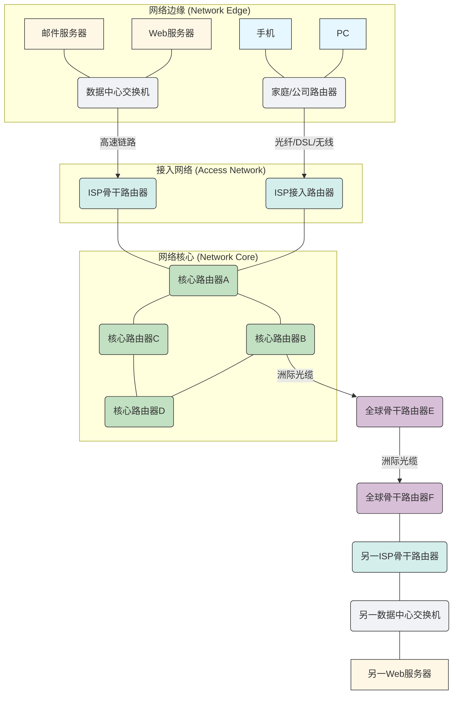

在上一节中，我们从“两台计算机如何精确通信”这一根本问题出发，探讨了互联网的惊人复杂性，并引入了“分层”这一核心设计智慧，最终将TCP/IP五层模型作为我们理解网络世界的骨架。我们深入了解了每一层职责、协议与服务的分工，这为我们搭建起了网络的“内部运作机制”。

然而，光理解内部机制还不够。一个宏伟的工程，除了精密的内部结构，还需要一幅清晰的“全景图”，告诉我们这个机制到底搭建在何种物理载体之上，它的主要构成部分是什么，数据是如何在其中穿梭的。就好比我们理解了一辆汽车的发动机和传动系统如何工作，下一步自然是想知道这辆汽车由哪些主要部件组成，它在什么样的道路上行驶，以及道路上车辆通行的基本规则。

本节，我们将把视角拉高，俯瞰整个互联网的宏伟蓝图。我们将不再纠结于协议报文的细枝末节，而是专注于构成互联网的**核心物理组件**、它们如何**分工协作**，以及数据在其中**流动**的两种基本模式，最终理解衡量其效率的**关键性能指标**。准备好了吗？让我们一起探索这个连接全球的巨大生命体。

---

### 1.2 宏观视角：互联网的全景图——如何让全球计算机高效对话？

想象一下，互联网不是一堆冰冷的机器和代码，而是一个生机勃勃的“地球村”。在这个村子里，有无数的居民（用户设备），有专业的服务提供者（服务器），有遍布全球的道路（通信链路），更有无数的交通枢纽和管理机构（路由器、交换机）。它们共同构成了我们今天赖以生存的数字生态系统。

从最宏观的层面看，互联网可以被分解为两大主要组成部分：**网络边缘 (Network Edge)** 和 **网络核心 (Network Core)**。它们之间通过**接入网络 (Access Network)** 连接，共同协作，实现了全球信息的自由流动。

#### 核心组件：网络边缘 (Network Edge) – 我们与互联网的触点

**问题背景：** 互联网之所以存在，根本目的是为了服务用户和应用。那么，用户和应用是如何接入这个庞大网络的呢？它们扮演着怎样的角色？

**解决方案：** 互联网的“边缘”，正是我们日常生活中直接接触的部分。它由所有连接到互联网的**终端设备 (End Systems)** 组成，这些设备通常被称为**主机 (Hosts)**。

*   **终端设备的多样性：**
    *   **个人电脑 (PC)、笔记本、手机、平板电脑：** 这是我们最熟悉的终端设备，是我们获取信息、娱乐、交流的个人门户。
    *   **服务器 (Servers)：** 它们是互联网服务的心脏，提供我们访问的网页、存储我们的邮件、运行我们的在线游戏。从巨型数据中心里的成千上万台服务器，到你可能在家里搭建的小型文件服务器，它们都是互联网边缘的重要组成。
    *   **物联网 (IoT) 设备：** 智能手表、智能家居设备、自动驾驶汽车、工业传感器等，这些新兴设备正以前所未有的速度接入互联网，进一步扩展了网络边缘的广度和深度。

这些终端设备在互联网上扮演着两种基本角色：**客户端 (Client)** 和 **服务器 (Server)**。

*   **客户端 (Client)：服务的请求者**
    *   **职责：** 通常是用户使用的设备，发起请求，接收服务。比如你的浏览器向网站服务器请求网页，你的邮件客户端向邮件服务器请求邮件。客户端通常不永久连接到互联网，它们的IP地址也常常是动态的。
    *   **类比：** 就像一个村子里的居民，他们会去商店买东西，去邮局寄信，去图书馆借书。他们是服务的消费者。
*   **服务器 (Server)：服务的提供者**
    *   **职责：** 响应客户端的请求，提供数据、内容或功能。例如，一个Web服务器存储并发送网页给浏览器；一个数据库服务器响应数据查询。服务器通常需要永久在线，并拥有固定的、全球唯一的IP地址，以便客户端能够随时找到它们。
    *   **类比：** 就像村子里的各种服务机构——商店、邮局、图书馆、银行。它们随时待命，为居民提供所需的服务。

**影响：** 网络边缘是互联网价值的最终体现。正是这些终端设备和它们提供的多样化服务，才使得互联网成为了一个如此丰富和不可或缺的平台。它们是信息流动的起点和终点。

#### 核心组件：网络核心 (Network Core) – 互联网的“交通枢纽”与“高速公路网”

**问题背景：** 如果网络边缘是地球村里的家家户户和服务机构，那么如何将这些分散在全球各地的“家户”和“机构”连接起来，并让他们之间高效地交换信息呢？需要一个复杂且高效的“交通系统”。

**解决方案：** 互联网的“核心”正是这个庞大的、复杂的交通系统。它由全球各地数以百万计的**路由器 (Routers)** 和 **交换机 (Switches)** 组成，通过各种物理链路（如光纤、铜缆、无线电波）相互连接，形成一个错综复杂的“网状网络”。

*   **路由器 (Router)：全球交通的“指路明灯”**
    *   **职责：** 路由器是互联网的核心“交通警察”。它们的主要任务是根据数据包的目的IP地址，决定将数据包转发到哪条路径上，以使其尽快到达目的地。路由器维护着巨大的路由表，其中包含了到达不同目的地的最佳路径信息，并能根据网络状况动态调整。它们是跨越不同网络（如你的家庭网络和ISP网络）的关键连接点。
    *   **类比：** 路由器就像全球公路网上的一个个**高速公路枢纽**或**国家的边境口岸**。当一辆装载着货物的卡车（数据包）驶来时，路由器会查看货物的目的地（目的IP地址），然后根据全球地图和实时路况（路由表），指引卡车应该驶向哪个方向，进入哪条高速公路。它只关心将货物送到下一个大的中转站，而不需要知道最终收件人的门牌号。
*   **交换机 (Switch)：局部区域的“交通指挥官”**
    *   **职责：** 交换机通常在局域网 (LAN) 内部工作，将数据帧从一个端口转发到另一个端口，以便连接在同一局域网内的设备进行通信。它使用**MAC地址**（物理地址）在相邻设备之间精确转发数据。
    *   **类比：** 交换机就像一个**城市内部的交通环岛**或**繁忙的街区十字路口**。它负责在小范围内，将车辆（数据帧）从一条街道精确地引导到另一条与它直接相连的街道上。它知道每个连接到它的设备（房屋）的具体位置，并能直接将邮件（数据帧）送到相应的门前。

**网络核心的拓扑结构：**

网络核心通常被设计成高度互联的网状结构，以提供**冗余性**和**弹性**。这意味着从一个源头到目的地，通常不止一条路径可走。如果某条链路或某个路由器发生故障，数据可以通过其他备用路径继续传输。这种设计是互联网健壮性的基石。

*图1.2.1 互联网的宏观视图：网络边缘、接入网络与网络核心的连接示意图*

**影响：** 网络核心是互联网的承重墙和交通主动脉。它的高效、可靠和弹性，是支撑全球信息交换的基础。没有它，网络边缘的设备将是孤立的岛屿。

#### 核心工作模式：电路交换 vs. 分组交换 – 效率与弹性的权衡

当我们谈论数据在网络核心中如何流动时，有两种根本性的工作模式：**电路交换 (Circuit Switching)** 和 **分组交换 (Packet Switching)**。理解它们的区别，是理解现代互联网为何如此高效和灵活的关键。

**问题背景：** 在计算机网络出现之前，传统的电话网络是如何工作的？它有什么优点和缺点？当我们需要让海量计算机高效共享资源时，这种模式还适用吗？

**1. 电路交换：独占专线，保证服务**

*   **提出背景：** 电路交换是为语音通信而设计的。在电话网络发展的早期，最重要的是保证通话的连续性和质量。
*   **工作原理：** 在通信开始之前，必须先在源和目的之间建立一条**专用的物理通信路径（电路）**。一旦这条电路建立，它就会被通信双方独占，即使在没有数据传输的空闲时间，资源（如带宽）也不会被释放给其他用户。直到通信结束，电路才会被拆除。
*   **类比：** 想象一下，你想要从上海开车到北京，并且希望一路畅通。于是你提前预订并**独占了一条从上海到北京的专用车道**。这条车道在整个旅程中都只为你服务，即使你中途停车休息，这条车道也一直为你保留。其他车辆无法使用这条车道。
*   **优点：**
    *   **保证带宽和时延：** 一旦电路建立，传输速率是恒定的，且时延较低且可预测。非常适合实时性要求高、数据流连续的应用（如传统电话语音）。
    *   **实时性强：** 数据传输无需等待，一路畅通。
*   **缺点：**
    *   **资源利用率低：** 如果通信双方在建立电路后长时间不传输数据（比如电话通话中的沉默），被分配的带宽资源会被浪费，其他用户也无法使用。
    *   **建立时延：** 在通信开始前需要耗费时间建立电路。
    *   **灵活性差：** 一旦电路建立，路径固定，不易改变。网络中能建立的电路数量受限于物理容量。
    *   **故障脆弱：** 路径中任何一点的故障都可能导致整个通信中断。

**2. 分组交换：共享资源，灵活高效**

*   **提出背景：** 互联网诞生之初，是为了连接军事和科研机构的计算机。这些计算机之间的通信模式与电话语音不同，它们发送的数据往往是**突发性的**（一会儿发送大量数据，一会儿又长时间沉默）。如果为每次通信都建立专用电路，资源浪费将是巨大的。因此，需要一种更高效、更灵活的方式来共享网络资源。分组交换的概念应运而生，并成为了互联网的基石。
*   **工作原理：** 发送方将要传输的**数据分解成一系列小块，称为“分组 (Packet)”**。每个分组都包含了一小段数据以及源和目的地的地址信息（如IP地址）。这些分组会独立地在网络中传播，沿着各自的路径，**共享**网络中的链路资源。当分组到达路由器时，路由器会将其暂存（排队），然后根据其目的地地址，寻找最佳的下一跳路径，并将其转发出去。
*   **类比：** 仍然是从上海到北京。现在没有专用车道，你将货物打包成一个个**集装箱（数据包）**，每个集装箱上都贴有收货地址。你将这些集装箱交给物流公司，物流公司会根据每个集装箱的地址，将其装载到合适的卡车上。这些卡车会行驶在**共享的公共道路（网络链路）**上，可能会遇到交通拥堵（排队时延），可能会选择不同的路线（路由器选择路径），甚至有的集装箱可能会走丢（丢包）。但最终，所有集装箱都将陆续到达目的地，并在那里被重新组装。
*   **优点：**
    *   **高效资源利用：** 多个用户可以共享同一条通信链路。当一个用户没有数据传输时，链路资源可以被其他用户使用，极大地提高了带宽的利用率。
    *   **弹性与健壮性：** 如果网络中的某条链路或某个路由器发生故障，分组可以绕过故障点，通过其他可用路径继续传输，提高了网络的可靠性。
    *   **灵活性：** 适应各种数据类型（文本、图片、视频、语音），并且能够很好地处理突发性数据流量。
    *   **无需建立连接：** 在传输数据前不需要建立专用电路，减少了建立时延。
*   **缺点：**
    *   **不可预测的时延：** 由于分组共享资源，可能会遇到拥堵而排队，导致时延是可变的，并且可能出现丢包和乱序。
    *   **需要复杂的协议：** 为了处理丢包、乱序、重复等问题，上层协议（如TCP）需要提供错误检测和恢复机制，增加了协议的复杂性。
    *   **开销：** 每个分组都需要包含额外的头部信息（地址、序号等），这增加了传输的开销。

**比较总结：**

| 特性     | 电路交换 (Circuit Switching)                               | 分组交换 (Packet Switching)                               |
| :------- | :--------------------------------------------------------- | :-------------------------------------------------------- |
| **连接建立** | 必须先建立专用电路                                         | 无需建立专用电路，按需发送分组                          |
| **资源分配** | 独占式，预留带宽                                           | 共享式，动态分配带宽                                     |
| **效率**   | 空闲时资源浪费，效率相对低（针对突发数据）             | 高效利用资源，适合突发数据                             |
| **时延**   | 建立时延高，传输时延低且可预测（一旦建立）             | 传输时延可变，可能因拥堵导致排队时延                     |
| **健壮性** | 路径固定，某点故障可能中断整个通信                       | 路径灵活，可绕过故障点，健壮性高                       |
| **开销**   | 建立和拆除电路的信令开销                                   | 每个分组需要头部开销                                     |
| **应用场景** | 传统电话、实时语音/视频会议（早期）                      | 互联网数据传输、网页浏览、电子邮件、在线视频、文件下载等 |
| **类比**   | 预订高速公路上的专用车道，全程独占                       | 将货物打包成集装箱，在公共道路上与其它货物共享车道并行 |

**影响：** 分组交换是互联网之所以能成为互联网的基石。它的出现，彻底改变了通信网络的格局，使得不同类型的应用能够高效、灵活地共享同一个基础设施，极大地促进了互联网的普及和发展。今天我们所见的全球信息高速公路，正是由无数个“集装箱”（数据包）在共享的“道路”（网络链路）上穿梭构筑而成。

#### 核心性能指标：时延、丢包与吞吐量 – 衡量网络体验的刻度尺

当我们体验互联网时，总会遇到各种“慢”或“卡”的问题。为了科学地描述和衡量网络的性能，我们引入了三个最基本的性能指标：**时延 (Delay/Latency)**、**丢包 (Packet Loss)** 和 **吞吐量 (Throughput)**。它们共同定义了用户体验，也是网络工程师优化网络的基石。

**问题背景：** 用户在网络上进行各种操作（看视频、玩游戏、下载文件）时，对网络的表现有直观感受。但如何量化这些感受？如何找出网络“卡顿”的根源？

**1. 时延 (Delay / Latency)：信息抵达需要多久？**

*   **定义：** 时延是指一个数据包从发送端传输到接收端所花费的总时间。它衡量的是“等待”的时间。
*   **组成部分：**
    *   **传输时延 (Transmission Delay)：** 将数据包的所有比特从发送端完整推出到链路上所需的时间。它取决于数据包的大小和链路的发送速率。
        *   *类比：* 汽车装载货物的时间。
    *   **传播时延 (Propagation Delay)：** 比特在物理介质（如光纤、电缆、空气）中传播所需的时间。它取决于物理距离和传播介质中的信号传播速度（接近光速）。
        *   *类比：* 汽车在高速公路上以固定速度行驶的时间。
    *   **处理时延 (Processing Delay)：** 路由器或主机在接收到数据包后，对其进行错误检查、解析头部、决定下一跳路径等操作所需的时间。
        *   *类比：* 交通警察检查司机的证件、查看地图并决定行驶方向所需的时间。
    *   **排队时延 (Queuing Delay)：** 数据包在路由器或交换机的输出缓冲区中等待被转发到输出链路的时间。当流量过大，超出链路处理能力时，排队时延会显著增加。
        *   *类比：* 汽车在高速公路收费站或堵车时排队等待的时间。
*   **现实场景解释：**
    *   **视频会议卡顿、语音通话有回声：** 这些都是典型的**高时延**现象。如果你说了一句话，对方要过几秒钟才能听到，或者当你和对方同时说话时，各自听到的是延迟的自己的声音，这就是时延过高在作祟。高时延直接影响了实时交互应用的体验。
    *   **网页加载慢：** 从点击链接到网页内容开始呈现的这段时间，包含了多次请求和响应的时延累计。
*   **影响：** 时延是所有网络交互体验的基石。低时延是实现流畅在线游戏、实时通讯、远程手术等应用的关键。

**2. 丢包 (Packet Loss)：信息是否能完整抵达？**

*   **定义：** 丢包是指在数据传输过程中，部分数据包未能到达目的地。
*   **发生原因：**
    *   **网络拥塞 (Congestion)：** 当网络流量超过路由器或交换机的处理能力时，它们的缓冲区（队列）可能会溢出，导致新到达的数据包被直接丢弃。这是最常见的丢包原因。
    *   **物理链路故障：** 电缆损坏、无线信号干扰、硬件故障等都可能导致数据包在传输过程中丢失。
    *   **错误校验失败：** 数据包在传输过程中受损，接收设备检测到错误并丢弃了该包。
*   **现实场景解释：**
    *   **视频播放出现马赛克、画面卡顿：** 这是**丢包**的典型表现。当视频流中的关键帧或连续帧丢失时，解码器无法正确还原画面，就会出现花屏、卡顿甚至完全停滞。
    *   **语音通话断断续续：** 语音数据包丢失，导致语音内容不完整或中断。
    *   **文件下载失败或损坏：** 大量丢包可能导致传输中断或文件损坏，需要重新下载。
*   **影响：** 丢包严重影响数据完整性和应用体验。虽然TCP协议能够通过重传机制来弥补丢包，但这会引入额外的时延并降低有效吞吐量。UDP协议则不提供重传，对丢包更为敏感。

**3. 吞吐量 (Throughput)：信息传输有多快？**

*   **定义：** 吞吐量是指在单位时间内成功传输的数据量，通常以比特每秒 (bps) 来衡量。它衡量的是“传输速度”。
*   **衡量方式：** 可以是瞬时吞吐量（某一时刻的速度），也可以是平均吞吐量（一段时间内的平均速度）。
*   **决定因素：** 吞吐量受限于网络中最慢的链路（**瓶颈链路**）的带宽，以及网络拥塞、时延和丢包等因素。即使你的网卡带宽很高，如果网络中的某个路由器性能不足或链路带宽较低，你的实际吞吐量也会受限。
*   **现实场景解释：**
    *   **文件下载速度慢：** 这是**低吞吐量**的最直观感受。无论是下载一个大文件，还是上传一个视频，如果速度达不到预期，就是吞吐量不足。
    *   **高清视频缓冲：** 如果你的网络吞吐量不足以支撑视频流的实时播放速率，播放器就会频繁暂停进行缓冲。
    *   **多用户共享网络时速度变慢：** 当多个人同时下载或观看视频，吞吐量会被瓜分，每个人感受到的速度都会下降。
*   **影响：** 吞吐量是衡量网络“承载力”和“速度”的关键指标。高吞吐量意味着更快的下载、更流畅的视频、更高效的数据同步。

这三个核心性能指标并非独立存在，它们之间相互影响。高时延和高丢包都会导致有效吞吐量下降。网络拥塞是导致高排队时延和高丢包的主要原因，进而影响吞吐量。理解它们，就像拿到了衡量互联网“健康状况”的三把尺子。

---

### 总结与展望：互联网的宏大秩序

通过本节的学习，我们从宏观层面建立起了对互联网全景的认知。我们看到了互联网的“触角”——**网络边缘**（我们的终端设备和服务器），以及承载着这些触角之间信息流动的“骨架”——**网络核心**（由无数路由器和交换机组成的全球网络）。我们深入探讨了互联网数据流动的核心机制：**分组交换**，并理解了它如何凭借其高效和弹性，战胜了传统的电路交换，成为支撑现代互联网的基石。最后，我们掌握了衡量网络“健康”的三把尺子：**时延、丢包和吞吐量**，它们是评估用户体验和网络性能的关键指标。

这张互联网的全景图，如同一个精密的全球交通系统。网络边缘是出发地和目的地，网络核心是公路网和交通枢纽，分组交换是高效的物流模式，而时延、丢包、吞吐量则是我们衡量物流效率和用户满意度的关键指标。

这张宏大的图景，并非凭空而来，而是无数工程师和科学家在面对“如何让全球计算机高效对话”这一挑战时，一步步探索和构建的结果。它的优雅和健壮性令人叹为观止。

然而，这张图景并非一成不变。随着新的应用（如元宇宙、自动驾驶）和新的挑战（如网络安全、可持续性）的不断涌现，互联网的边缘正在持续扩张，核心也在不断演进。那么，我们能否想象未来的互联网将以何种姿态应对这些挑战？当我们的设备数量达到天文数字，数据传输需求呈现指数级增长时，今天这些基本的工作模式和性能指标，又会面临怎样的极限和变革？

带着这些问题，我们将深入到TCP/IP模型的每一层中，去揭开那些更为精妙的协议和技术，它们是构建这个宏伟秩序的每一个逻辑模块。