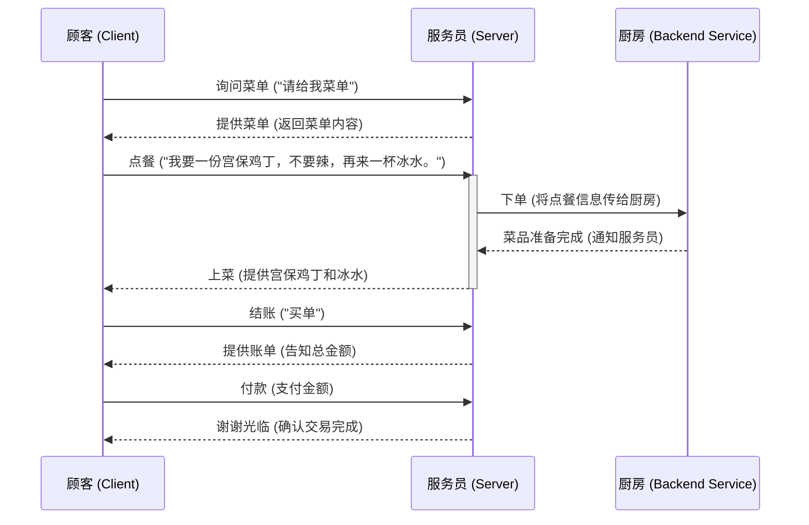
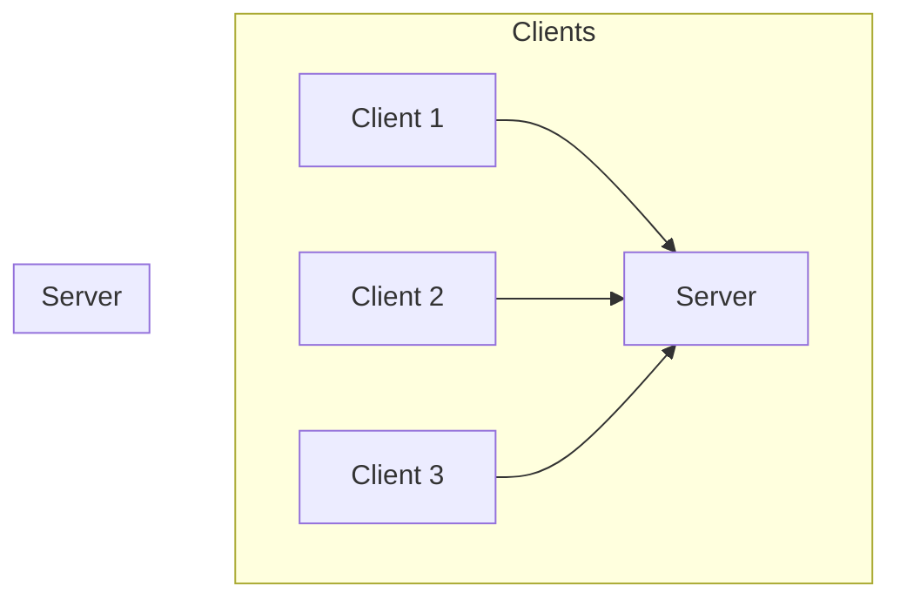
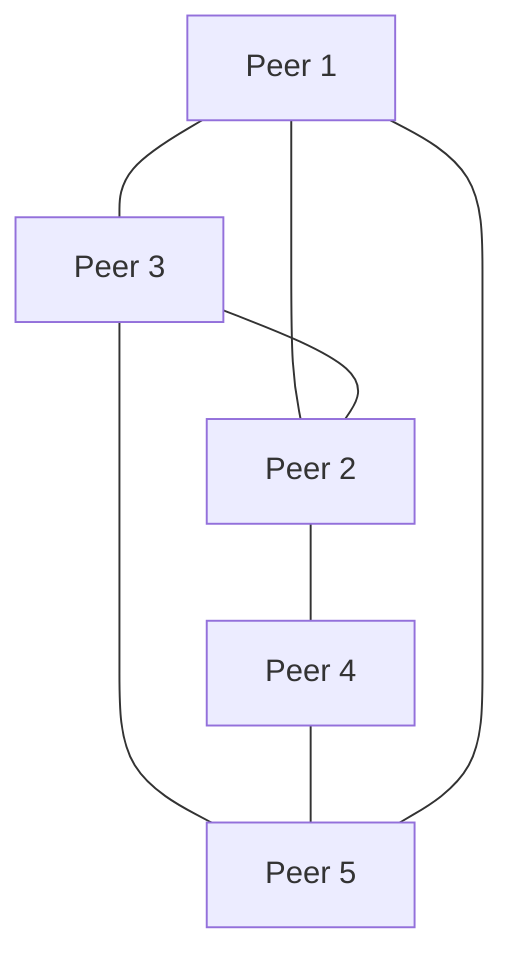

## 2.1 核心问题：应用程序之间如何约定通信规则？

在浩瀚无垠的互联网世界中，无数应用程序正在实时地进行着信息交换——从你浏览的网页、发送的邮件，到进行的视频通话和共享的文件。这些形形色色的应用，由不同的开发者在不同的系统上创建，却能奇迹般地相互理解、协同工作。它们之间究竟是如何“约定”好彼此的“语言”和“行为规范”的呢？这便是应用层协议与应用程序架构模式的核心议题，也是我们构建网络世界的第一块基石。

### 核心概念：应用层协议——网络世界的“对话脚本”

想象一下，你走进一家熙熙攘攘的餐厅，饥肠辘辘。你和服务员之间，看似简单的点餐、上菜、结账过程，实际上蕴含着一套无形的“规则”。如果你突然用一种无人听懂的语言大喊一声，或者要求服务员在你点餐之前就先结账，整个餐厅的运作都会陷入混乱。在网络世界中，应用程序之间的通信也面临着同样的挑战，甚至更为复杂。

#### 背景与困境：群龙无首的沟通乱象

在计算机网络发展的早期，应用程序之间的通信往往是“各自为政”的。如果两台机器上的两个特定程序需要交互，开发者可能会为它们编写一套专门的、临时的通信代码。这种方式在小型、封闭的环境中尚可维持，但一旦要实现更广泛的互联互通，问题便层出不穷：

1.  **互不兼容的“方言”**：每对应用都有自己的通信方式，就像每个人都讲着不同的方言，无法直接交流。
2.  **重复造轮子的低效**：每次建立新的通信，都需要重新设计消息格式、传输流程，耗费大量资源。
3.  **脆弱且难以扩展**：任何一方的修改都可能导致通信中断，难以引入新的应用或功能。

这种混乱的局面，正是计算机网络最初面临的“巴别塔困境”——语言不通，协作无从谈起。

#### 协议的诞生：秩序的建立者

为了解决这种通信乱象，先驱们意识到，必须为应用程序之间的交流制定一套**统一的、公认的“对话脚本”**。这个“对话脚本”就是我们所说的**应用层协议 (Application Protocol)**。它的出现，就像是为全球的餐厅制定了一套统一的点餐、上菜、结账流程和术语，无论身处何地，只要遵循这套规则，顾客和服务员就能高效顺畅地完成服务。

#### 何谓协议？拆解通信的本质

应用层协议，简而言之，就是**定义了应用程序之间相互发送和接收消息的规则**。这些规则通常涵盖三个关键方面：

1.  **消息的格式 (Message Format)**：这规定了应用程序发送和接收的消息必须如何构造。例如，消息的哪些部分是头部？哪些是数据体？各个字段的含义、长度、编码方式是什么？就像菜单上菜品名称、价格、描述的排版格式，或者点餐单上姓名、桌号、菜品数量的填写位置。
2.  **消息的顺序 (Message Order)**：这规定了应用程序在特定场景下发送和接收消息的先后顺序。例如，客户端必须先发送请求，服务器才能发送响应。就像你必须先点餐，服务员才能上菜；你必须先结账，服务员才能说“谢谢惠顾”。
3.  **对消息的动作 (Actions Taken on Messages)**：这规定了应用程序在发送或接收到特定消息后，应该采取什么行动。例如，服务器收到HTTP GET请求后，应该查找对应的网页文件并将其发送给客户端；客户端收到错误消息后，应该显示错误提示。就像服务员收到点餐单后，要去厨房下单；收到付款后，要打印发票。

通过严格遵循这些预先定义的规则，即使是两个完全不了解彼此内部实现细节的应用程序，也能通过交换符合协议规范的消息来成功通信。

#### 生活中的协议：点餐的艺术

让我们用餐厅点餐的例子，更深入地理解应用层协议的三个构成要素：

1.  **消息格式**：
    *   当你说“请给我菜单”时，服务员能理解这是一条请求提供信息的命令。如果你的表达是“菜单给，我请”，虽然意思相近，但可能因不符合“语法”而让服务员疑惑。
    *   点餐时，你说“我要一份宫保鸡丁，不要辣，再来一杯冰水”。这里面有明确的菜品名称、数量、口味修饰（不要辣），以及饮品名称。这是一种约定俗成的结构。
2.  **消息顺序**：
    *   你通常是先看菜单，再点餐，然后等待上菜，最后结账。如果你在进门的第一秒就说“我要结账”，服务员会感到莫名其妙，因为这不符合约定的流程。
    *   服务员也是，只有收到你的点餐请求后，才会去厨房下单；只有收到你的结账请求后，才会提供账单。
3.  **对消息的动作**：
    *   服务员收到“请给我菜单”的消息后，动作是递上菜单。
    *   服务员收到你的点餐消息后，动作是记录并传达给厨房。
    *   服务员收到你的付款后，动作是确认收款并告知交易完成。

一旦这些“格式”、“顺序”和“动作”的约定达成并被遵守，无论你是第一次来这家餐厅，还是服务员是新来的，都能高效地完成整个服务过程。

#### 协议的影响：互联互通的基石

应用层协议的出现，是计算机网络从实验室走向普罗大众的关键一步。它带来的影响是深远且革命性的：

*   **标准化与互操作性**：不同厂商、不同系统开发的应用程序，只要遵循相同的协议，就能无缝通信。这使得万维网、电子邮件等全球性服务成为可能。
*   **分层设计与模块化**：协议将通信任务分解为可管理的、独立的部分，使得开发者可以专注于应用逻辑，而不必关心底层网络的复杂性。
*   **创新与迭代**：基于稳定的协议，开发者可以在应用层构建更丰富、更复杂的服务，而不必担心底层通信规则的频繁变动。

### 架构模式一：客户端/服务器 (Client/Server, C/S)——中心化的服务典范

理解了应用层协议是应用程序“对话的语言和规则”，接下来我们要探讨的是，这些应用程序如何组织起来，以提供或使用服务。其中最普遍且影响力深远的模式，就是客户端/服务器（Client/Server, C/S）架构。

#### 背景与需求：集中式服务的崛起

在互联网诞生之初，信息和服务的提供者往往是大型机构（如大学、政府、企业），它们拥有强大的计算资源。用户希望能够方便地访问这些集中存储的信息和服务。因此，一种能够高效管理资源、确保数据一致性，并能为大量用户提供服务的模式应运而生。这正是C/S架构解决的核心问题：**如何构建一个集中管理、稳定可靠的服务提供中心，并让分散的用户能够便捷地访问？**

#### C/S模式的核心思想：分工与协作

C/S模式的核心思想是**职责分离与专业分工**。网络中的角色被清晰地划分为两类：

*   **服务器 (Server)**：一个**始终在线**的**强大主机**，拥有**固定且公开的IP地址**。它负责存储和管理资源（如网页文件、邮件、数据库），并为客户端提供服务。服务器是服务的“提供者”。
*   **客户端 (Client)**：可以是个人电脑、智能手机或任何运行着应用程序的设备。它通过网络向服务器**发起请求**，获取所需的服务和数据。客户端是服务的“消费者”。

#### 工作机制详解：请求与响应的循环

C/S架构的工作流程通常是一个**请求-响应循环**：

1.  **客户端发起请求**：当用户在浏览器中输入一个网址，或在邮件客户端点击“发送”，客户端应用程序就会按照特定的应用层协议（如HTTP、SMTP）构建一个请求消息，并通过网络将其发送给对应的服务器。
2.  **服务器处理请求**：服务器侦听到来自客户端的请求，接收并解析消息。然后根据请求的内容，执行相应的操作，比如查找文件、查询数据库、发送邮件等。
3.  **服务器发送响应**：服务器完成处理后，会按照协议规定，构建一个包含请求结果的响应消息，并将其发送回客户端。
4.  **客户端接收响应**：客户端接收并解析响应消息，然后将结果呈现给用户（如显示网页内容、确认邮件发送成功）。

#### C/S架构的特点

*   **中心化管理与控制**：所有核心数据和业务逻辑都集中在服务器端，便于统一管理、更新和备份。这使得系统管理员能够对服务进行精细化控制。
*   **服务器的“永远在线”与固定地址**：为了确保服务始终可用，服务器通常是24/7运行，并且拥有一个稳定的、不会轻易改变的IP地址，方便客户端随时定位和连接。
*   **高可用性与可扩展性**：通过部署多台服务器（服务器集群）、负载均衡等技术，C/S架构可以实现高可用性和水平扩展，以应对大量的并发请求。
*   **安全性相对集中**：由于数据集中存储，安全防护措施可以重点部署在服务器端，但同时也意味着服务器可能成为攻击的重点目标。
*   **客户端的轻量化**：客户端通常只负责用户界面和与服务器的通信，大部分计算和存储任务都由服务器完成，这降低了客户端设备的性能要求。

#### 典型应用场景：无处不在的互联网体验

C/S架构是当今互联网世界最主流的模式，你几乎每天都在使用：

*   **网页浏览 (Web Browsing)**：你的浏览器是客户端，请求Web服务器（如Apache, Nginx）上的网页文件（HTML, CSS, JavaScript等）。协议是HTTP/HTTPS。
*   **电子邮件 (Email)**：你的邮件客户端（Outlook, Gmail App）是客户端，与邮件服务器（如SMTP服务器发送邮件，POP3/IMAP服务器接收邮件）交互。协议是SMTP, POP3, IMAP。
*   **域名系统 (DNS)**：你的电脑在访问一个网址时，会向DNS服务器发起请求，将域名解析成IP地址。
*   **数据库访问、在线银行、云存储**等绝大多数提供集中式服务的应用。

C/S模式的优势在于其稳定、可控、易于管理和扩展，是构建大型、可靠互联网服务的首选。

### 架构模式二：对等网络 (Peer-to-Peer, P2P)——去中心化的共享哲学

尽管C/S架构在提供集中式服务方面表现出色，但它并非没有局限。随着互联网用户数量的爆炸式增长，以及对更高效率、更强韧性通信的需求，一种全新的架构模式——对等网络（Peer-to-Peer, P2P）开始崭露头角。

#### 背景与挑战：C/S模式的局限

C/S模式的成功也带来了其固有的挑战：

*   **单点故障风险**：如果核心服务器发生故障，整个服务就会中断。
*   **可伸缩性瓶颈**：随着用户数量增加，服务器的负载会线性上升，可能导致性能下降，甚至崩溃。扩容服务器需要投入大量成本。
*   **高昂的基础设施成本**：维护强大的、24/7在线的服务器集群需要巨大的硬件、电力和运维投入。
*   **集中化管理带来的审查风险**：所有数据都通过中心服务器流通，使得内容审查或监控变得相对容易。

这些挑战促使人们思考：**有没有一种方式，能够分散系统负担，提高系统的健壮性，同时降低对中心化基础设施的依赖？** P2P架构正是对这一问题的有力回应。

#### P2P模式的核心思想：人人为我，我为人人

P2P模式与C/S模式截然不同，它摒弃了中心化的服务器概念，而是将所有的参与者（**对等方，Peer**）视为平等的节点。每个Peer既可以作为服务的**请求者（客户端）**，也可以作为服务的**提供者（服务器）**。

#### 工作机制详解：直接通信与资源共享

在P2P网络中，通信不再需要通过一个中心服务器中转。当一个Peer需要某个资源时，它会向网络中的其他Peer发起请求。拥有该资源的Peer可以直接将资源发送给请求方。其核心机制是：

1.  **发现机制**：Peer如何找到拥有所需资源的Peer？这通常依赖于某种发现协议，可以是中心化的（如BitTorrent的Tracker），也可以是完全去中心化的（如DHT，分布式哈希表）。
2.  **直接通信**：一旦找到目标Peer，它们之间便建立直接连接，进行数据传输。
3.  **资源共享**：每个Peer不仅消费资源，也贡献资源（如文件片段、带宽）。

#### P2P架构的特点

*   **去中心化与自组织**：没有中心服务器，网络中的所有Peer地位平等。系统通过Peer之间的协作实现功能，具有很强的自组织能力。
*   **节点角色的双重性**：每个Peer都可以同时扮演客户端和服务器的角色，这使得资源和负载能够在网络中均匀分布。
*   **卓越的可伸缩性与健壮性**：随着参与Peer数量的增加，网络的总资源（带宽、存储）也随之增加，系统能够更好地应对高负载。即使部分Peer下线，整个网络仍然能够继续运行，抗攻击和抗审查能力强。
*   **动态性与拓扑管理**：Peer可以随时加入或离开网络，网络的拓扑结构是动态变化的。这需要更复杂的机制来维护网络连接和资源索引。
*   **安全性与信任挑战**：由于缺乏中心化的管理，P2P网络中的信任和安全问题（如恶意Peer、数据篡改）变得更为复杂，需要专门的协议和机制来解决。

#### 典型应用场景：自由与效率的结合

P2P架构在某些领域展现出无与伦比的优势：

*   **文件共享系统 (如BitTorrent)**：用户可以从多个Peer同时下载文件的不同部分，极大地提高了下载速度，并分散了服务器压力。每个下载者同时也是上传者。
*   **网络电话与即时通信 (如早期的Skype)**：Peer之间直接建立语音或视频连接，减少了对中心服务器的依赖，降低了延迟。
*   **区块链技术 (Blockchain, 如比特币、以太坊)**：每个节点都存储一份完整的账本副本，并通过P2P网络进行交易广播和验证，实现了去中心化的分布式信任机制。
*   **内容分发网络 (CDN)**：部分CDN边缘节点可以看作是P2P思想的延伸，将内容缓存到离用户更近的节点。

P2P模式通过其去中心化的特性，在面对大规模数据分发、需要高容错性或希望避免中心化控制的场景中，展现出强大的生命力。

### 两种架构模式的比较与选择

C/S和P2P这两种架构模式各有千秋，并非孰优孰劣的简单对立，而是针对不同问题域的优化方案。选择哪种模式，往往取决于应用程序的具体需求和运行环境。

| 特征           | 客户端/服务器 (C/S)                                   | 对等网络 (P2P)                                              |
| :------------- | :------------------------------------------------------ | :---------------------------------------------------------- |
| **中心化程度** | 高度中心化，所有服务和数据依赖中心服务器              | 去中心化或弱中心化，Peer之间直接通信                      |
| **角色划分**   | 明确的客户端和服务器角色，职责分明                    | 所有Peer地位对等，同时扮演客户端和服务端角色              |
| **可伸缩性**   | 通过增加服务器（横向扩展）或提升服务器性能（纵向扩展）实现，但有物理上限和成本考量 | 随着Peer数量增加，整体资源（带宽、存储）也增加，具有天然的伸缩性 |
| **健壮性/容错性** | 服务器是单点故障风险，服务易受服务器故障影响          | 部分Peer故障不影响整体网络，具有较高的健壮性和抗审查性    |
| **管理与控制** | 易于集中管理、维护、更新和安全控制                    | 难以集中管理，需要更复杂的分布式协同机制来维护和安全保障 |
| **性能瓶颈**   | 服务器可能成为性能瓶颈（如高并发请求），网络带宽集中在服务器端 | 网络传输能力分散在各个Peer，整体吞吐量高，但单个Peer性能依赖其自身资源 |
| **应用场景**   | 网页浏览、电子邮件、在线银行、云服务、大部分企业级应用 | 文件共享、区块链、分布式计算、部分实时通信（如VoIP）      |

#### 场景驱动：选择的智慧

在实际应用中，开发者需要根据具体需求权衡这些因素：

*   **如果需要严格的数据一致性、集中的用户管理、以及可预测的服务质量**，C/S架构通常是更佳选择。例如，银行系统绝不可能采用纯P2P模式来管理用户的账户余额。
*   **如果对数据的分发效率有极高要求，希望利用用户闲置资源，或者需要强大的抗审查和抗单点故障能力**，P2P架构则能大显身手。例如，大型软件更新包的分发，P2P能显著减轻服务器负担并加速下载。

#### C/S vs P2P: 并非非此即彼

值得注意的是，许多现代网络应用并非纯粹的C/S或P2P，而是采用了**混合（Hybrid）架构**。例如，BitTorrent在文件下载时是P2P模式，但在初始发现文件和Tracker信息时，通常会连接一个中心化的Tracker服务器。一些流媒体服务也可能在C/S的基础上引入P2P分发来减轻服务器压力。这种混合模式可以扬长避短，结合两种架构的优势。

### 总结与展望：协议与架构，构建网络世界的双翼

至此，我们探讨了应用程序在网络中通信的基石：**应用层协议**与两种核心的**应用程序架构模式（C/S与P2P）**。协议为应用程序的“对话”提供了统一的语言、格式和流程规范，是互联互通的必要条件；而架构模式则决定了这些应用程序如何在网络中组织其角色、分配任务并进行交互，是构建高效、稳定、可扩展服务的蓝图。

协议定义了“说什么、怎么说、说什么了做什么”，而架构定义了“谁在说、和谁说、如何组织说话的群体”。它们共同构成了应用程序在网络世界中协作的两大支柱。

随着万物互联、边缘计算和分布式智能的不断发展，未来的应用程序通信将面临更加复杂和多样化的挑战。新的协议、新的架构模式，乃至现有模式的巧妙融合，都将层出不穷。我们今天的学习，仅仅是踏上理解这一宏大而精巧体系的第一步。

*   **思考一下：** 除了我们讨论的两种，你还能想象出其他应用程序架构模式吗？它们可能解决什么样的问题？
*   **进一步探索：** 在Web 3.0和元宇宙的语境下，P2P架构将扮演怎样的角色？它又将如何与C/S模式协同演进？

正是对这些基础问题的深刻理解，才让我们能更有效地设计、构建和优化未来网络世界的无限可能。