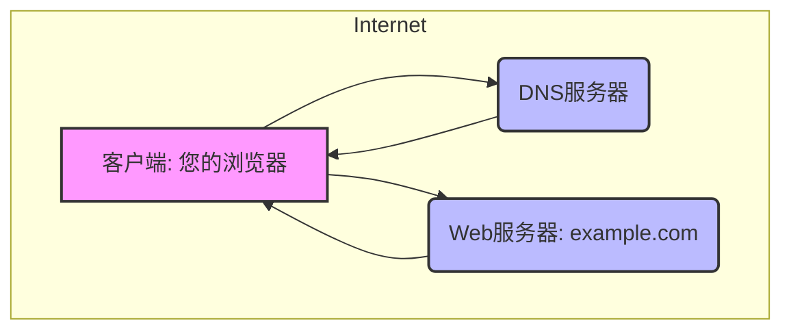
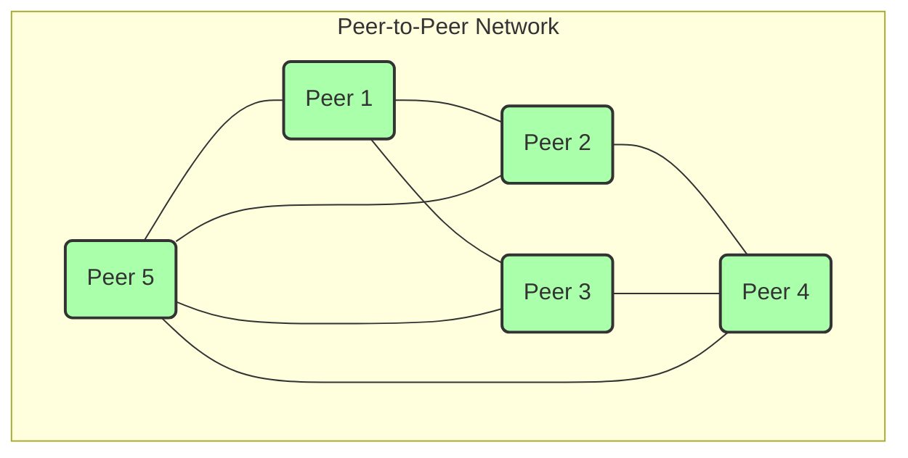

## 2.1 根本问题：应用程序如何制定通信规则？

想象一下，我们身处一个由无数“智能个体”——也就是计算机应用程序——组成的庞大城市：互联网。在这个城市里，有些个体是默默工作的服务器，有些是个性张扬的社交媒体客户端，还有些是穿梭于数据洪流中的文件共享程序。它们各司其职，却又紧密相连。但如果这些个体想要相互交流，传递信息，分享资源，它们会面临一个根本性的问题：**它们应该如何制定通信的规则？**

这正是我们即将深入探讨的计算机网络原理第二章——应用层的起点。应用层，顾名思义，是直接面向应用程序的最高层。它不关心数据包在物理线路上如何变成光信号，也不关心如何通过路由器转发到遥远的另一端，它只关心一件事：**应用程序之间，如何高效、准确、有目的地进行信息交换。**

### 1. 互联网的“语言与礼仪”：应用层协议的诞生

就像不同国家的人需要通过共同的语言和约定俗成的礼仪才能顺畅交流一样，互联网上的应用程序也需要一套共通的“语言”和“行为规范”。这套规范，在计算机网络的世界里，被称为**应用层协议 (Application-Layer Protocol)**。

#### 1.1 问题的根源：混沌与无序

在计算机网络早期，每个应用程序都可能采用自己独有的通信方式。例如，A公司的邮件程序可能用一种格式发送邮件，而B公司的邮件程序则用另一种完全不同的格式。结果可想而知：A公司的用户无法收到B公司用户发送的邮件，或者即便收到了也无法正确解读。这就像每个人都在说自己的方言，没有统一的普通话，也缺乏基本的社交礼仪，使得跨应用程序的交流变得异常困难，甚至不可能。

这种无序状态的**问题**在于：

1.  **互操作性差 (Poor Interoperability)：** 不同厂商、不同开发者开发的应用程序无法相互理解。
2.  **开发成本高 (High Development Cost)：** 每开发一个新的应用程序，都需要重新设计一套通信机制，并为与旧系统兼容而付出巨大努力。
3.  **扩展性受限 (Limited Scalability)：** 每次新加入一个应用程序，都可能需要修改现有应用程序以适应新的通信方式。

#### 1.2 解决方案：标准化与统一

为了解决这种混乱，人们意识到必须引入一套**标准化的规则**，让所有相关的应用程序都遵循。这些规则不仅要定义“说什么”，还要定义“怎么说”。这就是应用层协议的核心使命。

**应用层协议**，简而言之，就是为特定网络应用定义了：

*   **消息类型 (Message Types)：** 定义应用程序之间可以交换哪些类型的消息。例如，对于网页浏览，会有“请求网页”的消息和“响应网页内容”的消息。对于电子邮件，会有“发送邮件”的消息和“接收邮件”的消息。
*   **消息语法 (Message Syntax)：** 定义了这些消息的结构或格式。例如，一个请求消息应该包含哪些字段（如请求方法、URL、协议版本），每个字段应该占多少字节，字段之间用什么分隔符。这就像人类语言中的语法规则，规定了句子的成分和排列顺序。
*   **消息语义 (Message Semantics)：** 定义了这些消息中各个字段的含义，以及发送或接收到特定消息后应用程序应该采取的动作。例如，HTTP协议中的 `GET` 方法表示客户端希望获取资源，而 `POST` 方法表示客户端希望向服务器提交数据。这就像人类语言中词语的含义和表达的意图。
*   **消息交换规则 (Message Exchange Rules)：** 定义了应用程序之间消息交换的时序和流程。例如，客户端通常先发送请求，服务器收到请求后才发送响应。这就像人类对话中的“一问一答”的顺序，或更复杂的“握手”过程。

**类比：**

我们可以将应用层协议比作一本**互联网服务的“剧本”**。

*   **剧本背景：** 互联网这个巨大的舞台。
*   **演员：** 各种应用程序（Web浏览器、邮件客户端、文件服务器等）。
*   **角色：** 客户端、服务器、对等节点等。
*   **台词（消息类型和语法）：** 定义了每个角色在特定场景下能说什么，以及这些“台词”应该以什么样的结构呈现。例如，Web浏览器说“GET /index.html HTTP/1.1”，Web服务器就回应一段HTML代码。
*   **表演指导（消息语义和交换规则）：** 定义了这些“台词”的深层含义，以及演员们应该何时说哪句台词，说完了之后应该有什么样的动作和反应。比如，服务器收到一个 `GET` 请求，就知道要找到对应的文件并发送给客户端，而不是去修改数据库。

**影响：**

应用层协议的标准化，带来了革命性的影响：

1.  **全球互联互通：** 无论你使用哪家公司开发的浏览器，都能访问全球任何一个网站，因为它们都遵循HTTP协议。
2.  **降低开发难度：** 开发者可以基于已有的协议标准进行应用程序开发，无需从零开始设计通信机制，专注于业务逻辑。
3.  **促进创新：** 稳定的协议基础，使得开发者可以在应用层进行各种创新，催生了无数新的互联网服务和应用。

经典的例子包括：

*   **HTTP (HyperText Transfer Protocol)：** 万维网（Web）的基础，定义了浏览器和Web服务器之间如何交换Web页面和数据。（详见2.2节）
*   **SMTP (Simple Mail Transfer Protocol)：** 电子邮件发送协议，定义了邮件服务器之间以及邮件客户端向服务器发送邮件的规则。
*   **DNS (Domain Name System)：** 域名系统协议，定义了如何将人类可读的域名（如`www.example.com`）解析成机器可识别的IP地址。（详见2.3节）
*   **FTP (File Transfer Protocol)：** 文件传输协议，定义了在客户端和服务器之间传输文件的规则。

这些协议就像互联网的“法律”和“字典”，为应用程序的通信提供了清晰、一致的蓝图。

### 2. 互联网的“组织结构”：应用程序架构模式

仅仅定义了通信规则还不够，应用程序还需要决定它们之间如何“组织起来”才能实现这些通信。这种组织方式，就是**应用程序架构模式 (Application Architecture Patterns)**。在互联网世界中，最主流的两种架构模式是：**客户-服务器 (Client-Server, C/S)** 和 **对等网络 (Peer-to-Peer, P2P)**。

#### 2.1 架构模式一：客户-服务器 (Client-Server) - 中心化的服务剧场

**背景与问题：**

在互联网发展的早期，计算资源昂贵且稀缺，大型机房拥有强大的处理能力和存储空间。用户通常通过终端连接到这些集中式的计算资源上。这种模式自然而然地演变成了客户-服务器架构的雏形。当时面临的**问题**是：如何有效地共享稀缺的计算资源和信息？如何为大量用户提供统一且可靠的服务？

**解决方案：**

客户-服务器架构正是为了解决这些问题而生。它将应用程序的功能清晰地划分为两种主要角色：

1.  **服务器 (Server)：**
    *   **角色定位：** 信息的提供者、服务的主导者、资源的管理者。
    *   **特点：** 通常是功能强大的主机，拥有固定的、广为人知的IP地址，并持续运行（“永远在线”）。它被设计为能同时响应来自多个客户端的请求，提供数据、计算或存储等服务。服务器像一个图书馆或银行，集中管理着重要的资源。
    *   **任务：** 监听特定端口，等待客户端的请求；收到请求后，根据请求内容进行处理，并将结果发送回客户端。

2.  **客户端 (Client)：**
    *   **角色定位：** 信息的消费者、服务的请求者。
    *   **特点：** 通常是用户设备（如PC、智能手机），需要时才启动，可以间歇性地连接到网络。客户端通常拥有动态的IP地址，并且不直接与其他客户端通信，而是专门向服务器发起请求，接收服务。客户端就像图书馆的读者或银行的顾客。
    *   **任务：** 向服务器发起连接，发送请求；接收服务器的响应，并向用户展示或处理。

**工作流程（以Web浏览为例）：**

当你在浏览器中输入一个网址（如`www.example.com`）时，这个过程完美诠释了客户-服务器模式：

1.  **请求者 (客户端)：** 你的浏览器作为客户端，向域名服务器（DNS服务器，也是一种服务器）发送请求，将域名解析为IP地址。
2.  **服务提供者 (服务器)：** DNS服务器收到请求，查找对应IP地址，并将其返回给浏览器。
3.  **请求者 (客户端)：** 浏览器使用得到的IP地址，向目标Web服务器（`www.example.com`的主机）发起HTTP连接。
4.  **服务提供者 (服务器)：** Web服务器收到HTTP请求（例如GET请求），找到对应的网页文件。
5.  **服务提供者 (服务器)：** Web服务器将网页内容封装在HTTP响应中，发送回浏览器。
6.  **请求者 (客户端)：** 浏览器接收响应，渲染网页并显示给你。

**Mermaid 图示：**

*图2.1.1 客户端-服务器架构示例*

**影响与优缺点：**

*   **优点：**
    *   **集中管理与控制：** 服务器可以集中管理数据和资源，易于维护、备份和安全管理。
    *   **数据一致性：** 由于数据集中存储，更容易保证数据的一致性。
    *   **安全性：** 服务器可以实施统一的安全策略，对访问进行身份验证和授权。
    *   **性能相对可预测：** 在服务器能力范围内，服务性能相对稳定。
*   **缺点：**
    *   **单点故障 (Single Point of Failure)：** 如果服务器宕机，所有依赖该服务器的客户端都将无法获得服务（尽管现代系统通过冗余设计缓解了此问题）。
    *   **可伸缩性瓶颈 (Scalability Bottleneck)：** 单个服务器的处理能力和带宽有限，当客户端数量急剧增加时，服务器可能成为性能瓶颈（尽管现代架构通过负载均衡、集群和微服务等技术显著提高了其伸缩性）。
    *   **高昂的维护成本：** 维护和升级高性能服务器、数据中心等需要大量投资和专业人员。

#### 2.2 架构模式二：对等网络 (Peer-to-Peer, P2P) - 去中心化的协作社群

**背景与问题：**

随着互联网用户数量的爆炸式增长，以及宽带接入的普及，用户设备（如个人电脑）的计算能力和存储空间也大大提升。传统客户-服务器模式在面对海量数据分发（如大型文件下载）、高并发访问以及希望降低运营成本的场景时，其中心化瓶颈和单点故障的风险日益凸显。

**问题**主要体现在：

1.  **服务器负载过重：** 单一服务器难以承受亿万用户的同时访问和大规模数据分发。
2.  **成本高昂：** 维护庞大的服务器集群和带宽需要巨大的经济投入。
3.  **抗审查性与隐私需求：** 中心化的控制可能导致内容被审查或用户数据被收集。

**解决方案：**

对等网络（P2P）架构应运而生，它旨在打破中心化服务器的束缚，让网络中的每个参与者（“对等节点”或“Peer”）都能够同时扮演客户端和服务端的角色，直接相互通信和共享资源。

**核心思想：** 网络中的每个节点都具有同等的地位，既是服务的请求者，也是服务的提供者。

**工作流程（以BitTorrent文件共享为例）：**

BitTorrent是P2P架构的经典应用，它通过以下方式实现文件共享：

1.  **文件分割：** 一个大文件会被分割成许多小块（chunks）。
2.  **Tracker服务器 (可选，但常见)：** 用户首先通过一个“Tracker”服务器（这是一个中心化的组件，但只负责协调，不存储文件内容）找到拥有所需文件块的其他对等节点。
3.  **对等节点发现：** Tracker服务器返回一个对等节点列表给客户端A。
4.  **直接通信与共享：** 客户端A随后直接与其他对等节点建立连接，并开始下载文件块。同时，客户端A下载到的文件块也可以立即上传给其他需要这些块的对等节点。
5.  **自伸缩性：** 随着更多用户（对等节点）加入文件共享网络，提供上传能力的节点也随之增加，整个网络的下载速度和健壮性反而会增强。

在这个过程中，每个参与下载的用户既是向其他用户请求文件块的“客户端”，也是向其他用户提供已下载文件块的“服务器”。

**Mermaid 图示：**

*图2.1.2 对等网络架构示例*

**影响与优缺点：**

*   **优点：**
    *   **高伸缩性与健壮性：** 随着用户数量的增加，网络的总带宽和存储能力也随之增加，无需依赖昂贵的中心服务器扩容。即使部分节点离线，整个网络仍能继续运行。
    *   **抗审查性：** 由于没有中心化的控制点，更难被单一实体关闭或审查。
    *   **成本效益：** 服务提供商无需投入大量资金购买和维护服务器，利用了用户的闲置资源。
    *   **潜在的隐私保护：** 某些P2P系统通过加密和匿名路由来增强用户隐私。
*   **缺点：**
    *   **安全性挑战：** 难以对内容和参与者进行统一的安全管理和信任验证。恶意节点可能传播病毒或伪造数据。
    *   **资源管理复杂：** 节点的多样性（不同带宽、在线时长）使得资源调度和管理变得复杂。
    *   **服务质量 (QoS) 难以保证：** 节点的瞬时性（随时加入或离开）可能导致服务不稳定。
    *   **法律与版权问题：** P2P文件共享常被用于非法内容传播，引发版权纠纷。
    *   **NAT穿越问题：** 大多数家庭宽带用户处于NAT（网络地址转换）之后，直接连接其他外部Peer存在技术挑战。

### 3. 两种架构模式的比较

为了更清晰地理解这两种主流的应用架构模式，我们可以通过以下表格进行对比：

| 特性         | 客户-服务器 (Client-Server)                               | 对等网络 (Peer-to-Peer)                                     |
| :----------- | :-------------------------------------------------------- | :---------------------------------------------------------- |
| **中心化程度** | 高度中心化，所有服务和资源都由中心服务器提供和管理。      | 高度去中心化，服务和资源分布在各个对等节点上。              |
| **角色划分**   | 明确的客户端（请求服务）和服务器（提供服务）角色。        | 节点同时扮演客户端和服务器的角色，角色动态且对等。          |
| **资源位置**   | 集中存储在服务器上。                                    | 分散存储在各个对等节点上。                                  |
| **可伸缩性**   | 受限于服务器容量和带宽，伸缩性有限，扩展成本高。          | 理论上可无限伸缩，通过增加对等节点来增加网络容量和带宽。    |
| **鲁棒性**     | 易受单点故障影响，服务器宕机则服务中断。                  | 对部分节点故障具有高鲁棒性，无单点故障。                    |
| **安全性**     | 易于集中实施安全策略和访问控制。                          | 安全性挑战大，难以统一管理和信任验证。                      |
| **部署与管理** | 相对简单，只需管理服务器。                                | 复杂，需处理大量不可控的对等节点。                          |
| **常见应用**   | Web浏览 (HTTP), 电子邮件 (SMTP/POP3/IMAP), 域名解析 (DNS), 数据库服务。 | 文件共享 (BitTorrent), 加密货币 (Bitcoin), 部分VoIP应用, 分布式存储 (IPFS)。 |

这两种架构模式并非水火不容，许多现代应用实际上采用了**混合架构**，结合两者的优点。例如，一些P2P系统会使用中心化的Tracker服务器来帮助对等节点相互发现，而核心的数据传输仍通过P2P方式进行。云计算的兴起也使得“服务器”的概念变得更加弹性，可以是物理机器，也可以是虚拟实例，甚至是无服务器函数。

### 总结与展望

在这一节中，我们深入探讨了应用程序如何制定通信规则这一根本问题。我们了解到，**应用层协议**是解决应用程序互操作性问题的关键，它定义了通信的“语言”和“礼仪”——包括消息的类型、语法、语义以及交换规则。我们还认识到，为了有效地利用这些规则，应用程序需要采用特定的**架构模式**来组织其通信：

*   **客户-服务器 (C/S)** 架构通过中心化的服务器提供稳定、集中的服务，适用于对数据一致性、安全性和管理性要求高的场景，但存在单点故障和伸缩性瓶颈。
*   **对等网络 (P2P)** 架构通过去中心化的节点直接协作，具有高伸缩性、鲁棒性和成本效益的优势，尤其适合大规模数据分发，但面临安全和管理上的挑战。

理解这些基本概念，不仅能帮助我们掌握互联网的工作原理，更能启发我们去思考更深层次的问题。随着物联网 (IoT)、边缘计算 (Edge Computing) 和区块链等新兴技术的发展，我们对应用程序架构的需求也在不断演变。未来的应用，将如何巧妙地融合这些传统架构的优点，规避其缺点？如何在去中心化的趋势下，保障通信的安全与信任？又如何在海量异构设备的连接中，制定出更加灵活、高效的应用层协议？

这些问题没有简单的答案，但正是这种持续的探索和创新，驱动着计算机网络的不断演进，构筑着我们数字世界的未来。