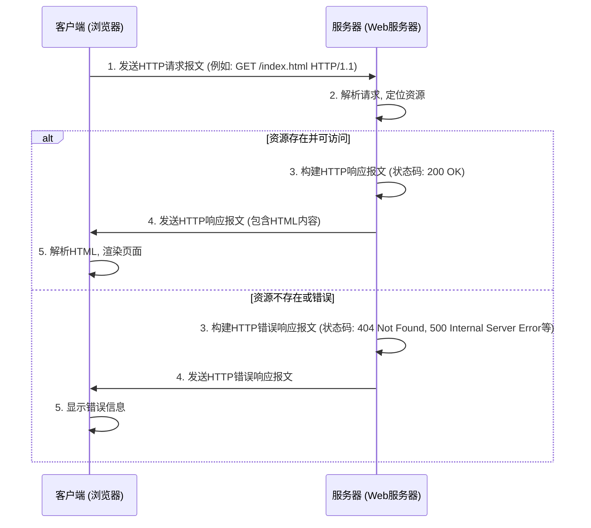

## 2.2 工具一 (Web)：HTTP - 构建万维网的语言

亲爱的探索者们，

欢迎来到计算机网络原理的殿堂。在前一章，我们探讨了应用层的宏大愿景——让网络成为我们沟通、协作、获取信息的无缝桥梁。现在，我们将深入探究这座桥梁上最繁忙、也最熟悉的一条通道：**万维网（World Wide Web）**。而支撑这条通道，让您此刻得以阅读这篇文章的，正是我们今天的主角——**HTTP（HyperText Transfer Protocol），超文本传输协议**。

您可以将HTTP想象成万维网上通用的“语言”。当您在浏览器中输入一个网址，或者点击一个链接时，您的设备与远方服务器之间就开始了一场微妙而高效的对话。这场对话的规则、词汇和语法，便是由HTTP所定义。它不只是一种协议，更是我们通往信息世界的钥匙，构建了我们今天所熟知且赖以生存的数字世界。

### 一、 背景与诞生：万维网的基石

在HTTP诞生之前，网络上的信息获取方式是相对碎片化和复杂的。那时，如果你想获取一份文档，可能需要使用FTP（文件传输协议）连接到特定的服务器，然后浏览目录、下载文件；如果你想查找信息，可能需要通过Gopher协议，在层层菜单中穿梭。这些协议各自为政，缺乏统一性，也缺乏一种简单、直观的方式来连接不同的信息资源。

想象一下，在没有统一邮政编码和地址系统的时代，你寄信需要知道每个收件人的详细物理路径，而且每种信件（文本、图片）可能还要用不同的寄送方式。这显然效率低下且难以推广。

正是在这样的背景下，蒂姆·伯纳斯-李（Tim Berners-Lee）在1989年提出了万维网的构想。他设想了一个全球性的信息系统，其中所有的文档都能够通过**超链接**相互连接，无论它们存储在世界的哪个角落，都能够被统一地访问。为了实现这一愿景，他需要一套简单的规则来：

1.  **定位资源：** 如何指定一个独特的地址来找到任何一个文档？（诞生了URL/URI）
2.  **传输资源：** 如何将这个文档从服务器传输到客户端？（诞生了HTTP）
3.  **显示资源：** 如何在客户端展现这个文档，并支持超链接？（诞生了HTML）

HTTP正是这“三驾马车”中负责“传输”的核心组件。它的设计目标是**简单、高效、可扩展**，能够让用户轻松地“点击”即可获取信息，从而彻底改变了信息的发布和消费模式。它的出现，将原本分散、复杂的网络信息，编织成了一张巨大而相互关联的“网”，极大地降低了信息获取的门槛，促进了知识的传播和共享，最终催生了我们今天繁荣的互联网生态。

### 二、 核心机制：请求-响应模型——网络的对话艺术

HTTP协议的核心机制是**请求-响应模型（Request-Response Model）**。这是一种经典的客户端-服务器（Client-Server）架构，描述了信息在网络中如何被发起、处理和返回。

**类比：图书馆的借阅过程**

你可以把这整个过程想象成你在图书馆里向图书管理员（服务器）借阅书籍（资源）的场景：

1.  **你（客户端）发起请求：** 你走进图书馆，找到图书管理员，明确告诉他：“我想借阅《三体》这本书。”这就是一个**HTTP请求**。
2.  **图书管理员（服务器）处理请求：** 图书管理员听到你的请求后，会去书架上寻找《三体》。
3.  **图书管理员（服务器）返回响应：**
    *   如果找到了这本书，他会告诉你：“好的，这本书在这里，请拿好。”并把书递给你。这就是一个**HTTP成功响应**，包含了你请求的资源。
    *   如果没找到，他可能会说：“抱歉，这本书被借走了。”或者“这本书我们图书馆没有。”这就是一个**HTTP错误响应**，表明请求未能成功。

在这个过程中，你是发起方（客户端），图书管理员是响应方（服务器）。每次互动都遵循“你问我答”的模式。

#### 2.2.1 HTTP请求报文的结构

当您的浏览器（客户端）需要从服务器获取一个网页时，它会构造一个HTTP请求报文并发送出去。一个典型的HTTP请求报文由以下几个部分组成：

1.  **请求行（Request Line）:**
    *   **方法（Method）：** 表示客户端希望对资源执行的操作类型，如 `GET`（获取）、`POST`（提交数据）、`PUT`（更新）、`DELETE`（删除）等。最常见的是 `GET` 和 `POST`。
    *   **URI（Uniform Resource Identifier）：** 标识了服务器上的特定资源路径，例如 `/index.html`。
    *   **HTTP版本（HTTP Version）：** 客户端使用的HTTP协议版本，如 `HTTP/1.1` 或 `HTTP/2.0`。
    *   *示例：* `GET /index.html HTTP/1.1`

2.  **请求头（Request Headers）:**
    *   提供关于请求或客户端的额外信息，以键值对（`Key: Value`）的形式出现。
    *   常见的请求头包括：
        *   `Host:`：指定服务器的域名，使得同一台物理服务器可以托管多个网站。
        *   `User-Agent:`：标识客户端浏览器和操作系统信息。
        *   `Accept:`：告知服务器客户端可以接受的媒体类型（如 `text/html`, `image/jpeg`）。
        *   `Accept-Language:`：告知服务器客户端偏好的语言。
        *   `Connection:`：管理客户端与服务器连接的选项，如 `keep-alive` 表示持久连接。
        *   `Cookie:`：承载客户端保存的Cookie信息（我们稍后会详细解释）。

3.  **空行：** 一个空白行，用于分隔请求头和请求体。

4.  **请求体（Request Body，可选）:**
    *   在 `GET` 请求中通常为空。
    *   在 `POST` 或 `PUT` 等请求中，用于承载需要发送到服务器的数据，例如表单数据、JSON数据等。

**案例分析：一个简单的GET请求**

假设你在浏览器中输入 `https://www.example.com/index.html`，浏览器会向 `www.example.com` 服务器发送类似如下的HTTP请求：

```http
GET /index.html HTTP/1.1
Host: www.example.com
User-Agent: Mozilla/5.0 (Windows NT 10.0; Win64; x64) AppleWebKit/537.36 (KHTML, like Gecko) Chrome/100.0.4896.88 Safari/537.36
Accept: text/html,application/xhtml+xml,application/xml;q=0.9,image/avif,image/webp,image/apng,*/*;q=0.8,application/signed-exchange;v=b3;q=0.9
Accept-Encoding: gzip, deflate, br
Accept-Language: en-US,en;q=0.9
Connection: keep-alive
```

*   **请求行** `GET /index.html HTTP/1.1` 清晰地表明：我想用 HTTP/1.1 协议，从服务器获取根目录下的 `index.html` 文件。
*   **Host** 头告诉服务器，我要访问的是 `www.example.com` 这个网站。
*   **User-Agent** 头让服务器知道我正在使用什么浏览器和操作系统，这有助于服务器提供适配的内容。
*   **Accept** 头则表明我优先接收 HTML 格式的文本，其次是其他格式。

#### 2.2.2 HTTP响应报文的结构

当服务器接收、解析并处理了客户端的请求后，它会构建一个HTTP响应报文并返回给客户端。一个典型的HTTP响应报文由以下几个部分组成：

1.  **状态行（Status Line）:**
    *   **HTTP版本（HTTP Version）：** 服务器使用的HTTP协议版本。
    *   **状态码（Status Code）：** 一个三位数的整数，表示请求处理的结果。
    *   **原因短语（Reason Phrase）：** 对状态码的文字描述。
    *   *示例：* `HTTP/1.1 200 OK`

2.  **响应头（Response Headers）:**
    *   提供关于响应、服务器或资源本身的额外信息，以键值对（`Key: Value`）的形式出现。
    *   常见的响应头包括：
        *   `Date:`：响应生成的时间。
        *   `Server:`：服务器软件的名称和版本。
        *   `Content-Type:`：响应体中内容的媒体类型（如 `text/html`, `application/json`）。
        *   `Content-Length:`：响应体的大小（字节数）。
        *   `Last-Modified:`：资源的最后修改时间。
        *   `Set-Cookie:`：服务器指示客户端设置Cookie，用于后续请求。
        *   `Cache-Control:`：控制客户端或代理服务器如何缓存响应。

3.  **空行：** 一个空白行，用于分隔响应头和响应体。

4.  **响应体（Response Body，可选）:**
    *   包含客户端所请求的实际资源内容，如HTML页面、图片文件、JSON数据等。

**案例分析：一个简单的200 OK响应**

如果服务器成功找到了 `index.html` 文件，它可能会返回如下的HTTP响应：

```http
HTTP/1.1 200 OK
Date: Mon, 27 Jul 2024 12:00:00 GMT
Server: Apache/2.4.41 (Ubuntu)
Last-Modified: Sat, 25 Jul 2024 10:00:00 GMT
Content-Length: 150
Content-Type: text/html; charset=UTF-8
Connection: keep-alive

<!DOCTYPE html>
<html>
<head>
    <title>Welcome</title>
</head>
<body>
    <h1>Hello, World!</h1>
    <p>This is a simple HTML page.</p>
</body>
</html>
```

*   **状态行** `HTTP/1.1 200 OK` 明确地告诉浏览器：请求成功，一切正常。
*   **Content-Type** `text/html; charset=UTF-8` 告知浏览器响应体是UTF-8编码的HTML文本，浏览器会据此正确渲染页面。
*   **Content-Length** 告诉浏览器响应体的大小，有助于浏览器判断数据是否接收完整。
*   **响应体** 包含了 `index.html` 文件的实际HTML内容。

当浏览器收到这个响应后，它会解析HTML内容，并将其呈现在您的屏幕上。

**HTTP请求-响应流程图**

为了更直观地理解这个过程，我们可以用一个流程图来表示：



### 三、 核心特性：无状态 (Stateless)——“健忘”的服务器与记忆的魔法

HTTP的一个极其重要的核心特性是其**无状态性（Stateless）**。这意味着服务器不会保留任何关于之前请求的信息。每一次HTTP请求都是独立的，服务器对待每个请求都如同它从未见过这个客户端一样。

**为什么是无状态的？**

这种设计并非偶然，而是深思熟虑的结果，旨在解决早期互联网的一些核心问题：

1.  **简单性：** 无状态协议的实现逻辑更简单，服务器无需管理大量会话状态，降低了协议本身的复杂性。
2.  **可伸缩性（Scalability）：** 服务器不需要记住每一个客户端的状态，使得将请求分发到多台服务器变得非常容易。任何一台服务器都可以处理任何一个请求，而不需要担心它是否拥有特定的会话信息。这对于构建大型、高并发的Web服务至关重要。
3.  **容错性：** 如果一个服务器因为故障而下线，其他服务器可以立即接管，而不会丢失任何用户的会话信息，因为根本就没有“会话信息”需要丢失。

**类比：健忘的商店店员与会员卡**

就像你的教学目标中提到的那个例子：每次你去一家商店，店员都不认识你。你每次购物，都需要重新告诉他你的需求。这就像HTTP服务器，它不会记住你上次买了什么，或者你是不是这个商店的常客。

想象一下，如果你想买三件商品，你可能需要说：
*   “请给我一件T恤。”
*   “（过一会儿）请给我一条裤子。”
*   “（再过一会儿）请给我一双鞋。”

每次店员都把你看作是全新的顾客，他不知道你刚才买过T恤。这种“健忘”对于简单的信息获取（如浏览静态网页）来说是完全可行的，甚至是有益的。

**无状态带来的问题：如何实现有状态的行为？**

然而，在现代Web应用中，我们常常需要有“状态”的交互。例如：

*   **用户登录：** 网站需要知道你是谁，你是否已经登录。
*   **购物车：** 网站需要记住你添加了哪些商品。
*   **个性化推荐：** 网站需要根据你之前的浏览历史和偏好来推荐内容。
*   **多步表单：** 在一个分步骤填写的表单中，网站需要记住你上一步填写的内容。

如果服务器总是“健忘”的，那这些功能该如何实现呢？这就引出了弥补HTTP无状态性的核心机制——**Cookies**。

#### 2.3.1 弥补无状态性：Cookies的魔法

**Cookies**（中文常译作“曲奇”或“小甜饼”）正是为解决HTTP无状态问题而生的一种巧妙机制。

**类比：你的会员卡**

回到商店的例子，如果你希望店员能够记住你，你可能会向店员出示一张**会员卡**。这张会员卡上记录了你的会员编号、积分等信息。当你下次再来购物时，店员看到你的会员卡，就知道你是一个老顾客，并且可以查询到你的消费记录和偏好。

在Web世界中，**Cookie就是这张“会员卡”**。

**Cookies的工作原理：**

1.  **服务器发放“会员卡”：** 当你第一次访问某个网站并登录成功后，服务器会在其响应报文的**`Set-Cookie`**头中，向你的浏览器发送一些键值对信息。
    ```http
    Set-Cookie: sessionId=abc123xyz; Path=/; Expires=Tue, 19 Jan 2038 03:14:07 GMT; HttpOnly
    Set-Cookie: username=zhangsan; Path=/; Max-Age=3600
    ```
    这些信息可以是你的会话ID（sessionId）、用户名（username）等。

2.  **浏览器保存“会员卡”：** 你的浏览器收到这些Cookie信息后，会将其存储在本地（通常是一个小文本文件或浏览器内部存储）。

3.  **浏览器出示“会员卡”：** 从此以后，每当你再次访问同一个网站时，浏览器会自动在其请求报文的**`Cookie`**头中，将之前保存的、与该网站相关的Cookie信息发送给服务器。
    ```http
    Cookie: sessionId=abc123xyz; username=zhangsan
    ```

4.  **服务器识别“会员卡”：** 服务器接收到请求后，通过解析`Cookie`头中的信息，就能识别出是哪个用户发起的请求，从而恢复该用户的会话状态，提供个性化的服务。

通过Cookies，HTTP协议在保持自身无状态特性的同时，巧妙地实现了有状态的应用。它让服务器“间接”地记住了你，从而构建出我们今天所体验到的、充满个性化和互动性的万维网。当然，Cookies也引发了隐私、安全等诸多讨论，这促使我们对网络追踪和数据保护有了更深入的思考。

### 四、 现实关联：HTTPS——为网络披上安全外衣

尽管HTTP协议在连接世界方面取得了巨大成功，但它有一个致命的弱点：**数据是明文传输的**。这意味着，当您的浏览器与服务器通过HTTP通信时，所有传输的内容（包括您的用户名、密码、信用卡号、浏览记录等）都可能被网络上的第三方窃听、篡改或劫持。这就像你和图书馆管理员的对话都是在公开场合大声喊出来的，任何路过的人都能听到你们的对话内容。

随着在线交易、个人隐私和数据安全变得越来越重要，这种明文传输的风险是不可接受的。因此，**HTTPS（HyperText Transfer Protocol Secure）**应运而生。

**HTTPS的本质：HTTP + TLS/SSL**

HTTPS并非一个全新的协议，它是在HTTP的基础上，增加了一个**安全层（TLS/SSL - Transport Layer Security / Secure Sockets Layer）**。可以理解为：

*   **HTTP:** 负责内容传输的“规矩”（请求-响应模型）。
*   **TLS/SSL:** 负责数据加密、身份认证和数据完整性保护的“安全卫士”。

**类比：密封的快递包裹**

如果说HTTP是寄送一张明信片——内容一目了然，谁都能看；那么HTTPS就是寄送一个经过严格加密、密封，并且有快递员身份验证的**快递包裹**。

1.  **加密（Encryption）：** TLS层会对所有传输的数据进行加密，即使数据被截获，也只是一堆乱码，无法被解读。这就像包裹被上了锁，没有钥匙无法打开。
2.  **身份认证（Authentication）：** 客户端会验证服务器的数字证书，确保它访问的是真正的网站，而不是一个假冒的钓鱼网站。这就像快递员会出示他的工作证，证明他是正规公司的员工。
3.  **数据完整性（Data Integrity）：** TLS能够确保数据在传输过程中没有被篡改。任何对数据的改动都会被发现。这就像包裹在运输途中如果被拆开又重新封装，收件人一眼就能看出异样。

HTTPS的普及，是互联网发展史上一个里程碑式的进步。它为在线银行、电子商务、社交媒体等各种需要处理敏感信息的应用提供了坚实的安全保障。现在，几乎所有的主流网站都已切换到HTTPS，浏览器也通过地址栏的绿色锁图标或“安全”提示，来明确告诉用户当前连接是安全的。

HTTPS的出现，预示着我们对网络安全的追求永无止境。它也为我们后续深入探讨网络安全、加密技术和数字证书等章节埋下了伏笔。

### 五、 总结与启发

今天我们深入探讨了HTTP——构建万维网的语言。我们了解到：

*   **HTTP的诞生背景**是为了解决早期网络信息获取的碎片化问题，它的出现将分散的信息编织成了一张全球性的网。
*   其**核心机制是请求-响应模型**，客户端发送请求，服务器返回响应，像一场有条不紊的对话。我们剖析了请求和响应报文的具体结构，并通过实例理解了它们的运作方式。
*   HTTP协议本质上是**无状态的**，服务器不保留历史信息，这带来了简单性和伸缩性。
*   为了弥补无状态性，**Cookies**被引入，允许服务器和浏览器协作，实现会话跟踪和个性化体验，就像一张能让店员记住你的会员卡。
*   面对明文传输的安全隐患，**HTTPS**应运而生，它在HTTP之上增加了TLS安全层，实现了数据加密、身份认证和完整性保护，为现代Web应用提供了不可或缺的安全保障。

HTTP以其看似简单的请求-响应模型和无状态特性，构建起了我们今天所依赖的庞大而复杂的万维网。它的设计哲学体现了“Keep it simple, stupid (KISS)”的精髓——用最基础的机制，承载起最宏大的应用。

但你是否曾想过：
*   如果HTTP不是无状态的，我们的服务器会面临怎样的存储和性能挑战？
*   如果Web内容不仅仅是文本和图片，还需要实时的视频、音频流和复杂的交互，HTTP这种请求-响应模型是否依然是最优解？（这正是WebSockets等新技术试图解决的问题）
*   随着万物互联的兴起，HTTP是否依然能作为所有设备间通信的通用语言？

这些问题将引导我们继续探索网络世界的奥秘，理解协议设计的权衡，并展望未来网络协议的演进。HTTP无疑是您深入理解计算机网络的基石，掌握它，就如同掌握了万维网世界的通用语。