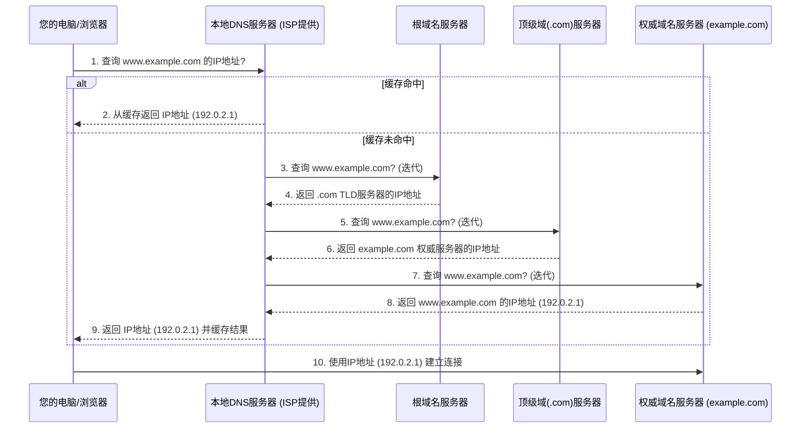

## 2.3 工具二 (寻址)：DNS - 互联网的“电话本”

在上一章中，我们初步探讨了计算机网络存在的基础——连接与通信。然而，仅仅建立连接是远远不够的。当我们在浩瀚的数字海洋中遨游时，如何准确无误地找到我们想去的目的地，成了摆在我们面前的又一个核心问题。这就引出了我们今天的主角——DNS（Domain Name System，域名系统），一个被誉为“互联网电话本”的寻址利器。它如同幕后英雄，默默地将我们耳熟能详的网站名称，转化为机器能识别的数字地址，构建起我们与互联网世界沟通的桥梁。

### 根本问题：为什么我们需要DNS？

试想一下，如果你想联系你的朋友，你更愿意记住他的名字“张三”，还是他长串的电话号码“138xxxxxxxx”？毫无疑问，我们人类的记忆系统更擅长处理有意义、易于联想的文本信息，而非一串无规律的数字。这正是互联网诞生之初，工程师们所面临的挑战。

在互联网的早期，计算机之间的通信依赖于IP地址（例如IPv4的`142.251.42.228`或IPv6的`2607:f8b0:4004:80c::2004`）。这些由点分十进制或冒号分隔的数字，对于机器来说是精确无误的身份标识，但对于人类而言，它们既难记忆，也缺乏直观意义。当用户想要访问一个网站时，如果每次都要输入一长串IP地址，这无疑是反人类的，大大降低了互联网的可用性和普及性。

**问题-解决方案-影响链条：**

*   **问题：** 人类难以记忆和使用数字化的IP地址进行网络资源访问，导致用户体验差，阻碍互联网普及。
*   **早期解决方案（及其局限）：** 互联网早期，曾采用一个名为`hosts.txt`的文件来解决这个问题。这个文件存储了少量主机名与IP地址的对应关系。当用户访问一个主机名时，系统会首先查询本地的`hosts.txt`文件。这种方式在网络规模很小、更新频率低时尚可运作。
    *   **局限性：** 随着互联网规模的指数级增长，`hosts.txt`的局限性暴露无遗：
        1.  **管理噩梦：** 维护一个全球唯一的、不断更新的`hosts.txt`文件几乎不可能。任何IP地址的变更都需要手动更新到所有联网的设备上。
        2.  **扩展性差：** 随着主机数量的增加，文件会变得极其庞大，查询效率低下。
        3.  **单点故障：** 如果更新服务器或文件本身出现问题，将导致整个网络寻址瘫痪。
*   **根本解决方案：** 为了应对这些挑战，一种更具弹性、可扩展性和分布式特性的系统应运而生——这就是域名系统（DNS）。它将人类友好的域名（如`www.google.com`）与机器可识别的IP地址（如`142.251.42.228`）之间建立起动态的映射关系，并以分布式的方式进行管理和查询。
*   **关键影响：** DNS的出现，极大地降低了互联网的使用门槛，使得普通用户无需记忆复杂的IP地址，只需输入易于理解和记忆的域名，就能轻松访问全球范围内的网站和服务。可以说，没有DNS，今天的互联网普及程度将难以想象。它不仅是寻址的工具，更是用户体验和网络可扩展性的基石。

### 核心架构：分布式层次化数据库

DNS之所以能高效且稳定地运行在全球数以亿计的设备之上，其核心在于其精心设计的**分布式、层次化数据库**架构。它摒弃了中心化的单一数据库模式，而是将域名与IP地址的映射信息，按照一种树状结构，分散存储在世界各地的服务器上。

为了更好地理解这一架构，我们可以想象一个宏大的“全球地址簿”查找过程：

> 假设你在寻找一位名叫“约翰·史密斯”的人，而你只知道他大概在美国。你不会直接去敲美国所有门询问，而是会遵循一套层层递进的查找流程：
> 1.  **你先问“国家总机”：** “请问美国在哪里？”
> 2.  **“国家总机”告诉你去找“某州总机”：** “你找美国的人，请联系加州的总机。”
> 3.  **你再问“某州总机”：** “请问加州的约翰·史密斯在哪里？”
> 4.  **“某州总机”告诉你去找“某市总机”：** “加州的约翰·史密斯在洛杉矶，请联系洛杉矶的总机。”
> 5.  **你最后问“某市总机”：** “请问洛杉矶的约翰·史密斯在哪里？”
> 6.  **“某市总机”告诉你具体地址：** “他在洛杉矶的某个具体地址。”

DNS的分布式层次化架构正是遵循了类似的逻辑，主要由以下几类服务器组成：

1.  **根域名服务器（Root DNS Servers）：**
    *   **地位与功能：** 它们是DNS查询的起点，如同上述类比中的“国家总机”。全球有13组根服务器，以字母A到M命名，由不同组织运营，并通过Anycast技术在全球部署了数百个物理实例，确保高可用性和负载均衡。
    *   **存储内容：** 它们不存储具体域名的IP地址，而是存储了**顶级域（TLD）服务器**的地址信息。例如，当你想访问`www.example.com`时，根服务器会告诉你`.com`这个顶级域的服务器地址在哪里。
    *   **重要性：** 根服务器是整个DNS体系的锚点，它们任何长时间的故障都可能导致全球范围内的网络瘫痪。正因如此，它们被设计得极其健壮和冗余。

2.  **顶级域（TLD）域名服务器：**
    *   **地位与功能：** 它们管理着所有属于某个特定顶级域的域名，比如`.com`、`.org`、`.net`等通用顶级域（gTLD），以及`.cn`、`.jp`、`.uk`等国家代码顶级域（ccTLD）。它们是类比中的“某州总机”。
    *   **存储内容：** 它们存储了该顶级域下所有**权威域名服务器**的地址信息。例如，`.com`的TLD服务器知道`example.com`这个域名的权威服务器地址在哪里。

3.  **权威域名服务器（Authoritative DNS Servers）：**
    *   **地位与功能：** 它们是某个特定域名（例如`example.com`）的最终管理者，存储着该域名下所有主机（如`www.example.com`、`mail.example.com`）的IP地址记录。它们是类比中的“某市总机”，最终能给出具体地址。
    *   **存储内容：** 它们持有域名的完整资源记录（Resource Records，RR），包括A记录（IPv4地址）、AAAA记录（IPv6地址）、MX记录（邮件服务器）、NS记录（指定子域的权威服务器）等等。当TLD服务器将查询引导到正确的权威服务器后，权威服务器便会给出最终的IP地址。

4.  **本地DNS服务器（Local DNS Resolver/Server）：**
    *   **地位与功能：** 这通常由你的互联网服务提供商（ISP）或企业网络提供。当你发起一个域名查询时，你的电脑（客户端）首先会向它发送请求。它扮演着一个代理或缓存的角色，是用户与DNS世界的第一道关卡。
    *   **存储内容：** 本地DNS服务器不属于DNS的层次结构，但它是DNS查询流程中不可或缺的一环。它负责向上级服务器（根、TLD、权威）发起查询请求，并将查询结果缓存起来，以便后续的相同查询能快速响应。

**为何选择分布式层次化架构？**

这种架构的巧妙之处在于：

*   **避免单点故障：** 没有一个单一的服务器持有所有域名信息。即使某个TLD服务器宕机，也不会影响其他TLD下的域名解析。根服务器的分布式部署更是增加了系统的鲁棒性。
*   **实现全球扩展：** 任何组织都可以注册自己的域名，并设置自己的权威DNS服务器，将维护任务分散到全球各地，极大地提高了系统的可扩展性。
*   **提高查询效率：** 通过分层管理，可以将复杂的查询任务分解为多个小任务。本地DNS服务器的缓存机制，更是进一步加速了重复查询的速度。

### 核心流程：域名解析过程

现在，让我们来追踪一次典型的域名解析过程，看看当你在浏览器中输入`www.example.com`时，幕后都发生了什么。这个过程通常是一个**递归查询**，意味着你的本地DNS服务器会代表你完成所有后续的查找步骤，直到找到最终答案。

#### 场景设定

你打开浏览器，在地址栏输入 `www.example.com`，然后按下回车。

#### 详细解析步骤

1.  **客户端发起查询（递归查询至本地DNS）：**
    *   你的操作系统（客户端）首先检查自己本地的DNS缓存（比如`hosts`文件或操作系统内存中的缓存），看是否已经有`www.example.com`对应的IP地址。如果没有，它会向配置好的**本地DNS服务器**（通常由ISP提供）发起一个DNS查询请求。这个请求是“递归的”，意味着客户端希望本地DNS服务器能直接告诉它最终的IP地址，而无需客户端自己再进行后续查找。

2.  **本地DNS服务器查询缓存：**
    *   本地DNS服务器收到请求后，会首先检查自己的缓存。如果缓存中有`www.example.com`对应的IP地址，且该记录的存活时间（TTL, Time To Live）尚未过期，它会立即将IP地址返回给客户端，整个查询过程就此结束。这种情况下，解析速度非常快。

3.  **本地DNS服务器向根域名服务器查询（迭代查询）：**
    *   如果本地DNS服务器缓存中没有该记录，或者记录已过期，它会开始向外进行迭代查询。它会首先向全球**根域名服务器**发起查询，请求`www.example.com`的IP地址。

4.  **根域名服务器响应（指示TLD服务器）：**
    *   根域名服务器收到请求后，发现它并不直接管理`example.com`。它会告诉本地DNS服务器：如果你想知道`example.com`的IP地址，你需要去问管理`.com`这个**顶级域（TLD）**的服务器。它会返回`.com`TLD服务器的IP地址列表。

5.  **本地DNS服务器向TLD域名服务器查询：**
    *   本地DNS服务器接收到`.com`TLD服务器的地址后，便会向其中一台`.com`TLD服务器发起查询，请求`www.example.com`的IP地址。

6.  **TLD域名服务器响应（指示权威服务器）：**
    *   `.com`TLD服务器收到请求后，发现它也不直接管理`www.example.com`的IP地址。它会查找自己的数据库，找到管理`example.com`域名的**权威域名服务器**的IP地址，并将其返回给本地DNS服务器。

7.  **本地DNS服务器向权威域名服务器查询：**
    *   本地DNS服务器获得`example.com`域名的权威域名服务器地址后，便会向该权威服务器发起最终的查询请求：`www.example.com`的IP地址是什么？

8.  **权威域名服务器响应（返回最终IP地址）：**
    *   权威域名服务器是`example.com`域名的最终管理者，它存储着`www.example.com`对应的IP地址。它会将这个IP地址（例如`192.0.2.1`）返回给本地DNS服务器。

9.  **本地DNS服务器缓存并返回结果：**
    *   本地DNS服务器收到IP地址后，会将其**缓存**起来，并设置一个TTL值。然后，它会将这个IP地址返回给最开始发起请求的客户端（你的浏览器）。

10. **客户端与目标服务器建立连接：**
    *   你的浏览器收到IP地址后，便可以使用这个IP地址直接与`www.example.com`的服务器建立TCP连接，并请求网页内容。

整个过程可以用以下 `mermaid` 图表示：

#### 缓存 (Caching) 的关键作用

在上述流程中，**缓存**是DNS系统高效运行的基石。

*   **目的：** 提高查询速度，减轻上游DNS服务器（根、TLD、权威）的负载。
*   **工作原理：** 当本地DNS服务器或客户端首次成功解析一个域名时，它会将该域名与IP地址的对应关系以及一个**存活时间（TTL）**一同存储在自己的内存中。
*   **影响：**
    *   **速度提升：** 对于在TTL时间内再次发生的相同查询，可以直接从缓存中获取结果，无需再次进行耗时复杂的迭代查询，极大地加速了用户访问体验。
    *   **负载均衡：** 减少了对根、TLD和权威服务器的重复查询请求，降低了它们的负载。
    *   **容错性：** 即使权威服务器短暂宕机，只要缓存中的记录未过期，用户仍然可以正常访问。
*   **TTL：** 域名所有者在配置DNS记录时会指定一个TTL值（通常为几分钟到一天）。这个值告诉缓存服务器该记录可以被缓存多久。当TTL过期后，即使缓存中有该记录，也需要重新进行查询，以确保获取到最新的IP地址（因为目标网站的IP地址可能会发生变化）。

### DNS的影响与未来

DNS，这个诞生于互联网早期、看似简单的“电话本”系统，却是支撑现代互联网运行的无名英雄。它的分布式、层次化设计，以及精巧的查询与缓存机制，解决了IP地址难以记忆与管理的核心难题，为互联网的全球化扩展和普及奠定了坚实基础。每一次你在浏览器中输入网址，或者点击一个链接，DNS都在幕后默默地为你导航。

然而，DNS也并非一成不变。随着网络安全和隐私意识的提高，新的挑战和技术也在不断涌现：

*   **DNSSEC (DNS Security Extensions)：** 旨在为DNS提供数据源认证和数据完整性校验，防止DNS欺骗和缓存污染攻击。
*   **DoH (DNS over HTTPS) / DoT (DNS over TLS)：** 通过加密传输DNS查询，以保护用户的隐私不被中间人窃听或篡改，这正在改变传统的DNS查询方式。
*   **新的顶级域：** 随着`.xyz`、`.app`等新通用顶级域的不断推出，DNS的命名空间还在持续扩展，为企业和个人提供了更多独特的网络身份。

### 总结与反思

DNS的核心使命，在于将人类友好的域名与机器可识别的IP地址进行高效、可靠地映射。它通过**分布式层次化**的架构，将全球域名信息拆分到根、TLD和权威服务器中管理，避免了单点故障，并实现了大规模扩展。其**递归/迭代查询**流程配合**缓存机制**，确保了域名解析的效率与响应速度。

想象一下没有DNS的互联网会是怎样？我们将被迫记忆无数的数字地址，网络世界将变得晦涩难懂，步履维艰。正是DNS的存在，使得互联网能够以一种对人类友好的方式呈现，让信息触手可及。在网络世界的底层逻辑中，DNS无疑是那块支撑着我们数字生活的基石。

思考：在数据隐私和网络安全日益受到关注的今天，DNS作为网络访问的第一步，它的安全性与隐私性是如何被保障的？未来DNS的发展方向又将如何影响我们上网的体验？