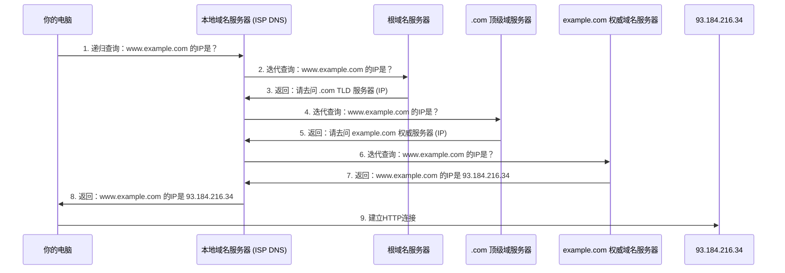

## 2.3 工具二：互联网的地址簿 (DNS)

在网络世界的浩瀚剧本中，我们已经见证了应用层如何以各种协议（如HTTP）编织起用户与服务的精彩互动。然而，所有的精彩表演都离不开一套高效、可靠的基础设施作为支撑。今天，我们将聚焦于其中一个看似隐形却又无处不在的“幕后英雄”——域名系统（Domain Name System, 简称DNS），一个堪称“互联网地址簿”的核心工具。它静默地工作着，将我们熟稔于心的网站名字，转化为机器方能理解的数字地址，正是它，维系着网络世界的秩序与可达。

### 第一幕：记忆的重负——DNS诞生的时代背景与根本问题

想象一下，你想要拜访一位朋友，但你记住的不是他家的门牌号，而是他家的GPS坐标——一串长而无意义的数字。每次要去找他，你都得费力地输入或查阅这串坐标。这听起来是不是非常反人性？

这正是互联网早期面临的“根本问题”。最初，互联网规模尚小，连接在网络上的每台计算机都有一个唯一的数字标识，即IP地址（例如：`172.217.160.142`）。如果我们要访问某台机器上的服务，比如某个网站，就必须直接输入这串IP地址。

**【问题】IP地址的反人性记忆挑战：**
人类大脑擅长记忆有语义、有结构、能与现有知识关联的信息，比如名字、地点等。而由四组数字或更复杂的IPv6地址组成的IP地址，对人类而言，无疑是枯燥且难以记忆的。试想，如果每次访问“百度”你都要输入 `14.215.177.38`，访问“谷歌”要输入 `172.217.160.142`，我们的互联网体验将是何等低效和痛苦！更不用说，当网站服务器需要更换IP地址时，用户将无从得知，瞬间失去访问途径。

**【背景】从本地文件到分布式系统：**
在DNS出现之前，人们确实一度采取过一种原始的解决方案：在每台联网的机器上维护一个名为 `HOSTS.TXT` 的文本文件。这个文件记录了域名与其对应IP地址的映射关系。当用户访问一个域名时，系统会先查询本地的 `HOSTS.TXT` 文件。

然而，这种中心化的、手动更新的机制，在互联网规模爆炸式增长的背景下，迅速暴露出其致命的缺陷：
1.  **扩展性差**：随着网络上的主机数量从几十台发展到几千、几万乃至数亿，`HOSTS.TXT` 文件将变得无比庞大，更新和维护将成为一场噩梦。
2.  **更新延迟与不一致**：当某个站点的IP地址发生变更时，需要手动更新全球所有联网设备的 `HOSTS.TXT` 文件，这几乎是不可能完成的任务，会导致信息严重滞后和不一致。
3.  **单点故障**：如果负责维护 `HOSTS.TXT` 文件的主机出现问题，整个地址解析系统将崩溃。

**【解决方案】DNS的横空出世与革命性影响：**
为了解决这一根本性的问题，并支撑互联网的持续扩张，域名系统（DNS）应运而生。它的核心思想是：将IP地址与人类友好的域名进行映射，并且以一种**分布式、层次化**的方式管理这些映射关系。这不仅仅是一个技术上的改进，更是一场深刻的变革，它：
*   **解放了用户的记忆负担**：我们得以通过 `www.example.com` 这样的语义化名称访问网络资源。
*   **实现了地址与位置分离**：即便服务器IP地址变更，只要在DNS中更新记录，用户依然可以通过域名访问，而无需感知底层变化。
*   **支持了互联网的全球规模化发展**：其分布式架构能够高效地处理海量的查询请求，并灵活地进行扩展和维护。

可以说，没有DNS，今天的互联网将寸步难行。它如同互联网世界里的一部巨型、自动更新且人人可查的全球地址簿，是我们流畅网上冲浪体验的基石。

### 第二幕：层层抽丝剥茧——DNS的分布式查询剧本

DNS最引人入胜的设计在于其**分布式和层次化**的查询机制。它不是一个单一的、巨大的服务器来存储所有域名和IP地址的对应关系，而是由遍布全球的无数台DNS服务器协同工作，共同完成“翻译”任务。我们可以将这个过程想象成一次“从国家问到省，再问到市”的层层询问之旅。

当你在浏览器中输入 `www.example.com` 并按下回车时，幕后会发生一系列复杂的DNS查询。这个过程通常涉及以下几个关键角色：

1.  **本地域名服务器 (Local DNS Resolver / Recursive Resolver)**：
    这是你电脑或路由器上配置的DNS服务器，通常由你的互联网服务提供商（ISP）提供。它是DNS查询的起点，也是你“个人助理”。当你的计算机需要解析一个域名时，它会首先向本地域名服务器发起请求。本地域名服务器收到请求后，会尽力为你找到最终的答案。

2.  **根域名服务器 (Root Name Servers)**：
    全球共有13组根域名服务器（由A到M标识），它们是DNS层次结构的顶端。它们不存储具体的域名-IP映射，而是知道所有**顶级域（Top-Level Domain, TLD）**服务器的IP地址。想象它们是全球的总局，知道哪些国家/地区/通用分类有自己的管理机构。

3.  **顶级域服务器 (Top-Level Domain Name Servers, TLD Servers)**：
    TLD服务器负责管理所有属于特定顶级域（如 `.com`, `.org`, `.cn`, `.net`, `.info` 等）的域名。例如，`.com` TLD 服务器知道所有以 `.com` 结尾的域名的**权威域名服务器**的IP地址。它们是“国家/地区/通用分类管理局”。

4.  **权威域名服务器 (Authoritative Name Servers)**：
    这是存储特定域名（例如 `example.com`）及其子域名（如 `www.example.com`）的最终IP地址映射的服务器。当你注册一个域名时，你需要指定或使用域名注册商提供的权威域名服务器。它们是“最终地址管理者”，拥有你所查询域名的最终答案。

**【核心机制：分层查询的剧本】**

让我们通过一个具体的例子来描绘这个查询过程，比如你要访问 `www.example.com`：

1.  **起点：你的电脑询问本地域名服务器。**
    你的电脑首先向配置的本地域名服务器（这通常是你的家庭路由器，其地址可能是 `192.168.1.1`）发出一个“递归查询”请求：“请告诉我 `www.example.com` 的IP地址是什么？”

2.  **本地域名服务器询问根域名服务器。**
    本地域名服务器会检查自己的缓存（我们稍后会讲到），如果找不到，它会向全球13组**根域名服务器**中的一个发出“迭代查询”请求：“谁知道 `www.example.com` 的IP地址？” 根服务器一看，这个域名以 `.com` 结尾，它不知道具体答案，但它知道 `.com` 顶级域的服务器在哪儿，于是它回复本地域名服务器说：“我不知道 `www.example.com` 的IP，但你可以去问 `.com` TLD 服务器（并给出其IP地址）。”

3.  **本地域名服务器询问顶级域服务器。**
    本地域名服务器收到根服务器的指引后，会向 `.com` **顶级域服务器**发送迭代查询请求：“请告诉我 `www.example.com` 的IP地址。” `.com` TLD 服务器查看后，发现 `example.com` 这个域名的权威域名服务器是 `ns1.exampledns.com`（并给出其IP地址），于是它回复本地域名服务器：“我不知道 `www.example.com` 的IP，但你可以去问 `example.com` 的权威域名服务器（并给出其IP地址）。”

4.  **本地域名服务器询问权威域名服务器。**
    本地域名服务器拿到 `example.com` 的**权威域名服务器**的IP地址后，向其发出迭代查询请求：“请告诉我 `www.example.com` 的IP地址。” 这台权威服务器终于找到了最终的答案：`www.example.com` 对应的IP地址是 `93.184.216.34`，并将其返回给本地域名服务器。

5.  **返回答案并缓存。**
    本地域名服务器收到 `93.184.216.34` 后，会将这个映射关系缓存起来（供下次查询使用），然后将这个IP地址返回给你的电脑。

6.  **建立连接。**
    你的电脑获得IP地址后，就可以向 `93.184.216.34` 发送HTTP请求，加载 `www.example.com` 的网页内容了。

整个过程如同一个逐级转交任务的侦探故事，确保了即使全世界的域名信息再庞大，也能通过分层管理和查询，高效准确地找到目标。



### 第三幕：智慧的捷径——缓存机制的奥秘

在上述复杂的查询过程中，你可能已经意识到，每次都从根服务器开始层层查询，效率会非常低下。DNS之所以能高效运行，离不开一项核心的性能优化技术——**缓存 (Caching)**。

**【为什么需要缓存？】**
想象一个图书馆，每次你借书都要让图书管理员从头开始，查阅所有目录，才能找到你想借的书。如果同一本书经常被借阅，而管理员每次都要重复这个全流程，那效率可想而知。但如果管理员把那些经常被借阅的书放在一个随手可取的地方，或者记住它们的位置，那么下次再有人借同一本书时，就能迅速提供。

在DNS中，缓存扮演的正是这个“记住”的角色。当本地域名服务器成功解析一个域名并获得其IP地址后，它不会立刻丢弃这个信息，而是将其存储在自己的内存中一段时间。下次有相同的域名查询请求到达时，本地域名服务器可以直接从缓存中返回答案，而无需再次进行耗时的分层查询。

**【缓存如何工作？TTL（生存时间）】**
DNS记录在被创建时，会带有一个名为 **TTL (Time To Live)** 的值，单位是秒。这个TTL值告诉查询它的DNS服务器（包括本地域名服务器和你的操作系统），该记录可以被缓存多久。
*   例如，如果 `www.example.com` 的A记录（地址记录）的TTL是3600秒（1小时），那么本地域名服务器会将这个映射关系缓存1小时。在这1小时内，所有对 `www.example.com` 的查询都将直接从缓存中得到答案。
*   当TTL过期后，该缓存记录就会被清除，下次查询时本地域名服务器就需要重新发起查询流程。

**【缓存的价值与影响】**
1.  **大幅减少查询延迟**：直接从缓存中获取答案比进行完整的迭代查询要快得多，极大地提升了用户访问网站的速度。
2.  **减轻上游服务器负载**：减少了对根服务器、TLD服务器和权威服务器的请求压力，使整个DNS系统更加稳定和健壮。
3.  **无处不在的性能优化思想**：DNS缓存是计算机科学中“缓存”这一通用性能优化思想的经典应用。无论是CPU缓存、数据库缓存、CDN缓存，其核心原理都是利用局部性原理，通过牺牲一些存储空间来换取时间效率。理解DNS缓存，有助于理解更广泛的计算机系统性能优化策略。

然而，缓存也并非没有弊端。当域名的IP地址发生变更时，由于缓存的存在，全球的DNS服务器需要等待旧的TTL过期后才能更新到新的IP地址，这导致了所谓的“DNS解析生效延迟”，即我们常说的“DNS传播需要时间”。

### 第四幕：亲手揭开面纱——DNS查询的实战演练

理论学习固然重要，但亲手实践更能加深理解。我们可以使用一些命令行工具来观察DNS的实际工作过程。`nslookup` 和 `dig` 是两个常用的DNS查询工具。`dig`（domain information groper）功能更强大，输出信息更详尽，更受专业人士青睐。

我们将以 `dig` 命令为例，进行一次DNS查询：

1.  **打开终端或命令提示符**：
    *   在macOS/Linux上，打开“终端”（Terminal）应用程序。
    *   在Windows上，打开“命令提示符”（Command Prompt）或PowerShell。

2.  **基本查询**：
    输入 `dig www.example.com` 并按下回车。

    ```bash
    dig www.example.com
    ```

    你将看到类似以下的输出（具体内容会因时间、网络环境而异）：

    ```
    ; <<>> DiG 9.10.6 <<>> www.example.com
    ;; global options: +cmd
    ;; Got answer:
    ;; ->>HEADER<<- opcode: QUERY, status: NOERROR, id: 34327
    ;; flags: qr rd ra; QUERY: 1, ANSWER: 1, AUTHORITY: 0, ADDITIONAL: 1

    ;; OPT PSEUDOSECTION:
    ; EDNS: version: 0, flags:; udp: 512
    ;; QUESTION SECTION:
    ;www.example.com.               IN      A

    ;; ANSWER SECTION:
    www.example.com.        300     IN      A       93.184.216.34

    ;; Query time: 1 msec
    ;; SERVER: 192.168.1.1#53(192.168.1.1)
    ;; WHEN: Thu Jan 01 00:00:00 UTC 2024
    ;; MSG SIZE  rcvd: 59
    ```

    **【输出解读】**
    *   `ANSWER SECTION`：这是我们最关心的部分。
        *   `www.example.com.`：查询的域名。
        *   `300`：这就是 TTL 值，表示这条记录可以被缓存300秒（5分钟）。
        *   `IN`：Internet，表示互联网数据。
        *   `A`：记录类型，表示这是一个地址记录（Address record），映射域名到IPv4地址。
        *   `93.184.216.34`：最终解析到的IPv4地址。
    *   `SERVER: 192.168.1.1#53(192.168.1.1)`：指示了本次查询所使用的本地域名服务器的IP地址（`192.168.1.1`，通常是你的路由器）和端口号（`53`）。
    *   `Query time`：本次查询的耗时。如果你的本地域名服务器有缓存，这个时间会非常短。

3.  **查询特定类型的记录**：
    DNS不仅存储A记录（IPv4地址），还有其他多种记录类型：
    *   **CNAME (Canonical Name) 记录**：别名记录，将一个域名指向另一个域名。
    *   **MX (Mail Exchanger) 记录**：邮件交换记录，指定负责接收邮件的服务器。
    *   **NS (Name Server) 记录**：域名服务器记录，指定负责某个域名的权威DNS服务器。
    *   **AAAA 记录**：IPv6地址记录。

    *查询CNAME记录*：
    ```bash
    dig www.baidu.com
    ```
    在 `ANSWER SECTION` 中，你可能会看到 `www.baidu.com.` 是一个 `CNAME` 到 `www.a.shifen.com.`，然后再由 `www.a.shifen.com.` 指向一个 `A` 记录。这说明 `www.baidu.com` 是 `www.a.shifen.com` 的一个别名。

    *查询MX记录*：
    ```bash
    dig baidu.com MX
    ```
    这将显示 `baidu.com` 的邮件服务器记录。

    *查询NS记录*：
    ```bash
    dig example.com NS
    ```
    这将显示 `example.com` 的权威域名服务器。你会发现这些正是我们在第二幕中提到的重要角色。

4.  **指定DNS服务器查询**：
    你可以强制 `dig` 向特定的DNS服务器发送查询请求，这对于调试非常有用。例如，你可以直接向Google的公共DNS服务器 `8.8.8.8` 发送请求：

    ```bash
    dig @8.8.8.8 www.example.com
    ```
    通过这种方式，你可以观察不同DNS服务器的响应，或者验证某个特定DNS服务器的缓存状态。

通过这些简单的命令行操作，你不仅能直观地看到DNS解析的结果，更能深入理解其背后的分层与记录机制，亲身感受它如何成为互联网不可或缺的基石。

### 第五幕：超越地址——DNS的更深层价值与未来

至此，我们已经深入探讨了域名系统（DNS）的核心功能、其分布式层次化的查询机制以及至关重要的缓存优化。DNS不仅仅是一个简单的“地址簿”，它的存在使得互联网能够从一个早期的小型实验网络，演变为今天全球互联、用户友好的信息高速公路。

**【要点回顾】**
*   **根本问题**：IP地址难以记忆和管理，`HOSTS.TXT` 文件无法扩展。
*   **解决方案**：DNS以分布式、层次化的方式，将人类可读的域名映射为机器可识别的IP地址。
*   **核心机制**：通过本地域名服务器、根域名服务器、顶级域服务器和权威域名服务器协同工作，完成层层迭代查询。
*   **性能优化**：缓存机制（TTL）大大减少了查询延迟，提升了用户体验并减轻了服务器负载。
*   **实践工具**：`dig` 等工具可以帮助我们亲身探索DNS的工作原理。

**【启发性思考与未来展望】**
DNS的价值远不止于简单的域名解析。它还是：
*   **负载均衡的基石**：通过返回不同IP地址，将流量导向不同的服务器集群。
*   **内容分发网络（CDN）的利器**：引导用户访问最近的CDN节点，提升访问速度。
*   **服务发现的关键**：在微服务架构中，DNS可以用于服务的注册与发现。

然而，作为互联网的核心基础设施，DNS也面临着挑战和发展：
1.  **安全挑战**：DNS查询通常是明文传输，容易受到监听、篡改（如DNS劫持、DNS欺骗）。这促生了 **DNSSEC (DNS Security Extensions)** 的发展，它通过数字签名来验证DNS响应的真实性和完整性，确保用户获得正确的解析结果。
2.  **隐私问题**：传统的DNS请求并不加密，你的ISP可以看到你访问了哪些网站。为了解决这一问题，**DoH (DNS over HTTPS)** 和 **DoT (DNS over TLS)** 等协议应运而生，它们将DNS查询封装在加密的HTTPS或TLS连接中，提高了用户的隐私保护。
3.  **技术演进**：随着IPv6的普及、边缘计算和物联网的发展，DNS也在不断演进，以适应新的网络环境和需求。

DNS，这个我们日常上网时几乎从未察觉的幕后英雄，其深远影响渗透在互联网的每一个角落。它静默地工作着，支撑着万物互联的壮丽图景。那么，在未来，随着网络攻击的日益复杂和用户隐私意识的增强，DNS将如何继续演变，以应对这些挑战，并继续作为互联网的“罗盘”指引我们前行？它的每一次迭代和革新，都将再次重塑我们与数字世界的交互方式。