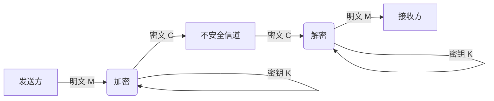
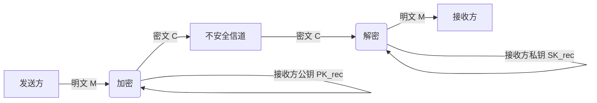
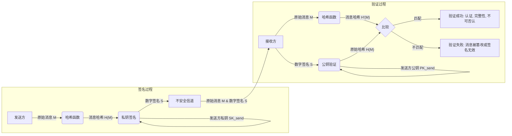

## 第六章：融会贯通 · 安全、VPN与现代网络

### 6.1 根本问题：如何在公开的网络上进行私密对话？

想象一下，你身处一个熙熙攘攘的公共广场，你希望与朋友进行一次私密的对话，确保旁人无法窃听、篡改你们交流的信息，并且你能确信与你对话的正是你的朋友本人，而非冒名顶替者。这正是计算机网络在处理信息传输时所面临的根本挑战：在一个开放、全球互联的互联网上，如何在本质上不可信赖的公共信道上，实现私密、安全、可靠的交流？

互联网的诞生之初，其设计理念更侧重于信息的开放性与互联性，而非安全性。数据包在路由器之间传递，如同明信片在邮局间流转，任何人都可以窥视其内容，甚至可能随意修改。这种“明信片”模式在早期可能无伤大雅，但在商业交易、个人隐私、国家安全日益依赖网络的今天，这无疑是一场灾难。这正是我们今天要探讨的“根本问题”，以及计算机网络安全领域为解决这些问题而发展出的三大核心目标与关键技术。

我们的目标是建立一个数字世界的“私密聊天室”，这需要解决三个核心挑战：**机密性 (Confidentiality)**、**完整性 (Integrity)** 和 **认证 (Authentication)**。它们是构建任何安全通信体系的基石。

---

#### 6.1.1 机密性 (Confidentiality)：如何防止窃听？——加密的艺术

**1. 问题的提出：信息暴露的风险**

在公共网络上发送信息，就像在广场上大声喊话。任何在场的人都能听到你说了什么。在网络世界中，这意味着你的数据包，从你的电脑发送到目标服务器的途中，会经过许多路由器、交换机，这些中间节点理论上都有可能被攻击者监听，从而窃取你的敏感信息，如银行账号、密码、个人邮件等。这就是“窃听”问题。

**2. 解决方案：加密——信息的伪装术**

为了防止窃听，我们需要对信息进行“伪装”，使其即使被截获，也无法被理解，这就是**加密（Encryption）**。加密的本质是将原始的、可读的信息（明文，Plaintext）通过某种算法和密钥转换成无序、不可读的信息（密文，Ciphertext）。只有拥有正确密钥的人才能将密文还原成明文。

我们可以用一个简单的类比来理解加密：想象你和你的朋友想交换一个秘密食谱。直接寄送食谱原件（明文）风险太高，因为邮递员或路上任何一个人都可能偷看。为了保密，你们决定使用一种“秘密代码本”。将食谱上的每个词都替换成代码本中对应的代号。这样，即使食谱被截获，没有代码本的人也无法理解。

在数字世界中，加密算法就是这个“代码本”的规则，而密钥就是选择特定代码本的那把“钥匙”。

加密技术主要分为两大类：**对称加密**和**非对称加密（公钥加密）**。

##### 2.1. 对称加密：速度与密钥分发的困境

**思想核心**：对称加密是最直观的加密方式。它使用**相同的密钥**进行加密和解密。

**类比**：这就像你和朋友共享一把锁和一把钥匙。你用这把钥匙把信件锁进一个箱子寄给朋友，朋友收到箱子后，用同一把钥匙打开箱子取出信件。

**工作原理**：
发送方使用密钥K对明文M进行加密，生成密文C。
接收方使用相同的密钥K对密文C进行解密，还原出明文M。



**优点**：
*   **速度快**：对称加密算法通常计算复杂度较低，处理大量数据时效率极高。这使得它非常适合加密大数据流，例如视频会议、文件传输等。

**缺点**：
*   **密钥分发难题**：这是对称加密的“阿喀琉斯之踵”。在你的朋友收到箱子之前，你们俩如何安全地共享那把唯一的钥匙？如果你们直接在公共广场上交换钥匙，钥匙就有可能被窃听者复制。如果在网络环境中，我们如何在一个不安全的网络上安全地协商或传递这个共同的密钥，而不被攻击者截获？如果密钥被截获，那么所有的加密都形同虚设。
*   **密钥管理复杂**：如果N个人之间需要进行安全通信，两两之间都需要一个独立的共享密钥，那么密钥总数将是 N * (N-1) / 2。当参与者数量庞大时，密钥的生成、存储和管理将成为一个噩梦。

**背景与影响**：
对称加密的历史可以追溯到古罗马的凯撒密码，甚至更早。二战时期的德国“Enigma”密码机也是对称加密的经典案例。这些系统虽然复杂，但其根本缺陷都在于密钥分发和管理。一旦密钥落入敌手，整个通信系统便会崩溃。正是这些历史教训，促使人们开始思考，是否有一种方式，可以在不直接共享密钥的情况下，实现安全的加密通信？

##### 2.2. 非对称加密（公钥加密）：密钥分发问题的终结者

**思想核心**：非对称加密，又称**公钥加密**，解决了对称加密的密钥分发难题。它使用**一对**不同的密钥：一个**公钥 (Public Key)** 和一个**私钥 (Private Key)**。这两个密钥是数学上相关联的，但从公钥推导出私钥在计算上是极其困难的。

**类比**：想象你拥有一个特殊的邮箱。这个邮箱有一个投入口（公钥），任何人都可以把信件投进去；但只有你拥有唯一的钥匙（私钥）才能打开邮箱取出信件。你可以在公共场合公布你的邮箱地址和投入口的信息（公钥），告诉所有人：“请把给我的秘密信件投到这个邮箱里！”但你永远不需要把你的钥匙（私钥）告诉任何人。

**工作原理**：
1.  **密钥对生成**：每个参与者生成一对密钥：一个公钥和一个私钥。
2.  **公钥公开**：公钥可以安全地对外公布，甚至发布在互联网上。
3.  **私钥保密**：私钥必须严格保密，只有其拥有者才能使用。
4.  **加密**：发送方使用**接收方的公钥**对明文进行加密，生成密文。
5.  **解密**：接收方使用**自己的私钥**对密文进行解密，还原出明文。



**优点**：
*   **解决了密钥分发难题**：发送方无需预先与接收方共享任何秘密信息。只需知道接收方的公钥，就可以发送加密信息。公钥可以公开传输，即使被窃听者获取，也无法解密信息（因为没有对应的私钥）。
*   **密钥管理简化**：每个用户只需要管理自己的密钥对。

**缺点**：
*   **速度慢**：与对称加密相比，非对称加密算法的计算开销要大得多，通常比对称加密慢上千倍。这使得它不适合直接加密大量数据。

**背景与影响**：
非对称加密的概念由Whitfield Diffie和Martin Hellman于1976年首次公开提出，随后Rivest、Shamir和Adleman在1977年发明了RSA算法，这标志着密码学领域的一场革命。它彻底改变了人们对安全通信的认知，使在不安全的信道上建立安全连接成为可能。它的出现为现代互联网的安全基础设施（如TLS/SSL协议）奠定了基础。

##### 2.3. 混合加密系统：鱼与熊掌兼得

鉴于对称加密的速度优势和非对称加密的密钥分发优势，现代网络安全通信往往采用**混合加密系统**：
1.  **非对称加密用于密钥协商**：通信双方首先使用非对称加密来安全地协商或交换一个**临时的一次性对称密钥（会话密钥）**。
2.  **对称加密用于数据传输**：一旦会话密钥安全建立，双方就使用这个会话密钥进行后续所有数据的加密和解密。

```mermaid
graph LR
    subgraph 密钥协商 (非对称加密)
        A[客户端] -- 请求 --> B[服务器]
        B -- 服务器公钥 PK_srv --> A
        A -- 1. 生成会话密钥 SK_session<br>2. 用 PK_srv 加密后发送 --> B
        B -- 用私钥 SK_srv 解密, 获得 SK_session --> B
    end

    subgraph 数据传输 (对称加密)
        A[客户端] -- 使用会话密钥加密数据 --> C[安全通信]
        C -- 使用会话密钥解密数据 --> B[服务器]
    end
```

这种模式完美结合了两者的优点：非对称加密解决了最棘手的密钥分发问题，而对称加密则以其高效性承担了大量数据的加密传输任务，实现了速度与安全的平衡。

---

#### 6.1.2 完整性 (Integrity)：如何防止篡改？——信息的“指纹”

**1. 问题的提出：数据被静默修改的风险**

仅仅确保信息不被窃听是不够的。如果攻击者能够截获你的信息，并在你不知情的情况下修改它（例如，将转账金额从100元改为10000元），然后将修改后的信息发送给接收方，这将造成严重的后果。我们不仅要防止窃听，还要防止“篡改”——即确保信息从发送方到接收方的过程中没有被未经授权地修改、删除或重放。

**2. 解决方案：消息摘要（哈希函数）——独一无二的数字指纹**

为了防止篡改，我们需要一种机制来验证信息的“原始性”。这就是**消息摘要（Message Digest）**，也常被称为**哈希函数（Hash Function）**。

**思想核心**：哈希函数是一种将任意长度的输入数据（消息）通过一个单向运算，转换成一个固定长度的短字符串（哈希值、散列值或消息摘要）的算法。这个哈希值就像是原始数据的“数字指纹”。

**类比**：想象你有一个非常长的合同文档。为了确保在你和对方签署后，合同的任何一页都不会被偷偷修改，你们可以给整个合同文档制作一个独一无二的“摘要”或“指纹”。这个“指纹”是如此特殊，以至于合同中的任何一个标点符号的改动，都会导致“指纹”发生巨大、难以预测的变化。当对方收到合同后，他会重新计算一份“指纹”，并与你给他的“指纹”进行比对。如果一致，就说明合同内容未被篡改。

**哈希函数的重要特性**：
*   **确定性**：相同的输入总是产生相同的输出。
*   **快速计算**：计算任何消息的哈希值都应该非常迅速。
*   **不可逆性（单向性）**：从哈希值无法推导出原始消息。这是哈希函数在密码学中用于保证数据完整性和实现数字签名的重要基础特性。
*   **微小改动，巨大影响**：原始消息的任何细微改动，都会导致哈希值发生雪崩式变化。
*   **抗碰撞性**：找到两个不同的消息产生相同哈希值（碰撞）在计算上是极其困难的（强抗碰撞性），找到与给定消息有相同哈希值的另一个消息也是极其困难的（弱抗碰撞性）。

**工作原理**：
1.  发送方对原始消息M计算其哈希值H(M)。
2.  发送方将原始消息M和哈希值H(M)一同发送给接收方。
3.  接收方收到消息M'和哈希值H'后，会独立地对收到的消息M'计算其哈希值H(M')。
4.  接收方比较自己计算出的H(M')与发送方发送的H'。如果两者一致，则认为消息在传输过程中没有被篡改；如果不一致，则表明消息被篡改。

**背景与影响**：
哈希函数并非为密码学而生，但其特性使其在密码学领域大放异彩。MD5、SHA-1曾是广泛使用的哈希算法，但由于发现其存在碰撞攻击的弱点，现在更安全的SHA-256、SHA-3等算法被广泛采用。哈希函数是构建数字签名、信息认证码（MAC）等更高级安全机制的基础。

**局限性**：
仅仅发送消息和其哈希值并不能完全防止篡改。如果攻击者截获了消息M和哈希值H(M)，他可以修改消息M为M'，然后重新计算M'的哈希值H(M')，并将M'和H(M')一起发送给接收方。在这种情况下，接收方会认为消息是完整的，因为它收到的消息M'和攻击者计算的哈希值H(M')是匹配的。因此，为了真正防止篡改并确认消息来源，我们还需要引入“认证”机制。

---

#### 6.1.3 认证 (Authentication)：如何确认对方身份？——数字签名

**1. 问题的提出：身份冒充与否认**

在一个匿名的网络世界中，如何确认与你通信的对方真的是他声称的那个人？攻击者可以冒充你的银行，骗取你的账户信息；也可以冒充你的朋友，发送恶意链接。此外，如果我发送了一个消息，后来却否认是我发的（例如，否认我向某人发送了转账指令），又该如何追溯和证明？这就是“认证”问题，包括**实体认证**（确认对方身份）和**消息认证**（确认消息来源及完整性，并防止否认）。

**2. 解决方案：数字签名——可靠的数字身份证明**

**数字签名（Digital Signature）**是解决认证问题的核心技术，它巧妙地利用了非对称加密的特性。数字签名不仅能确认消息的发送者身份，还能保证消息的完整性，并提供不可否认性。

**思想核心**：数字签名类似于现实世界中的手写签名，但它更强大。它能证明某个数字文档确实是由某个特定的人（或实体）“签署”的，并且这个文档在签署后没有被更改。

**类比**：回到合同的例子。现在，你不仅要确保合同内容不被篡改，还要确保这份合同真的是你的朋友签署的，而不是其他人伪造的。你的朋友在合同的“指纹”（哈希值）上，用他**独有的印章（私钥）**盖上了一个只有他才能盖上的“密印”。这个密印是公开可验证的：任何人都可以用你的朋友公开的“印章鉴定工具”（公钥）来检查这个密印是否真实有效，是否真的是你的朋友盖的，并且确保密印所对应的合同指纹没有被更改。

**工作原理**：
1.  **消息哈希**：发送方对原始消息M计算其哈希值H(M)。
2.  **私钥签名**：发送方使用**自己的私钥**对这个哈希值H(M)进行**签名计算**。这个经过计算后的哈希值就是**数字签名S**。
3.  **发送**：发送方将原始消息M和数字签名S一同发送给接收方。
4.  **公钥验证**：接收方收到消息M'和数字签名S'后：
    *   首先，它会使用**发送方的公钥**对数字签名S'进行**验证操作**，从而得到发送方原始的哈希值H(M)。
    *   接着，接收方会独立地对收到的消息M'计算其哈希值H(M')。
    *   最后，接收方比较通过公钥验证得到的H(M)与自己计算出的H(M')。如果两者一致，则表明：
        *   **认证**：消息确实是由拥有该私钥的发送方发出的（因为只有发送方的私钥才能生成有效的签名）。
        *   **完整性**：消息在传输过程中没有被篡改（因为任何对消息的改动都会导致哈希值不匹配）。
        *   **不可否认性**：发送方不能否认它发送过这个消息（因为只有它拥有私钥来生成这个签名）。



**背景与影响**：
数字签名的概念同样基于非对称加密，是现代电子商务、代码签名、软件更新、身份验证等所有需要信任和可审计性场景的基石。没有数字签名，我们几乎无法在数字世界中进行安全的法律事务或商业交易。它将现实世界的“签名”概念提升到了一个更高级、更难以伪造的维度。然而，数字签名的有效性也依赖于公钥的真实性，这引出了我们将在后续章节中探讨的“证书”和“证书颁发机构（CA）”的概念。

---

#### 总结与展望

至此，我们已经深入探讨了网络安全的三大核心支柱：
*   **机密性**：通过**对称加密**（高效传输大量数据）与**非对称加密**（安全分发密钥）的组合，确保信息不被窃听。
*   **完整性**：通过**哈希函数**为信息生成独一无二的“数字指纹”，以检测信息是否被篡改。
*   **认证**：通过基于非对称加密的**数字签名**，确认信息发送者的身份，保证消息的真实性和完整性，并提供不可否认性。

这三大基石相互配合，共同构建了现代网络通信安全的基础框架。它们并非孤立存在，而是通过精巧的设计和复杂的协议（如我们将在后续章节中学习的SSL/TLS协议）被整合在一起，为我们每天在网上进行的各种活动——从发送邮件到网上购物，从访问银行网站到使用VPN——提供了看不见的保护伞。

然而，网络安全的挑战永无止境。随着计算能力的提升，新的攻击手段层出不穷。我们今天所依赖的加密算法是否能在未来几十年内依然坚不可摧？量子计算的崛起又将对现有的密码学体系带来怎样的冲击？当我们在享受安全通信带来的便利时，也应意识到，这场关于隐私与安全的“猫鼠游戏”从未停止。了解这些基本原理，是我们理解未来网络安全趋势，乃至参与构建更安全数字世界的起点。