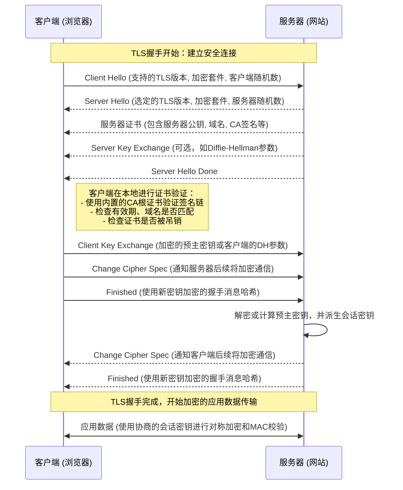

## 6.2 工具一：为网页浏览加密 (HTTPS/TLS)

在数字世界的浩瀚海洋中，我们每天都在互联网上航行，访问着各种网站，交换着海量信息。然而，想象一下，如果我们所有的通信都如同在大街上高声喊话，没有丝毫隐私可言，那将是何等混乱与危险？在计算机网络的早期，这就是HTTP协议所面临的“裸奔”困境。它高效、简洁，却如同敞开的明信片，将我们的敏感信息（如登录凭证、银行卡号）毫无保留地暴露在任何可能窥探的第三方眼前。

为了解决这个根本性的安全危机，一个名为**传输层安全协议（Transport Layer Security，简称TLS）**的强大工具应运而生。它不是一个全新的协议，而是一层包裹在传统应用层协议（如HTTP）之上的“坚固铠甲”和“秘密契约”，确保数据在传输过程中的**机密性（Confidentiality）**、**完整性（Integrity）**和**身份认证（Authentication）**。当HTTP被TLS武装起来，它就蜕变成了我们今天耳熟能详的**HTTPS**（Hypertext Transfer Protocol Secure）。

本节，我们将深入TLS的腹地，以其核心——**TLS握手**为例，解构它如何巧妙地编织对称加密、非对称加密和数字证书这三大安全基石，为我们的网络通信构建起一道坚不可摧的防线。

### 一、HTTP的“裸奔”困境：为什么我们需要TLS？

在TLS出现之前，HTTP协议在设计之初并没有考虑到安全性问题。它主要关注如何高效地传输超文本内容。这带来了三个核心问题，也是TLS力图解决的关键痛点：

1.  **机密性缺失：旁听者无处不在 (Eavesdropping)**
    *   **问题**：当您在HTTP网站上输入用户名和密码时，这些信息以明文形式在网络中传输。这意味着，任何能够监听网络流量的人（例如，在公共Wi-Fi下，或ISP的某个路由器上）都可以像阅读一份未密封的信件一样，轻易获取您的敏感数据。
    *   **类比**：这就像你在一个嘈杂的市场里，大声宣布你的银行卡密码。任何走过的人都能听到并记住。
2.  **完整性缺失：篡改者伺机而动 (Tampering)**
    *   **问题**：由于HTTP传输的数据没有被保护，恶意第三方不仅可以窃听，还可以随意篡改您发送或接收的信息。例如，将下载文件的内容替换为病毒，或者在您提交表单时修改表单数据。
    *   **类比**：你寄出去的信件，在路上被人拆开，改写了内容，然后再重新封上，让你无法察觉。
3.  **身份认证缺失：冒名顶替者混淆视听 (Impersonation)**
    *   **问题**：在HTTP中，客户端无法有效验证服务器的真实身份。恶意攻击者可以架设一个与真实网站外观一模一样的“钓鱼网站”，诱骗用户输入信息。由于没有有效的身份验证机制，用户很难区分真假。
    *   **类比**：你以为自己在和银行柜员对话，实际上对方是一个伪装成柜员的骗子。你无法通过任何官方凭证来验证对方的身份。

这些“裸奔”的风险，使得HTTP在处理敏感数据时变得不可接受。TLS的出现，正是为了为这些“裸奔”的数据穿上“加密衣”，并为通信双方提供“身份证”和“防篡改封条”。

### 二、TLS的核心基石：三大安全工具的协同作战

TLS并非一个单一的魔法，而是巧妙地结合了多种加密技术，以解决上述问题：

1.  **对称加密 (Symmetric Encryption)**：
    *   **核心思想**：加密和解密使用相同的密钥。一旦密钥协商成功，数据加密和解密的速度非常快。
    *   **TLS中的应用**：用于在TLS握手完成后，对后续所有**实际应用数据**（如HTTP请求和响应）进行高效的加密和解密。
    *   **类比**：你和朋友约定了一个只有你们俩知道的“秘密密码”，所有私密的对话都用这个密码进行编码和解码。
2.  **非对称加密 (Asymmetric Encryption)**：
    *   **核心思想**：使用一对密钥——公钥和私钥。公钥可以公开，用于加密；私钥必须保密，用于解密。用公钥加密的数据只能用对应的私钥解密，反之亦然（用于数字签名）。
    *   **TLS中的应用**：主要用于TLS握手阶段，安全地**协商和交换对称密钥**，以及**服务器身份认证**（通过数字签名）。
    *   **类比**：你有一个上了锁的邮箱（公钥），任何人都可以把信件投进去（加密），但只有你手中有唯一一把钥匙（私钥）才能打开并阅读。
3.  **数字证书 (Digital Certificates)**：
    *   **核心思想**：由一个受信任的第三方机构（证书颁发机构，CA）签发的电子文档，它将一个**公钥**与一个**实体（如网站域名）的身份**绑定在一起，并由CA的私钥进行数字签名，以保证其真实性。
    *   **TLS中的应用**：客户端通过验证服务器的数字证书，来确认服务器的真实身份，防止冒充。
    *   **类比**：就像你的身份证或护照，由国家权威机构颁发，上面有你的照片和信息，证明“你是你”。

有了这三大基石，TLS才能上演一场复杂而精密的“握手舞蹈”，确保后续通信的安全。

### 三、TLS握手：一次“秘密契约”的签订与身份验证之旅

TLS握手是整个安全通信流程的起点，也是最关键、最复杂的部分。它的目标是完成两件事：**认证服务器身份**和**安全地协商出会话密钥**。这个过程涉及客户端和服务器之间的多次往返通信，就像两个初次见面的商务伙伴，在开始正式合作前，先验证对方身份，再协商合作细则。

我们以最常见的TLS握手流程为例，将其拆解为几个核心阶段：

#### 1. 阶段一：初次问候——“你好，我想和你安全地通信！”

**(Client Hello -> Server Hello)**

*   **客户端问候 (Client Hello)**：当您在浏览器中输入`https://www.example.com`并按下回车，或者点击一个HTTPS链接时，您的浏览器（客户端）会主动向服务器发起一个“Client Hello”消息。这个消息包含了：
    *   **支持的TLS版本**：例如TLS 1.2, TLS 1.3。
    *   **支持的加密套件列表 (Cipher Suites)**：客户端告诉服务器，我能理解和支持哪些加密算法组合（例如，用于密钥交换的算法、用于对称加密的算法、用于哈希的算法）。
    *   **客户端生成的随机数 (Client Random)**：一个用于后续生成会话密钥的随机数。
    *   **（可选）会话ID**：如果客户端之前与服务器建立过安全连接，可能尝试恢复会话以加速。
*   **服务器响应 (Server Hello)**：服务器收到“Client Hello”后，会从客户端提供的列表中选择它自己也支持且偏好的TLS版本和加密套件。然后，它会发送“Server Hello”消息，其中包含：
    *   **选定的TLS版本**。
    *   **选定的加密套件**。
    *   **服务器生成的随机数 (Server Random)**：另一个用于生成会话密钥的随机数。

到目前为止，双方只是“打了个招呼”，选定了通信语言和工具。接下来才是关键。

#### 2. 阶段二：身份验证——“请出示你的身份证件！”

**(Server Sends Certificate -> Client Verifies Certificate)**

*   **服务器发送证书 (Server Certificate)**：在“Server Hello”之后，服务器会立即发送它的**数字证书**链（通常包含服务器证书及其上一级CA证书）。这个证书是服务器的“数字身份证”，包含了：
    *   服务器的公钥。
    *   服务器的域名（如`www.example.com`）。
    *   证书的有效期。
    *   证书颁发机构（CA）的名称。
    *   CA对该证书的数字签名。

*   **客户端验证证书 (Client Certificate Verification)**：这是TLS握手中最关键的信任建立环节，也是防范“钓鱼网站”和中间人攻击的核心。您的浏览器收到服务器的数字证书后，会执行一系列严格的验证步骤：
    1.  **检查证书是否由受信任的CA颁发**：浏览器内置了一个信任的根证书列表（这些都是全球公认的CA）。它会沿着证书链向上追溯，直到找到一个它信任的根CA。
        *   **类比**：这就像你收到一份重要文件，上面盖有某个官方机构的印章。你不仅要看这个印章本身，还要确认这个机构是否是你信任的政府部门。如果这个机构的印章是另一个更权威机构签发的，你还得去核实那个更权威的机构。
    2.  **检查证书的有效期**：证书是否在有效使用期内？
    3.  **检查证书的域名**：证书中包含的域名是否与您正在访问的网站域名（URL）完全匹配？例如，如果您访问`www.example.com`，但证书上写的是`www.bad-guy.com`，浏览器就会发出警告。
    4.  **检查CA的数字签名**：浏览器使用相应CA的**公钥**来解密证书上的数字签名。如果解密成功，且摘要内容与证书本身的哈希值匹配，则证明证书未被篡改，且确实是由该CA颁发的。
        *   **问题-解决方案**：CA为什么能被信任？因为CA在颁发证书时，会用自己的私钥对证书进行数字签名。这个签名只有用CA的公钥才能验证。而CA的公钥是公开的，并且被预装在操作系统和浏览器中，被广泛信任。这形成了一个**信任链**：浏览器信任根CA -> 根CA信任中间CA -> 中间CA信任服务器。
    5.  **检查证书撤销列表 (CRL) 或在线证书状态协议 (OCSP)**：确认证书是否已被吊销（例如，因服务器私钥泄露）。

**如果任何一步验证失败，浏览器都会立即中断连接，并向用户发出警告（例如，显示“此网站的连接不安全”）。这正是浏览器地址栏中“小锁”图标的魔力所在——它代表着这份身份认证已经通过！**

#### 3. 阶段三：密钥协商——“让我们秘密地商量一个密码！”

**(Client Key Exchange)**

*   **客户端密钥交换 (Client Key Exchange)**：如果服务器证书验证通过，客户端就确信自己正在与一个合法的服务器通信。现在，双方需要安全地协商出一个用于后续数据加密的**对称会话密钥**。这个过程主要有两种方式：
    *   **RSA密钥交换（较传统）**：客户端生成一个随机的秘密数据，称为**预主密钥 (Pre-Master Secret)**。然后，客户端使用服务器证书中的**公钥**对其进行加密，并将加密后的结果发送给服务器。只有拥有对应私钥的服务器才能解密它，从而获取预主密钥。
    *   **Diffie-Hellman密钥交换（更现代，如DHE/ECDHE）**：在这种模式下，客户端和服务器各自生成临时的公私钥对（DH参数），并交换它们的公钥部分。然后，双方可以利用对方的公钥和自己的私钥，独立计算出**相同的预主密钥**，而无需在网络上直接传输它。这种方法的巨大优势是提供了**完美前向保密性（Perfect Forward Secrecy, PFS）**。即使未来服务器的长期私钥泄露，攻击者也无法解密过去被截获的通信流量，因为每次会话的密钥都是临时生成的，与服务器的长期私钥无关。

*   **服务器解密与密钥生成**：服务器根据所选的密钥交换算法，通过解密（RSA方式）或计算（DH方式）得到原始的预主密钥。

*   **双方生成会话密钥**：此时，客户端和服务器都拥有了三个关键信息：
    *   Client Random (客户端随机数)
    *   Server Random (服务器随机数)
    *   Pre-Master Secret (预主密钥)
    *   双方利用这些信息，通过一个确定性的密钥派生函数（Key Derivation Function, KDF），共同计算生成出**主密钥 (Master Secret)**，进而从主密钥中派生出多个**会话密钥 (Session Keys)**，这些会话密钥将分别用于数据的对称加密/解密以及消息认证码 (MAC) 的生成。

#### 4. 阶段四：握手结束——“契约达成，开始秘密通信！”

**(Finished Messages)**

*   **变更加密套件协议 (Change Cipher Spec)**：双方各自发送一个“Change Cipher Spec”消息，通知对方：“我已准备好，从现在开始，所有后续通信将使用我们刚刚协商出的对称会话密钥进行加密和认证！”
*   **握手完成 (Finished)**：双方各自发送一个“Finished”消息。这个消息是对整个握手过程的哈希值进行加密后的结果。
    *   **目的**：它是一个完整性校验，确认在握手过程中没有第三方篡改任何参数。如果对方能够成功解密并验证这个哈希值，就证明双方确实拥有相同的会话密钥，并且握手过程是完整的、未被篡改的。

至此，TLS握手成功完成！双方已经建立了安全的通信通道。

### 四、握手之后：高效的秘密通信

一旦TLS握手完成，客户端和服务器就拥有了：
1.  **相互认证的身份**（客户端确认了服务器身份）。
2.  **共享的对称会话密钥**。

接下来的所有应用层数据（HTTP请求、HTTP响应）都将使用这些对称会话密钥进行：

*   **加密 (Encryption)**：确保数据机密性。即使数据被截获，没有密钥也无法解密。
*   **消息认证码 (Message Authentication Code, MAC)**：确保数据完整性。每次发送数据时都会附加一个MAC，接收方用共享密钥重新计算MAC并与收到的MAC进行比对，若不一致则表明数据在传输过程中被篡改。

由于对称加密算法（如AES）的效率远高于非对称加密，因此将海量应用数据加密的任务交给对称加密，而将耗时的非对称加密仅用于密钥交换和身份认证，这是一个非常明智且高效的设计。

### 五、现实案例：浏览器中的“小锁”图标

您是否注意到，当您访问银行网站、购物网站或社交媒体时，浏览器地址栏通常会显示一个**小锁图标**，并且网址以`https://`开头？

**这个小锁，正是TLS握手成功、网站身份验证通过的直观标志！**

点击这个“小锁”图标，您通常可以看到一个弹出窗口，显示“连接安全”或“证书有效”。进一步点击查看证书详情，您会看到：

*   **颁发者**：哪个CA颁发了此证书（例如：DigiCert, Let's Encrypt）。
*   **有效期**：证书的生效和失效日期。
*   **使用者**：证书属于哪个域名（如`www.google.com`）。
*   **公钥信息**：服务器的公钥类型和参数。
*   **证书链**：从服务器证书到根CA的完整路径。

这些信息与我们刚刚学习的TLS握手过程中客户端验证服务器证书的步骤完全对应。它不仅仅是一个装饰，而是浏览器为您提供的强有力保障，确保您与服务器之间的通信是私密且受保护的。

### 六、TLS握手流程示意图

为了更直观地理解这个复杂的舞蹈，我们用Mermaid序列图来描绘TLS握手的关键步骤（以TLS 1.2为例）：

### 总结回顾

通过TLS/HTTPS，我们实现了在不安全的互联网上进行安全通信的壮举。其核心思想在于：

*   **身份认证**：通过数字证书和CA信任链，客户端能可靠地验证服务器的真实身份，避免与假冒网站通信。
*   **密钥安全协商**：利用非对称加密（特别是服务器的公钥），安全地交换并协商出一个一次性的对称会话密钥，即使被窃听也无法被解密。
*   **高效数据传输**：一旦会话密钥建立，后续所有应用数据都通过高效的对称加密进行加密和完整性保护，平衡了安全与性能。

HTTPS/TLS是现代互联网的基石，它使得在线购物、银行交易、私密通信等活动成为可能，极大地提升了用户对网络的信任度。

### 启发与展望

TLS协议的演进仍在继续，例如TLS 1.3版本带来了更快的握手速度和更高的安全性，进一步减少了握手延迟并移除了许多不安全的加密选项。然而，安全并非一劳永逸。

*   **思辨**：如果证书颁发机构本身被攻破，恶意攻击者签发了虚假证书，那将会发生什么？我们又该如何防范这种“信任根源”的危机？
*   **前瞻**：随着量子计算的崛起，现有的一些非对称加密算法可能面临被破解的风险，未来的TLS协议又将如何演进以应对“量子威胁”？

这些问题提醒我们，网络安全是一个永无止境的猫鼠游戏，需要我们不断学习、创新，才能在数字世界中保持领先，守护我们的信息安全。理解TLS，不仅仅是掌握一个技术细节，更是理解现代网络安全体系的核心思想和挑战。
