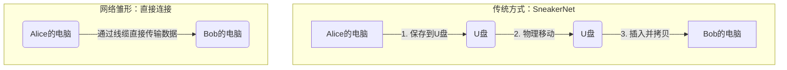

好的，作为一位资深的技术教育作者，我将紧接您的课程定位，续写 **1.1.1 问题的起点：为何需要网络？** 的内容。

---

要回答这个问题，让我们回到一切开始的地方——一个没有任何网络的场景，看看最基本的信息共享需求是如何催生出整个网络世界的。

#### 案例研究：最原始的文件共享——“U盘网络”

想象一下，在同一个办公室里，Alice 完成了一份重要的项目报告，需要立刻分享给旁边的同事 Bob。在没有网络的时代，最直接的方法是什么？

1.  **保存**：Alice 将文件保存到 U 盘（或者软盘、移动硬盘）中。
2.  **移动**：Alice 拔下 U 盘，起身走到 Bob 的座位旁。
3.  **拷贝**：Bob 接过 U 盘，插入自己的电脑，然后将文件复制到本地硬盘。

这个过程，我们戏称为“**SneakerNet**”（“运动鞋网络”或“人肉网络”），因为它依赖人力物理移动存储介质来完成数据传输。

对于两台近在咫尺的电脑，这种方式虽然原始，但确实有效。然而，一旦场景发生变化，它的局限性便暴露无遗：

*   **距离的障碍**：如果 Alice 在北京，而 Bob 在纽约，难道要靠跨国快递寄送一个 U 盘吗？这在时间与成本上都是无法接受的。
*   **效率的瓶颈**：如果 Alice 需要将文件同时发给公司里的 100 位同事，她需要重复拷贝、传递 100 次吗？这显然是极其低效的。
*   **实时性的缺失**：如果 Alice 和 Bob 需要的不是文件传输，而是进行一场实时的视频会议，或者共同在线编辑一份文档，“U盘网络”则完全无能为力。

这些显而易见的痛点指向了一个共同的、根本性的需求：**我们必须找到一种方法，让计算机之间能够直接、高效、远程地交换数据。**

#### 从物理隔离到数字连接

为了解决上述问题，最直观的想法就是：**“用一根线把两台电脑连起来不就行了？”**

这正是网络最原始的形态。我们不再依赖物理介质的移动，而是建立一个专属于数据的数字通道。

这个简单的连接，瞬间解决了近距离传输的效率问题。Alice 只需在自己的电脑上点击几下，文件数据就会以电信号或光信号的形式，沿着线缆飞速传递到 Bob 的电脑上。

#### 简单连接背后的复杂性

然而，这个看似完美的“一根线”方案，却像打开了潘多拉的魔盒，引出了一系列更深层次的问题：

1.  **硬件标准问题**：这根“线”应该是什么样的？是双绞线、同轴电缆还是光纤？两台电脑上的接口（网卡）必须是相同类型才能匹配吗？—— 这引出了**物理层**的标准化需求。

2.  **数据“语言”问题**：连接成功后，Alice 的电脑如何告诉 Bob 的电脑“我要发送文件”？如何确保数据在传输过程中没有损坏或丢失？如果一台是 Windows 系统，另一台是 macOS 系统，它们如何理解对方的“语言”？—— 这引出了**协议 (Protocol)** 的概念，即通信双方必须遵守的规则和约定。

3.  **规模化问题**：现在，如果第三位同事 Carol 也想加入，我们该怎么连接？是在 Alice 和 Carol、Bob 和 Carol 之间再各拉一根线吗？那 100 位同事呢？我们不可能在每两台电脑之间都拉一根线，办公室会变成盘丝洞。—— 这引出了**网络拓扑**和**网络设备**（如交换机、路由器）的需求，用以管理和构建更大规模的计算机群体。

从试图解决一个简单的文件共享问题开始，我们发现，为了让计算机能够可靠、高效地进行通信，背后需要一套极其复杂的体系来支撑。这个体系需要对硬件、信号、数据格式、通信流程、设备寻址、错误处理等方方面面进行精密的定义和设计。

---

#### 本节小结

*   **需求的根源**：网络诞生的根本动力，是为了克服物理限制，实现计算机之间高效、远程的数据共享与实时交互。
*   **最简模型**：两台电脑通过线缆直接相连，是网络最原始、最简单的形态，解决了“U盘网络”在近距离场景下的低效问题。
*   **复杂性的开端**：一个简单的直连模型，迅速引出了关于**标准化（硬件与协议）**和**规模化（网络拓扑与设备）**的根本性挑战。

正是为了系统性地解决这些连锁问题，计算机科学家们才构建了分层的网络模型与一系列复杂的协议。这，也正是我们接下来要深入探索的核心内容。