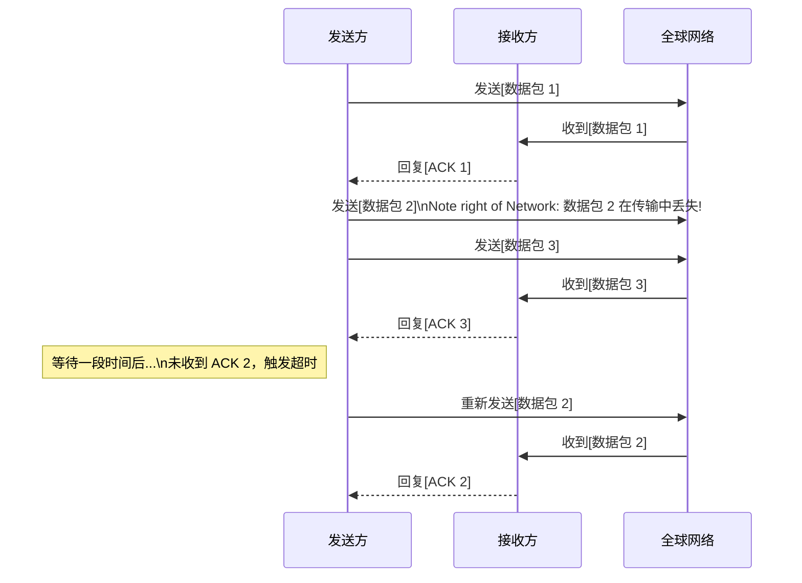

好的，作为一位资深的技术教育作者，我将紧接上一节**《1.1.1 问题的起点：为何需要网络？》**的内容，自然地过渡并撰写 **1.1.2 复杂性的挑战：如何组织全球通信？** 的部分。

---

### 1.1.2 复杂性的挑战：如何组织全球通信？

上一节，我们从两台电脑的简单连接中，窥见了**标准化**与**规模化**这两个根本性挑战的冰山一角。现在，让我们将这个视角从一间办公室放大到整个地球。当连接的目标不再是两台、一百台电脑，而是数以十亿计的、遍布全球的设备时，原先的挑战被急剧放大，演变成了三个更为宏大且棘手的难题。

#### 挑战一：异构性的爆炸 (The Explosion of Heterogeneity)

在两台电脑直连的简单场景中，我们只需要考虑两台设备间的兼容性。但放眼全球，情况天差地别：

*   **设备类型迥异**：网络中的成员早已不只是个人电脑。你的智能手机、室友的游戏机、家里的智能音箱、路边的摄像头、天上的卫星、远在大洋彼岸的数据中心服务器……它们都需要接入同一个网络。
*   **厂商与系统林立**：苹果的 iPhone、谷歌的 Android 手机、运行 Windows 的笔记本、运行 Linux 的服务器、思科的路由器、华为的交换机……这些设备来自不同的制造商，搭载着不同的操作系统和硬件。
*   **传输媒介多样**：数据可能先通过你家的 Wi-Fi 无线网络，再经过小区的光纤，汇入城市的骨干网，跨越太平洋的海底光缆，最后通过 5G 信号塔到达接收者的手机。

全球网络就像一座数字世界的“巴别塔”。如果每家厂商都坚持使用自己的一套硬件标准和通信“方言”，那么它们之间将无法沟通，全球互联也就无从谈起。

> **核心问题**：如何让这些形形色色、由不同技术构建的设备，使用同一种“语言”进行无障碍交流？

**解决方案的雏形**：答案并非强制统一硬件或操作系统，而是制定一套所有参与者都共同遵守的**通用通信协议 (Common Protocols)**。这套协议就像是网络世界的“普通话”或“英语”，无论你的“出身”如何，只要你遵循这套语法和词汇，就能被网络中的任何其他成员理解。

---

#### 挑战二：寻址的迷宫 (The Labyrinth of Addressing)

回到办公室的例子，给 100 位同事的电脑进行编号或许还算简单。但如何在全球网络中，从数十亿台设备里，精准地找到一台特定的目标设备呢？

想象一下全球邮政系统。如果你想从中国北京寄一封信到美国纽约的一所公寓，你需要一个极其精确的地址：`国家 -> 州 -> 城市 -> 街道 -> 门牌号 -> 公寓号`。缺少任何一环，信件都可能迷路。

网络世界同样需要这样一套全球统一的、唯一的地址分配系统。没有它，你发送给朋友的消息，就像一封没有填写收件人地址的信，邮递员（网络设备）根本不知道该把它送往何方。

> **核心问题**：如何为全球每一台入网设备分配一个独一无二的、可供查找的地址？

**解决方案的雏形**：为此，网络世界发明了 **IP 地址 (Internet Protocol Address)**。它就像是每台设备的“门牌号”，为数据包的精确导航提供了可能。这套地址系统必须经过中心化机构的规划和管理，以确保其全球唯一性，避免地址冲突。

| **现实世界类比：邮政地址** | **网络世界对应：IP 地址** | **说明** |
| :--- | :--- | :--- |
| 国家/地区 | 网络部分 (Network ID) | 标识一个大的网络区域，如某个运营商或机构的网络。 |
| 城市/街道 | 子网部分 (Subnet ID) | 在大网络内划分出更小的子网络，便于管理。 |
| 门牌号 | 主机部分 (Host ID) | 在特定子网内，标识一台具体的设备。 |

---

#### 挑战三：可靠性的赌注 (The Gamble on Reliability)

一根短网线连接的两台电脑，数据传输路径简单，出错的概率很低。然而，当数据需要跨越山和大海，旅程就变得充满变数：

*   **路径漫长且复杂**：数据包从源头到目的地，可能需要经过几十个甚至上百个中间网络设备（路由器）。
*   **链路可能中断**：某个路由器可能突然宕机，某条海底光缆可能被船只的锚意外挖断。
*   **数据可能出错或丢失**：在传输过程中，电磁干扰可能导致数据比特位发生翻转（从 0 变成 1），网络拥堵也可能导致路由器因不堪重负而主动丢弃数据包。

直接发送一个巨大的文件，就像把一个贵重的花瓶不做任何保护就交给一个横跨大陆的接力运输队。在任何一站都可能发生破碎、丢失，或者零件送达顺序错乱的事故。

> **核心问题**：在一条漫长、不可靠、充满不确定性的路径上，如何确保数据能够完整、正确、按序地到达目的地？

**解决方案的雏形**：网络协议采用了一种类似于“包裹邮寄”的精妙策略。

1.  **分而治之 (Segmentation)**：将大文件拆分成一个个带有编号的小数据包（Packet）。
2.  **确保送达 (Acknowledgement)**：接收方每收到一个正确的数据包，就向发送方回一个“收到了”的确认消息（ACK）。
3.  **超时重传 (Timeout & Retransmission)**：发送方如果在一定时间内没有收到某个数据包的确认消息，就认为它在路上丢失了，并重新发送这个数据包。
4.  **有序重组 (Sequencing)**：接收方根据数据包的编号，将它们重新拼装成原始的、完整的文件。

通过这套机制，即使底层的物理网络是不可靠的，我们依然可以在其上构建出可靠的通信服务。

---

#### 本节小结

从两台电脑到全球互联，网络规模的指数级增长带来了质变，催生了三大核心挑战及其对应的解决方案思路：

*   **异构性挑战**：通过制定**通用协议**，让千差万别的设备可以说上同一种“数字语言”。
*   **寻址挑战**：通过建立 **IP 地址**系统，为全球设备分配唯一的“网络门牌号”。
*   **可靠性挑战**：通过**分包、确认和重传**机制，在不可靠的物理链路上实现可靠的数据传输。

这些挑战的解决方案并非各自为战，而是被巧妙地组织在一个分层的体系结构中。这个体系，就是我们即将揭开面纱的网络模型，它为解决网络世界的复杂性问题提供了清晰的路线图。