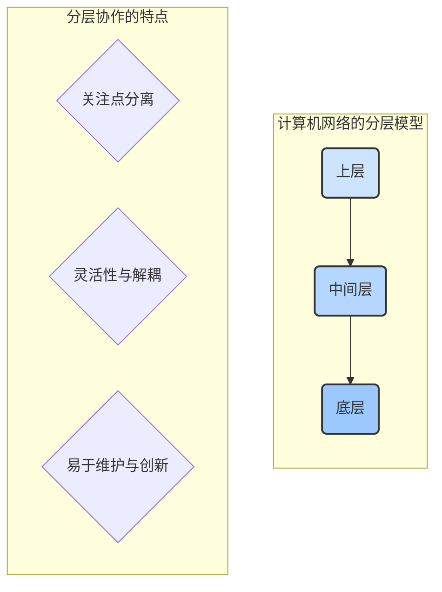
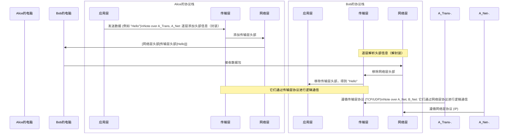

好的，作为一位资深的技术教育作者，我将紧接上文，以流畅自然的叙事风格，撰写 **1.1.3 解决之道：分层思想与协议约定** 的内容。

---

### 1.1.3 解决之道：分层思想与协议约定

在上一节中，我们目睹了将网络从办公室扩展到全球所面临的三大挑战：异构性、寻址和可靠性。我们还初步接触了它们各自的解决方案雏形：通用协议、IP地址以及分包重传机制。

现在，一个关键问题浮出水面：如何将这些针对不同问题的解决方案，优雅地组织成一个协调一致、行之有效的整体系统？

答案并非简单地将所有功能堆砌在一起，而是借鉴了一种在人类工程史上屡试不爽的强大思想——**分层 (Layering)**。

#### 思想的闪光：像寄国际快递一样组织网络通信

想象一个复杂但我们都很熟悉的过程：将一件在中国生产的精美瓷器，安全、准确地寄送到一位身在美国纽约的客户手中。整个流程极其复杂，涉及打包、报关、国内运输、国际空运、美国清关、最后一公里派送等诸多环节。

如果让一个人从头到尾负责所有事情，他会立刻陷入混乱。因此，一个成熟的国际物流体系会采用**分层协作**的方式：

*   **第1层 - 打包专家**：他的任务只有一个——确保瓷器本身的安全。他使用泡沫、填充物和坚固的箱子精心包装，贴上“易碎品”标签。他**不关心**收件人地址，也**不关心**这箱货物是坐飞机还是轮船。他的专业领域就是“物品的可靠封装”。
*   **第2层 - 物流规划师**：他拿到打包好的箱子。他的任务是规划最高效、最经济的跨国路径，并打印出包含精确地址（国家、城市、街道、邮编）的国际运单。他**不关心**箱子里装的是什么，也**不关心**卡车司机具体走哪条高速公路。他的专业领域是“全球寻址与路由”。
*   **第3层 - 运输执行者（卡车司机/飞行员）**：他们是实际的“搬运工”。卡车司机负责将货物从一个集散中心运到下一个，飞行员负责将货物从一个国家空运到另一个国家。他们**只关心**当前这段路程的起点和终点。他们不需要知道包裹的最终目的地，只需要服从调度指令即可。

这种分工明确的模式带来了巨大的好处：

1.  **关注点分离 (Separation of Concerns)**：每个人都专注于自己最擅长领域，极大地降低了单一个体的任务复杂度。
2.  **灵活性与解耦 (Flexibility & Decoupling)**：我们可以随时更换航空公司（例如，将国航换成美联航），而这对打包专家和纽约的快递员没有任何影响。只要接口（交接货物的流程）不变，任何一层的具体实现都可以被替换。
3.  **易于维护与创新**：如果打包技术有了新突破（例如，发明了新型缓冲材料），只需要升级打包部门即可，整个物流链条的其他部分无需改动。

#### 将分层思想应用于网络

计算机科学家们将这种强大的分层思想完美地应用到了网络设计中。他们没有把网络通信看作一个单一的、庞大的难题，而是将其垂直切分成若干个功能层。每一层都负责一个特定的子问题，并为其上一层提供明确定义的服务。

*   **底层**专注于物理传输，就像卡车司机，只负责将比特流（0和1）从一个节点搬到下一个节点。
*   **中间层**负责寻址和路由，就像物流规划师，为数据包规划穿越整个网络的路径。
*   **更高层**则负责保证端到端通信的可靠性，就像打包专家，确保数据（瓷器）在整个旅程后依然完整无缺。
*   **最顶层**则直接面向用户应用，例如你的浏览器或聊天软件。

#### 秩序的基石：协议 (Protocol)

如果说“分层”是网络的体系架构，那么**协议**就是确保这套体系能够运转起来的法律和语言。

> **定义**：网络协议（Protocol）是为进行网络中的数据交换而建立的规则、标准或约定的集合。

回到国际快递的例子：
*   打包专家和物流规划师之间必须有协议：包装好的箱子尺寸不能超过多少，运单必须贴在箱子的哪个位置。
*   中国邮政和美国邮政（USPS）之间也必须有国际邮政协议：双方承认对方的运单格式，并约定好邮件交接的流程与费用结算方式。

没有这些共同遵守的约定，协作便无从谈起。在网络世界中，**同一层**的两个对等实体（Peer Entity）之间的通信，就必须遵循该层的协议。

例如，Alice 电脑的“传输层”与 Bob 电脑的“传输层”，它们在逻辑上直接对话。它们使用**传输层协议**（如TCP）来商定如何分包、如何确认、如何重传，从而共同完成“可靠数据传输”这一任务。它们并不关心数据包具体走了哪条路，这是下一层（网络层）的工作。

一个完整的协议通常定义了三大要素：
*   **语法 (Syntax)**：数据与控制信息的结构或格式。例如，一个IP数据包，哪几位是版本号，哪几位是源地址，哪几位是目标地址，都有严格规定。
*   **语义 (Semantics)**：用于解释比特流的每个部分的意义。例如，某个字段的值为 `0x06` 表示上层数据是 TCP 协议，值为 `0x11` 则表示是 UDP 协议。
*   **时序 (Timing)**：对事件实现顺序的详细说明。例如，发送方发送数据后，在多长时间内必须收到接收方的确认，超时了该怎么办。

下图清晰地展示了这种分层与协议协同工作的模式：

数据在发送端从上到下，层层“打包”（封装，Encapsulation）；在接收端则从下到上，层层“拆包”（解封装，Decapsulation）。而每一层的行为，都由该层特定的协议来精确定义。

---

#### 本节小结

*   **分层是解决之道**：面对网络通信的巨大复杂性，计算机科学家们采用“分而治之”的策略，将问题分解到不同的层次中，每一层解决一个特定的子问题。
*   **分层的核心优势**：关注点分离、灵活性高、易于维护和标准化。
*   **协议是行动纲领**：协议是网络实体间进行通信的“共同语言”和“行为准则”。它定义了通信的语法、语义和时序，是实现网络互操作性的关键。
*   **协同工作模式**：数据在分层模型中纵向流动（封装与解封装），而对等实体之间则依据协议进行横向的逻辑通信。

通过建立分层模型并为每一层制定标准协议，我们终于有了一张清晰的蓝图，可以系统性地构建和理解庞大而复杂的全球互联网。接下来，我们将学习业界最经典的两大网络参考模型：OSI 七层模型和 TCP/IP 模型。