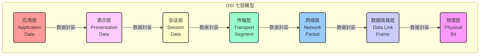

好的，作为一名资深的技术教育作者，我将为你撰写这篇关于 OSI 七层模型的教学段落。

---

### 1.2.2 工具一 (理论参考)：OSI 七层模型

在我们了解了网络分层是一种化繁为简的“解题思路”后，便需要一个具体的、公认的“蓝图”来指导我们理解和分析复杂的网络通信。这便是开放式系统互联模型（Open Systems Interconnection model，简称 OSI 模型）诞生的初衷。它是由国际标准化组织（ISO）提出的一个概念性框架，旨在使各种计算机在世界范围内能够无障碍地互联。

尽管在当今的互联网世界里，我们实际使用的是 TCP/IP 模型，但 OSI 模型因其严谨和完备的层次划分，成为了我们学习、分析和排查网络问题的“黄金标准”和“通用语言”。它就像一张精确的地图，即使我们不完全按照它的路线走，它也能帮助我们清晰地定位问题所在。

#### OSI 七层结构概览

OSI 模型将复杂的网络通信过程精确地划分为七个独立的层次，自下而上依次是：物理层、数据链路层、网络层、传输层、会话层、表示层和应用层。每一层都专注于一个特定的功能，并为其上一层提供标准化的服务。

我们可以通过下面的图表直观地了解这七个层次的结构和它们处理的数据单元名称：

接下来，让我们从下至上，逐一探索每一层的核心职责。

#### 第一层：物理层 (Physical Layer)

物理层是整个网络模型的地基。它不关心数据的内容，只关心如何将原始的二进制比特流（0和1）在物理媒介（如电缆、光纤、无线电波）上传输。

*   **核心职责**：定义物理设备的标准，如接口类型、电压、线缆规格、传输速率等。
*   **通俗理解**：相当于“快递员的交通工具和道路”。它决定了数据是走公路（铜缆）、铁路（光纤）还是航空（无线），以及车辆的速度和规格。
*   **设备示例**：集线器 (Hub)、中继器 (Repeater)、网线、光纤。

#### 第二层：数据链路层 (Data Link Layer)

当比特流到达一个节点后，数据链路层负责在**相邻的两个直接连接**的节点之间建立可靠的通信。

*   **核心职责**：
    1.  **帧封装 (Framing)**：将来自网络层的比特流组装成“帧”（Frame）。
    2.  **物理寻址 (Physical Addressing)**：使用 MAC 地址来识别网络中的设备，确保数据能准确送达同一物理网络段内的正确节点。
    3.  **流量控制 (Flow Control)**：防止发送方过快地发送数据，淹没接收方。
    4.  **错误检测 (Error Detection)**：检测并丢弃在传输中损坏的帧。
*   **通俗理解**：相当于“同城快递的分拣站”。它通过门牌号（MAC地址）确保包裹能在同一个城市（局域网）内准确投递到正确的家庭。
*   **设备示例**：交换机 (Switch)、网桥 (Bridge)、网卡 (NIC)。

#### 第三层：网络层 (Network Layer)

当通信需要跨越多个网络（例如从你家的局域网到互联网上的服务器）时，网络层就派上了用场。

*   **核心职责**：
    1.  **逻辑寻址 (Logical Addressing)**：为数据包（Packet）添加源和目标的 IP 地址。
    2.  **路由 (Routing)**：根据 IP 地址，在复杂的网络环境中为数据包选择最佳的传输路径。
*   **通俗理解**：相当于“跨国邮政系统”。它负责规划包裹从一个国家（网络）到另一个国家（网络）的最佳路线。
*   **设备示例**：路由器 (Router)。

#### 第四层：传输层 (Transport Layer)

传输层是负责**端到端**（End-to-End）通信质量的关键层。它不关心中间经过了多少路由器，只关心数据是否从发送方的应用程序，完整、可靠地到达了接收方的应用程序。

*   **核心职责**：
    1.  **端口寻址 (Port Addressing)**：确保数据能够送达目标主机上正确的应用程序（例如，80端口用于Web服务，25端口用于邮件服务）。
    2.  **分段与重组 (Segmentation & Reassembly)**：将上层应用的大块数据分割成小的数据段（Segment），并在接收端重新组装。
    3.  **连接控制 (Connection Control)**：提供面向连接（如 TCP）和无连接（如 UDP）的服务。
    4.  **流量控制与差错控制**：提供可靠的数据传输，确保数据无差错、不丢失、不重复，并按序到达。
*   **通俗理解**：相当于“总包裹的打包与签收部门”。它给每个包裹贴上部门标签（端口号），确保网页数据送给浏览器，邮件数据送给邮箱客户端，并负责检查包裹是否完整送达。
*   **协议示例**：TCP (传输控制协议)、UDP (用户数据报协议)。

#### 第五层：会话层 (Session Layer)

从会话层开始，我们进入了上三层，它们更多地与应用程序和软件打交道。会话层负责建立、管理和终止不同设备上应用程序之间的“会话”或“对话”。

*   **核心职责**：建立会话、管理会话（如同步、设置检查点）、终止会话。
*   **通俗理解**：相当于“通话管理器”。它负责拨号、保持通话连接、在通话中断时提供断点续传（例如文件下载中断后可以从上次的位置继续），以及挂断电话。

#### 第六层：表示层 (Presentation Layer)

表示层是网络的“翻译官”，它确保一个系统的应用层所发送的信息可以被另一个系统的应用层理解。

*   **核心职责**：
    1.  **数据格式转换**：处理不同系统间的数据编码差异（例如，ASCII 与 EBCDIC 的转换）。
    2.  **数据加密与解密 (Encryption & Decryption)**：确保通信的安全性。
    3.  **数据压缩与解压 (Compression & Decompression)**：提高传输效率。
*   **通俗理解**：相当于“编码翻译与保密部门”。它将普通话（一种数据格式）翻译成广东话（另一种数据格式），并在传输前给信件加密，收到后再解密。
*   **格式示例**：JPEG, GIF, ASCII, SSL/TLS (部分功能)。

#### 第七层：应用层 (Application Layer)

应用层是离用户最近的一层，它为用户应用程序（如浏览器、电子邮件客户端）提供访问网络服务的接口。

*   **核心职责**：提供各种网络服务协议，让应用程序能够使用网络。
*   **通俗理解**：这就是我们直接接触的“应用程序界面”。当你在浏览器输入网址时，你就启动了应用层的 HTTP 协议。
*   **协议示例**：HTTP (超文本传输协议)、FTP (文件传输协议)、SMTP (简单邮件传输协议)、DNS (域名系统)。

### 要点回顾

OSI 七层模型虽然是理论模型，但它为我们理解网络通信提供了一个极其强大的分析框架。在遇到网络问题时，我们可以自下而上或自上而下地逐层排查，极大地提高了解决问题的效率。

- [ ] **物理层**：负责传输比特流，定义物理规范。
- [ ] **数据链路层**：负责相邻节点间的通信，使用 MAC 地址。
- [ ] **网络层**：负责跨网络寻址和路由，使用 IP 地址。
- [ ] **传输层**：负责端到端的可靠/不可靠传输，使用端口号。
- [ ] **会话层**：负责建立、管理和终止应用程序间的会话。
- [ ] **表示层**：负责数据格式转换、加密和压缩。
- [ ] **应用层**：为用户应用程序提供网络服务接口。

记住这个模型，你就拥有了一把解剖网络世界的“手术刀”，能够清晰地看透数据从一个应用到另一个应用的完整旅程。