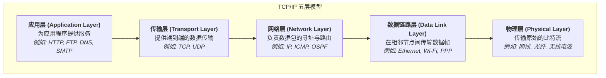
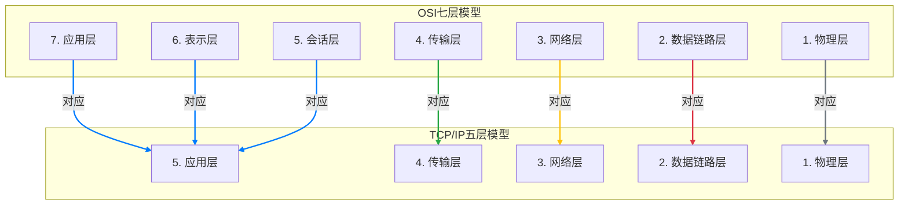

好的，作为一位资深的技术教育作者，我将为你撰写这段关于TCP/IP模型的教学内容。

---

### 1.2.3 工具二 (事实标准)：TCP/IP四层/五层模型

在我们了解了OSI七层模型这个精巧的、如同教科书般的理论框架后，现在让我们将目光投向现实世界。在浩瀚的互联网海洋中，真正乘风破浪、承载着全球数据航行的，并非OSI这艘理论巨轮，而是一套更为精炼、务实的协议族——TCP/IP模型。如果说OSI是网络通信的“理想蓝图”，那么TCP/IP就是构建起今天网络世界的“施工图纸和建筑材料”。

#### TCP/IP模型：从军用到民用的网络基石

TCP/IP（Transmission Control Protocol/Internet Protocol，传输控制协议/网际协议）协议族并非凭空设计，它源于20世纪70年代美国国防部高级研究计划局（ARPA）的一个项目——ARPANET。它的设计初衷就极具实践性：构建一个在战争等恶劣环境下，即使部分网络节点失效也能保持通信的弹性网络。这种“先实现，再推广”的实用主义路线，也决定了它最终的成功。

#### 分层结构：四层还是五层？

在学习TCP/IP模型时，你可能会遇到“四层”和“五层”两种说法，这常常让初学者感到困惑。让我们来厘清这个概念：

*   **经典的TCP/IP四层模型**：这是最原始的划分方式，它将网络通信的核心功能划分为四个层次。
    *   **应用层 (Application Layer)**：对应OSI模型的上三层（应用层、表示层、会话层），负责处理特定应用程序的协议，如HTTP、FTP、DNS等。
    *   **传输层 (Transport Layer)**：负责端到端的通信，提供数据传输的可靠性（TCP）或高效性（UDP）。
    *   **网际层 (Internet Layer)**：核心是IP协议，负责数据的寻址和路由，实现数据包在网络间的传输。
    *   **网络接口层 (Network Interface Layer)**：对应OSI模型的下两层（数据链路层、物理层），处理与物理网络媒介（如以太网、Wi-Fi）相关的所有细节。

*   **教学中常用的TCP/IP五层模型**：为了更好地与OSI模型进行比较和教学，学术界和许多教材将四层模型中的“网络接口层”进一步拆分为“数据链路层”和“物理层”，从而形成了五层模型。这种划分方式能更清晰地揭示底层网络的物理和逻辑细节。

在本书后续的讲解中，**我们将主要采用五层模型**，因为它结构更清晰，有助于我们理解每一层所扮演的独立角色。

#### 两大模型的对决：TCP/IP vs. OSI

将TCP/IP模型与OSI模型进行比较，能让我们更深刻地理解二者的设计哲学与现实意义。

| 特性/方面 | OSI 七层模型 | TCP/IP 四层/五层模型 |
| :--- | :--- | :--- |
| **层数** | 7层 | 4层（经典） 或 5层（教学用） |
| **设计哲学** | “先标准，后实现” (Prescriptive) | “先实现，后标准” (Descriptive) |
| **本质** | 一个严谨的、用于指导协议设计的**理论参考模型**。 | 一套被广泛部署和使用的**协议族**，是事实上的工业标准。 |
| **协议依赖** | 模型设计独立于任何具体协议。 | 模型是围绕核心协议（IP、TCP）建立的。 |
| **通信方式** | 严格遵循分层，支持无连接和面向连接。 | 同时支持无连接（IP）和面向连接（TCP）。 |
| **应用范围** | 主要用于学术研究和网络架构的理论分析。 | 全球互联网运行的基础。 |

下面是OSI模型与TCP/IP五层模型的层次对应关系图，你可以清晰地看到TCP/IP是如何将OSI上三层的功能合并到其应用层中的。

#### 为何TCP/IP成为事实标准？

TCP/IP模型之所以能战胜理论上更完美的OSI模型，成为互联网的基石，主要有以下几个原因：

1.  **时机恰当**：在OSI模型还在进行复杂的理论研讨时，TCP/IP已经随着ARPANET的扩张被部署和使用了。它抢占了市场先机，并随着互联网的爆炸式增长而根深蒂固。
2.  **简洁高效**：相对于OSI的七层，TCP/IP模型更简单，层次更少，实现起来更容易，也更高效。它将OSI中不常用的会话层和表示层功能交由应用层自己处理，这在实践中被证明是完全可行的。
3.  **开放与免费**：TCP/IP协议的标准是开放的，任何人都可以免费获取其规范并进行实现，这极大地促进了它的普及和各种网络设备的互联互通。
4.  **强大的推动力**：源于美国国防部的项目背景，以及后续学术界和商业公司的广泛支持，为TCP/IP的研发和推广提供了强大的动力。

---

#### **要点回顾**

*   **事实标准**：TCP/IP是当前互联网实际运行所依赖的协议模型，而非OSI。
*   **双重结构**：TCP/IP存在经典的四层模型和用于教学的五层模型，后者将网络接口层细分为数据链路层和物理层，便于理解和与OSI对比。
*   **实用主义**：TCP/IP的设计遵循“先实现再标准化”的原则，其层次划分和功能组合都更贴近工程实践。
*   **成功之道**：其成功归功于恰当的时机、简洁的设计、开放的特性以及强大的早期推动力。

理解TCP/IP模型，就如同掌握了阅读现代网络世界地图的图例。在接下来的章节中，我们将深入这个模型的每一层，去探索那些让数据得以在全球范围内自由流淌的奥秘。