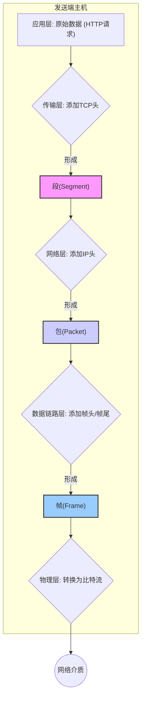

好的，我们继续。

---

### 1.3.1 数据的打包：封装 (Encapsulation)

我们已经知道，数据在网络中传输，就像寄送一个层层包装的快递。这个精心打包的过程，在计算机网络中拥有一个专业术语——**封装 (Encapsulation)**。现在，就让我们化身为一名专业的“数据包装工”，跟随一份普通的数据，看看它在发送端的电脑里，是如何从一份“普通货物”一步步变成一个整装待发、可以跨越千山万水去往目的地的“超级包裹”的。

#### 封装的舞台：协议栈中的逐层演绎

数据的封装之旅发生在操作系统的**协议栈 (Protocol Stack)** 中。这趟旅程是自上而下、井然有序的。每一层协议栈都会为上层传下来的数据“穿上一件新衣服”——也就是添加一个**头部 (Header)**，这个头部包含了该层协议所需的重要控制信息。

##### 1. 应用层 (Application Layer)：源头活水

一切始于应用层。当你使用浏览器想访问一个网页时，浏览器会生成一个 HTTP 请求报文。这份报文就是我们最初的“货物”。

- **数据形态**：应用层数据 (Data)
- **快递比喻**：你想寄送的礼物本身，比如一本书。

##### 2. 传输层 (Transport Layer)：标明“房间号”

应用层将数据递交给传输层。传输层的主要任务是为两台主机上运行的应用程序提供端到端的通信服务。它会给数据加上一个 **TCP** 或 **UDP 头部**。

- **添加的头部**：TCP/UDP Header
- **关键信息**：**源端口号**和**目的端口号**。这就像在礼物盒上贴了一张便签，写着“从我的书房寄出，请送到对方公司的技术部收”，确保数据能准确送达对方电脑上的正确应用程序（例如，Web 服务的 80 端口）。
- **数据新名称**：**段 (Segment)**
- **快递比喻**：将书（数据）放进一个内部包装盒（TCP/UDP 头部），并贴上便签指明收件人部门（端口号）。

##### 3. 网络层 (Internet Layer)：贴上“收件地址”

传输层将数据段（Segment）交给网络层。网络层负责在复杂的网络环境中为数据规划最佳路径，实现主机到主机的通信。它会给数据段加上一个 **IP 头部**。

- **添加的头部**：IP Header
- **关键信息**：**源 IP 地址**和**目的 IP 地址**。这是整个网络中最关键的寻址信息，如同快递单上必须填写的发件人与收件人的详细地址，确保包裹能在全球互联网中被正确路由。
- **数据新名称**：**包 (Packet)** 或 **数据报 (Datagram)**
- **快递比喻**：将内部包装好的盒子（段）放进一个坚固的快递纸箱（IP 头部），并贴上写有完整发件/收件地址的国际快递单。

##### 4. 数据链路层 (Data Link Layer)：指定“下一站快递员”

网络层将数据包（Packet）交给数据链路层。数据链路层负责在相邻的两个网络节点之间（例如，你的电脑和家庭路由器之间）可靠地传输数据。它会给数据包加上**帧头 (Frame Header)** 和**帧尾 (Frame Trailer)**。

- **添加的头部/尾部**：Frame Header / Frame Trailer
- **关键信息**：**源 MAC 地址**和**目的 MAC 地址**。MAC 地址是网卡的物理地址，是局域网内的唯一标识。这好比快递员在揽件后，包裹上会贴一个内部标签，写明“下一站：XX 市分拣中心”，它只关心下一跳该交给谁，而不是最终目的地。帧尾则通常用于差错校验。
- **数据新名称**：**帧 (Frame)**
- **快递比喻**：快递员在已经贴好地址的包裹上，再绑上一个内部流转标签（帧头/帧尾），指明下一站的中转站（下一跳设备的 MAC 地址）。

##### 5. 物理层 (Physical Layer)：装车出发

最后，数据链路层将完整的帧（Frame）交给物理层。物理层不添加任何头部，它的任务是将这些数字化的帧转换为可以在物理媒介（如网线、光纤、无线电波）上传输的**比特流 (Bit Stream)**（即 0 和 1 序列对应的电信号或光信号）。

- **数据形态**：比特 (Bits)
- **快递比喻**：将打包完毕、所有标签都贴好的包裹，装上卡车，正式发车上路。

#### 可视化封装流程

为了更直观地理解这个过程，我们可以使用下面的流程图来展示：

#### 案例研究：一次网页浏览的幕后之旅

让我们以访问 `www.example.com` 网站为例，看看数据封装在现实世界中是如何发生的。

| 层次 (Layer) | 数据单元名称 (PDU) | 添加的头部信息（示例） | 快递比喻 |
| :--- | :--- | :--- | :--- |
| **应用层** | 数据 (Data) | HTTP GET 请求报文 | 要寄送的《计算机网络》教科书 |
| **传输层** | 段 (Segment) | **TCP 头**: 源端口 51000, 目的端口 80 | 给书套上内盒，写上“寄往图书馆80号阅览室” |
| **网络层** | 包 (Packet) | **IP 头**: 源IP `192.168.1.10`，目的IP `93.184.216.34` | 将内盒放入大纸箱，贴上“从A市到B市”的快递单 |
| **数据链路层**| 帧 (Frame) | **以太网帧头**: 源MAC `AA:BB:..`, 目的MAC `CC:DD:..` (路由器) | 在纸箱上绑上“下一站：本小区快递站”的流转标签 |
| **物理层** | 比特 (Bits) | 将帧转换为电信号 | 包裹装车，通过公路运输 |

通过这个案例，我们可以清晰地看到，我们一次简单的网页点击，背后却是一套严谨、精密、层层递进的数据打包工序。

---

#### 本节小结

- **封装 (Encapsulation)** 是数据在发送端从协议栈高层向低层传递时，被逐层添加控制信息（头部）的过程。
- 每一层添加的头部都服务于该层的特定功能：端口号用于区分应用，IP 地址用于全局寻址，MAC 地址用于局域网内下一跳的寻址。
- 经过封装，原始数据在不同层次有着不同的名称：**段 (Segment)**、**包 (Packet)**、**帧 (Frame)**，它们统称为**协议数据单元 (PDU, Protocol Data Unit)**。
- 这个过程保证了数据能够在复杂的网络环境中，被准确、有序地送达目的地。