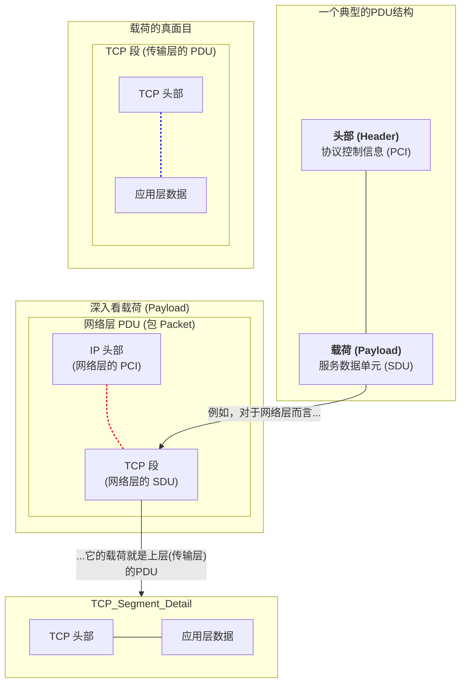

好的，我们继续。

---

### 1.3.1 数据的打包：封装 (Encapsulation)

... (前文内容已省略) ...

- 经过封装，原始数据在不同层次有着不同的名称：**段 (Segment)**、**包 (Packet)**、**帧 (Frame)**，它们统称为**协议数据单元 (PDU, Protocol Data Unit)**。
- 这个过程保证了数据能够在复杂的网络环境中，被准确、有序地送达目的地。

---

### 1.3.2 旅途中的包裹：协议数据单元 (PDU)

在上一节的封装之旅中，我们看到数据在每一层都有了新的名字：段、包、帧。这些五花八门的名称，其实都是一个更通用概念的具体体现——**协议数据单元 (Protocol Data Unit, PDU)**。

如果说封装是“打包”的动作，那么 PDU 就是在每个打包步骤中“产出的包裹本身”。无论这个包裹在传输层被称为“段”，在网络层被称为“包”，还是在数据链路层被称为“帧”，它们本质上都是 PDU。

#### PDU 的通用结构

PDU 是对等层之间传递的数据单位。虽然每一层的 PDU 头部信息各不相同，但它们都遵循一个通用的基本结构：

**PDU = 协议控制信息 (PCI) + 服务数据单元 (SDU)**

这是什么意思呢？让我们拆解一下：

1.  **协议控制信息 (Protocol Control Information, PCI)**：这就是我们前面反复提到的“头部”（有时也包括“尾部”）。它包含了当前层协议为了完成其功能所必需的控制信息。比如 TCP 头部里的端口号、IP 头部里的 IP 地址、以太网帧头里的 MAC 地址等，都属于 PCI。
2.  **服务数据单元 (Service Data Unit, SDU)**：这个术语听起来有点陌生，但其实它就是指**上层传递下来的、需要本层提供服务来传输的完整数据**。换句话说，对于第 N 层而言，它的 SDU 就是第 N+1 层的整个 PDU。

这个嵌套关系可能有点绕，让我们用一张图来清晰地展示它：

从图中可以清晰地看到：
- **网络层**的 PDU 是一个**包 (Packet)**。
- 这个包由 **IP 头部 (PCI)** 和 **TCP 段 (SDU)** 组成。
- 而作为网络层载荷的 **TCP 段**，其本身又是**传输层**的 PDU。

这种“俄罗斯套娃”式的结构，正是封装过程的精髓所在。每一层都只关心自己的 PDU，将上层的 PDU 视为一个整体的数据块（即 SDU）来处理，而无需关心其内部的具体构造。

#### 各层 PDU 汇总

为了方便记忆，我们将各层的 PDU 名称和其主要功能进行一个梳理。当你以后听到某个术语时，应该能立刻反应出它处于协议栈的哪个层面，以及它主要解决了什么问题。

- [ ] **应用层 (Application Layer)**
    - **PDU 名称**: 数据 (Data) 或报文 (Message)
    - **关注点**: 为用户提供特定应用服务，如 HTTP 报文定义了如何请求和响应网页。
- [ ] **传输层 (Transport Layer)**
    - **PDU 名称**: **段 (Segment)** (TCP) 或 **数据报 (Datagram)** (UDP)
    - **关注点**: 端口号，确保数据在两台主机之间正确地传递给对应的应用程序。
- [ ] **网络层 (Network Layer)**
    - **PDU 名称**: **包 (Packet)** 或 **数据报 (Datagram)**
    - **关注点**: IP 地址，负责在整个互联网范围内进行寻址和路由。
- [ ] **数据链路层 (Data Link Layer)**
    - **PDU 名称**: **帧 (Frame)**
    - **关注点**: MAC 地址，负责在相邻的两个网络设备之间进行寻址。
- [ ] **物理层 (Physical Layer)**
    - **PDU 名称**: **比特 (Bit)**
    - **关注点**: 电信号/光信号，负责在物理介质上透明地传输 0 和 1。

#### 本节小结

- **协议数据单元 (PDU)** 是网络协议栈中对等层之间交换的数据包的通用术语。
- 一个 PDU 由**协议控制信息 (头部/尾部)**和**服务数据单元 (载荷)**两部分组成。
- 上一层完整的 PDU，会成为下一层 PDU 的**载荷 (Payload)** 部分，这就是封装的本质。
- 熟记每一层 PDU 的特定名称（段、包、帧）是网络工程师的基本功，它能帮助我们快速定位和讨论网络问题。