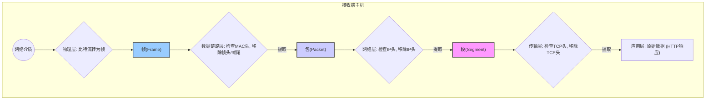

好的，我们继续。

---

### 1.3.3 数据的拆解：解封装 (Decapsulation)

经过了封装的精心打包和网络中的长途跋涉，我们的数据包裹终于抵达了目的地。但这还不是旅程的终点。收件人需要的是包裹里的“礼物”——原始的应用数据，而不是层层叠叠的包装盒和快递单。这个拆开包裹、还原数据的过程，就是**解封装 (Decapsulation)**。

如果说封装是“打包发货”，那么解封装就是“收货拆包”。这是一个与封装方向完全相反、自下而上的过程。在接收端的协议栈中，数据从物理层开始，逐层向上递交。每一层都像一位专业的“拆包员”，只负责检查并拆掉属于自己那一层的“包装”（头部信息），然后将里面的内容交给上一层，直到最终的原始数据呈现在应用程序面前。

#### 解封装的舞台：协议栈中的逆向旅程

让我们跟随那个长途跋涉而来的“超级包裹”，看看它在接收端是如何被一步步还原的。

##### 1. 物理层 (Physical Layer)：卡车卸货
包裹抵达后，首先由物理层接收。物理层将网线或空气中传播的电信号/光信号重新转换为数字化的**比特流 (Bit Stream)**。它完成了最基础的“卸货”工作，并将完整的**帧 (Frame)** 递交给上一层——数据链路层。

- **数据形态**：比特 (Bits) -> 帧 (Frame)
- **快递比喻**：快递卡车抵达目的地，卸下包裹，包裹本身（帧）被送入分拣中心。

##### 2. 数据链路层 (Data Link Layer)：核对“本地流转标签”
数据链路层收到了一个完整的帧。它会检查**帧头 (Frame Header)**，主要关注**目的 MAC 地址**。
- **检查动作**：这个 MAC 地址是我自己的网卡地址吗？
- **处理结果**：
    - **是**：确认是发给自己的包裹。它会“撕掉”这个帧头和帧尾，取出里面的核心内容——**IP 包 (Packet)**，然后递交给网络层。
    - **否**：这不是我的包裹。大多数情况下，网卡会直接丢弃这个帧。
- **快递比喻**：分拣中心的工作人员看到包裹上的本地流转标签，确认“收件地址是本楼”，于是撕掉这个标签，将包裹送往楼内的收发室。

##### 3. 网络层 (Internet Layer)：核对“最终收件地址”
网络层从数据链路层手中接过了 IP 包。它会检查 **IP 头部 (IP Header)**，核心是查看**目的 IP 地址**。
- **检查动作**：这个 IP 地址是我这台主机的地址吗？
- **处理结果**：
    - **是**：确认是发给自己的。它会“拆开”这个快递纸箱，也就是移除 IP 头部，然后将里面的**传输层段 (Segment)** 交给传输层。
    - **否**：（通常在路由器上发生）如果自己不是最终目的地，但开启了路由功能，就会根据路由表决定下一跳，重新封装并转发出去。对于普通主机，则会丢弃。
- **快递比喻**：收发室的管理员核对快递单上的最终收件人地址，确认无误后，拆开外包装纸箱，把里面的内部包装盒交给收件人。

##### 4. 传输层 (Transport Layer)：送达“指定房间”
传输层收到了一个 TCP 或 UDP 段。它会解读 **TCP/UDP 头部**，关键信息是**目的端口号**。
- **检查动作**：哪个应用程序正在监听这个端口号？
- **处理结果**：根据端口号，操作系统就能知道这个数据段应该交给哪个正在运行的应用程序（例如，80 端口的数据交给 Web 浏览器）。传输层移除 TCP/UDP 头部，将最纯粹的**应用层数据**递交给对应的应用程序。
- **快递比喻**：收件人看到内部包装盒上的便签写着“请交到书房”，于是拿掉便签，将盒子里的书（礼物本身）放到了书房的桌子上。

##### 5. 应用层 (Application Layer)：解读“礼物”
最后，应用程序（如浏览器）收到了它等待已久的原始数据（例如，一个 HTTP 响应报文）。应用层协议会解析这些数据的内容，并将其呈现给用户，比如在屏幕上渲染出一个绚丽的网页。至此，一次完整的数据之旅宣告结束。

- **快递比喻**：你走进书房，拿起桌上的书，翻开阅读，获取了其中的知识。

#### 可视化解封装流程

下面的流程图清晰地展示了这个自下而上的“拆包”过程：

#### 封装与解封装的对称之美

封装与解封装是一对完美对称的逆向操作。它们共同确保了数据在复杂的网络环境中，既能被有效、准确地引导，又能被最终的应用程序正确理解。

| 层次 (Layer) | 封装过程（发送端） | 解封装过程（接收端） |
| :--- | :--- | :--- |
| **应用层** | 生成原始数据 | 接收并解析原始数据 |
| **传输层** | 添加 TCP/UDP 头部，形成**段** | 读取并移除 TCP/UDP 头部，提取数据 |
| **网络层** | 添加 IP 头部，形成**包** | 读取并移除 IP 头部，提取段 |
| **数据链路层** | 添加帧头/帧尾，形成**帧** | 读取并移除帧头/帧尾，提取包 |
| **物理层** | 将帧转换为比特流 | 将比特流转换为帧 |

这个对称的设计是分层网络模型的核心优势：**每一层都只专注于处理自己的协议头部，而将内部的数据（载荷）视为一个不透明的整体，交给上一层处理**。这种关注点分离的设计，极大地简化了网络协议的开发和维护。

---

#### 本节小结

- **解封装 (Decapsulation)** 是数据在接收端从协议栈低层向高层传递时，被逐层移除控制信息（头部），最终还原为原始数据的过程。
- 这是一个**自下而上**的旅程，与封装的**自上而下**正好相反。
- 每一层协议栈在解封装时，都会**检查**该层的头部信息（如 MAC 地址、IP 地址、端口号）以确保数据被正确地送往目的地，然后**移除**该头部，将载荷（Payload）向上传递。
- 封装与解封装的对称性体现了网络分层模型的精髓，实现了各层功能的解耦与独立。