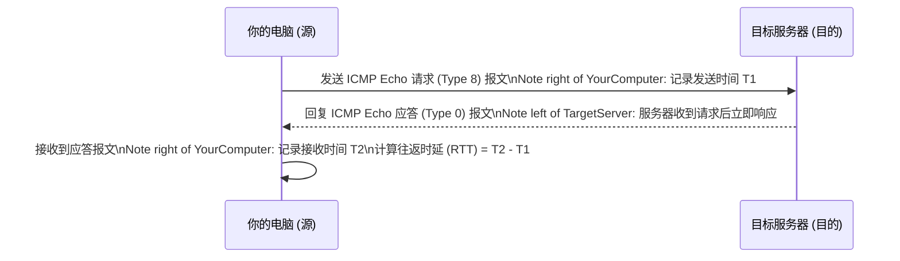

好的，作为一位资深的技术教育作者，我将紧接“1.4.1 工具介绍：`ping` 是什么？”这一主题，为你续写接下来的内容。

---

那么，这个看似简单的“打招呼”动作，在网络世界里究竟是如何实现的呢？`ping` 命令的背后，其实是一套严谨而高效的通信机制。

### “一来一回”的问候：Echo 请求与应答

`ping` 的核心工作原理可以被生动地比喻为向山谷中呐喊并等待回声。在网络术语中，这个过程被称为 **Echo 请求（Echo Request）** 与 **Echo 应答（Echo Reply）**。

1.  **发出请求**：当你在你的计算机（我们称之为“源主机”）上对另一个目标（“目标主机”，例如 `www.baidu.com`）执行 `ping` 命令时，你的计算机会构建一个特殊的数据包，即“Echo 请求”报文，并将其发送给目标主机。这个数据包里包含了一些用于校验和识别的信息，以及一个时间戳。
2.  **收到并应答**：如果目标主机在线，并且其网络功能正常、防火墙等安全策略也允许，它在收到这个“Echo 请求”报文后，会立即构建一个“Echo 应答”报文，并把它发回给你的源主机。
3.  **确认收到**：源主机接收到“Echo 应答”报文后，一次完整的“问候”就成功了。通过计算从发出请求到收到应答所花费的时间，`ping` 就能告诉你这次通信的往返时间（Round-Trip Time, RTT）。

这个“一来一回”的过程，不仅确认了目标主机是“活着的”（可达的），还验证了从你到目标、再从目标回到你的双向网络路径都是通畅的。

### `ping` 的基石：ICMP 协议

这种精巧的问答机制并非 `ping` 程序独创，而是基于网络层的一个重要协议——**ICMP（Internet Control Message Protocol，互联网控制报文协议）**。

你可以将 IP 协议想象成一个只负责投递信件的邮差，他尽力而为，但不保证信件一定能送达，也不知道信件送达后对方的情况。而 ICMP 协议则像是邮政系统里的“回执与通知服务”。它不负责传输真正的用户数据（如网页、文件），而是专门用来在 IP 主机、路由器之间传递控制消息，报告网络中可能出现的问题。

`ping` 程序正是利用了 ICMP 协议中定义的两种特定类型的报文：

*   **类型 8 (Type 8)**：Echo 请求报文
*   **类型 0 (Type 0)**：Echo 应答报文

下面的流程图清晰地展示了 `ping` 命令借助 ICMP 的工作流程：

*图 1-4-1 `ping` 命令的 ICMP 工作流程*

所以，`ping` 本质上是一个用户态的应用程序，它调用操作系统的网络功能，去创建和发送 ICMP Echo 请求报文，并监听和解析返回的 ICMP Echo 应答报文。

***

#### 本节小结

*   **核心用途**：`ping` 是用于验证网络连通性的基础工具。
*   **工作原理**：它通过发送“ICMP Echo 请求”并等待“ICMP Echo 应答”来工作，这是一个“一来一回”的确认过程。
*   **底层协议**：`ping` 的功能完全建立在网络层的 **ICMP 协议** 之上，它不涉及传输层的 TCP 或 UDP 协议。

理解了 `ping` 的工作原理后，我们就能更好地解读它返回的信息，并利用它来诊断更具体的网络问题。在下一节中，我们将亲手实践，学习如何在不同操作系统中使用 `ping` 命令，并分析其输出结果。