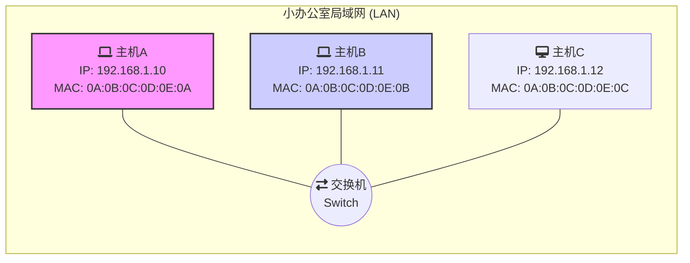

好的，作为一位资深的技术教育作者，我将紧接上下文，为你续写“2.1.1 场景设定：聚焦数据链路层”这部分内容。

---

### 2.1.1 场景设定：聚焦数据链路层

在第一章中，我们已经建立了网络分层的宏观视角，从应用层到物理层，每一层各司其职。现在，让我们收窄视野，将聚光灯打在**数据链路层（Data Link Layer, L2）**上。顾名思义，这一层关心的是数据如何在一段段物理“链路”上传输，它处理的是“一步之遥”的通信问题。

为了让概念变得具体，我们来设定一个贯穿本章的简单场景：一个小型办公室局域网（LAN）。

在这个场景中，我们有三台主机（A、B、C）和一台交换机（Switch）。它们通过网线连接，共同构成了一个典型的以太网环境。所有设备都位于同一个 IP 子网 `192.168.1.0/24` 中，可以互相“看到”对方。

现在，我们的核心任务是：**主机 A 要向主机 B 发送一条消息。**

从网络分层模型的角度看，这个任务会自上而下地传递：

1.  **高层（应用层、传输层、网络层）**：应用层产生数据（例如，一个聊天消息），传输层为其加上 TCP/UDP 头部，网络层再为其封装上 IP 头部。IP 头部中包含了至关重要的信息：源 IP 地址（`192.168.1.10`）和目标 IP 地址（`192.168.1.11`）。至此，我们有了一个完整的 IP 数据包（Packet）。

2.  **数据链路层（我们的主角）**：现在，IP 数据包被移交给了主机 A 的数据链路层。此时，它面临一个非常具体且物理的问题：
    > “我（主机 A）知道我要去 `192.168.1.11` 这个逻辑地址，但我的网卡应该把这个数据包转换成电信号，从哪个物理端口、具体发送给连接在这根网线另一端的哪个设备呢？”

这个问题正是数据链路层的职责所在。它不关心数据最终要跨越多少个路由器到达世界另一端，它只关心**下一跳（Next Hop）**该怎么走。在我们的局域网场景中，“下一跳”就是从主机 A 的网卡到交换机，再从交换机到主机 B 的网卡。

为了完成这个任务，数据链路层会将来自网络层的 IP 数据包再次打包，形成一个称为**帧（Frame）**的数据单元。这个“帧”包含了在本地链路上进行寻址和传输所必需的信息。

因此，我们的探索将围绕以下三个核心问题展开，这也构成了本地通信的三部曲：

1.  **身份识别**：在局域网中，设备如何拥有一个全球唯一且固定的物理身份标识？（**引出 MAC 地址**）
2.  **数据转发**：当帧到达交换机时，交换机如何智能地决定应该从哪个端口将其转发出去，而不是盲目地广播给所有设备？（**引出交换机的工作原理**）
3.  **地址映射**：主机 A 明明只知道主机 B 的 IP 地址，它是如何获知投递帧所必需的主机 B 的物理身份标识的？（**引出 ARP 协议**）

理解了这三个问题，你就掌握了数据在局域网内部流动的全部脉络。接下来，让我们从最基础的身份标识——MAC 地址开始。

---
#### **本节要点回顾**

- **场景聚焦**：我们的讨论将基于一个由主机和交换机组成的简单局域网（LAN）环境。
- **核心任务**：探究一台主机（A）如何向同一网络中的另一台主机（B）发送数据。
- **数据链路层的职责**：负责相邻设备间的通信，将网络层的 IP 数据包（Packet）封装成帧（Frame），并解决“下一跳”的物理传输问题。
- **引出的三大主题**：MAC 地址（身份）、交换机（转发）和 ARP 协议（地址解析），它们是实现局域网通信的基石。