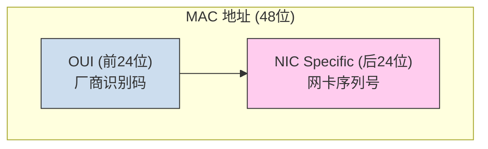

好的，作为一位资深的技术教育作者，我将紧接上一节的铺垫，为你续写 **2.1.2 第一步：设备的物理身份证 (MAC地址)** 的内容。

---

### 2.1.2 第一步：设备的物理身份证 (MAC 地址)

在上一节中，我们提出了数据链路层的第一个核心问题：在局域网中，设备如何拥有一个全球唯一且固定的物理身份标识？要解决这个问题，我们需要一种独一无二、与生俱来的标识符。这个标识符就是 **MAC 地址（Media Access Control Address）**，通常也被称为**物理地址**或**硬件地址**。

如果说 IP 地址像是你在网络世界的“住址”，可以随时搬家更换，那么 MAC 地址则更像是你的“身份证号”，从设备出厂那一刻起就被烧录在网卡（Network Interface Card, NIC）中，理论上是永久不变的。

#### MAC 地址的构成与格式

一个标准的 MAC 地址是一个 48 位（6 字节）的二进制数，为了便于人类阅读，通常表示为 12 位的十六进制数，并用冒号（`:`）、连字符（`-`）或无分隔符来分组。

最常见的格式如下：
`0A:0B:0C:0D:0E:0A` 或 `0A-0B-0C-0D-0E-0A`

这 48 位地址并非随意分配，它遵循着全球统一的标准，由国际组织 IEEE（电气和电子工程师协会）负责管理，从而确保其全球唯一性。其内部结构分为两部分：

1.  **组织唯一标识符 (OUI - Organizationally Unique Identifier)**：前 24 位（前 3 个字节）由 IEEE 分配给硬件制造商。例如，所有由思科（Cisco）生产的网卡，其 MAC 地址的前 24 位都是相同的或在特定范围内。这就像身份证号的前几位代表了你所在的省市。
2.  **网卡特定地址**：后 24 位（后 3 个字节）由制造商自行分配给其生产的每一块网卡。制造商需要确保在自己的 OUI 范围内，分配出去的后 24 位地址是唯一的。

通过这种“厂商锁定 + 内部唯一”的分配机制，理论上保证了任何一块网卡的 MAC 地址都是全世界独一无二的。

<strong>动手实践：查看你自己的 MAC 地址</strong>

了解理论不如亲手实践。你可以在自己的电脑上轻松找到网卡的 MAC 地址：

<ul>
<li><strong>在 Windows 系统中：</strong>
打开命令提示符（cmd），输入 <code>ipconfig /all</code>。在输出信息中找到你正在使用的网络适配器（如“以太网适配器”或“无线局域网适配器”），其中的“物理地址”就是 MAC 地址。
<pre><code class="bash">
...
以太网适配器 以太网:

   连接特定的 DNS 后缀 . . . . . . . :
   描述. . . . . . . . . . . . . . . : Intel(R) Ethernet Connection
   物理地址. . . . . . . . . . . . . : 0A-0B-0C-0D-0E-0A  &lt;-- 就是它！
   DHCP 已启用 . . . . . . . . . . . : 是
   自动配置 IPv4 地址 . . . . . . . : 192.168.1.10
...
</code></pre>
</li>
<li><strong>在 macOS 或 Linux 系统中：</strong>
打开终端，输入 <code>ifconfig</code> 或 <code>ip addr</code>。在相应网卡（如 <code>en0</code>, <code>eth0</code>）的信息中，找到 `ether` 或 `link/ether` 字段后面的值。
<pre><code class="bash">
eth0: flags=4163&lt;UP,BROADCAST,RUNNING,MULTICAST&gt;  mtu 1500
        inet 192.168.1.10  netmask 255.255.255.0  broadcast 192.168.1.255
        inet6 fe80::... prefixlen 64  scopeid 0x20&lt;link&gt;
        ether 0a:0b:0c:0d:0e:0a  txqueuelen 1000  (Ethernet) &lt;-- 就是它！
        ...
</code></pre>
</li>
</ul>

#### 深度辨析：为什么有了 IP 地址，还需要 MAC 地址？

这是初学者最容易困惑的问题。既然 IP 地址能定位到一台主机，为什么在局域网通信中还要画蛇添足地使用 MAC 地址呢？答案在于它们服务于网络协议栈的不同层级，解决不同范围的问题。

| **特性** | **MAC 地址 (物理地址)** | **IP 地址 (逻辑地址)** |
| :--- | :--- | :--- |
| **所属层级** | **数据链路层 (L2)** | **网络层 (L3)** |
| **作用范围** | 局域网（LAN），**邻近设备间**的通信 | 全球互联网，**端到端**的通信 |
| **地址性质** | 硬件固化，全球唯一，**通常不变** | 软件配置，可变，**随网络环境改变** |
| **生活类比** | **身份证号** (唯一、不变) | **家庭住址** (可搬家、会改变) |

我们可以用一个更生动的“快递”比喻来理解：

-   **IP 地址** 就像是快递包裹上的**最终收货地址**（如：北京市朝阳区 XX 小区 1 号楼 101 室）。这个地址决定了包裹的最终目的地，路由器（相当于快递分拣中心）会根据这个宏观地址来规划跨城市、跨省份的运输路线。
-   **MAC 地址** 则像是**最后一公里的快递员**需要的信息。当包裹到达你所在小区的快递站时，快递员需要知道 101 室具体在哪栋楼的哪个门。在局域网中，交换机（相当于快递站）就是根据 MAC 地址这个“门牌号”，将数据帧精准地送到目标设备的网卡上，而不是送到邻居的网卡上。

**关键点在于，IP 地址在数据跨越多个局域网（经过路由器）时保持不变，而 MAC 地址在每一“跳”都会改变。** 当主机 A 的数据包要发往互联网上的服务器时，帧的目标 MAC 地址是下一跳路由器接口的 MAC 地址，而不是最终服务器的 MAC 地址。

<strong>常见误区警示：一台电脑只有一个 MAC 地址吗？</strong>

不一定。MAC 地址是与<strong>网络接口</strong>绑定的，而不是与设备本身。如果你的笔记本电脑既有有线网卡（用于插网线），又有无线网卡（用于连接 Wi-Fi），那么它将拥有至少两个 MAC 地址，每个网络接口各一个。

现在，我们已经为局域网中的设备找到了它们的物理身份证——MAC 地址。在我们的场景中，主机 A、B、C 的网卡都各自拥有一个全球唯一的 MAC 地址。

回到数据链路层封装的**帧（Frame）**，其头部结构中最重要的两个字段就是**目标 MAC 地址**和**源 MAC 地址**。

当主机 A 要发送数据给主机 B 时，它会构建一个以太网帧，将主机 B 的 MAC 地址（`0A:0B:0C:0D:0E:0B`）填入“目标 MAC”字段，将自己的 MAC 地址（`0A:0B:0C:0D:0E:0A`）填入“源 MAC”字段。然后，它将这个帧通过网线发送出去。

这引出了我们的下一个问题：这个包含了目标 MAC 地址的帧被发送到交换机后，交换机是如何知道该从哪个端口把它准确地发给主机 B，而不是广播给所有人的呢？这便是我们下一节要探讨的交换机的工作原理。

---

#### **本节要点回顾**

-   **MAC 地址定义**：它是烧录在网卡上的全球唯一的 48 位硬件地址，是设备在数据链路层的物理身份标识。
-   **结构**：由 24 位的厂商识别码（OUI）和 24 位的厂商自定义序列号组成，确保了其唯一性。
-   **核心区别 (vs IP)**：MAC 地址工作在 L2，用于局域网内部的“下一跳”寻址，是物理且相对固定的；IP 地址工作在 L3，用于全球范围的“端到端”寻址，是逻辑且可变的。
-   **在帧中的作用**：以太网帧的头部包含了源 MAC 地址和目标 MAC 地址，是局域网设备间识别彼此的关键。