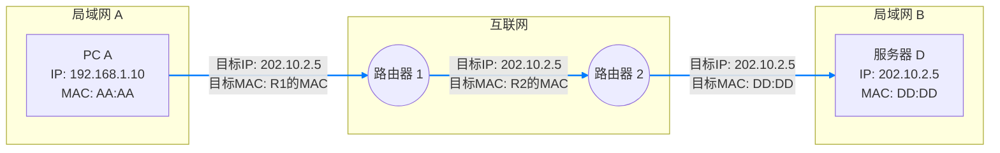

好的，作为一名资深的技术教育作者，我将为你撰写这篇关于“什么是IP地址？”的教学段落。

---

### 3.1.1 起点：什么是IP地址？

在上一章中，我们探索了数据链路层，了解了设备如何通过 MAC 地址在同一个局域网（比如同一个Wi-Fi下）内相互识别和通信。MAC地址就像设备的“身份证号”，是其独一无二的物理标识。然而，当我们的数据需要走出家门，跨越城市乃至大洋，去往另一个网络时，仅凭“身份证号”是远远不够的。这就引出了我们网络层的核心概念——**IP地址**。

如果说 MAC 地址回答了“你是谁？”这个问题，那么 IP 地址则回答了“你在哪？”这个问题。

**IP地址（Internet Protocol Address）** 是分配给网络上每个设备的一个唯一的逻辑地址。它为在广阔的互联网中进行通信的亿万设备，提供了一个清晰、可寻址的“坐标”。想象一下寄送一封跨国信件，你需要一个详细的邮寄地址：国家、城市、街道、门牌号。IP地址就扮演着这个“邮寄地址”的角色，它不仅标识了独一无二的设备，更重要的是，它蕴含了设备在网络中所处的**位置信息**，使得路由器（互联网中的“邮局”）能够据此规划出一条最高效的路径，将数据包准确送达。

#### “身份证”与“家庭住址”：MAC地址与IP地址的根本区别

为了彻底理解IP地址的作用，最好的方式就是将它与我们已经熟悉的MAC地址进行对比。它们是网络通信中不可或DENO的搭档，但各司其职，工作在不同的层面。

| 特性 | MAC地址 (数据链路层) | IP地址 (网络层) |
| :--- | :--- | :--- |
| **本质** | 物理地址，固化在网卡中 | 逻辑地址，由网络管理员或服务商分配 |
| **变动性** | 通常是永久不变的 | 可变的，设备移动到新网络时会改变 |
| **作用范围** | 局部范围，仅在同一局域网（LAN）内有效 | 全局范围，在整个互联网中有效 |
| **作用** | 识别一个特定的网络接口（“你是谁”） | 标识设备在网络中的位置（“你在哪里”） |
| **生活中的类比**| 设备的序列号 或 个人的身份证号 | 家庭住址 或 公司的邮寄地址 |

这个区别是理解网络分层思想的关键：**IP地址负责在宏观上找到目标网络，而MAC地址负责在微观上（即局域网内部）找到目标设备。**

#### 一次跨网络访问的旅程

让我们通过一个简化的图示，来观察当你的电脑（PC A）试图访问一个远程服务器（服务器 D）时，IP地址和MAC地址是如何协同工作的。

在这个旅程中，请注意两个关键点：

1.  **IP地址的稳定性**：从PC A发出的数据包，其头部包含的“源IP地址”（192.168.1.10）和“目标IP地址”（202.10.2.5）在整个传输过程中是**始终不变**的。这就像信封上的寄信人地址和收信人地址，从写好到投递，都不会被修改。

2.  **MAC地址的接力性**：数据包每经过一个网络节点（如路由器），其数据链路层的“目标MAC地址”都会发生改变。
    *   在局域网A内，PC A的目标是把包交给网关路由器 R1，所以目标MAC是 R1 的MAC地址。
    *   当包到达 R1 后，R1会查找路由表，决定下一跳是 R2，于是它重新封装数据包，将目标MAC地址改为 R2 的MAC地址。
    *   以此类推，直到最后一跳路由器 R2 将数据包送往服务器 D 时，目标MAC地址才最终变为服务器 D 的MAC地址。

这个过程清晰地展示了：**IP地址负责端到端的最终寻址，而MAC地址负责点到点的下一跳寻址。**

---

#### **要点回顾**

*   **IP地址**是设备在互联网上的逻辑地址，核心作用是**标识位置**和**实现全局寻址**。
*   IP地址与MAC地址有本质区别：IP地址是逻辑的、可变的、全局的（如家庭住址）；MAC地址是物理的、固定的、局部的（如身份证号）。
*   在跨网络通信中，IP地址（源/目）全程不变，而MAC地址在每一“跳”（hop）都会更新，用于在当前局域网内找到下一个设备（通常是路由器）。

理解了IP地址的 foundational 作用，我们就拿到了进入广阔互联网世界的第一把钥匙。接下来，我们将深入探索IP地址的结构和分类。