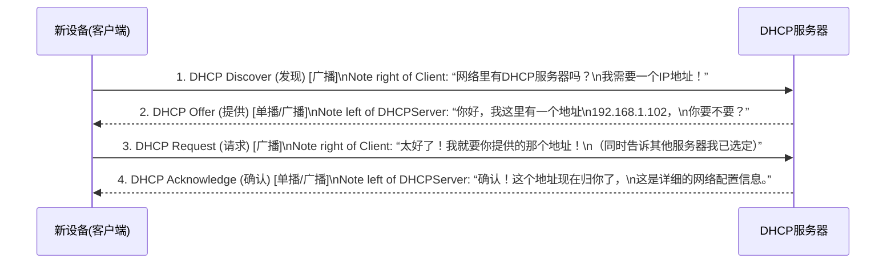

好的，作为一位资深的技术教育作者，我将为你撰写这篇关于 DHCP 的教学段落。

---

### 3.1.4 工具三：自动分配IP地址 (DHCP)

在前面的学习中，我们了解了如何为一台设备手动配置IP地址、子网掩码和默认网关。这就像为每一位新入住酒店的客人手动登记信息、分配房间号、并亲手递上地图。对于几位客人来说，这尚可应付；但如果酒店有成百上千间客房，或者客人流动频繁，手动操作无疑是一场灾难——效率低下且极易出错。在庞大的计算机网络中，我们同样需要一位高效的“前台经理”来自动化这个过程，而这个角色，就由**DHCP**来扮演。

**DHCP (Dynamic Host Configuration Protocol，动态主机配置协议)** 是一种网络管理协议，它的核心使命就是——实现网络中客户端IP地址的自动化分配与管理。当你将手机连上咖啡馆的Wi-Fi，或者把电脑接入公司的局域网时，背后那个让你“即插即用”的无名英雄，正是DHCP。

#### DHCP的“四步握手”：DORA过程

DHCP 的工作流程非常严谨，通常被称为“四步握手”或“DORA过程”，即**发现(Discover)**、**提供(Offer)**、**请求(Request)**和**确认(Acknowledge)**。这四个步骤确保了每台设备都能快速、准确地获得一个唯一的、可用的IP地址。

我们可以通过一个时序图来直观地理解这个过程：

1.  **第一步：发现 (Discover)**
    *   一台新设备（客户端）接入网络时，它什么都不知道，就像一个初来乍到的人在大厅里喊：“请问前台在哪？我需要一个房间！”
    *   在技术上，客户端会发送一个**DHCP Discover**报文。由于它没有IP地址，也不知道服务器在哪，所以这个报文会以**广播**的形式发送给网络中的所有设备。

2.  **第二步：提供 (Offer)**
    *   网络中监听着的DHCP服务器听到了这个请求，就像前台听到了呼唤。
    *   服务器会从自己的IP地址池中挑选一个尚未分配的IP地址，连同子网掩码、网关、DNS等信息，打包成一个**DHCP Offer**报文，回应给客户端。网络中可能有多台DHCP服务器，所以客户端可能会收到多个Offer。

3.  **第三步：请求 (Request)**
    *   客户端收到了一个或多个Offer后，通常会选择最先到达的那个。
    *   然后，它会再次以**广播**的形式发送一个**DHCP Request**报文，明确告诉所有服务器：“我决定接受来自[某服务器]提供的[某IP地址]。” 这样做的好处是，所有DHCP服务器都能收到这个消息，那些未被选中的服务器就可以收回它们提供的IP地址，以便分配给其他设备。

4.  **第四步：确认 (Acknowledge)**
    *   被选中的DHCP服务器收到Request报文后，会进行最后的确认。
    *   它会发送一个**DHCP Acknowledge (ACK)** 报文给客户端，表示：“交易完成！这个IP地址在接下来的租期（Lease Time）内正式属于你了。” 同时附上所有必要的网络配置信息。至此，客户端便完成了网络配置，可以开始正常通信了。

---

> **案例研究：连接咖啡馆的Wi-Fi**
>
> 想象一下你走进一家咖啡馆，拿出手机准备上网。
> 1.  **你选择并连接咖啡馆的Wi-Fi**：你的手机（客户端）立刻向网络发送了一个DHCP Discover广播包。
> 2.  **Wi-Fi路由器响应**：咖啡馆的路由器通常内置了DHCP服务器功能。它收到广播后，准备了一个IP地址（如 `192.168.1.55`）和相关信息，通过DHCP Offer发回给你的手机。
> 3.  **手机接受提议**：你的手机接受了这个Offer，并发送DHCP Request广播，声明它要使用这个地址。
> 4.  **最终确认**：路由器发送DHCP ACK，确认分配。
>
> 整个过程在几秒钟内自动完成，你几乎毫无察觉，就已经获得了上网所需的一切配置，可以开始刷短视频或处理邮件了。

---

#### DHCP的“上网大礼包”

通过这四步，DHCP不仅仅是给了一个IP地址那么简单，它提供的是一个完整的“上网大礼包”。

- [x] **IP 地址 (IP Address)**: 网络中的唯一身份标识。
- [x] **子网掩码 (Subnet Mask)**: 用于判断通信对象是处于本地网络还是外部网络。
- [x] **默认网关 (Default Gateway)**: 本地网络通往互联网的“大门”，通常是你的路由器地址。
- [x] **DNS 服务器地址 (DNS Server)**: 负责将域名（如 `www.google.com`）解析为IP地址的“网络电话簿”。

#### 本节小结

DHCP是现代网络能够如此便捷、易用的基石。它将复杂、繁琐且易错的手动IP配置过程，转变为一个全自动、可靠的“即插即用”体验。

**要点回顾:**
- **目的**: 自动化分配和管理IP地址及相关网络配置。
- **核心过程**: DORA四步握手——发现 (Discover)、提供 (Offer)、请求 (Request)、确认 (Acknowledge)。
- **分配内容**: 一个包含IP地址、子网掩码、默认网关和DNS服务器的“上网大礼包”。

理解了DHCP，你就理解了为什么我们每次连接到一个新网络时，几乎不需要任何手动设置就能立即上网。它就像网络世界里那位高效、不知疲倦的“酒店前台”，默默地为每一位“旅客”安排好一切。