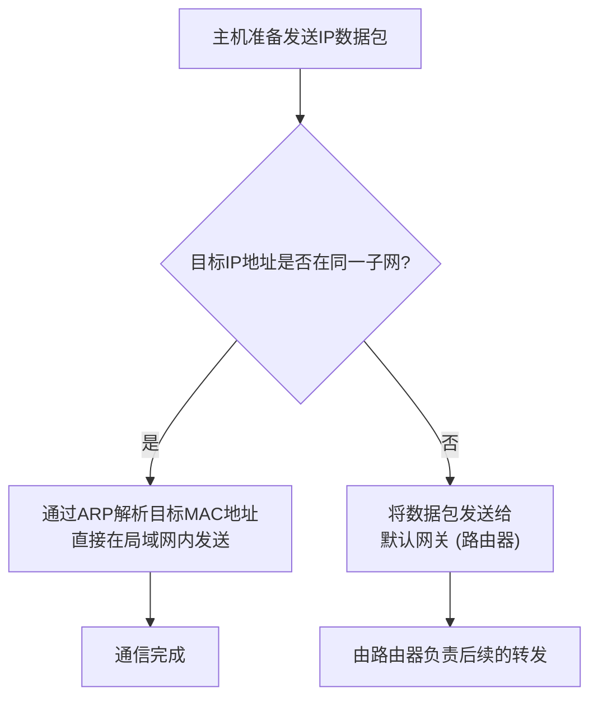

好的，作为一位资深的技术教育作者，我将紧接课程脉络，为你续写 **3.2.1 第一步：离开本地网络 (默认网关)** 的内容。

---

### 3.2.1 第一步：离开本地网络 (默认网关)

在我们开始探讨数据包如何在广袤的互联网中进行复杂的寻路之前，必须先解决一个最基本的问题：如果目的地不在我们当前所在的“社区”（本地网络），数据包该如何迈出第一步？这就像你想寄一个跨省的快递，你不能直接把包裹扔到街上，而是需要先把它交给小区的快递揽收点。在计算机网络中，这个“快递揽收点”就是**默认网关 (Default Gateway)**。

#### 网关的“十字路口”抉择

一台主机在发送 IP 数据包时，内心会面临一个关键的“十字路口”抉择：这个目标地址，我认识吗？它是在我们这个局域网内部，还是在遥远的外界？

这个决策过程非常严谨，完全基于 IP 地址和子网掩码的计算：

1.  **自我认知**：主机知道自己的 IP 地址和子网掩码。通过将这两者进行“按位与”（Bitwise AND）运算，它可以得到自己所在的网络地址。
2.  **审视目标**：主机查看目标 IP 地址，并用**自己的子网掩码**与之进行“按位与”运算，得到目标地址所属的网络地址。
3.  **做出判断**：
    *   **情况一：网络地址相同**。这意味着目标主机和自己位于同一个局域网内。此时，数据包无需走出“家门”，主机会通过 ARP 协议查询目标 IP 的 MAC 地址，然后将数据包在数据链路层直接封装并发送给目标主机。
    *   **情况二：网络地址不同**。这意味着目标主机在外部网络。此时，主机知道自己无法直接送达，它会放弃寻找目标主机的 MAC 地址，转而将数据包发送给一个指定的“中间人”——**默认网关**。

这个决策流程可以用下面的图清晰地表示：

#### Case Study: 一封发往远方的“电子邮件”

让我们通过一个具体的案例，来感受默认网关的工作。

假设你的电脑（我们称之为 `PC-A`）正在你的家庭网络中，你想访问 Google 的网站。

**网络环境如下表所示：**

| 设备 | IP 地址 | 子网掩码 | 默认网关 |
| :--- | :--- | :--- | :--- |
| 你的电脑 (PC-A) | `192.168.1.101` | `255.255.255.0` | `192.168.1.1` |
| Google 服务器 (示例) | `142.250.75.100` | (未知) | (未知) |

**决策过程：**

1.  **PC-A 的自我定位**：
    *   它计算自己的网络地址：`192.168.1.101` AND `255.255.255.0` = `192.168.1.0`。
    *   PC-A 知道自己属于 `192.168.1.0/24` 这个网络。

2.  **PC-A 分析目的地**：
    *   它用**自己的子网掩码**去计算目标地址的网络：`142.250.75.100` AND `255.255.255.0` = `142.250.75.0`。

3.  **得出结论**：
    *   `192.168.1.0` 与 `142.250.75.0` **不相等**。
    *   PC-A 的操作系统立即做出判断：“目的地在外面！”

4.  **执行动作**：
    *   PC-A 会将这个发往 `142.250.75.100` 的 IP 数据包，在数据链路层封装时，目标 MAC 地址不再是 Google 服务器的，而是**默认网关（`192.168.1.1`）的 MAC 地址**。
    *   数据包被顺利地发送到你的家用路由器（即默认网关）。至此，数据包成功地迈出了离开本地网络的第一步。接下来的旅程，将由这台路由器以及后续网络中的无数路由器接力完成。

#### 网关的真实身份

需要强调的是，“默认网关”并不是一个虚拟的概念，它是一个实实在在的 IP 地址。这个地址通常是你所在局域网中的**路由器**的 LAN 口 IP 地址。路由器作为连接不同网络的设备，天然扮演着“关口”的角色。当数据包被发送到这个“关口”后，路由器会开始它的核心工作——**路由选择**，为数据包规划下一跳的路径，这正是我们接下来要深入探讨的主题。

---

**本节核心要点回顾**

*   **默认网关**是本地局域网设备访问外部网络的出口，通常是路由器的 IP 地址。
*   设备通过对比**自身网络地址**和**目标网络地址**来判断通信对象是否在同一局域网。
*   如果目标在外部网络，数据包会被发送给默认网关，由其负责后续的转发工作。
*   这个简单的判断与转发机制，是数据包能够开启跨网络“寻路之旅”的第一个、也是至关重要的一个环节。