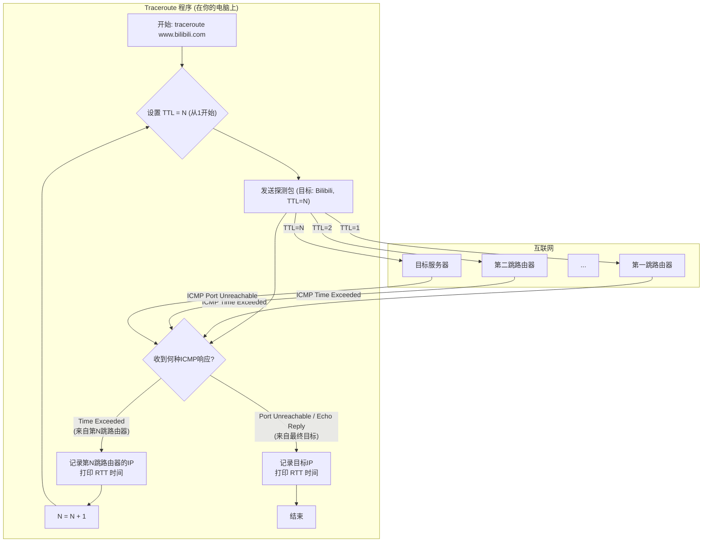

好的，作为一位资深的技术教育作者，我将无缝衔接已完成的内容，为你续写 **3.2.4 实践：用 `traceroute` 绘制旅行地图** 的内容，保持课程的连贯性和深度。

---

### 3.2.4 实践：用 `traceroute` 绘制旅行地图

在上一节的结尾，我们留下了一个引人入胜的线索：`traceroute`（或 Windows 下的 `tracert`）命令正是利用 TTL 和 ICMP “超时”消息这两个机制，来侦测数据包所经过的路径。理论知识已经为我们铺好了道路，现在，是时候亲自动手，将这些抽象的概念转化为一张清晰可见的网络旅行地图了。

`traceroute` 不仅仅是一个命令，它更像是网络世界里的一位侦探。它通过发送一系列精心设计的“探测”数据包，并仔细聆听沿途路由器传回的“回声”，最终为我们拼凑出数据包从起点到终点的完整足迹。

#### 侦探的工作原理：一个巧妙的“圈套”

`traceroute` 的工作流程堪称一个经典的网络工程设计，它将 TTL 机制的副作用转化为了强大的诊断能力。整个过程可以分解为以下几个步骤：

1.  **第一轮探测 (TTL=1)**：`traceroute` 向目标地址发送第一个探测包，但故意将 IP 头部的 TTL 字段设置为 1。
2.  **第一跳的回应**：这个数据包到达路径上的第一个路由器（通常是你的默认网关）。该路由器按照规则将 TTL 减 1，得到 0。它随即丢弃该数据包，并向源主机（你的电脑）发送一个 ICMP `Time Exceeded` (超时) 消息。这个消息中包含了该路由器自身的 IP 地址。
3.  **记录第一站**：你的电脑收到这个 ICMP 消息后，`traceroute` 程序便记录下来：“旅程的第一站是 [路由器A的IP地址]”。
4.  **第二轮探测 (TTL=2)**：`traceroute` 再次向目标地址发送探测包，这次将 TTL 设置为 2。
5.  **第二跳的回应**：数据包顺利通过第一个路由器（TTL 变为 1），但在到达第二个路由器时，TTL 再次被减为 0。于是，第二个路由器丢弃数据包，并同样返回一个包含其自身 IP 地址的 ICMP `Time Exceeded` 消息。
6.  **记录第二站**：`traceroute` 记录下：“旅程的第二站是 [路由器B的IP地址]”。
7.  **持续探测**：这个过程不断重复，`traceroute` 依次将 TTL 设置为 3, 4, 5... 直到探测包最终抵达目的地。
8.  **终点的特殊回应**：当探测包最终到达目标服务器时，情况有所不同。目标服务器不会因为 TTL 而丢弃包。
    *   对于大多数 `traceroute`（如 Linux/macOS 版）发送的 UDP 包，目标主机会发现一个发往其“不存在”端口的数据包，因此会返回一个 ICMP `Port Unreachable` (端口不可达) 消息。
    *   对于 Windows 的 `tracert` 发送的 ICMP Echo 请求包，目标主机会返回一个 ICMP `Echo Reply` 消息（与 `ping` 的响应相同）。
    *   当 `traceroute` 收到这类“终点”消息时，它便知道：“侦测结束，已成功抵达！”

这个过程可以用下面的流程图来清晰地展示：



#### Code Example: 追踪一次到B站的访问

让我们打开终端（在 Windows 上是命令提示符或 PowerShell），实际操作一下。我们将追踪从本地到 Bilibili（`www.bilibili.com`）的路径。

**在 Linux 或 macOS 上:**
```bash
traceroute www.bilibili.com
```

**在 Windows 上:**
```bash
tracert www.bilibili.com
```

你可能会看到类似下面这样的输出（具体 IP 和延迟会因你的地理位置和网络环境而异）：

```text
traceroute to www.bilibili.com (111.23.44.56), 64 hops max
 1  192.168.1.1 (192.168.1.1)  1.234 ms  1.567 ms  1.890 ms
 2  10.0.0.1 (10.0.0.1)  5.432 ms  5.876 ms  6.123 ms
 3  city-isp-gw.net (202.96.12.8)  10.111 ms  10.345 ms  10.567 ms
 4  province-backbone-1.chinanet (218.10.5.1)  25.678 ms  26.001 ms  26.333 ms
 5  * * *
 6  beijing-ix.chinaunicom.net (219.158.10.13)  40.123 ms  40.456 ms  40.789 ms
 7  shanghai-data-center.bilibili.com (121.89.3.2) 55.987 ms  56.210 ms  56.433 ms
 8  s111-23-44-56.static.bilicdn.com (111.23.44.56)  55.555 ms  55.888 ms  56.001 ms
```

**如何解读这份“旅行地图”？**

*   **第一列 (跳数)**：代表这是旅程的第几站，从 1 开始。
*   **第二列 (主机名/IP地址)**：这是该站点的“名字”（通过反向 DNS 查询得到）和它的 IP 地址。
*   **三组时间值 (RTT)**：`traceroute` 默认会为每一跳发送三个探测包，这三列数字分别显示了每个探测包从发送到收到回应所需的往返时间 (Round-Trip Time, RTT)，单位是毫秒 (ms)。它是衡量网络延迟的关键指标。

**从这份地图中，我们可以解读出数据包的旅行故事：**
1.  **第1跳**：`192.168.1.1`，这是我的家庭路由器（默认网关），延迟极低。
2.  **第2-4跳**：数据包进入了我的互联网服务提供商 (ISP) 的网络，从本地城域网，走向了省级骨干网。延迟在逐步增加。
3.  **第5跳**：`* * *`。这是什么情况？我们稍后在案例分析中探讨。
4.  **第6-7跳**：数据包进入了另一个大型运营商的网络，并最终抵达了 Bilibili 在上海的数据中心。
5.  **第8跳**：数据包最终到达了 `www.bilibili.com` 对应的服务器。

#### Case Study: 阅读地图背后的信息

`traceroute` 的价值远不止于展示路径，它还是一个强大的网络故障诊断工具。

*   **情况一：星号 (`* * *`) 的含义**
    `* * *` 表示在规定时间内没有收到来自该跳路由器的 ICMP 响应。这通常有两种可能：
    1.  **路由器配置**：出于安全或性能考虑，该路由器被管理员配置为不发送 ICMP `Time Exceeded` 消息。数据包本身是正常通过了这一跳的，只是我们未能收到它的“自我介绍”。
    2.  **网络拥堵或丢包**：从我们电脑发出的探测包，或者从路由器返回的 ICMP 消息，在路上丢失了。如果后续的跳数恢复正常，通常是前一种情况。如果从某一跳开始，后面全是星号，则很可能是该节点或其后的链路出现了严重问题。

*   **情况二：延迟的突然剧增**
    如果你观察到延迟在某两跳之间突然从 20ms 飙升到 200ms，这通常意味着一个重要的地理或逻辑跨越。
    *   **地理跨越**：数据包可能跨越了很长的物理距离，例如通过海底光缆从亚洲传输到了北美。光速虽然快，但长距离依然会带来不可避免的延迟。
    *   **网络瓶颈**：数据包进入了一个拥堵的网络交换节点，或者两个运营商网络之间的互联带宽不足，导致了排队延迟。

通过分析 `traceroute` 的输出，网络工程师可以快速定位问题所在，判断是本地网络、ISP 问题，还是目标服务器网络的问题。

---

#### 本节核心要点回顾

*   **`traceroute`/`tracert`** 是一个可视化网络路径和测量延迟的诊断工具。
*   其核心工作原理是巧妙地利用 **TTL 递增**的探测包，来触发沿途每一跳路由器返回 **ICMP `Time Exceeded`** 消息。
*   通过分析返回的 ICMP 消息的**源 IP 地址**和**往返时间 (RTT)**，`traceroute` 能够描绘出完整的路由路径和每一跳的延迟。
*   输出中的 **`* * *`** 表示请求超时，而 **延迟的剧增** 则往往指向网络瓶颈或长距离的物理链路。掌握 `traceroute` 是每一位网络学习者和从业者的必备技能。