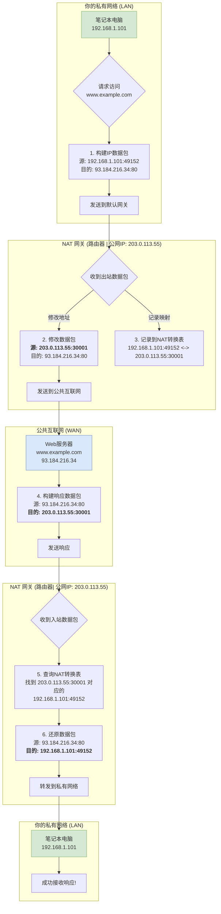

好的，我将以一位资深技术教育作者的身份，紧密衔接您提供的上下文，为您续写“3.3.2 解决方案：NAT的工作流程”这一节。

---

### 3.3.2 解决方案：NAT的工作流程

在上一节的结尾，我们留下了一个悬念：生活在“数字孤岛”上的私网设备，是如何与广阔的互联网世界通信的？现在，让我们揭开这层神秘的面纱，深入探索网络地址转换（NAT）这道“穿越边界的魔法”。

这道魔法的核心，由我们网络中的一位关键角色来施展——**NAT网关（NAT Gateway）**。在家庭或小型办公网络中，这个角色通常由你的无线路由器扮演。它像一个经验丰富、神通广大的边境守卫，驻守在私有网络与公共互联网的交界处。它拥有双重身份：对内，它有一个私有IP地址（如 `192.168.1.1`），是所有内网设备的默认网关；对外，它拥有一个由互联网服务提供商（ISP）分配的、全球唯一的公有IP地址。

NAT的全部戏法，都围绕着**修改IP数据包的地址信息**和**维护一张精密的“翻译记录表”**来展开。整个流程可以分为“出境”和“入境”两个阶段。

#### 案例研究：一次普通的网页访问

为了将这个抽象的过程具体化，让我们跟随你的笔记本电脑（IP地址为 `192.168.1.101`）发起的一次网页访问，来看看NAT是如何工作的。

*   **你的设备（内网主机）**:
    *   私有IP: `192.168.1.101`
    *   临时源端口: `49152` (一个随机分配的端口)
*   **你的路由器（NAT网关）**:
    *   对内IP (LAN): `192.168.1.1`
    *   对外IP (WAN): `203.0.113.55` (一个宝贵的公有IP)
*   **目标服务器（公网主机）**:
    *   域名: `www.example.com`
    *   公有IP: `93.184.216.34`
    *   服务端口: `80` (HTTP服务的标准端口)

下面是这次旅程的完整流程图和分步解析。

#### 工作流程分步详解

**阶段一：出境（从私网到公网）**

1.  **构建与发送**：你的笔记本电脑（`192.168.1.101`）想要访问 `www.example.com`。它会创建一个IP数据包，其中包含源IP（`192.168.1.101`）、源端口（`49152`）、目的IP（`93.184.216.34`）和目的端口（`80`）。由于目的地在外部网络，数据包被发送给默认网关——也就是我们的NAT路由器。

2.  **地址转换 (Translate)**：NAT网关收到这个数据包，发现其源地址是私有IP，且目的地是公网。它立刻开始施展魔法：
    *   **修改源IP**：将数据包的源IP地址从 `192.168.1.101` 替换为自己的公有IP地址 `203.0.113.55`。
    *   **修改源端口**：它会从自己的端口池中选择一个未被使用的端口（例如 `30001`），替换掉原始的源端口 `49152`。这个操作至关重要，被称为**端口地址转换（PAT或NAPT）**，我们稍后会详细解释为什么它如此关键。

3.  **建立映射表 (Map)**：在修改的同时，NAT网关会在其内部维护的一张**NAT转换表**中，创建一条临时的映射记录。这张表是NAT的“记忆核心”。
    | 内网源IP | 内网源端口 | 公网源IP | 公网源端口 |
    | :--- | :--- | :--- | :--- |
    | `192.168.1.101` | `49152` | `203.0.113.55` | `30001` |

    这条记录清晰地记载了“从 `192.168.1.101:49152` 发出的请求，被我伪装成了 `203.0.113.55:30001`”。随后，这个“变装”后的数据包被发送到公共互联网。对于目标服务器 `www.example.com` 来说，它看到的请求完全来自于 `203.0.113.55` 这个公网IP。

**阶段二：入境（从公网到私网）**

4.  **服务器响应**：`www.example.com` 服务器处理完请求后，会发送一个响应数据包。这个数据包的源地址是它自己（`93.184.216.34:80`），目的地址则是它收到的请求来源地址，即 `203.0.113.55:30001`。

5.  **查询映射表 (Look up)**：响应数据包跨越互联网，准确地抵达了你的NAT网关。网关查看数据包的目的端口是 `30001`，于是迅速查询自己的NAT转换表。

6.  **逆向转换 (Reverse Translate)**：通过查询，网关找到了那条映射记录，瞬间“回忆”起来：哦，这个目的地为 `30001` 端口的包，原来是发给内网 `192.168.1.101` 的 `49152` 端口的！于是，它执行逆向操作：
    *   **修改目的IP**：将数据包的目的IP从 `203.0.113.55` 换回 `192.168.1.101`。
    *   **修改目的端口**：将目的端口从 `30001` 换回 `49152`。

最终，这个被完美还原的数据包被转发到你的笔记本电脑上。你的电脑收到了来自 `www.example.com` 的响应，整个过程对它而言是完全透明的，它并不知道中间发生了如此精妙的地址转换。连接建立，网页成功加载。

当通信结束（例如TCP连接关闭或超时），NAT网关会从转换表中删除这条映射记录，释放 `30001` 端口以供其他连接使用。

---

**本节要点回顾**

*   **核心角色**：NAT网关（通常是路由器）是实现地址转换的关键设备，它拥有至少一个公有IP和一个私有IP。
*   **出站流程**：`修改源IP/端口` -> `记录映射关系`。NAT网关将私有源地址替换为公共地址，并记录这一转换。
*   **入站流程**：`查询映射关系` -> `还原目的IP/端口`。NAT网关根据入站数据包的目的端口，查找转换表，将公共目的地址还原为正确的私有地址。
*   **NAT转换表**：是NAT机制的“大脑”，存储了内外地址的临时映射关系，确保响应数据包能被准确无误地送回发起请求的内网设备。
*   **透明性**：整个NAT过程对内网设备和外网服务器都是透明的。内网设备认为自己直接在和公网通信，而公网服务器则认为它在和一个具有公网IP的单一设备通信。