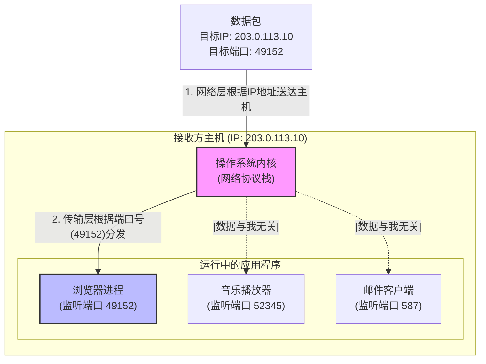

好的，作为一位资深的技术教育作者，我将紧接您的课程大纲，自然地续写 **4.1.1 承接第三章：从主机到进程的“最后一公里”** 这一节的内容。

---

### 4.1.1 承接第三章：从主机到进程的“最后一公里”

在第三章网络层的学习中，我们已经掌握了IP协议的强大能力。它就像一个全球定位系统，能够凭借IP地址，将一个数据包从世界的一个角落，穿越复杂的网络路由，精准地送达到目标主机的“大门口”。这解决了主机到主机（host-to-host）的通信问题，是网络通信的基石。

然而，当数据包满怀期待地敲开目标主机的“大门”时，一个新的问题出现了：这封“信”应该交给谁？

#### 一个主机，多个“收件人”

想象一下，你的电脑（主机）就像一栋繁忙的办公大楼，而IP地址就是这栋大楼的街道地址。此时，你可能正一边用浏览器查阅资料，一边用音乐播放器听着在线音乐，同时还挂着一个即时通讯软件与朋友聊天。

这三个应用程序（浏览器、音乐播放器、聊天软件）都处在活跃状态，它们都是这栋大楼里等待接收信件的“公司”或“住户”。当网络层（大楼的收发室）收到一个数据包时，它只知道这个包裹是送给“科技园区A栋”的（即送给你的IP地址），但它并不知道这个包裹究竟是给“801室的浏览器公司”，还是给“1203室的音乐电台”，抑或是“2204室的即时通讯中心”的。

如果操作系统无法区分，它可能会做出错误的投递，导致浏览器收到了本应属于音乐播放器的数据（网页上出现乱码或无法解析），或者聊天软件收到了网页数据，这无疑会造成通信的彻底混乱。

因此，仅有IP地址是不足够的。我们迫切需要一种机制，来标识主机中独一无二的应用程序进程，完成从**主机**到**进程**（process-to-process）这“最后一公里”的精准投递。

#### 端口号：应用程序的专属“房间号”

为了解决这个难题，传输层引入了一个至关重要的概念——**端口（Port）**。

如果说IP地址是办公大楼的地址，那么端口号就是每个公司的专属“房间号”。它是一个16位的数字，范围从0到65535。当一个应用程序需要进行网络通信时，操作系统会为它分配一个或多个端口号。这样，每一个网络通信的进程都可以通过其唯一的端口号被识别。

现在，数据包的寻址信息变得更加完整了：它不仅包含了目标IP地址，还包含了**目标端口号**。

我们可以通过下面的图示来直观地理解这个过程：

**图 4-1：数据包在主机内部的“寻址”过程**

如图所示：
1.  **网络层**的任务完成：数据包根据其目标IP地址 `203.0.113.10` 成功抵达了目标主机。
2.  **传输层**开始工作：操作系统检查数据包头中的目标端口号，发现是 `49152`。
3.  **精准投递**：操作系统将这个数据包交给正在 `49152` 端口上监听的浏览器进程。而音乐播放器和邮件客户端因为监听的端口不同，不会收到这个数据包。

通过这种方式，IP地址和端口号的组合 `(IP Address: Port)`，就如同一个完整的收件地址：“某市某街道某号（IP地址）的某房间（端口号）”，构成了一个网络中唯一的通信端点，我们通常称之为**套接字地址（Socket Address）**。正是这个组合，才使得数据能够从源应用程序，精确无误地传递到目标应用程序。

---
#### **本节小结**

- **网络层（IP）的局限**：IP地址只能负责将数据包从源主机送到目的主机，实现了“主机到主机”的通信。
- **传输层的核心任务**：为了将数据准确地交付给主机上的特定应用程序，传输层引入了**端口号**机制，从而将“主机到主机”的通信扩展为“**进程到进程**”的通信。
- **端口号的角色**：端口号是应用程序在主机上的唯一标识，如同公寓或办公室的房间号，解决了数据包在主机内部的“最后一公里”投递问题。
- **套接字地址**：`IP地址 + 端口号` 的组合，唯一地标识了全网络中的一个特定应用程序进程，是实现端到端通信的基础。