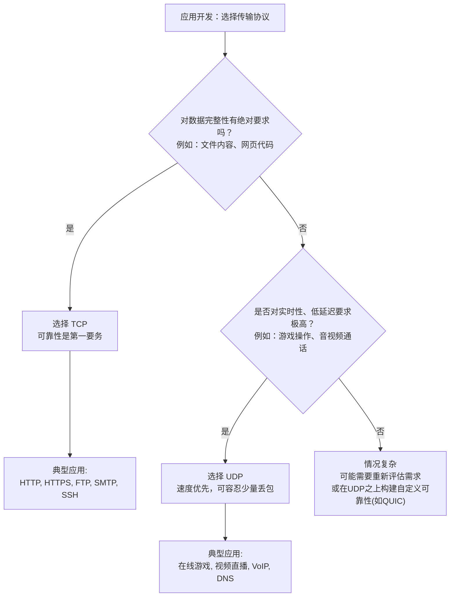

好的，作为一位资深的技术教育作者，我将基于您提供的父级知识点，为你撰写这篇关于 TCP 与 UDP 核心差异的教学内容。

---

### 4.2.3 核心对决：一张图看懂TCP与UDP的差异

在分别认识了追求效率的“快递员”UDP和严谨可靠的“管家”TCP之后，我们是时候将它们并排放在一起，进行一场全面的“核心对决”了。这不仅能巩固我们对两种协议的理解，更重要的是，它将直接指导我们在未来的应用开发中，如何根据场景需求，从工具箱中挑选出最合适的那个工具。

#### 全方位对比：从机制到场景

虽然前面的章节已经通过比喻和案例让我们对两者有了初步的印象，但一张清晰、详尽的对比表能让我们更系统地把握它们的本质区别。

| 对比维度 | TCP (严谨的“管家”) | UDP (高速的“快递员”) | 关键影响与权衡 |
| :--- | :--- | :--- |:--- |
| **核心隐喻** | 打电话 | 寄平信 | 一个需要先接通确认，一个直接投递。 |
| **连接性** | **面向连接** (Connection-Oriented) | **无连接** (Connectionless) | TCP在传输前有“三次握手”建立连接，结束后有“四次挥手”断开，增加了延迟和开销，但保证了双方的就绪状态。UDP则“即插即用”，随时可发。 |
| **可靠性** | **可靠** | **不可靠** (尽力而为) | TCP通过确认(ACK)、序列号、超时重传机制，确保数据不丢、不重。UDP不保证送达，数据包可能在网络中丢失。 |
| **顺序保证** | **保证有序** | **不保证有序** | TCP利用序列号对数据包进行排序，接收方能按正确顺序重组。UDP的数据包各自独立，先到先处理，可能出现乱序。 |
| **流量控制** | **有** (滑动窗口机制) | **无** | TCP能根据接收方的处理能力调整发送速度，防止淹没对方。UDP会按照应用层的速度持续发送，可能导致接收方来不及处理而丢包。 |
| **拥塞控制** | **有** | **无** | TCP能感知网络拥堵状况，主动降低发送速率，避免加剧网络瘫痪。UDP则不关心网络状况，可能成为网络拥堵的“野蛮”制造者。 |
| **传输速率** | **较慢** | **较快** | TCP的各种确认、重传、控制机制都需要时间与资源，因此速度较慢。UDP没有这些包袱，传输效率高。 |
| **头部开销** | **大** (20字节起，可变) | **小** (固定8字节) | TCP头部需要携带序列号、确认号、窗口大小等复杂信息。UDP头部只包含最基本的端口和长度信息，开销极小。 |
| **适用场景** | 对数据完整性、顺序性要求极高的场景 | 对实时性要求高，能容忍少量丢包的场景 | **选择TCP**：网页浏览(HTTP/HTTPS)、文件传输(FTP)、电子邮件(SMTP)、数据库连接。 **选择UDP**：视频直播、在线游戏、语音通话(VoIP)、DNS查询。 |

#### 选型指南：一张决策图帮你选

面对纷繁复杂的应用需求，我们如何快速做出决策？下面这张流程图可以作为你的“速查手册”：

这张决策图的核心思想是：

1.  **可靠性是首要分水岭**：如果你的应用无法容忍任何数据丢失或错乱（比如，一个银行转账指令、一段程序代码），那么无需犹豫，TCP是唯一的选择。
2.  **速度是次要考量点**：当你可以接受一定程度的数据不完美时，才轮到对速度和效率的考量。对于实时互动性强的应用，UDP的低延迟优势就体现出来了。例如，在视频通话中，丢失一两帧画面（表现为瞬间卡顿或花屏）通常比为了等待重传而导致整个画面长时间冻结要好得多。

#### 总结

TCP与UDP的核心对决，本质上是**可靠性与效率**之间的权衡。

-   **TCP**：选择TCP，意味着你将数据传输的复杂性和可靠性保障工作完全交给了这位经验丰富的“管家”。你付出的是更高的连接延迟和资源开销，换来的是省心、可靠的数据送达服务。它适用于那些“内容正确”远比“快速到达”更重要的场合。

-   **UDP**：选择UDP，则意味着你追求极致的轻量和高效。你将获得最低的延迟和最小的系统开销，但代价是你（或者你的应用程序）需要自己处理可能出现的丢包、乱序等问题。它适用于那些“快速反应”比“信息完整”更重要的场合。

理解了这场对决的精髓，你就掌握了在传输层选择正确工具的核心能力，为构建健壮、高效的网络应用打下了坚实的基础。