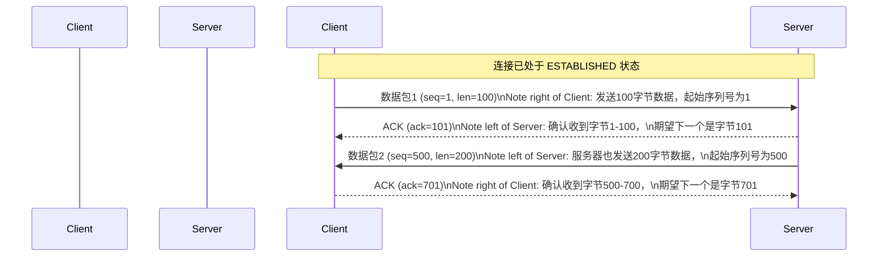

好的，我们紧接 “4.3.1 第一步 (建连)：三次握手建立信任” 这一主题，开始我们的内容。

---

三次握手为数据传输铺就了一条看似平坦的“高速公路”。但网络世界充满了不确定性，数据包可能会在途中丢失、损坏、或者因为网络拥堵而延迟到达。TCP 是如何在这条路上安全“驾驶”每一批货物（数据），确保它们按顺序、完整地抵达终点呢？

答案就藏在三次握手时双方交换的初始序列号（ISN）以及后续的确认与重传机制中。

### 4.3.2 第二步 (传输)：确认与重传机制的运作

连接一旦建立，数据传输就正式开始。这个过程就像一场精确的舞蹈，每一步都伴随着序列号（Sequence Number, SEQ）和确认号（Acknowledgement Number, ACK）的交换。

#### 数据“快递”的追踪系统：序列号 (SEQ) 与确认号 (ACK)

我们可以将 TCP 传输的数据看作是一批待发的快递包裹。为了确保万无一失，我们需要一个强大的追踪系统。

*   **序列号 (SEQ)**：相当于每个数据字节的唯一“快递单号”。如果一个 TCP 报文段包含 1000 字节的数据，并且其序列号字段的值是 `x`，那么这个报文段携带的就是字节流中第 `x` 到 `x+999` 号的字节。
*   **确认号 (ACK)**：这是接收方用来告知发送方“我收到货了”的回执。它的含义非常精确：“**我已成功接收到所有序列号在 `ack-1` 之前（包含 `ack-1`）的字节，现在我期望接收的是序列号为 `ack` 的字节。**”

这种确认方式被称为**累计确认 (Cumulative Acknowledgment)**。它非常高效，接收方不必为收到的每一个报文段都发送一个单独的确认。例如，即使发送方连续发送了 3 个报文段，接收方也可能只回复一个最终的 ACK，这个 ACK 就能确认这 3 个报文段都已成功接收。

让我们通过一个理想情况下的数据传输图来理解这个过程：



在这个理想的世界里，数据有来有往，确认及时准确，一切都井然有序。

#### 意外处理机制：超时重传 (Timeout Retransmission)

现实的网络环境远非如此完美。如果客户端发送的数据包在路上“丢”了怎么办？服务器将永远等不到它期望的数据，而客户端也永远等不到服务器的确认。这时，TCP 的核心可靠性保障机制——**超时重传**——就该登场了。

工作流程如下：

1.  **启动计时器**：发送方每发送一个包含数据的 TCP 报文段，就会为它启动一个**重传计时器 (Retransmission Timer)**。
2.  **等待确认**：发送方在计时器设定的时间内等待接收方对该报文段的确认。
3.  **超时处理**：
    *   如果在计时器到期**之前**收到了确认，那么一切顺利，该计时器被撤销。
    *   如果计时器到期**之后**仍未收到确认，发送方就会**假定**之前发送的报文段已经丢失或严重延迟。此时，它会**重新发送**完全相同的报文段，并重置计时器。

这个过程就像是你寄出了一封非常重要的信件，并告诉自己：“如果 3 天内没收到回信，我就再寄一封一模一样的。”

让我们看看数据包丢失时的场景：

```mermaid
sequenceDiagram
    participant 客户端 as Client
    participant 服务器 as Server

    Client->>Server: 数据包 (seq=1, len=100)\nNote right of Client: 发送数据，并启动重传计时器
    
    Note over Client, Server: X
糟糕，数据包在网络中丢失了！
    
    Note right of Client: 等待...等待...
重传计时器超时！
    
    Client->>Server: (重传) 数据包 (seq=1, len=100)\nNote right of Client: 重新发送相同的数据包
    
    Server-->>Client: ACK (ack=101)\nNote left of Server: 成功收到数据，发送确认
    
    Note right of Client: 收到确认，取消计时器
```

> **思考：如果丢失的是 ACK 报文呢？**
>
> 这是一个很有趣的情况。假设客户端的数据包（`seq=1`）成功到达了服务器，服务器也正确地回复了确认（`ack=101`），但这个 ACK 在返回途中丢失了。
>
> 1.  对客户端而言，情况和数据包丢失完全一样：它的重传计时器会超时。
> 2.  客户端会重传 `seq=1` 的数据包。
> 3.  服务器收到了一个重复的数据包。此时，服务器会检查其序列号 `1`。由于它期望的是 `101`，它便知道这是一个重复的数据包。
> 4.  服务器的处理方式是：**丢弃这个重复的数据包，并重新发送一次上一个 ACK（`ack=101`）**。
>
> 这个精巧的设计确保了即使确认信息丢失，数据传输最终也能恢复同步，并且接收方不会因为重复数据而出错。序列号在这里起到了关键的“幂等性”作用。

### 本节小结

TCP 在传输阶段的可靠性，主要建立在一套简单而强大的“确认+重传”机制之上：

*   **有序与完整**：通过**序列号 (SEQ)** 和**累计确认 (ACK)**，TCP 能够追踪每一个字节，确保数据流的有序和无缺失。ACK 不仅确认了数据的收到，更指明了下一个期望的数据起点。
*   **应对丢失**：**超时重传机制**是 TCP 的“安全网”。当数据或确认在网络中丢失时，发送方能够通过计时器超时来发现问题，并主动重发数据，从而保证了通信的最终成功。
*   **处理重复**：序列号使得接收方能够轻松识别并丢弃因重传而产生的重复数据包，保证了数据流的正确性。

这套确认与重传机制构成了 TCP 可靠性的基石。然而，仅仅保证数据能到还不够，如果发送方发送得太快，超出了接收方的处理能力，或者网络发生拥堵，又该如何是好？这便是我们接下来要探讨的流量控制与拥塞控制问题。