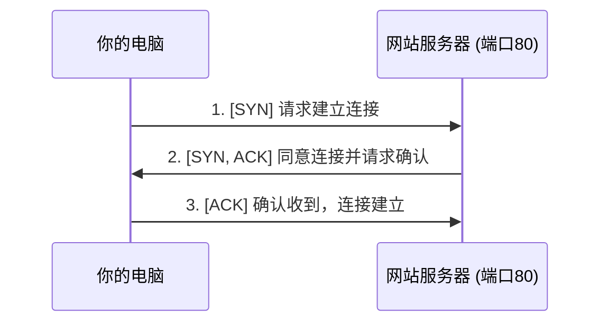

好的，作为一名资深的技术教育作者，我将为你撰写这篇关于使用 `Wireshark` 捕获 TCP 三次握手过程的教学段落。

---

### 4.4.2 工具二：用 `Wireshark` 亲手抓一个“三次握手”包

如果说上一节的 `netstat` 工具让我们看到了连接建立后的“静态快照”，那么 `Wireshark` 则是一台功能强大的“网络摄像机”，它能录下数据包在网络中交互的每一个“动态瞬间”。理论学习了千遍，不如亲手实践一遍。现在，就让我们启动这台摄像机，去捕捉一次完整的 TCP“三次握手”过程。

#### Wireshark：网络世界的“显微镜”

Wireshark 是全球最流行、也最强大的网络协议分析器。它允许你实时捕获流经网卡的数据包，并以极其详尽的方式展示每个数据包的内部结构。从宏观的 HTTP 请求到微观的 TCP 标志位，都无所遁形。

开始前，请确保你已从 [Wireshark 官网](https://www.wireshark.org/) 下载并安装了它。安装过程通常会一并安装必要的抓包驱动程序（如 Npcap）。

#### 案例实战：捕获一次 Web 请求的三次握手

我们的目标是捕获当你的浏览器访问一个网站时，你的计算机（客户端）与网站服务器之间建立 TCP 连接的过程。

**第一步：准备环境并启动抓包**

1.  **关闭无关应用**：为了减少网络流量的干扰，建议暂时关闭其他正在大量使用网络的应用程序（如在线音乐、下载工具等）。
2.  **打开 Wireshark**：启动 Wireshark，你会看到一个接口列表。
3.  **选择网络接口**：从列表中选择你当前正在用于上网的那个网络接口。如果你使用无线网络，它可能是“WLAN”或“Wi-Fi”；如果使用有线网络，则可能是“以太网”或“Ethernet”。双击该接口，Wireshark 将立即开始抓包。


 (*示意图，实际界面可能因版本和操作系统而异*)

**第二步：设置过滤器并生成流量**

刚开始抓包，你可能会被屏幕上飞速滚动的海量数据包所淹没。别担心，过滤器是我们的救星。

1.  **应用显示过滤器**：为了只观察与 Web 访问相关的 TCP 连接，我们在顶部的“应用显示过滤器”栏中输入以下内容，然后按回车：
    ```
    tcp.port == 80
    ```
    这个过滤器的意思是：“只显示源端口或目的端口是 80 的 TCP 报文”。因为 HTTP 协议默认使用 80 端口，这能极大地帮我们聚焦目标。

2.  **生成目标流量**：现在，打开你的浏览器，访问一个**未使用 HTTPS 加密**的简单网站，例如 `http://info.cern.ch` (世界上第一个网站)。为什么选择 HTTP 而非 HTTPS？因为 HTTPS 的流量被 TLS/SSL 加密了，我们无法直接看到其内部承载的 TCP 细节。访问后，你就可以回到 Wireshark。

3.  **停止抓包**：当网页加载完成后，点击 Wireshark 工具栏上的红色方块按钮停止抓包，以便我们从容分析。

**第三步：分析报文，解密“三次握手”**

现在，Wireshark 的主窗口应该已经为你筛选出了几条符合条件的记录。在这些记录中，你一定能找到符合以下特征的三条连续报文，它们就是我们梦寐以求的“三次握手”！



让我们将理论与 Wireshark 捕获到的真实数据包进行逐一对应：

| 报文 | 方向 | TCP 标志位 (Flags) | 序列号 (Seq) | 确认号 (Ack) | Wireshark Info 栏简述 |
| :--- | :--- | :--- | :--- | :--- | :--- |
| **1** | 客户端 → 服务器 | `SYN` | 一个随机初始值，设为 `x` | 0 | `[SYN] Seq=x Ack=0` |
| **2** | 服务器 → 客户端 | `SYN, ACK` | 一个随机初始值，设为 `y` | `x + 1` | `[SYN, ACK] Seq=y Ack=x+1` |
| **3** | 客户端 → 服务器 | `ACK` | `x + 1` | `y + 1` | `[ACK] Seq=x+1 Ack=y+1` |

**报文解读：**

1.  **第一次握手 (SYN)**：
    - 你会看到第一条报文从你的电脑 IP 发往服务器 IP。
    - 在 Wireshark 的“Packet Details”窗格中展开 TCP 层，你会发现 `Flags` 字段中，`SYN` 位被设置为 `1`。
    - 它的序列号 `Seq` 是一个由你的操作系统生成的随机初始值（我们记为 `x`）。
    - 因为这是发起方第一条消息，还没有需要确认的报文，所以确认号 `Ack` 为 0。

2.  **第二次握手 (SYN, ACK)**：
    - 服务器收到了你的请求，发回第二条报文。
    - 它的 `Flags` 字段中，`SYN` 和 `ACK` 位都被设置为 `1`，表示“我同意你的连接请求（ACK），同时我也发起我这一方的连接（SYN）”。
    - 它的序列号 `Seq` 是服务器端生成的随机初始值（我们记为 `y`）。
    - 它的确认号 `Ack` 等于客户端的初始序列号加一（`x + 1`），这正是对客户端 SYN 报文的确认。

3.  **第三次握手 (ACK)**：
    - 你的电脑收到服务器的响应后，发送第三条报文。
    - 它的 `Flags` 字段中，只有 `ACK` 位被设置为 `1`。
    - 它的序列号 `Seq` 是在第一次握手的基础上加一（`x + 1`）。
    - 它的确认号 `Ack` 等于服务器的初始序列号加一（`y + 1`），这是对服务器 SYN 报文的确认。

当这第三个数据包被服务器接收后，一个稳定、双向的 TCP 连接就正式宣告建立。紧接着，你就会看到承载着 HTTP 请求数据的报文（例如 `GET / HTTP/1.1`）开始在这条“隧道”中传输。

---

#### **要点回顾**

通过本次实践，我们不仅学习了 Wireshark 的基本操作，更重要的是将抽象的理论知识与真实的网络数据流联系了起来：

- **抓包三部曲**：选择接口启动抓包、设置过滤器、生成并捕获流量。
- **过滤器是关键**：使用 `tcp.port == 80` 这样的显示过滤器，能帮助我们从海量数据中快速定位到关心的报文。
- **眼见为实**：我们亲眼见证了 TCP 标志位 `SYN` 和 `ACK` 在三次握手过程中的精确变化，以及序列号（Seq）与确认号（Ack）之间 `+1` 的联动关系。

理论的价值在于指导实践，而实践的魅力在于验证和深化理论。现在，你已经掌握了网络分析的核心技能之一。在后续的探索中，你还可以用同样的方法去观察 TCP 的数据传输过程，甚至是“四次挥手”的连接断开过程。