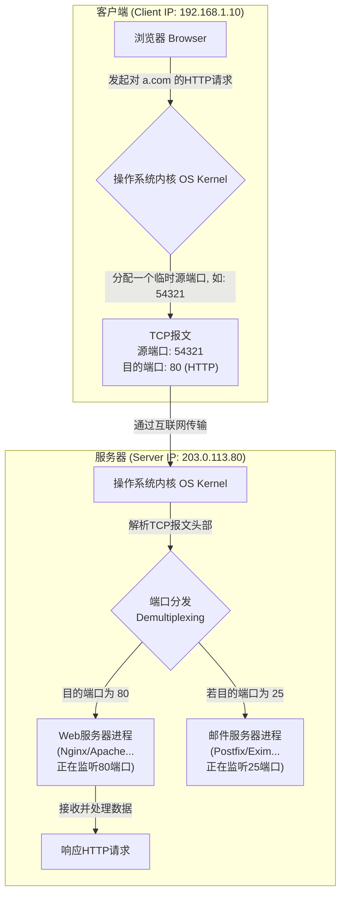

好的，作为一位资深的技术教育作者，我将紧接上下文，为您续写“5.1.1 承接第四章：应用程序如何找到彼此”的后续内容。

---

### 5.1.1 承接第四章：应用程序如何找到彼此

在第四章，我们已经为数据找到了通往正确主机的道路（IP地址），也为它找到了进入主机后该敲哪扇门的方法（端口号）。现在，让我们将这两个概念完美地结合起来，构成网络通信中独一无二的“地址牌”——**套接字地址（Socket Address）**。

一个完整的套接字地址由 `(IP 地址, 端口号)` 这样一个二元组构成。它在全球互联网中，能够唯一地标识出一个特定主机上的一个特定应用程序进程。这就像邮寄一封国际信件：

*   **IP 地址**：如同信封上的国家、城市和街道地址，它确保信件能被送到正确的大楼。
*   **端口号**：则像是信封上收件人所在的公司名称或公寓房间号，它确保大楼的门卫能将信件准确无误地交到最终收件人手中。

缺少任何一个，通信都将迷失方向。

#### 数据分发的流程：从内核到应用

当一个数据包（封装了TCP或UDP报文）历经千山万水抵达目标主机的网卡时，操作系统内核的网络协议栈会接管它。内核会解析IP头部，确认是发给本机的。接着，它会进一步拆开IP数据包，看到内部的TCP/UDP报文头部，并从中读取到**目的端口号**。

这个端口号就是关键的“分拣指令”。操作系统内部维护着一张端口号与应用程序进程的映射表。它会根据这个目的端口号，将数据精准地递送给正在监听该端口的应用程序。这个过程我们称之为**多路分用（Demultiplexing）**。

下面的流程图清晰地展示了这一过程：

从图中可以看到，正是因为有了端口号，服务器才能在同时运行网页服务、邮件服务等多个网络应用的情况下，将收到的数据准确地交给对应的“负责人”。

#### IP 地址 vs. 端口号：职责对比

为了进一步巩固理解，我们可以通过一个表格来清晰地对比IP地址与端口号的角色分工。

| 特性 | IP 地址 (IP Address) | 端口号 (Port Number) |
| :--- | :--- | :--- |
| **所属层级** | 网络层 (Network Layer) | 传输层 (Transport Layer) |
| **核心作用** | 在广域网或局域网中**标识一台主机** | 在一台主机内**标识一个应用程序进程** |
| **唯一性** | 在其所属网络范围内是唯一的（公网IP全球唯一） | 在一台主机内部是唯一的 |
| **通信角色** | 解决了数据应该发往**哪台计算机**的问题 | 解决了数据交给计算机后，应该由**哪个程序**来处理的问题 |
| **现实比喻** | 一栋大楼的街道地址 | 大楼里的具体房间号或公司名 |

---

#### 本节小结

- **网络通信的完整地址**：由 **IP地址** 和 **端口号** 共同组成的 **套接字地址**，是定位一个网络应用的唯一标识。
- **协同工作**：IP地址负责主机间的寻址（“到哪台电脑”），端口号负责主机内的进程寻址（“到哪个程序”）。
- **操作系统是交通枢纽**：操作系统内核利用端口号，实现了将传入数据准确分发给相应应用程序的**多路分用**机制。

理解了应用程序之间如何通过这对“黄金搭档”找到彼此，我们就为深入探索丰富多彩的应用层协议铺平了道路。接下来，我们将正式拉开应用层的大幕，看看那些我们每天都在使用的服务（如网页浏览、电子邮件）是如何构建在这一切之上的。