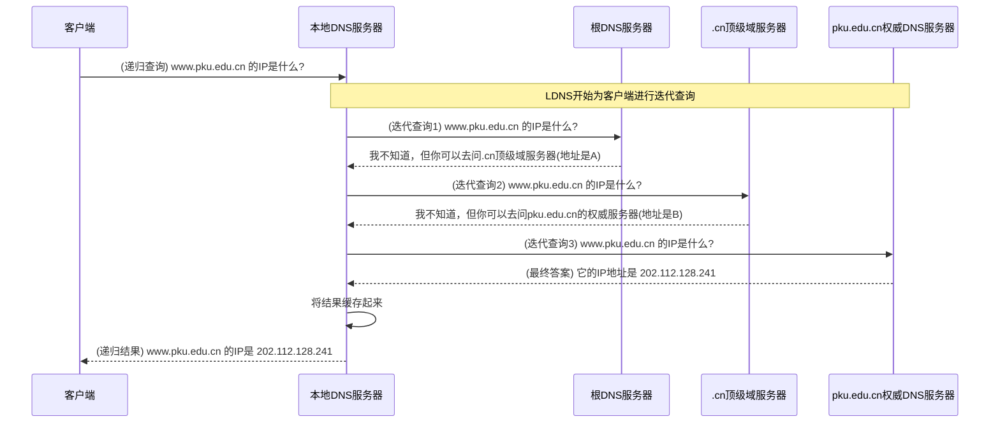

好的，作为一位资深的技术教育作者，我将紧接上一节的结尾，自然地过渡并续写 **5.2.2 DNS查询之旅：一次完整的域名解析过程** 的内容。

---

### 5.2.2 DNS查询之旅：一次完整的域名解析过程

在上一节的末尾，我们留下了一个关键问题：计算机作为“数字世界”的原住民，是如何将我们人类输入的、友好的域名（如 `www.pku.edu.cn`）翻译成它所能理解的IP地址（如 `202.112.128.241`）的呢？

这个翻译过程，我们称之为**域名解析（Domain Name Resolution）**。它并非一步到位，而是一场精心设计的、层层递进的查询之旅。现在，就让我们扮演一次侦探，跟随一个域名请求，从它在浏览器中被输入的那一刻起，完整地走一遍这趟旅程。

假设我们的目标是访问 `www.pku.edu.cn`。

#### 第一站：就近查找，检查本地“速记本”

在向广阔的互联网发出请求之前，计算机会遵循“能懒则懒”的最高效原则，首先检查自己手头有没有现成的答案。这个过程就像你要找一个不常用的联系人，会先翻翻自己的手机通讯录，而不是立刻去查庞大的公共黄页。

1.  **浏览器缓存 (Browser Cache)**：
    浏览器是这场旅程的起点，它会维护一个自己的小型、临时的DNS记录缓存。当你输入网址并按下回车时，浏览器会做的第一件事就是：“我最近访问过这个网站吗？” 如果在不久前（例如，几分钟或几小时内，具体时间由DNS记录的TTL值决定）你已经访问过 `www.pku.edu.cn`，那么它的IP地址很可能还存放在浏览器缓存里。如果找到，浏览器会直接使用这个IP地址发起连接，解析过程到此结束。这是最快的方式。

2.  **操作系统缓存与`hosts`文件 (OS Cache & hosts File)**：
    如果浏览器缓存中没有找到，请求会向下传递给操作系统。操作系统同样拥有自己的DNS缓存。但在此之前，它还会检查一个特殊的本地文件——`hosts`文件。

    `hosts`文件是一个存在于本地计算机中的纯文本文件，它允许用户手动建立域名与IP地址的映射关系。这个文件的优先级非常高。操作系统会先查看`hosts`文件中是否有关于 `www.pku.edu.cn` 的条目。
    *   在Windows系统中，它通常位于 `C:\Windows\System32\drivers\etc\hosts`。
    *   在macOS或Linux系统中，它通常位于 `/etc/hosts`。

    如果`hosts`文件中存在类似 `202.112.128.241 www.pku.edu.cn` 这样的配置，操作系统就会立即采用这个IP地址，解析过程同样提前结束。如果`hosts`文件没有，操作系统则会查询自己的DNS缓存。若缓存命中，则返回结果。

#### 第二站：求助于本地DNS服务器，开启递归查询

如果本地的所有“速记本”都查无此记录，那么我们的计算机就必须向外界求助了。这个首选的求助对象，就是**本地DNS服务器 (Local DNS Server, LDNS)**。

这个服务器通常由你的网络服务提供商（ISP，如中国电信、中国联通）自动分配，或者你也可以手动设置为公共DNS服务器（如Google的 `8.8.8.8` 或 `114DNS` 的 `114.114.114.114`）。

从你的计算机向本地DNS服务器发出的这个查询，是一个**递归查询 (Recursive Query)**。它的含义是：“嘿，LDNS，请帮我找到 `www.pku.edu.cn` 的IP地址。你尽管去问，我只在这里等你的最终答案。”

本地DNS服务器接到这个请求后，它自己也会先检查自己的缓存。如果缓存中有记录，就直接返回给你的计算机。但如果它也不知道，那么真正的“大戏”——**迭代查询 (Iterative Query)** 就将由它代为上演。

#### 第三站：层层问询，追根溯源的迭代之旅

本地DNS服务器将从“互联网的通讯录顶层”开始，一步步向下询问，直到找到最终答案。这个过程就像找一位住在“中国-北京市-海淀区-颐和园路5号”的人，你会先问国家（中国在哪），再问城市（北京在哪），然后是区，最后是具体街道。

整个迭代查询的流程可以用下面的图来清晰地展示：

让我们来分解这个过程中的每一步：

1.  **询问根DNS服务器 (Root DNS Server)**：
    本地DNS服务器首先会向全球13组根DNS服务器中的一个发出请求：“请问，我该去哪里找关于 `.cn` 域名的信息？” 根服务器本身不负责解析具体的域名，但它掌管着所有顶级域（如 `.com`, `.org`, `.cn`）的“通讯录”。它会回答：“我不知道 `www.pku.edu.cn` 的具体地址，但我知道负责 `.cn` 顶级域的服务器在哪里，它们的地址是……”。

2.  **询问顶级域DNS服务器 (Top-Level Domain, TLD DNS Server)**：
    本地DNS服务器拿着从根服务器那里得到的地址，转而向 `.cn` 的顶级域服务器发出请求：“请问，我该去哪里找关于 `pku.edu.cn` 域名的信息？” `.cn` 服务器同样不存储最终的IP地址，但它知道所有在它之下注册的二级域名（如 `pku.edu.cn`, `tsinghua.edu.cn`）由谁来管理。它会回答：“我不知道 `www.pku.edu.cn` 的具体地址，但我知道负责管理 `pku.edu.cn` 这个域的权威DNS服务器地址是……”。

3.  **询问权威DNS服务器 (Authoritative DNS Server)**：
    这是查询的最后一站。本地DNS服务器找到了负责 `pku.edu.cn` 这个“管辖区”的权威DNS服务器（通常由北京大学自己的IT部门或其委托的服务商管理）。它发出最终的请求：“请问，`www.pku.edu.cn` 的IP地址是什么？”
    权威DNS服务器拥有该域名下所有记录的最终解释权。它会查询自己的记录，找到 `www` 这台主机对应的A记录，然后给出最终答案：“`www.pku.edu.cn` 的IP地址是 `202.112.128.241`。”

#### 旅程终点：获得IP并建立连接

本地DNS服务器在获得这个确切的IP地址后，会做两件事：
1.  **将这个映射关系（`www.pku.edu.cn` -> `202.112.128.241`）存储在自己的缓存中**，以便下次再有其他用户查询同一个域名时，可以直接给出答案，无需再重复一遍漫长的迭代查询过程。
2.  **将这个IP地址返回给你的计算机操作系统**。

操作系统接收到IP地址后，也会将其缓存，并最终把它交给发起请求的浏览器。至此，DNS查询之旅圆满结束。浏览器拿到了通行证（IP地址），就可以向 `202.112.128.241` 这台服务器发起HTTP请求，开始真正地获取网页内容了。

> ##### <ins>概念辨析：递归查询 vs. 迭代查询</ins>
>
> *   **递归查询 (Recursive Query)**：一种“大包大揽”式的查询。客户端只问一次，DNS服务器必须返回最终结果（成功或失败），中间的过程对客户端透明。典型发生在 **客户端 ↔ 本地DNS服务器** 之间。
> *   **迭代查询 (Iterative Query)**：一种“指路”式的查询。DNS服务器如果不知道答案，会返回一个它认为可能知道答案的下一级服务器的地址，让请求者自己去问。典型发生在 **本地DNS服务器 ↔ 各级域名服务器（根、顶级域、权威）** 之间。

***

#### 本节小结

一次完整的DNS域名解析，是一场从“本地”到“云端”，结合了缓存、递归与迭代查询的高效协作过程。我们可以用以下清单来回顾整个流程：

> #### DNS解析全流程清单 (Checklist)
>
> - [ ] **1. 浏览器缓存**：检查浏览器自身是否缓存了该域名的IP。
> - [ ] **2. 操作系统`hosts`文件**：检查本地`hosts`文件是否有手动指定的映射。
> - [ ] **3. 操作系统DNS缓存**：检查操作系统是否缓存了该域名的IP。
> - [ ] **4. 本地DNS服务器 (LDNS)**：发起递归查询请求。
>   - [ ] **4.1 LDNS缓存**：LDNS检查自身缓存。
>   - [ ] **4.2 迭代查询开始**：
>     - [ ] a. LDNS 询问 **根DNS服务器**，获得顶级域服务器地址。
>     - [ ] b. LDNS 询问 **顶级域DNS服务器**，获得权威DNS服务器地址。
>     - [ ] c. LDNS 询问 **权威DNS服务器**，获得最终的IP地址。
> - [ ] **5. 返回结果**：LDNS将IP地址返回给客户端，并缓存该记录。
> - [ ] **6. 建立连接**：浏览器使用获取到的IP地址与目标服务器通信。

这个设计精巧的分布式、层次化系统，正是支撑整个互联网高效运转的关键基础设施之一。它确保了无论我们在世界的哪个角落，输入一个简单的域名，都能准确、快速地找到我们想要访问的目标。