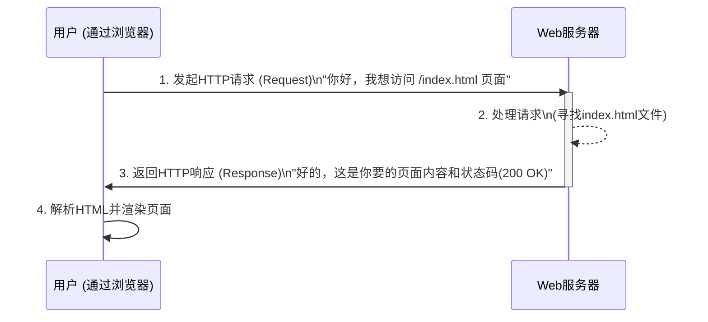

好的，作为一名资深的技术教育作者，我将为你撰写这篇关于HTTP核心模型的教学段落。

---

### 5.3.1 核心模型：客户端与服务器的“对话”

在我们了解了HTTP是Web世界的通用语言后，接下来让我们深入探究这门语言的语法规则——它的核心通信模型。理解了这个模型，你就能明白每次点击链接或刷新页面时，背后究竟发生了什么。

HTTP的世界由两个基本角色构成：**客户端 (Client)** 和 **服务器 (Server)**。你可以将它们之间的互动想象成一场目标明确、规则清晰的对话。

- **客户端 (Client)**：通常是我们日常使用的网页浏览器（如 Chrome, Firefox, Safari），也可以是手机App或任何需要从网络获取数据的程序。在对话中，客户端是**主动方**，它负责**发起请求**，就像一个顾客走进商店，明确地告诉店员他想要什么。

- **服务器 (Server)**：也称为Web服务器（如 Apache, Nginx），是存放着网站资源（HTML文件、图片、视频等）的计算机。在对话中，服务器是**被动方**，它始终在**监听和等待**请求。一旦收到请求，它就会处理并给出**响应**，就像店员根据顾客的需求，从货架上取下商品并递给他。

#### 一、请求-响应模型 (Request-Response Model)

这场“对话”遵循着一个严格的、不可逆转的流程，这就是**请求-响应模型**。

1.  **请求 (Request)**：对话永远由客户端发起。客户端会精心构造一个“HTTP请求报文”，这个报文中包含了它想要执行的操作（比如 `GET` 获取数据）、所需资源的路径（比如 `/products/iphone.html`）以及其他附加信息。
2.  **响应 (Response)**：服务器在接收并解析请求后，会执行相应的逻辑（例如从数据库查询数据、从文件系统读取文件），然后构造一个“HTTP响应报文”发回给客户端。这个报文中包含了请求是否成功的状态（如 `200 OK` 表示成功，`404 Not Found` 表示未找到），以及客户端请求的资源内容本身。

客户端在发送一个请求后，必须等待服务器的响应，然后才能发起下一个请求。服务器也绝不会主动向客户端推送信息，它只会“回答”问题。

我们可以用一个时序图来清晰地展示这个过程：

#### 二、一个重要的特性：无状态 (Stateless)

HTTP协议还有一个至关重要的特性——**无状态 (Stateless)**。

“无状态”意味着服务器**不会保留任何关于客户端过去请求的信息**。每一次HTTP请求对于服务器来说，都是一个全新的、独立的事件。它就像一个记忆力只有七秒的店员，每次你和他说话，他都不知道你之前是否来过、买过什么。

- **优点**：无状态的设计极大地简化了服务器的实现。服务器不需要维护复杂的会话历史，这使得它可以轻松地处理来自海量不同客户端的请求，从而具备了极强的可伸缩性（Scalability）。

- **挑战**：但这也带来了问题。在很多场景下，我们恰恰需要“记住”用户的状态，比如用户是否已经登录、购物车里有什么商品。为了解决这个问题，Web世界引入了Cookie、Session等技术，但这属于在HTTP这个无状态协议之上的“变通”方案，我们将在后续章节中探讨。

#### 本节小结

通过本节的学习，我们明确了HTTP的核心工作模式，可以总结为以下几点：

- **角色分明**：HTTP通信建立在**客户端-服务器 (Client-Server)** 模型之上，客户端是请求方，服务器是响应方。
- **流程固定**：通信严格遵循**请求-响应 (Request-Response)** 模式，客户端主动，服务器被动。
- **天生“健忘”**：HTTP协议本身是**无状态 (Stateless)** 的，每个请求之间相互独立，服务器不保存历史状态。

这个简洁而强大的模型，正是支撑起整个万维网信息交互的基石。