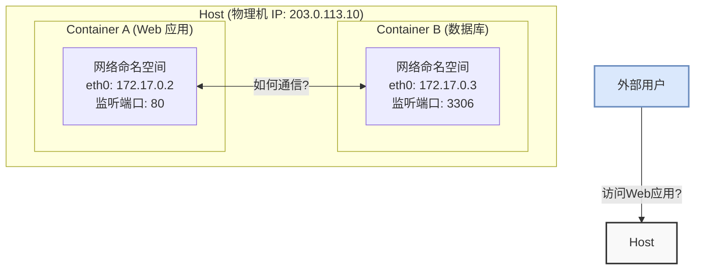

好的，作为一位资深的技术教育作者，我将为你撰写这篇关于“为何容器需要独立的网络模型”的教学段落。

---

### 6.2.1 核心问题：为何容器需要独立的网络模型

在了解了容器作为一种轻量级虚拟化技术的基本概念后，我们自然会深入到它最核心、也是最精妙的设计之一：网络。为了真正理解容器网络模型的必要性，我们不妨先回到一个没有容器的世界，看看当时我们是如何在单一主机上运行多个应用的。

#### 从端口冲突到网络隔离

想象一下，你有一台物理服务器，想在上面同时部署两个Web应用。如果这两个应用都默认监听80端口，你会在启动第二个应用时立刻遇到“端口已被占用”（Port is already in use）的错误。这是因为在传统模型中，所有进程共享主机的同一个**网络栈（Network Stack）**。它们共享同一个IP地址，共用一套从1到65535的端口号。这就像一栋只有一个总机号码的大楼，每个房间（应用）想要接听外线电话，都必须向总机申请一个唯一的分机号（端口）。

容器技术的核心价值主张便是**隔离 (Isolation)**。它通过Linux的命名空间（Namespace）和控制组（Cgroups）等技术，为每个应用创建了一个独立的、受资源限制的运行环境——一个“沙盒”。这种隔离是全方位的，包括文件系统、进程ID，以及至关重要的——**网络命名空间（Network Namespace）**。

当一个容器启动时，它会获得自己的一套完整的、独立的网络协议栈。在这个独立的“网络世界”里：
- 它拥有自己的网络接口（例如 `eth0`）。
- 它拥有自己的IP地址（通常是一个内部私有IP）。
- 它拥有自己完整的端口空间（1-65535）。

这意味着，你可以在同一台主机上启动十个都监听80端口的Nginx容器，而它们之间不会产生任何端口冲突。因为从每个容器*内部*看，它都独占了那个网络环境。

#### 隔离带来的新挑战

这种彻底的隔离带来了部署灵活性和环境一致性的巨大好处，但也立即引出了一个棘手的新问题：**一个被完美隔离的“盒子”，如何与外界以及其他“盒子”沟通？**

这正是容器网络模型需要解决的核心矛盾：**在维持容器间网络隔离性的同时，实现它们之间以及与外部世界的可控通信。**

我们可以通过一个简单的场景来可视化这些挑战：

上图清晰地揭示了容器环境下的几个基本网络通信问题：

1.  **容器间通信 (Container-to-Container Communication):** Web应用（容器A）需要连接数据库（容器B）。但它们位于两个隔离的网络命名空间中，拥有不同的私有IP地址（`172.17.0.2` 和 `172.17.0.3`），它们之间默认是无法直接通信的。如何为它们架设一座桥梁？

2.  **容器与外部世界通信 (Container-to-External Communication):** 外部用户希望通过主机的公网IP（`203.0.113.10`）访问Web应用。但是，Web应用实际上监听的是容器A内部的80端口。如何将外部对主机IP和某个端口的请求，精确地转发到特定容器的特定端口上？这个过程需要一层类似网络地址转换（NAT）和端口映射（Port Mapping）的机制。

3.  **容器访问外部世界 (External-to-Container Communication):** 如果容器A中的应用需要调用一个外部的API服务，它又该如何访问互联网？数据包如何从容器的私有网络“走出去”？

为了系统性地解决上述所有问题，一个独立于主机的、专为容器设计的**网络模型**就变得不可或缺。这个模型就像一个虚拟的“网络管理员”，负责在主机内核层面创建虚拟网络设备、配置路由规则、管理IP地址分配，并最终为所有容器编织出一张能够按需通信的虚拟网络。

#### 本节小结

- **核心动机**：传统应用部署模式存在**端口冲突**问题，因为所有进程共享主机的网络栈。
- **容器的方案**：通过**网络命名空间**为每个容器提供独立的网络环境，实现了网络层面的彻底隔离，从根本上解决了端口冲突。
- **新的挑战**：隔离是一把双刃剑，它同时切断了容器之间以及容器与外部世界的默认通信路径。
- **根本原因**：正是为了在**维持隔离**和**实现通信**这对矛盾之间找到平衡，我们才需要一套专门为容器设计的、独立于传统主机网络的模型。

接下来的内容，我们将深入探讨Docker等容器平台是如何通过不同的网络驱动（如Bridge、Host、Overlay等）来实现这一精巧的通信艺术的。