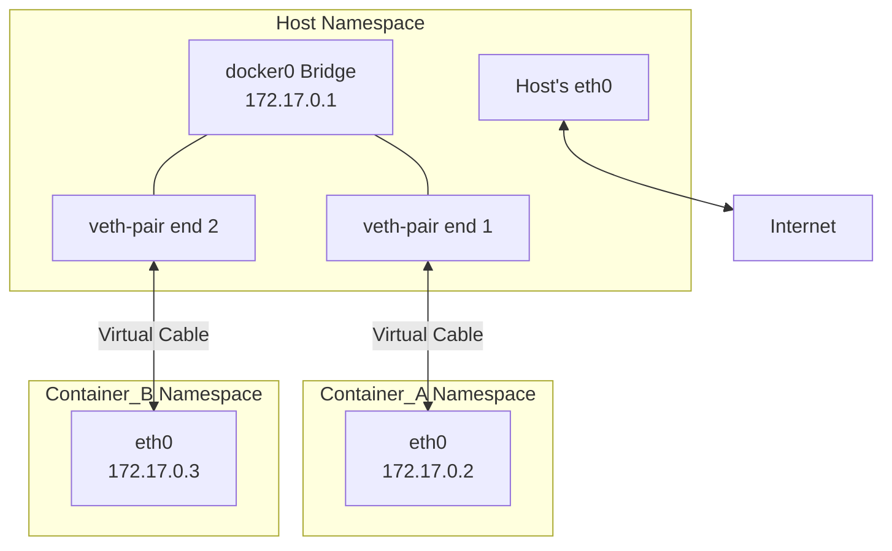

好的，作为一位资深的技术教育作者，我将为你撰写这篇关于 Docker Bridge 网络的教学段落。

---

### 6.2.2 工具一 (默认模式)：Bridge 网络

在上一节我们理解了容器需要一个独立网络命名空间来实现隔离后，一个显而易见的问题随之而来：这个“与世隔绝”的容器，该如何与外界（包括宿主机和其他容器）沟通呢？Docker 的默认网络模式——**Bridge（桥接）网络**，为我们提供了一个优雅且高效的答案。当你安装完 Docker 并启动第一个容器时，你就在不知不觉中使用了它。

Bridge 网络的核心思想是在宿主机上创建一个虚拟的二层网络交换机（即网桥），所有连接到这个网络的容器，其网络流量都会通过这个网桥进行转发。让我们一步步拆解其工作原理。

#### 1. 核心枢纽：虚拟网桥 `docker0`

Docker 服务启动时，会在宿主机上创建一个名为 `docker0` 的虚拟网络接口。它不仅仅是一个接口，更是一个功能完整的**虚拟网桥**。你可以把它想象成一个现实世界中的网络交换机，只不过它是用软件实现的，运行在宿主机的内核中。

`docker0` 网桥会自动配置一个私有网段的 IP 地址，通常是 `172.17.0.1/16`。这个 IP 地址同时也是该 Bridge 网络中所有容器的**默认网关**。

你可以通过以下命令在宿主机上查看到它的存在：

```bash
# 查看网络接口信息，会看到 docker0 及其 IP 地址
ip addr show docker0

# 输出示例：
# 4: docker0: <NO-CARRIER,BROADCAST,MULTICAST,UP> mtu 1500 qdisc noqueue state DOWN group default
#     link/ether 02:42:ac:11:00:01 brd ff:ff:ff:ff:ff:ff
#     inet 172.17.0.1/16 brd 172.17.255.255 scope global docker0
#        valid_lft forever preferred_lft forever
```
`docker0` 网桥的存在，为所有默认网络的容器构建了一个共享的、隔离的二层网络环境。

#### 2. 连接的桥梁：veth-pair 技术

那么，容器是如何“插入”到 `docker0` 这个虚拟交换机上的呢？答案是 `veth-pair`（Virtual Ethernet Pair）。

`veth-pair` 是一种成对出现的特殊网络设备，可以把它理解为一根虚拟的“网线”，一头连接着一端，另一头连接着另一端。任何从一端进入的数据包，都会原封不动地从另一端出来。

当 Docker 创建一个容器并将其加入 Bridge 网络时，它会：
1.  创建一对 `veth-pair` 设备。
2.  将其中一端（我们称之为 `veth-host`）“插入”到宿主机的 `docker0` 网桥上。
3.  将另一端（我们称之为 `veth-container`）放入容器的网络命名空间内，并将其重命名为我们熟悉的 `eth0`。
4.  从 `docker0` 网桥的地址池中（例如 `172.17.0.0/16`）分配一个 IP 地址给容器的 `eth0`。

这个过程可以用下图清晰地表示：


通过这种方式，每个容器都像是通过一根独立的网线连接到了 `docker0` 这个交换机上，实现了与网桥的连接。

#### 3. 通信实现：三大场景剖析

理解了 `docker0` 和 `veth-pair` 的结构后，我们来看流量在其中是如何流转的。

##### 场景一：同一宿主机内，容器间通信

- **路径**：Container A (`172.17.0.2`) -> A 的 `eth0` -> `veth-pair` -> `docker0` 网桥 -> `veth-pair` -> B 的 `eth0` -> Container B (`172.17.0.3`)。
- **原理**：这是一个纯粹的二层转发过程。`docker0` 网桥作为交换机，根据目标 IP 地址（`172.17.0.3`）查询 ARP 表找到对应的 MAC 地址，然后将数据包从正确的 `veth` 端口转发出去。整个过程都在宿主机内核中完成，效率很高，且与宿主机的物理网络无关。

##### 场景二：容器访问外部网络

- **路径**：Container A (`172.17.0.2`) -> 默认网关 `docker0`(`172.17.0.1`) -> 宿主机 `eth0` -> Internet。
- **原理**：这背后真正的魔术师是 Linux 内核的 `iptables` NAT（网络地址转换）功能。
    1.  容器发出的数据包，源 IP 是 `172.17.0.2`，目标是外部公网 IP。
    2.  数据包到达网关 `docker0` 后，被宿主机内核的路由规则捕获。
    3.  Docker 预先在 `iptables` 的 `nat` 表的 `POSTROUTING` 链中设置了一条 `MASQUERADE` 规则。
    4.  这条规则的作用是：当数据包从 `docker0` 网段发出，准备离开宿主机时，将其**源 IP 地址**从容器的私有 IP (`172.17.0.2`) **伪装**成宿主机的公网 IP 地址（例如 `eth0` 的 IP）。
    5.  这样，对于外部网络来说，请求看起来就像是宿主机自己发起的。当响应包返回时，宿主机内核根据连接跟踪记录，再做一次反向的地址转换，将数据包正确地送回给源容器。

你可以通过以下命令查看这条关键的 NAT 规则：
```bash
sudo iptables -t nat -L POSTROUTING

# 你会看到类似下面的一条规则
# MASQUERADE  all  --  172.17.0.0/16       !172.17.0.0/16
```
这条规则意味着，所有源地址是 `172.17.0.0/16` 网段，但目标地址不是该网段的流量，都会被进行源地址转换（SNAT）。

##### 场景三：外部网络访问容器

> **[常见误区警告]**
>
> 默认情况下，容器内的服务对于外部网络是完全不可见的。这是一种安全设计，提供了天然的隔离。仅仅启动一个 Web 服务容器，你并不能通过 `http://<宿主机IP>:<端口>` 来访问它。

要让外部能够访问容器，你需要进行**端口映射**。例如，使用 `docker run -p 8080:80 nginx` 命令。这个 `-p 8080:80` 参数做了什么呢？

- **原理**：它同样是利用 `iptables` NAT 来实现的，但这次是**目标地址转换（DNAT）**。
    1.  Docker 会在 `iptables` 的 `nat` 表的 `DOCKER` 链（由 `PREROUTING` 链引导）中添加一条规则。
    2.  这条规则会监听宿主机的 `8080` 端口。
    3.  当一个外部请求访问 `<宿主机IP>:8080` 时，`iptables` 会将该数据包的**目标地址和端口**修改为 `<容器IP>:80`。
    4.  随后，数据包被路由到 `docker0` 网桥，并最终送达目标容器的 `80` 端口。

#### 要点回顾

Bridge 网络是 Docker 最基础也是最核心的网络模式，它巧妙地利用了 Linux 内核已有的成熟技术，为容器提供了一个功能完备的网络环境：

-   **`docker0` 虚拟网桥**：构建了一个隔离的二层网络，并充当容器的默认网关。
-   **`veth-pair`**：如同一根根虚拟网线，将每个容器独立地连接到 `docker0` 网桥上。
-   **`iptables` NAT**：是实现内外网通信的关键。通过**源地址转换（SNAT/MASQUERADE）**让容器能主动访问外部；通过**目标地址转换（DNAT）**和端口映射，让外部能访问容器内的特定服务。

理解了 Bridge 模式，你就掌握了 Docker 网络世界的基础语言，为后续学习更复杂的网络模式（如 Overlay 网络）打下了坚实的基础。