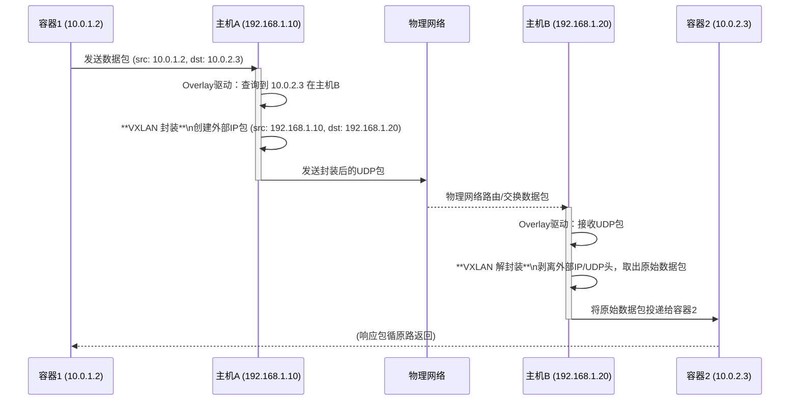

好的，作为一位资深的技术教育作者，我将为你撰写这篇关于 Overlay 网络的教学段落。

---

### 6.2.4 工具三 (集群模式)：Overlay 网络

在我们之前的讨论中，无论是使用默认的 `bridge` 模式还是 `host` 模式，我们都主要解决了**单台主机**上容器间的通信问题。然而，现代应用的部署早已超越了单机的范畴，它们以集群的形式运行在多台物理或虚拟主机之上。此时，一个核心挑战便浮现出来：**如何让分布在不同物理主机上的容器，像在同一个局域网中一样自由通信？**

这正是 **Overlay 网络（Overlay Network）** 登场的原因。它是一种在现有物理网络（我们称之为 **Underlay 网络**）之上构建虚拟网络的技术，其核心思想是“网络之上的网络”。

#### 1. 问题的根源：物理网络的“无知”

想象一下这个场景：

*   **主机A** (IP: `192.168.1.10`) 上运行着 **容器1** (IP: `10.0.1.2`)。
*   **主机B** (IP: `192.168.1.20`) 上运行着 **容器2** (IP: `10.0.2.3`)。

当容器1试图访问容器2（`ping 10.0.2.3`）时，数据包会离开容器1，到达主机A的内核。主机A的路由表只认识 `192.168.1.0/24` 这个物理网络，它完全不知道 `10.0.2.3` 这个地址在哪里，因此数据包无法被正确路由到主机B。物理网络对容器的私有IP地址一无所知。

#### 2. Overlay 网络的解决方案：隧道与封装

Overlay 网络的解决思路十分巧妙：既然物理网络不认识容器IP，那我们就把**容器的数据包**伪装成**主机间的数据包**。这个“伪装”的过程，在技术上被称为**封装 (Encapsulation)**，而这条逻辑上的通信信道，则被称为**隧道 (Tunnel)**。

具体流程如下：

1.  **原始数据包**：容器1创建一个目标地址为 `10.0.2.3` 的IP包。
2.  **封装**：当这个包到达主机A的网络驱动时，Overlay网络驱动会拦截它。它查询一个（由集群管理系统维护的）映射表，发现 `10.0.2.3` 位于主机B (`192.168.1.20`)。于是，它将整个原始数据包作为“货物”（Payload），外面套上一个新的IP头。这个新IP头的源地址是主机A (`192.168.1.10`)，目标地址是主机B (`192.168.1.20`)。
3.  **传输**：这个被封装后的新数据包在物理网络上传输。对于物理路由器和交换机来说，这只是一个从 `192.168.1.10` 到 `192.168.1.20` 的普通数据包，它们知道如何处理。
4.  **解封装**：数据包到达主机B后，其内核将数据交给Overlay网络驱动。驱动识别出这是一个封装过的数据包，于是“拆开”外层IP头，取出里面的“货物”——也就是那个原始的、发往 `10.0.2.3` 的数据包。
5.  **投递**：主机B将这个原始数据包投递给本地的容器2。

从容器1和容器2的视角看，它们之间仿佛有一条直接的、平坦的二层网络链路，它们根本感知不到底层复杂的物理网络和封装/解封装过程的存在。

#### 3. 主流实现技术：VXLAN

**VXLAN (Virtual eXtensible LAN)** 是目前实现Overlay网络最主流的技术之一。它是一种功能强大的隧道协议，其设计初衷就是为了解决大规模虚拟化环境中的网络隔离和扩展问题。

VXLAN 的封装格式通常是这样的：
`[外部物理网络帧头] [外部IP头] [UDP头] [VXLAN头] [内部原始容器帧]`

*   **VXLAN头**：包含一个24位的**VNI (VXLAN Network Identifier)**，理论上可以创建超过1600万（2^24）个相互隔离的虚拟网络，远超传统VLAN的4094个限制，这对于多租户的云环境至关重要。
*   **UDP头**：VXLAN巧妙地将封装数据承载于UDP之上。这使得它可以轻松穿越大多数现有的网络设备，因为UDP是一种标准协议。

***

##### Case Study: 一次跨主机容器通信的旅程

让我们通过一个流程图来完整地描绘一次基于VXLAN的跨主机通信：

这个流程清晰地展示了Overlay网络是如何通过在主机层面增加一层智能处理，来弥合容器虚拟网络与物理网络之间的鸿沟的。

#### 4. 优势与考量

| 优势 | 考量 |
| :--- | :--- |
| **解耦与灵活性** | **性能开销**：封装和解封装过程会消耗少量CPU资源。 |
| 容器网络与物理网络解耦，网络管理员无需为容器专门配置底层网络。 | **MTU问题**：由于增加了额外的包头，每个数据包的体积变大。需要确保物理网络的MTU（最大传输单元）足够大，或进行适当配置，以避免数据包分片。 |
| **大规模扩展性** | **网络可见性**：网络故障排查变得更复杂，因为物理网络设备看不到原始的容器间流量。 |
| VXLAN的VNI提供了海量的虚拟网络，轻松实现多租户隔离。 | |
| **跨越三层网络** | |
| 只要主机之间IP可达，即使它们不在同一个物理子网，也能构建出一个虚拟的二层网络。 | |

---

#### 本节小结

Overlay 网络是实现大规模、跨主机容器集群通信的关键技术。它通过**隧道技术**（如 **VXLAN**）在现有的物理网络（Underlay）之上构建一个虚拟网络层，通过在主机端进行**数据包封装与解封装**，巧妙地解决了物理网络无法识别容器IP地址的问题。

这种设计虽然带来了一些性能和复杂性的考量，但其带来的巨大灵活性、扩展性和与底层设施的解耦能力，使其成为 Kubernetes、Docker Swarm 等主流容器编排系统网络方案的基石。理解了Overlay网络，你便掌握了打开现代云原生网络大门的钥匙。