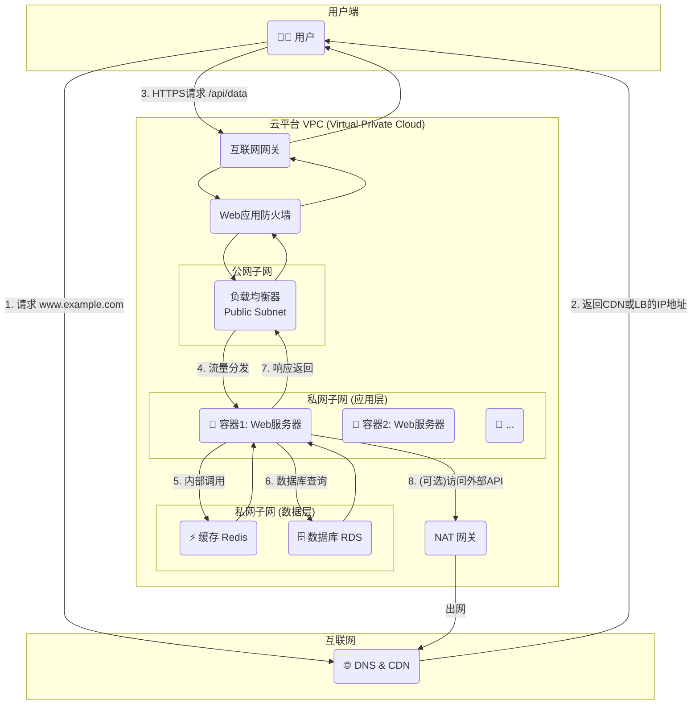

好的，我们紧接“6.3.1 终极蓝图：请求的全链路追踪”这一主题，开始撰写。

---

### 6.3.1 终极蓝图：请求的全链路追踪

在前面的章节中，我们已经分别探讨了网络协议的分层模型、路由与转发的底层机制、DNS 与 HTTP 的应用交互，以及云网络和容器化的现代部署范式。现在，是时候将所有这些珍珠串成一条项链，通过一个完整的实例来审视一个现代 Web 应用的宏伟蓝图。

这张蓝图不仅是一个静态的架构图，更是一张动态的寻宝图。我们将以一次普通的用户HTTP请求为线索，追踪它从用户浏览器出发，穿越互联网的重重关卡，最终抵达云端容器化应用并返回响应的全过程。这趟旅程将贯穿我们课程所学的所有核心知识点。

#### 终极架构图景

让我们首先揭开这张终极蓝图的神秘面纱。它描绘了一个部署在公有云VPC（Virtual Private Cloud，虚拟私有云）环境中的典型Web应用。

这张图浓缩了现代网络实践的精华：
*   **云原生环境**：整个应用托管在云厂商提供的VPC中，实现了网络隔离与安全。
*   **分层设计**：通过公网子网和私网子网的划分，将面向公众的服务（如负载均衡器）与核心业务逻辑和数据（应用容器、数据库）进行隔离。
*   **容器化部署**：核心Web应用运行在Docker容器中，便于弹性伸缩和快速迭代。
*   **高可用架构**：负载均衡器将流量分发到多个无状态的应用容器实例，避免了单点故障。

#### 案例研究：一次API请求的奇幻漂流

假设一位用户在浏览器中执行了一个操作，触发了一次对 `https://www.example.com/api/products` 的 `GET` 请求。让我们一步步追踪它的旅程：

**第1步：DNS解析 - 应用层的“引路人”**

用户设备首先需要将域名 `www.example.com` 解析为IP地址。它会向本地DNS服务器发起查询，请求最终可能会被导向云服务商的DNS服务（如AWS Route 53）。
*   **智能解析**：现代DNS服务通常集成了CDN（内容分发网络）调度。它会根据用户的地理位置，返回一个离用户最近的CDN边缘节点的IP地址，或是应用入口——负载均衡器（Load Balancer）的公网IP。

> **知识点关联**：此阶段主要涉及**应用层**的 `DNS协议`。我们回顾了域名系统如何作为互联网的电话簿，将人类可读的域名映射为机器可读的IP地址。

**第2步：建立连接 - 跨越传输层的“握手”**

浏览器获得IP地址后，将与该地址对应的服务器（负载均衡器）尝试建立一个安全的TCP连接。
1.  **TCP三次握手**：客户端与服务端交换SYN和ACK报文，建立可靠的连接通道。
2.  **TLS握手**：在TCP连接之上，进行TLS/SSL握手，交换密钥、验证证书，建立一条加密的HTTPS信道。

> **知识点关联**：此阶段是**传输层**的 `TCP协议` 和**安全层**的 `TLS/SSL协议` 的主场。数据的可靠传输和通信安全在此得到保障。

**第3步：流量进入VPC - 网络边界的“守护者”**

加密的HTTP请求包被发送到负载均衡器的公网IP。数据包首先到达云VPC的**互联网网关（Internet Gateway, IGW）**，这是VPC与外界互联网通信的唯一出入口。随后，请求可能经过**WAF（Web应用防火墙）**，WAF会检测SQL注入、XSS跨站脚本等恶意攻击，过滤掉非法请求。

> **知识点关联**：这里体现了**网络层**的 `IP路由`（公网IP寻址）以及现代云网络的**边界安全**和**流量管理**概念。

**第4步：负载均衡与内部路由 - 应用的“交通枢纽”**

合法的请求到达**负载均衡器（Load Balancer, LB）**。LB根据预设的规则（如轮询、最少连接数等），从后端的健康应用实例中选择一个（例如，`容器1`），然后将请求转发给它。注意，此时发生了一次关键的地址转换：
*   **目的地址转换（DNAT）**：LB将请求包的目的IP从它自己的公网IP改写为`容器1`的私网IP。

> **知识点关联**：这是典型的**服务器负载均衡**技术。同时，`网络地址转换（NAT）` 的原理在此得到应用，实现了公网地址到私网地址的映射。VPC内部的路由表指导着数据包如何在子网间正确流转。

**第5步 & 6步：业务处理与数据访问 - 应用的“心脏”**

运行在私网子网中的`容器1`接收到请求。应用代码开始执行业务逻辑：
1.  **查询缓存**：应用首先尝试从Redis缓存中获取产品数据。如果命中，则直接构建响应，速度极快。
2.  **查询数据库**：如果缓存未命中，应用会通过内部网络连接到位于数据层子网的数据库（RDS），执行SQL查询。数据库返回数据给应用容器。

> **知识点关联**：此阶段的通信完全在**私有IP地址空间**内进行。云VPC的**安全组（Security Group）**或**网络ACL**等防火墙规则确保了只有应用层的容器才能访问数据层的服务，实现了精细的访问控制。

**第7步：响应返回 - 原路返航**

`容器1`生成HTTP响应包，沿着来时的路径返回给用户。这个过程是上述步骤的逆向操作：响应包从容器发出，经过LB（此时LB会做源地址转换SNAT），再通过互联网网关，最终回到用户的浏览器。

**第8步（可选）：访问外部服务**

如果应用在处理请求时需要调用第三方API（如支付网关），它会从私网子网发起一个出站连接。由于私网IP不能在公网上路由，这个连接请求会被路由到**NAT网关（NAT Gateway）**。NAT网关会将源IP（容器的私网IP）转换为自己的公网IP，然后将请求发往互联网。

> **知识点关联**：**NAT网关**是私网环境访问公网的“代理出口”，它解决了私网IP无法直接与互联网通信的问题，同时隐藏了内部网络结构。

---

#### 要点回顾

通过追踪这样一次看似简单的API请求，我们完成了一次对整个课程知识体系的巡礼：

*   **分层思想的体现**：请求的每一步都清晰地对应着网络协议栈的不同层次，从应用层DNS到传输层TCP，再到网络层IP路由。
*   **抽象与实现**：我们看到，诸如VPC、负载均衡器、NAT网关等云服务，都是对底层网络原理（如路由、交换、NAT）的高度抽象和产品化封装。
*   **安全纵深**：从边界的WAF，到VPC的子网隔离，再到安全组的精细化访问控制，现代网络架构处处体现着“安全是设计出来的”这一理念。
*   **全局视野**：理解一个请求的全链路，能帮助我们更高效地进行系统设计、性能调优和故障排查。网络不再是孤立的协议，而是支撑现代应用运行的生命线。