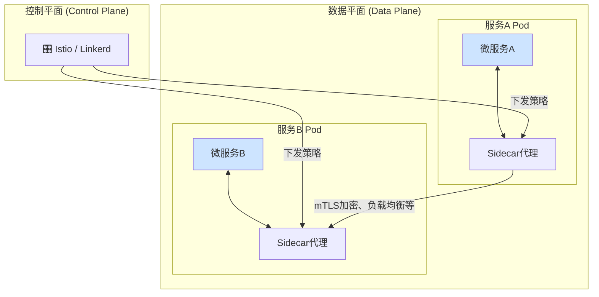

好的，我们已经将经典的五层网络模型与现代云原生实践紧密地缝合在一起。你现在已经具备了从宏观架构到微观协议的立体化视角，足以分析和理解绝大多数网络场景。

然而，技术的世界永远在奔腾向前。我们刚刚描绘的“终极蓝图”虽然是当下的最佳实践，但新的挑战和更优的解决方案正在不断涌现。站在这个坚实的知识基础上，你的学习之旅才刚刚开启。本节将为你揭示网络知识版图上的下一片大陆，指引你未来的探索方向。

---

### 6.3.3 展望未来：网络知识的下一步

你已经掌握了网络世界的“屠龙之术”，但这柄利剑也需要不断淬炼。随着应用架构向微服务、Serverless 等方向演进，以及运维理念向自动化、智能化发展，网络领域的抽象层次和管理复杂度也在同步提升。理解以下几个前沿领域，将让你在未来的技术浪潮中立于不败之地。

#### 1. 服务网格 (Service Mesh)：微服务时代的“智能交通警”

在我们的案例中，应用容器之间的通信（例如`AppContainer1`访问另一个微服务）相对简单。但当一个应用被拆分成数十甚至上百个微服务时，服务间的调用关系会变得异常复杂，形成一张混乱的“服务蜘蛛网”。如何统一管理这些服务间的流量、安全和可观测性？服务网格应运而生。

*   **核心思想**: 将服务间通信的网络功能（如负载均衡、服务发现、熔断、重试、加密、认证、监控）从应用程序代码中剥离出来，下沉到一个独立的基础设施层。
*   **工作原理**: 它通过在每个微服务旁部署一个轻量级的网络代理（称为“Sidecar”，边车代理），来劫持所有进出该服务的流量。这些Sidecar共同组成“数据平面”，由一个统一的“控制平面”进行集中管理和策略下发。


*   **与现有知识的关联**:
    *   如果说我们之前讨论的**负载均衡器**主要管理从外部进入集群的“南北流量”（North-South Traffic），那么**服务网格**则专注于管理集群内部服务之间的“东西流量”（East-West Traffic）。
    *   它是在**传输层（TCP/TLS）**和**应用层（HTTP/gRPC）**之上构建的更高阶的流量控制抽象。

#### 2. 软件定义网络 (SDN)：云网络的“幕后引擎”

在前面的章节中，我们能够通过点击云平台的控制台或调用API，就轻松地创建VPC、配置路由表、设定安全组。这一切便捷操作的背后，都离不开一项革命性的技术——软件定义网络（SDN）。

*   **核心思想**: 将传统网络设备中紧密耦合的**控制平面**（决定数据包该往哪走的“大脑”）和**数据平面**（负责实际转发数据包的“肌肉”）进行解耦。通过一个集中的控制器（控制平面）以软件编程的方式，来定义和管理整个网络（数据平面）的行为。
*   **价值**:
    1.  **集中化与自动化**: 网络管理员不再需要登录到成千上万台交换机上逐一配置，而是通过控制器下发全局策略。
    2.  **灵活性与可编程性**: 网络资源（如带宽、路由）可以像虚拟机一样被动态地创建、分配和回收。云厂商正是利用SDN技术，才得以向我们提供VPC、负载均衡器等弹性的网络服务。
*   **与现有知识的关联**:
    *   SDN是我们学习的VPC、子网、路由表、安全组等所有云网络概念的**底层技术实现**。深入理解SDN，你就能明白云网络的“魔法”是如何发生的，而不仅仅是停留在使用层面。

#### 3. 基础设施即代码 (Infrastructure as Code, IaC)：网络配置的“宪法”

当你的网络架构变得复杂，手动配置不仅效率低下，还极易出错。如何保证开发、测试、生产环境的网络配置完全一致？如何对网络变更进行版本控制和审计？IaC提供了完美的答案。

*   **核心思想**: 使用声明式的代码（如YAML, HCL）来定义你的所有基础设施资源（包括VPC、子网、负载均衡器、防火墙规则等），并通过自动化工具（如Terraform, AWS CloudFormation）来创建和管理它们。
*   **代码示例 (Terraform 伪代码)**:

  ```hcl
  // 定义一个VPC
  resource "aws_vpc" "main" {
    cidr_block = "10.0.0.0/16"
  }

  // 定义一个公网子网
  resource "aws_subnet" "public" {
    vpc_id     = aws_vpc.main.id
    cidr_block = "10.0.1.0/24"
  }

  // 定义一个负载均衡器
  resource "aws_lb" "frontend" {
    # ... LB的具体配置
    subnets = [aws_subnet.public.id]
  }
  ```
*   **与现有知识的关联**:
    *   IaC是**网络运维**的最佳实践。它将我们手动配置网络的操作，转化为可复用、可版本化、可审查的代码。
    *   IaC与**SDN**相辅相成。正是因为网络是“软件定义”的，我们才能用“代码”去驱动它。IaC工具的本质，就是将你写的代码翻译成对SDN控制器的一系列API调用。

---

#### summary / 要点回顾

我们从一个简单的HTTP请求出发，穿越了整个网络协议栈和现代云架构，最终抵达了网络知识的前沿阵地。这段旅程的核心，是希望你建立起一个观念：**网络知识不是一门孤立的、静止的学科，而是支撑整个IT世界运转的、不断进化的生命脉络。**

*   **根基稳固**: 无论上层抽象如何演变，TCP/IP五层模型始终是理解一切网络技术的基石。
*   **抽象升级**: 从物理网络到虚拟网络（VPC），再到服务网络（Service Mesh），网络的抽象层次在不断提升，其目标始终是提升效率、安全性和可靠性。
*   **运维革命**: 从手动配置到软件定义（SDN），再到代码化管理（IaC），网络运维的模式正在经历深刻的变革，自动化和可编程性成为核心竞争力。

学无止境。当你掌握了本课程的核心原理后，服务网格、SDN和IaC将是你继续攀登技术高峰的绝佳路径。带着这份完整的知识地图，勇敢地去探索、去实践，你将发现一个更加广阔和精彩的数字世界。