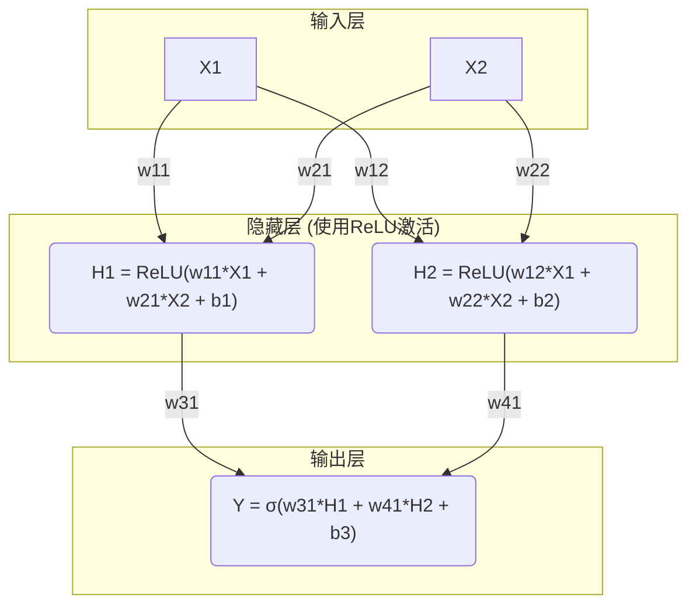

好的，承接上文的宏大叙事，我们现在将从“为什么需要学习”的哲学思辨，深入到“如何开始学习”的技术实践。我们已经确立，机器学习的核心是寻找一个未知的函数`f`。那么，我们应该从何处着手，去构建我们的第一个“通用函数逼近器”呢？

在科学与工程的世界里，面对未知时，我们总是从最简单的假设开始。这不仅是一种方法论，更是一种智慧——奥卡姆剃刀原理告诉我们：“如无必要，勿增实体”。因此，我们的旅程也将遵循这一原则，从最简单、最基础的模型形态开始。

---

### **1.2 核心思想：从线性模型到多层感知机(MLP)**

我们已经接受了我们的新角色：不再是规则的制定者，而是模型的架构师。我们的任务是设计一个框架，让它能够通过数据学习。那么，这个框架最简单的形式应该是什么样的？

答案是：**一条直线**。

这听起来可能过于朴素，甚至有些令人失望。我们刚刚还在讨论识别千姿百态的猫，现在却回到了初中数学的课堂。但请相信，正是从理解这条直线的强大与局限开始，我们才能真正领悟到深度学习那“深度”二字的革命性意义。

#### **回顾线性模型：优雅的简单与无情的束缚**

线性模型（Linear Models）是机器学习世界的“古典物理学”。它们优美、直观，并且在数不胜数的现实问题中表现出色。它们构成了我们探索的第一块基石。

让我们快速回顾两种最核心的线性模型：

**1. 线性回归 (Linear Regression)**

*   **问题**：预测一个连续的数值。例如，根据房子的面积（`x`）预测其价格（`y`）。
*   **数学形式**：`y = w * x + b`。如果输入特征有多个（比如面积、卧室数量、地段评分），形式就扩展为 `y = w_1*x_1 + w_2*x_2 + ... + w_n*x_n + b`。用向量表示就是我们熟悉的 `y = W·x + b`。
*   **几何意义**：这条公式的几何形象是什么？
    *   当输入只有一个特征时，它是一条直线。
    *   当输入有两个特征时，它是一个平面。
    *   当输入有N个特征时，它是一个N维的**超平面（Hyperplane）**。

    无论维度多高，它的本质永远是**“平”**的、**“直”**的。它不存在任何弯曲或折叠。

*   **类比：僵硬的尺子**
    想象你是一个数据分析师，你的工具箱里只有一把无限长的、绝对刚性的尺子。你的任务是用这把尺子去“拟合”散落在图表上的数据点。对于那些本身就大致呈线性关系的数据（比如房屋面积与价格），这把尺子能做得很好。你只需调整尺子的斜率（`W`）和截距（`b`），就能找到一条穿过数据点云中心的最佳直线。

**2. Softmax回归 (Softmax Regression，又称多项逻辑回归)**

*   **问题**：进行分类，即从多个类别中选择一个。这是我们“猫咪识别”问题的简化版，比如识别一张图片是“猫”、“狗”还是“鸟”。
*   **核心思想**：它依然基于线性的 `W·x + b`。对于每一个类别（猫、狗、鸟），模型都学习一套独立的 `W` 和 `b`，计算出一个“分数”。例如：
    *   `score_cat = W_cat · x + b_cat`
    *   `score_dog = W_dog · x + b_dog`
    *   `score_bird = W_bird · x + b_bird`
    *   最后，通过一个叫做 `softmax` 的函数，将这些原始分数转换成概率（例如：猫80%，狗15%，鸟5%）。

*   **几何意义**：这是关键。尽管Softmax回归可以处理多分类问题，但它的**决策边界（Decision Boundary）**——即区分一个类别与另一个类别的界线——**依然是线性的**。在二维空间中，它是一条直线。在三维空间中，它是一个平面。它通过这些“超平面”将整个特征空间切割成不同的区域，每个区域对应一个类别。

    ```mermaid
    graph TD
        subgraph "特征空间"
            A(类别 A)
            B(类别 B)
            C(类别 C)
            A ---|决策边界1 (线性)| B
            B ---|决策边界2 (线性)| C
            A ---|决策边界3 (线性)| C
        end
        style A fill:#f9f,stroke:#333,stroke-width:2px
        style B fill:#9cf,stroke:#333,stroke-width:2px
        style C fill:#9f9,stroke:#333,stroke-width:2px
    ```
    上图直观地展示了，Softmax回归就像是用几把直尺在地图上划分势力范围。每个区域内部纯属一类，但划分的边界永远是笔直的。

**线性模型的统一本质：**
无论是回归还是分类，这些模型的“心脏”都是 `y = f(W·x + b)` 这个结构。在回归中，`f` 是一个恒等函数（即 `f(z)=z`）；在Softmax回归中，`f` 是 `softmax` 函数。但无论如何，那个决定了模型几何形态的核心计算 `W·x + b`，是纯粹线性的。

这便是线性模型的优雅之处——简单、可解释。但同时，也埋下了它失败的种子。这个世界……并不是笔直的。

---

#### **XOR问题：线性模型的“滑铁卢”**

为了让线性模型的局限性以最尖锐、最无可辩驳的方式暴露出来，我们来看一个计算机科学中经典的“拦路虎”——**XOR（异或）问题**。

XOR是一个简单的逻辑运算。它的规则是：当两个输入不同时，输出为真（1）；当两个输入相同时，输出为假（0）。

我们可以将其看作一个分类问题，有四个数据点：

| 输入 x1 | 输入 x2 | 输出 y |
| :--- | :--- | :--- |
| 0 | 0 | **0** |
| 0 | 1 | **1** |
| 1 | 0 | **1** |
| 1 | 1 | **0** |

现在，让我们把这四个点画在一个二维平面上，并尝试用我们最强大的线性分类器（比如Softmax回归，或者它的简化版逻辑回归）来解决它。我们的任务是：**画一条直线，将类别 ‘0’ 和类别 ‘1’ 分开。**


请你亲自试试。拿起一支笔，在这张图上画一条直线。
你会立刻发现：**这是不可能的。**

*   无论你如何旋转、平移那把“僵硬的尺子”，你都无法在不犯错的情况下，将蓝色的点（类别1）和红色的点（类别0）完美地分到线的两侧。
*   你最多只能正确分类其中的三个点，但总有一个点会在错误的一边。

这就是**线性不可分（Linearly Inseparable）**问题的一个完美范例。

**历史的涟漪：**
这个看似简单的XOR问题，在人工智能的历史上曾掀起巨浪。在1969年，人工智能的先驱Marvin Minsky和Seymour Papert在他们的著作《感知器》中，系统地证明了单层的神经网络（即我们这里讨论的线性模型）无法解决XOR这类问题。这一结论极大地打击了当时对神经网络研究的热情，并在一定程度上导致了AI领域的第一次“寒冬”。

这告诉我们，我们遇到的不仅仅是一个技术难题，更是一个历史性的、根本性的障碍。要跨过这道坎，我们需要一次思想上的革命。我们需要一种新的工具，一种能够“弯曲”的工具。

---

#### **核心突破：引入非线性，赋予模型“弯曲”的能力**

如果一把直尺不够，我们该怎么办？一个直观的想法是：用多把直尺组合起来，形成一个更复杂的形状。但如果我们只是简单地把线性运算堆叠起来，会发生什么？

假设我们有两个线性层：
`y1 = W1·x + b1`
`y2 = W2·y1 + b2`

将 `y1` 代入 `y2`，我们得到：
`y2 = W2·(W1·x + b1) + b2 = (W2·W1)·x + (W2·b1 + b2)`

令 `W' = W2·W1`，`b' = W2·b1 + b2`，那么 `y2 = W'·x + b'`。

看到了吗？**两个线性层的堆叠，其结果依然是一个线性层！** 这就像是你把两把直尺首尾相连，你得到的还是一把更长的直尺。它依然是僵硬的，无法弯曲。

**真正的魔术发生在这里：在每一层线性变换之后，我们引入一个非线性“扭曲”。这个扭曲操作，就是由激活函数（Activation Function）完成的。**

**激活函数：模型的“关节”**

一个激活函数是一个简单的、固定的非线性函数。它接收一个数字，然后以一种非线性的方式输出另一个数字。

*   **类比：** 如果说 `W·x + b` 是我们模型的“骨骼”（提供结构和方向），那么激活函数就是连接骨骼的“关节”。没有关节，整个骨架只能作为一个整体僵硬地移动。有了关节，骨架才能弯曲、折叠，做出各种复杂的姿态。

让我们认识几位深度学习中最著名的“关节”：

1.  **Sigmoid函数 (`σ(z) = 1 / (1 + e⁻ᶻ)`)**
    *   **形状**：一个平滑的“S”形曲线。
    *   **作用**：它能将任何输入的实数“挤压”到 (0, 1) 的区间内。这在早期常被用来表示概率或神经元的“激活率”（从完全抑制0到完全激活1）。
    *   **类比**：一个调光开关。输入信号越强，灯就越亮，但亮度有上限（1）和下限（0），并且中间的亮度变化是平滑的。

2.  **Tanh函数 (双曲正切)**
    *   **形状**：和Sigmoid类似，但它将输入挤压到 (-1, 1) 区间。
    *   **优点**：它的输出是零中心的，这在某些情况下能帮助模型更快地收敛。

3.  **ReLU (Rectified Linear Unit, 修正线性单元) (`f(z) = max(0, z)`)**
    *   **形状**：极其简单。如果输入是负数，输出为0；如果输入是正数，输出等于输入。
    *   **作用**：这是当今最流行、最常用的激活函数。它的计算非常高效，并且在实践中被证明能够有效地训练非常深的网络。
    *   **类比**：一个单向阀门或一个门槛。只有当信号的强度超过一个门槛（0），它才能通过；否则，它就被完全阻断。这个看似简单的“开/关”行为，组合起来却能产生惊人的力量。

现在，我们的模型结构发生了质变。我们不再是简单地堆叠线性层，而是在它们之间插入了非线性激活函数。

---

#### **MLP结构：从“线”到“面”再到“体”的构建艺术**

有了“骨骼”（线性变换）和“关节”（激活函数），我们就可以开始构建一个真正强大的生物了。这个生物就是**多层感知机（Multi-Layer Perceptron, MLP）**，它是现代深度神经网络最基本也是最核心的原型。

一个简单的MLP通常由三部分组成：

1.  **输入层 (Input Layer)**：接收原始数据，比如我们XOR问题中的 `(x1, x2)`，或者一张图片的像素值。
2.  **隐藏层 (Hidden Layer(s))**：这是魔法发生的地方。一个MLP可以有一个或多个隐藏层。每一层都由若干个“神经元”组成。每个神经元内部都进行着 `激活(W·x + b)` 的计算。
3.  **输出层 (Output Layer)**：产生最终的预测结果，比如XOR问题的类别（0或1），或者猫狗鸟的分类概率。

让我们用一个简单的MLP结构图来可视化这个过程，看看它是如何解决XOR问题的：



**MLP如何“破解”XOR？—— 一场几何的交响乐**

1.  **第一幕：隐藏层的线性切割**
    *   隐藏层的每个神经元（H1和H2）本身都是一个线性分类器。它们各自在输入空间中画出一条直线。比如，H1可能学习到一条边界线 `x1 + x2 - 0.5 = 0`，H2可能学习到另一条边界线 `x1 + x2 - 1.5 = 0`。
    *   **关键**：这两条线本身都无法解决XOR问题。它们只是对空间进行了初步的、简单的划分。

2.  **第二幕：激活函数的非线性“开关”**
    *   ReLU激活函数登场。对于H1，当一个点 `(x1, x2)` 落在其直线的“正”侧时，H1输出一个正值；否则输出0。H2同理。
    *   现在，每个隐藏层神经元的输出，代表了输入点是否位于它所划分的某个“半空间”内。这不再是一个简单的线性分数，而是一个“是/否”的信号（或者说一个有强度的“是”信号）。

3.  **第三幕：输出层的逻辑组合**
    *   输出层的神经元Y不再直接观察原始的输入 `(x1, x2)`。它的输入是H1和H2的输出！
    *   它学习的是一个**基于这些新特征（H1, H2的输出）的线性分类**。它可以学习到这样一个逻辑：“**当H1被激活（信号>0）且H2未被激活（信号=0）时，最终结果为1。**”
    *   让我们代入XOR的四个点看看这个逻辑：
        *   `(0,0)`: H1=0, H2=0 -> Y=0
        *   `(1,1)`: H1>0, H2>0 -> Y=0 (假设权重配置如此)
        *   `(0,1)`: H1>0, H2=0 -> Y=1
        *   `(1,0)`: H1>0, H2=0 -> Y=1
    *   **成功了！** 输出层的神经元通过对隐藏层创造的“新特征”进行简单的线性组合，就完美地解决了这个非线性问题。

**类比：乐高积木的建造者（升级版）**
回到我们的乐高类比。
*   **线性模型**：你只有一种积木——一根无限长的、笔直的梁。你无法用它搭建出一座房子。
*   **MLP**：
    *   **输入层**：一堆最基础的2x1的乐高积木块（原始特征）。
    *   **第一个隐藏层**：你被允许使用这些基础积木块，搭建一些简单的“组件”，比如一小片“墙壁”（一条决策边界），或者一个“窗框”（另一条决策边界）。由于激活函数的存在（乐高积木的凸点和凹槽），这些组件可以被“打开”或“关闭”。
    *   **第二个隐藏层（如果存在）**：你可以拿起第一层搭建好的“墙壁”和“窗框”，把它们组合成更复杂的结构，比如一整面“带窗户的墙”。
    *   **输出层**：你将所有高层级的组件（“墙”、“屋顶”、“门”）组合起来，最终拼装成一个完整的“房子”（最终的分类决策）。

通过这种**逐层抽象、层层组合**的方式，一个由极其简单的“线性变换+非线性激活”单元构成的MLP，理论上可以拟合出任何复杂度的函数。这就是著名的**通用逼近定理（Universal Approximation Theorem）**所揭示的深刻道理。我们终于拥有了一把可以塑造任意形状的“瑞士军刀”。

---

### **总结与展望：我们刚刚开启了什么？**

在这一节中，我们完成了一次从“古典”到“现代”的认知飞跃：

*   我们认识到**线性模型**的本质是**“超平面”**，它们强大但受限于线性决策边界，无法解决像**XOR**这样的非线性问题。
*   我们发现了突破口在于引入**非线性激活函数**（如ReLU），它像一个“关节”，赋予了模型“弯曲”的能力。
*   我们构建了第一个真正的神经网络原型——**多层感知机（MLP）**，它通过将多个“线性变换+非线性激活”的神经元组织在**隐藏层**中，学会了将简单的线性边界组合成复杂的非线性决策区域。

我们已经搭建好了舞台，设计出了一个潜力无穷的“函数逼近器”。但这引出了一个更关键，也更激动人心的问题：

我们有了这个由无数权重 `W` 和偏置 `b` 构成的复杂结构，就像我们有了一座拥有亿万个旋钮的巨型机器。**我们该如何自动地、高效地去调节每一个旋钮，让这台机器能够根据我们提供的数据，自动学习并最终拟合出我们想要的那个神秘函数 `f` 呢？**

这个“自动调节旋钮”的过程，就是我们下一节将要深入探索的——**神经网络的“学习”之心：梯度下降与反向传播**。这将是我们从“构建模型”到“训练模型”的关键一步。