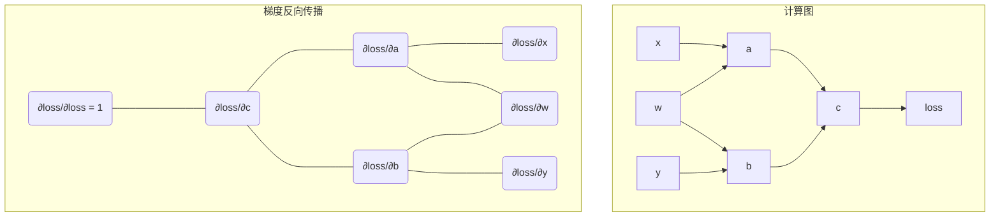

好的，我们已经搭建好了舞台，设计出了一个潜力无穷的“函数逼近器”——多层感知机。但这引出了一个更关键，也更激动人心的问题：

我们有了这个由无数权重 `W` 和偏置 `b` 构成的复杂结构，就像我们有了一座拥有亿万个旋钮的巨型机器。**我们该如何自动地、高效地去调节每一个旋钮，让这台机器能够根据我们提供的数据，自动学习并最终拟合出我们想要的那个神秘函数 `f` 呢？**

这个“自动调节旋钮”的过程，就是我们下一节将要深入探索的——**神经网络的“学习”之心：梯度下降与反向传播**。这将是我们从“构建模型”到“训练模型”的关键一步。

---

### **1.3 拆解关键机制：训练循环、反向传播与梯度下降**

想象你被蒙上双眼，置身于一片广袤、连绵起伏的山脉之中。你的任务是找到这片山脉的最低点——那个最深的峡谷。你看不见地图，无法一览全局。你唯一能依赖的，就是你脚下所站立之处的坡度。

这个场景，就是对神经网络训练过程最精准的隐喻。

*   **这片山脉**：被称为**损失景观（Loss Landscape）**。它的每一“点”都对应着我们模型所有参数（W和b）的一组特定取值。
*   **山脉的高度**：代表**损失（Loss）**。高度越高，意味着模型在当前参数下的预测与真实答案的差距越大，即“错误”越多。
*   **你的位置**：就是模型参数在某一时刻的当前值。
*   **你的目标**：找到损失景观的最低点，即**全局最小值（Global Minimum）**。在这个点，模型的参数配置最优，预测的错误最小。
*   **你的困境**：你被“蒙着眼”，无法看到整个景观。你只能感知局部的、脚下的信息。

那么，一个被蒙住眼睛的登山者，如何最有效地找到下山的路？答案既直观又深刻：**感受脚下最陡峭的下坡方向，然后朝着那个方向迈出一步。重复此过程，一步又一步，直到你感觉脚下已是一片平地。**

这个简单的策略，就是**梯度下降（Gradient Descent）**的核心思想。而指导我们完成这趟“下山之旅”的完整流程，就是**训练循环（Training Loop）**。现在，让我们把这个宏大的比喻拆解成四个具体、可执行的步骤。

---

#### **训练循环的四个步骤：学习的交响乐**

神经网络的学习不是一蹴而就的顿悟，而是一个反复迭代、持续优化的过程。这个过程就像一首由四个乐章组成的交响乐，周而复始地演奏，每一次循环，模型的表现都会变得更和谐、更精准一些。

**第一乐章：前向传播 (Forward Pass) —— 做出一次预测**

*   **登山者在做什么？** 在当前位置，他猜测：“我认为山谷应该在那个方向。”
*   **技术上发生了什么？** 这是模型进行“思考”和“表达”的过程。我们将一批数据（例如，一张猫的图片）输入到网络的输入层。数据像电流一样，逐层流过网络。在每一层，它都会经历一次线性变换（`W·x + b`，骨骼）和一次非线性激活（`ReLU(z)`，关节）。最终，在输出层，网络给出了它基于当前参数的“最佳猜测”。例如，它可能会输出：“我认为这张图片有80%的概率是猫，15%是狗，5%是鸟。”

**第二乐章：计算损失 (Loss Calculation) —— 衡量预测的优劣**

*   **登山者在做什么？** 他需要一个“高度计”来告诉他，他离谷底还有多远。
*   **技术上发生了什么？** 我们需要一个精确的、可量化的标准来衡量模型的“猜测”与“真相”之间的差距。这个标准就是**损失函数（Loss Function）**。
    *   **对于回归问题**（如预测房价），常用的损失函数是**均方误差（Mean Squared Error, MSE）**。它计算的是预测值与真实值之差的平方的平均值。差距越大，损失值（高度）也越大。
    *   **对于分类问题**（如猫狗识别），最常用的是**交叉熵损失（Cross-Entropy Loss）**。它能有效地衡量模型预测的概率分布与真实的标签（如“100%是猫”）之间的“距离”。如果模型以高概率预测了错误的类别，它会施加一个巨大的“惩罚”（一个非常高的损失值）。

**关键点**：损失函数将模型在成百上千个数据样本上的复杂表现，浓缩成了一个**单一的标量值**。这个数字就是我们登山者的高度计读数，是我们整个优化过程唯一需要关注和最小化的目标。

**第三乐章：反向传播 (Backward Propagation) —— 分配责任，找到下山方向**

*   **登山者在做什么？** 这是最关键的一步。他拿出了一个“坡度计”，精确地测量出在他脚下，哪个方向是下山最陡峭的。
*   **技术上发生了什么？** 我们现在知道了总的“错误”（损失值），但这个错误是由网络中成千上万个参数共同造成的。我们如何知道该调整哪个参数？又该朝哪个方向调整（增大还是减小）？
    *   **反向传播**就是解决这个“责任分配”问题的优雅而高效的算法。它利用微积分中的**链式法则（Chain Rule）**，从最终的损失值开始，“反向”地逐层向网络的输入端传播。
    *   在传播的过程中，它会计算出**损失函数对每一个参数（W和b）的偏导数**。这个偏导数，就是我们所说的**梯度（Gradient）**。
    *   **梯度的直观意义**：梯度是一个向量，它指向的方向是函数值**增长最快**的方向。对于我们的损失景观而言，梯度就指向了“上山最陡峭”的方向。因此，梯度的反方向，自然就是“下山最陡峭”的方向。同时，梯度的大小也告诉我们坡度有多陡。坡度越陡，意味着调整这个参数对减小损失的效果越显著。

**第四乐章：参数更新 (Parameter Update) —— 迈出改进的一步**

*   **登山者在做什么？** 知道了最陡的下坡方向后，他朝着这个方向小心翼翼地迈出了一小步。
*   **技术上发生了什么？** 我们使用一个称为**优化器（Optimizer）**的算法（最基础的就是随机梯度下降，Stochastic Gradient Descent, SGD）来更新模型的每一个参数。更新的规则简单而强大：
    `new_parameter = old_parameter - learning_rate * gradient`
    *   `gradient`：由反向传播计算出的下山方向。
    *   `learning_rate`（学习率）：这是一个超参数，它控制着我们每一步“迈出”的步子有多大。
        *   如果学习率太大，就像登山者一步迈得太远，可能会直接跨过谷底，跑到对面的山坡上去了，导致损失值来回震荡甚至发散。
        *   如果学习率太小，就像登山者每一步都只挪动一小寸，虽然方向正确，但要走到谷底会花费极长的时间。

这四个乐章循环往复，每一次循环（称为一个**epoch**或一个**iteration/step**），模型都会朝着损失更低的方向移动一小步。经过成千上万次循环，模型参数这名“登山者”，便能逐渐从一个随机的初始位置，一步步地“走”到损失景观中一个足够深的“山谷”里。至此，“学习”便发生了。

```mermaid
graph TD
    A[Step 1: 前向传播<br/>(Forward Pass)] --> B{Step 2: 计算损失<br/>(Calculate Loss)};
    B --> C[Step 3: 反向传播<br/>(Backward Propagation)];
    C --> D{Step 4: 参数更新<br/>(Update Parameters)};
    D --> A;

    subgraph "模型内部"
        A
        subgraph "数据流"
            direction LR
            Input --> |W1, b1| Hidden1 --> |W2, b2| Output
        end
    end

    subgraph "评估与反馈"
        B
        subgraph "比较"
            direction LR
            Output -- "与" --> True_Label
        end
    end

    subgraph "梯度计算"
        C
        subgraph "梯度流"
            direction RL
            Input_Grad <-- |W1, b1| Hidden1_Grad <-- |W2, b2| Output_Grad <-- Loss_Grad
        end
    end

    subgraph "优化器"
        D
        subgraph "更新公式"
            direction LR
            W_new -- "W_old - α * ∇W" --> W
        end
    end

    style A fill:#cde4ff
    style B fill:#fff4c7
    style C fill:#d4edda
    style D fill:#f8d7da
```

---

#### **反向传播的直觉：一场精密的“责任溯源”**

反向传播算法是深度学习的基石。没有它，训练深度网络在计算上是不可行的。要理解它的威力，我们必须先理解它解决了什么历史性难题。

*   **问题背景：** 在反向传播被广泛应用之前，计算梯度是一个巨大的瓶颈。最朴素的方法是**数值逼近**：对于每一个参数，我们都稍微扰动它一点点（比如增加一个极小的`ε`），然后重新进行一次完整的前向传播，看看损失值变化了多少，以此来估算梯度。`gradient ≈ (loss(param + ε) - loss(param)) / ε`。想象一下，一个拥有数百万参数的模型，为了计算一次梯度，需要进行数百万次前向传播！这在计算上是毁灭性的。

*   **解决方案-链式法则的威力：** 反向传播的绝妙之处在于，它通过一次前向传播和一次反向传播，就能**同时计算出所有参数的梯度**。它利用了微积分的链式法则，将复杂的求导过程变成了一系列简单的、局部的计算。

让我们通过一个极简的计算图来建立直觉。假设我们的网络只有一个神经元，它执行了这样的计算：`loss = f(c)`，其中 `c = a + b`，`a = w * x`，`b = w * y`。我们想知道损失`loss`对参数`w`的梯度 `∂loss/∂w`。



1.  **起点**：我们从最终的损失开始。`loss`对自身的导数 `∂loss/∂loss` 显然是1。这是我们反向传播的初始梯度。
2.  **第一步回溯**：梯度流向 `c`。我们需要计算 `∂loss/∂c`。根据链式法则，`∂loss/∂c = (∂loss/∂loss) * (∂loss/∂c)`。这里的 `∂loss/∂c` 是函数`f`的导数，是一个局部计算。
3.  **第二步回溯**：梯度从 `c` 分流到 `a` 和 `b`。
    *   `∂loss/∂a = (∂loss/∂c) * (∂c/∂a)`。因为 `c = a + b`，所以 `∂c/∂a = 1`。这是一个简单的加法门的局部导数。
    *   `∂loss/∂b = (∂loss/∂c) * (∂c/∂b)`。同理，`∂c/∂b = 1`。
4.  **第三步回溯（汇合点）**：现在看参数 `w`。`w` 同时影响了 `a` 和 `b`。根据多变量链式法则，`w` 对最终 `loss` 的总影响，是它通过所有路径影响的总和。
    *   `∂loss/∂w = (∂loss/∂a) * (∂a/∂w) + (∂loss/∂b) * (∂b/∂w)`。
    *   因为 `a = w*x`，所以局部导数 `∂a/∂w = x`。
    *   因为 `b = w*y`，所以局部导数 `∂b/∂w = y`。
    *   我们把上游传来的梯度（`∂loss/∂a` 和 `∂loss/∂b`）与本节点的局部梯度相乘，再相加，就得到了 `w` 的最终梯度。

**核心洞察**：反向传播将一个全局的、复杂的求导问题，分解成了一系列在每个计算节点上进行的、极其简单的**局部求导**。梯度就像一股“责任”流，从最终的错误结果开始，沿着计算路径反向回溯，每经过一个节点，就根据该节点的运算规则（加法、乘法、激活函数等）进行一次简单的变换和分配。这使得整个过程异常高效。

*   **影响：** 反向传播的普及，是直接导致2012年以来深度学习大爆发的关键技术催化剂。它将训练深层、复杂模型的理论可能性，转化为了工程上的现实。

---

#### **梯度下降的可视化：在等高线图上漫步**

为了更直观地感受梯度下降，我们可以将高维的损失景观投影到一个二维的等高线图上。

*   想象一张地形图，`x`轴和`y`轴分别代表模型的两个参数（比如一个简单的线性回归 `y = w*x + b` 中的 `w` 和 `b`）。
*   图中的等高线，连接的是所有损失值（高度）相同的点。等高线越密集的地方，说明地形越陡峭。
*   中心点是损失函数的最小值，也就是我们“登山之旅”的目的地。

梯度下降的过程在这张图上看起来是这样的：
1.  **随机初始化**：我们在地图上随机选择一个出发点（参数的初始值）。
2.  **计算梯度**：在当前点，梯度向量的方向总是与该点的等高线**垂直**，并指向“上山”的方向。
3.  **更新参数**：我们沿着梯度的**相反方向**（垂直于等高线，指向内部）移动一小步。
4.  **迭代**：在新的位置重复第2步和第3步。

你会看到一个点，从地图的某个角落开始，一步一步地、以一种“之”字形的方式，不断向着等高线图的中心（最低点）逼近。这个动态的、寻路的轨迹，就是梯度下降在“学习”的生动写照。

---

#### **代码实践：用PyTorch从零构建训练循环**

理论讲得再多，不如亲手实现一次。下面，我们将使用PyTorch（一个主流的深度学习框架）来编写一个完整的、极简的训练循环。我们的任务是解决一个简单的线性回归问题：根据一些数据点 `(X, y)`，找到最佳的直线 `y = w*x + b`。

这个例子将清晰地展示上述四个步骤是如何在代码中一一对应的。PyTorch的自动求导（autograd）引擎会为我们自动完成复杂的反向传播计算，我们只需要调用 `.backward()` 即可。

```python
import torch

# 0. 准备数据
# 我们想让模型学习的真实函数是 y = 2*x + 1
# 我们生成一些带有噪声的数据
X = torch.tensor([[1.0], [2.0], [3.0], [4.0]], dtype=torch.float32)
Y_true = torch.tensor([[3.0], [5.0], [7.0], [9.0]], dtype=torch.float32)

# 随机初始化模型的参数 w 和 b
# requires_grad=True 告诉PyTorch我们需要计算这些张量相关的梯度
w = torch.tensor([[0.0]], dtype=torch.float32, requires_grad=True)
b = torch.tensor([[0.0]], dtype=torch.float32, requires_grad=True)

# 定义超参数
learning_rate = 0.01
epochs = 20 # 我们将整个训练过程重复20次

print(f"训练开始前: w = {w.item():.3f}, b = {b.item():.3f}")

# 训练循环
for epoch in range(epochs):
    # --------------------------------------------------
    # 步骤 1: 前向传播 (Forward Pass)
    # --------------------------------------------------
    # 使用当前的 w 和 b 计算预测值 Y_pred
    Y_pred = torch.matmul(X, w) + b

    # --------------------------------------------------
    # 步骤 2: 计算损失 (Calculate Loss)
    # --------------------------------------------------
    # 使用均方误差 (MSE) 作为损失函数
    loss = torch.mean((Y_pred - Y_true)**2)

    # --------------------------------------------------
    # 步骤 3: 反向传播 (Backward Propagation)
    # --------------------------------------------------
    # PyTorch的魔法！这一行代码会自动计算 loss 对所有 requires_grad=True 的张量
    # (也就是 w 和 b) 的梯度。
    loss.backward()

    # --------------------------------------------------
    # 步骤 4: 参数更新 (Update Parameters)
    # --------------------------------------------------
    # 我们手动执行梯度下降。注意，更新过程不需要计算梯度，
    # 所以我们使用 with torch.no_grad() 来包裹它，以提高效率。
    with torch.no_grad():
        w -= learning_rate * w.grad
        b -= learning_rate * b.grad

        # 重要：在下一次迭代前，必须清零梯度！
        # 因为 .backward() 会累积梯度，而不是覆盖。
        w.grad.zero_()
        b.grad.zero_()
    
    if (epoch + 1) % 2 == 0:
        print(f'Epoch [{epoch+1}/{epochs}], Loss: {loss.item():.4f}, w: {w.item():.3f}, b: {b.item():.3f}')

print(f"\n训练结束后: w = {w.item():.3f}, b = {b.item():.3f}")
print("真实值: w = 2.000, b = 1.000")
```

当你运行这段代码时，你会清晰地看到，随着`epoch`的增加，`Loss`在稳步下降，而`w`和`b`的值则在逐步逼近我们设定的真实值`2`和`1`。你亲手实现并见证了一个最简单的“学习”过程。

---

### **总结与展望：我们掌握了学习的“引擎”**

在这一节中，我们深入到了神经网络学习过程的心脏地带。我们理解了：

*   **训练循环**是指导模型学习的“四步舞”：**前向传播、计算损失、反向传播、参数更新**。这个循环是几乎所有监督学习任务的通用框架。
*   **梯度下降**是学习的导航策略，它通过沿着损失函数梯度的反方向迭代，引导模型参数走向最优解。
*   **反向传播**是实现梯度计算的“魔法引擎”，它利用链式法则，将一个计算上不可行的问题变得高效可行，是现代深度学习的基石。

我们已经组装好了学习的引擎，并看着它成功地发动了起来。但这台引擎还非常基础，我们的“下山之旅”也只考虑了最理想的情况。这自然引出了一系列更深层次的问题：

*   **我们下山的路径是唯一的吗？** 如果损失景观这片“山脉”非常复杂，布满了大大小小的山谷（局部最小值），我们如何保证我们的登山者不会被困在一个较浅的山谷里，而错过了那个最深的“全球最优”峡谷？
*   **我们的“步长”（学习率）应该一成不变吗？** 在陡峭的悬崖边，我们或许应该走得慢一些、小心一些；而在平缓的坡地上，我们则可以迈开大步，加速前进。我们能让学习率变得更“智能”吗？
*   **我们每次只看一批数据就更新一次参数，会不会太“短视”了？** 这种基于小批量数据的梯度下降（SGD）会带来怎样的随机性？这种随机性是好是坏？

这些问题将引导我们进入下一阶段的探索：**优化算法的演进**。我们将看到，从简单的SGD出发，研究者们如何发展出Momentum、AdaGrad、RMSprop，乃至当今最常用的Adam等一系列更强大、更鲁棒的优化器，来帮助我们的“登山者”更聪明、更高效地在复杂的地形中导航。我们的旅程，才刚刚进入最精彩的部分。