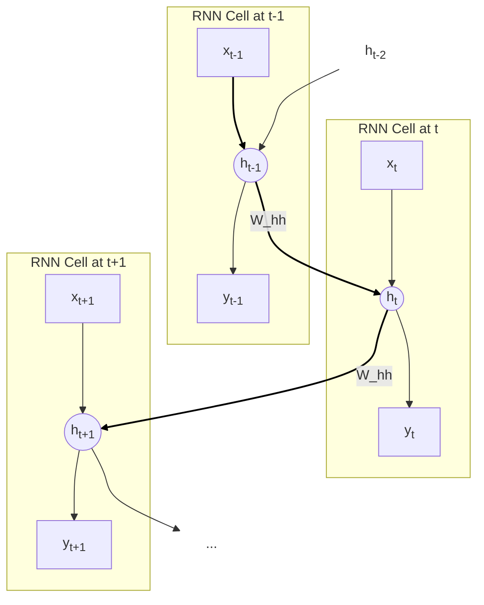
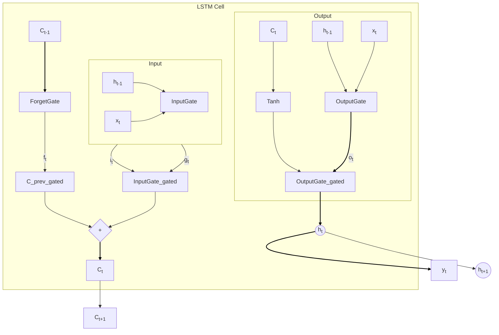

好的，我们已经站在了循环神经网络（RNN）的大门前，手中握着`h_t = f(x_t, h_{t-1})`这把理论钥匙。现在，让我们正式推开这扇大门，深入其内部，观察这个精巧的“记忆”机器是如何被构建、如何运转，又为何会暴露出其固有的、几乎致命的缺陷。然后，我们将见证一场天才般的修复工程——长短期记忆网络（LSTM）的诞生，它通过引入“门控”机制，彻底改变了序列建模的格局。

---

## 4.2 解决方案1.0：循环神经网络 (RNN) 与长短期记忆 (LSTM)

在上一节中，我们确立了一个革命性的思想：要处理序列，模型必须拥有“记忆”。这个记忆，我们称之为**隐藏状态（Hidden State）**，它像一条信息的河流，在每个时间步 `t` 接收来自当前输入 `x_t` 的“新水源”，并与来自上一时间步 `h_{t-1}` 的“旧河水”交汇融合，形成新的状态 `h_t`，然后继续向下个时间步流淌。

这便是循环神经网络（Recurrent Neural Network, RNN）的核心灵魂。现在，让我们把它从抽象的公式变成一个具体、可触摸的工程结构。

### 简单RNN (Simple RNN) - 第一台“时间机器”的诞生

想象一位古代的说书人，他需要一边听着台下观众递上来的纸条（新的输入 `x_t`），一边结合自己脑中对故事前半段的记忆（旧的隐藏状态 `h_{t-1}`），来构思故事的下一句话（新的隐藏状态 `h_t`），并同时向观众讲出当前的情节（输出 `y_t`）。

这个说书人的大脑工作方式，就是对简单RNN最生动的描绘。

#### 拆解工作原理

一个RNN单元的核心操作非常简洁。在每一个时间步 `t`，它执行两个计算：

1.  **更新隐藏状态**：将当前的输入 `x_t` 和上一时刻的隐藏状态 `h_{t-1}` 合并，通过一个激活函数（通常是 `tanh`）来生成新的隐藏状态 `h_t`。
2.  **生成输出**：基于**当前**的隐藏状态 `h_t`，计算出该时间步的输出 `y_t`。

用数学公式表达就是：

`h_t = tanh(W_hh * h_{t-1} + W_xh * x_t + b_h)`
`y_t = W_hy * h_t + b_y`

让我们像解剖精密仪器一样拆解这些公式：
*   `x_t`：时间步 `t` 的输入向量（例如，词“bites”的词向量）。
*   `h_{t-1}`：上一个时间步的隐藏状态向量。这是RNN“记忆”的载体。在第一个时间步 `t=0` 时，它通常被初始化为一个零向量。
*   `h_t`：当前时间步计算出的新隐藏状态向量。它既是 `t` 时刻记忆的总结，也将作为输入传递给下一个时间步 `t+1`。
*   `y_t`：时间步 `t` 的输出向量。在语言模型中，它可能是一个经过Softmax处理的、预测下一个词的概率分布。
*   `W_hh`, `W_xh`, `W_hy`：这是三个**权重矩阵**，是模型需要学习的参数。它们是整个RNN的核心，在**所有时间步中都是共享的**。
    *   `W_xh` (Input-to-Hidden): 决定了**当前输入 `x_t`** 如何影响新的记忆 `h_t`。可以理解为说书人“阅读新纸条”的理解规则。
    *   `W_hh` (Hidden-to-Hidden): 决定了**旧记忆 `h_{t-1}`** 如何影响新的记忆 `h_t`。这是实现“循环”的关键，是说书人“回忆过去”的思考模式。
    *   `W_hy` (Hidden-to-Output): 决定了**当前记忆 `h_t`** 如何转化为最终的输出 `y_t`。这是说书人将“心中所想”变为“口中所言”的表达方式。
*   `b_h`, `b_y`：偏置项（bias），用于提供额外的模型灵活性。
*   `tanh`：双曲正切激活函数。它将输入值压缩到-1到1之间，为网络引入非线性，使其能学习更复杂的关系。

#### 时间上的“展开”与参数共享

为了更直观地理解RNN的工作流程，我们可以将其沿着时间轴“展开”（unroll）。想象一下，我们不是只有一个循环的单元，而是有一排完全相同的单元，前一个单元的输出 `h_{t-1}` 连接到后一个单元的输入。

这个展开图清晰地揭示了RNN的两个本质特性：
1.  **信息的流动**：隐藏状态 `h` 像一条锁链，将整个序列串联起来，使得 `t` 时刻的计算依赖于 `t-1` 时刻，`t-1` 依赖于 `t-2`，以此类推。
2.  **参数共享（Parameter Sharing）**：尽管看起来像一长串不同的网络，但所有时间步的 `W_xh`, `W_hh`, `W_hy` 都是**完全相同**的。这至关重要！这意味着RNN学习的是一套**通用的规则**，用于处理序列中的任意位置。无论是在句首、句中还是句末，它都用同样的方式来更新记忆和生成输出。这不仅极大地减少了模型的参数量，也赋予了模型处理可变长度序列的能力。

#### 训练：时间反向传播 (BPTT)

我们如何训练这个“说书人”，让他讲出更精彩的故事呢？答案是**通过时间反向传播（Backpropagation Through Time, BPTT）**。

想象一下，在故事的结尾（最后一个时间步），我们发现说书人的预测（例如，预测最后一个词）与真实故事大相径庭（产生了损失 Loss）。BPTT就像一个侦探，沿着信息流动的路径**反向**追溯责任：
1.  首先，计算最后一个时间步的输出 `y_T` 对损失的贡献，并据此更新 `W_hy`。
2.  然后，将误差信号从 `y_T` 反向传播到 `h_T`。
3.  接着，侦探沿着时间链条向后走一步，从 `h_T` 传播到 `h_{T-1}`。这个过程不仅会计算 `h_T` 对 `W_xh` 和 `W_hh` 的影响，还会将一部分误差信号传递给 `h_{T-1}`。
4.  这个过程不断重复，误差信号像涟漪一样，从序列的末尾一波波地向前传播，直到序列的开端。
5.  在每个时间步，我们都会计算出 `W_xh`, `W_hh`, `W_hy` 对该步误差的“责任”，并将所有时间步的“责任”累加起来，最终用这个总的梯度来更新这套共享的权重。

通过BPTT，RNN学会了如何调整它的“思考模式”（`W_hh`）和“理解规则”（`W_xh`），以便在未来做出更准确的预测。

### RNN的致命缺陷：记忆的“短视”与梯度的“消逝”

初看之下，简单RNN的设计堪称完美。它拥有记忆，能处理变长序列，还能共享参数。它似乎就是我们一直在寻找的序列建模圣杯。然而，当我们将它应用于稍长一些的序列时，一个致命的缺陷便暴露无遗——它是个“金鱼”，只有短暂的记忆。

让我们回到那个经典的例子：
> "I grew up in France... [经过很长一段描述]... so I am fluent in **French**."

要正确预测出 "French"，模型在处理到句末时，必须清晰地“记得”句首的 "France"。对于简单RNN来说，这几乎是不可能完成的任务。为什么？

**问题根源：梯度消失与梯度爆炸 (Vanishing/Exploding Gradients)**

这个问题的核心出在BPTT的过程中。回忆一下，误差信号需要从序列末尾一步步地反向传播到序列开头。在每一步传播中，梯度都要穿过RNN的核心循环计算，也就是乘以 `W_hh` 权重矩阵。

`h_t = tanh(W_hh * h_{t-1} + ...)`

在反向传播时，梯度会近似地与 `W_hh` 的转置相乘。这意味着，要将误差从 `h_t` 传到 `h_{t-1}`，梯度需要乘以 `W_hh`。要传到 `h_{t-2}`，就需要乘以两次 `W_hh`。要从第 `T` 步传到第 `1` 步，梯度需要连续乘以 `T-1` 次 `W_hh`！

**类比：山谷中的回声**

想象一下，你在一个长长的山谷（时间序列）的一端大喊一声（产生了一个误差）。你的声音（梯度信号）需要向山谷的另一端传播。
*   **梯度消失 (Vanishing Gradients)**：如果山谷的岩壁是吸收声音的材质（`W_hh` 矩阵的某些性质，比如其最大特征值小于1），那么你的声音在每次反射后都会衰减。传出不远，回声就变得微弱到无法听见。对于RNN，这意味着来自序列末尾的误差信号在向前传播几步后，就变得极其微小，几乎为零。因此，模型无法根据远距离的未来信息来调整早期的权重。句首的 "France" 对句末的 "French" 预测所产生的误差，其梯度信号根本无法“抵达”处理 "France" 的那个时间步。模型也就永远学不会这个长距离依赖关系。这是最常见也最棘手的问题。
*   **梯度爆炸 (Exploding Gradients)**：反之，如果山谷的岩壁是完美反射声音的材质（`W_hh` 的最大特征值大于1），回声在每次反射后反而会增强，最终变成震耳欲聋的轰鸣，淹没了一切。对于RNN，这意味着梯度会变得异常巨大，导致模型参数更新的步子迈得太大，直接“跳出”了最优解的范围，使得训练过程极其不稳定，甚至崩溃（表现为损失值变为NaN）。梯度爆炸相对容易处理，可以通过一种叫做**梯度裁剪（Gradient Clipping）**的技术来解决——简单来说，就是给梯度设置一个上限，超过了就把它强行拉回来。

然而，梯度消失问题，就像一种慢性病，悄无声息地侵蚀着RNN的记忆能力，使其变成了一个只能看到眼前几步的“近视眼”。这正是简单RNN在实际应用中（尤其是在90年代和21世纪初）举步维艰的根本原因。整个领域都在呼唤一种能够**长期记忆**的解决方案。

### LSTM：为记忆安装智能“阀门”

**问题背景**：简单RNN的记忆更新机制太过粗暴。每个时间步，旧记忆 `h_{t-1}` 都被完全搅入 `W_hh * h_{t-1} + W_xh * x_t` 这个“搅拌机”，然后整个被 `tanh` 函数“揉捏”一番，形成全新的 `h_t`。在这个过程中，没有任何机制可以保护重要信息不被冲刷掉。

**解决方案的曙光**：1997年，Sepp Hochreiter和Jürgen Schmidhuber发表了具有里程碑意义的论文，提出了**长短期记忆网络（Long Short-Term Memory, LSTM）**。其核心思想堪称天才：**我们不应该粗暴地覆写记忆，而应该通过精密的“门控机制”（Gating Mechanism）来有选择地、可控地修改记忆。**

LSTM不再只有一个简单的隐藏状态 `h_t`，而是引入了一个至关重要的、独立于主信息流的**细胞状态（Cell State）`C_t`**。

**类比：记忆的“高速公路”与“收费站”**

*   **细胞状态 `C_t`**：可以想象成一条贯穿整个时间序列的“信息高速公路”。信息在这条路上可以顺畅地传递很远，而不会像在普通RNN的“乡间小路”上那样，每一步都受到剧烈的干扰和改变。
*   **门（Gates）**：这条高速公路上设置了三个精密的“收费站”或“控制阀门”，它们就是**遗忘门、输入门、输出门**。这些门都是小型的神经网络（通常是一个Sigmoid激活函数层），它们可以根据当前输入和过去的记忆，学习着去打开或关闭，控制着信息在这条高速公路上的进出。

让我们来详细拆解这场优雅的“信息外科手术”。

#### 1. 遗忘门 (Forget Gate)：决定该“扔掉”什么

第一步，LSTM需要决定从细胞状态中丢弃哪些旧信息。
`f_t = σ(W_f * [h_{t-1}, x_t] + b_f)`

*   `[h_{t-1}, x_t]` 表示将上一个隐藏状态和当前输入拼接起来。
*   `W_f` 和 `b_f` 是遗忘门的权重和偏置。
*   `σ` (Sigmoid函数) 输出一个介于0和1之间的值。这个值将与旧的细胞状态 `C_{t-1}` 按元素相乘。
*   **直观理解**：遗忘门 `f_t` 就像一个审查员，它看着新来的信息 `x_t` 和过去的总结 `h_{t-1}`，然后为 `C_{t-1}` 中的每一条信息打分。得分为0意味着“完全忘记这条信息”，得分为1意味着“完全保留这条信息”。例如，当句子中出现新的主语时，遗忘门可能会学会忘记关于旧主语的性别、单复数等信息。

#### 2. 输入门 (Input Gate)：决定该“存入”什么

第二步，决定什么样的新信息将被存放在细胞状态中。这分为两部分：
`i_t = σ(W_i * [h_{t-1}, x_t] + b_i)`
`g_t = tanh(W_g * [h_{t-1}, x_t] + b_g)`

*   **输入门 `i_t`**：同样是一个Sigmoid层，它决定了哪些新信息是重要的，值得被“写入”。它输出一个0到1的“开关”信号。
*   **候选记忆 `g_t`**：一个tanh层，它根据当前输入和旧状态，创造出一个“候选”的新信息向量。
*   **直观理解**：这就像一个两步的录入过程。首先，`g_t` 负责起草一份“更新备忘录”，包含了所有可能要添加的新内容。然后，`i_t` 作为“审批员”，逐条审阅这份备忘录，决定哪些条目（以及以多大的强度）可以被最终写入。

#### 3. 更新细胞状态：完成记忆的“新陈代谢”

现在，我们可以结合前两步，对细胞状态进行更新了。
`C_t = f_t * C_{t-1} + i_t * g_t`

*   `f_t * C_{t-1}`：这是旧记忆 `C_{t-1}` 经过遗忘门“过滤”后留下的部分。
*   `i_t * g_t`：这是候选新记忆 `g_t` 经过输入门“审批”后允许添加的部分。
*   **直观理解**：这个操作极其优雅。我们先通过“遗忘”扔掉一部分旧东西，再通过“输入”添加一部分新东西，完成了细胞状态的一次平滑、可控的更新。信息高速公路上的车流就这样被精确地调度了。

#### 4. 输出门 (Output Gate)：决定该“输出”什么

最后，模型需要根据更新后的细胞状态 `C_t` 来决定当前的输出。但并非 `C_t` 中的所有信息都与当前任务相关。
`o_t = σ(W_o * [h_{t-1}, x_t] + b_o)`
`h_t = o_t * tanh(C_t)`

*   **输出门 `o_t`**：一个Sigmoid层，它决定了细胞状态 `C_t` 中的哪些部分应该被暴露出来作为当前的隐藏状态 `h_t`。
*   `tanh(C_t)`：将细胞状态的值压缩到-1到1之间。
*   **直观理解**：细胞状态 `C_t` 是我们完整的、长期的“知识库”。而隐藏状态 `h_t` 则是为了完成**当前任务**（比如预测下一个词）而从知识库中提取的“工作记忆”。输出门 `o_t` 就是那个聪明的图书管理员，它根据当前的问题（`x_t` 和 `h_{t-1}`），从巨大的知识库 `C_t` 中精准地提取出最相关的那一小部分信息，形成 `h_t`，并用于最终的预测 `y_t`。

通过这套精密的门控系统，LSTM解决了梯度消失问题。因为细胞状态 `C_t` 的更新主要是加法操作，梯度在反向传播时可以很顺畅地流过这条“高速公路”，几乎没有衰减。这使得LSTM能够学习到数百个时间步之前的长距离依赖关系，这在简单RNN中是不可想象的。

### GRU：LSTM的简化变体

LSTM的强大毋庸置疑，但其内部结构也相对复杂，有三个门和独立的细胞状态，这意味着更多的参数和计算。2014年，Kyunghyun Cho等人提出了**门控循环单元（Gated Recurrent Unit, GRU）**，作为LSTM的一个引人注目的替代方案。

GRU的目标是用更简单的结构实现类似的效果。它将LSTM的遗忘门和输入门合并为了一个单一的**更新门（Update Gate）**，并且将细胞状态和隐藏状态也合并了。

GRU的核心是两个门：
1.  **重置门 (Reset Gate, `r_t`)**：它决定了在计算新的“候选记忆”时，应该**忽略**多少过去的隐藏状态。如果重置门接近0，模型就会“重置”其记忆，使得候选记忆主要由当前输入决定。
2.  **更新门 (Update Gate, `z_t`)**：它同时控制两件事——应该**保留**多少旧的隐藏状态 `h_{t-1}`，以及应该从候选记忆中**采纳**多少新信息。`z_t` 的值如果是0.8，就意味着保留80%的旧记忆，并采纳20%的新记忆。

GRU的更新公式大致如下：
`r_t = σ(W_r * [h_{t-1}, x_t])`
`z_t = σ(W_z * [h_{t-1}, x_t])`
`h̃_t = tanh(W_h * [r_t * h_{t-1}, x_t])`
`h_t = (1 - z_t) * h_{t-1} + z_t * h̃_t`

#### LSTM vs. GRU：一场权衡的艺术

| 特性 | 长短期记忆网络 (LSTM) | 门控循环单元 (GRU) |
| :--- | :--- | :--- |
| **核心组件** | 3个门 (遗忘, 输入, 输出) + 1个细胞状态 `C_t` | 2个门 (重置, 更新) |
| **参数数量** | 更多 | 更少 |
| **计算效率** | 较低，计算更密集 | 较高，训练可能更快 |
| **表达能力** | 理论上更强，因为有独立的细胞状态来存储长期信息 | 稍弱，但实践中在许多任务上表现与LSTM相当 |
| **适用场景** | 数据量巨大，且需要建模非常复杂的长距离依赖时可能更有优势 | 在数据量不是特别大，或对计算效率要求较高的场景下，是很好的首选 |

**核心权衡**：GRU用更少的参数和更简单的结构，实现了与LSTM非常接近的性能。在许多任务上，两者之间的差距并不明显。因此，GRU成为了一个非常受欢迎的选择，尤其是在计算资源有限或希望模型更轻量化的情况下。然而，LSTM由于其更明确的结构（独立的细胞状态），在需要精细控制长期记忆的、极其复杂的任务上，可能仍然具有理论上的优势。

### 总结与展望

在这一节中，我们完成了一次从理论到实践，再到优化的完整旅程：
*   **简单RNN**：我们构建了第一台能够处理序列的“时间机器”，理解了其通过循环和参数共享来工作的原理，以及如何通过BPTT进行训练。
*   **致命缺陷**：我们直面了RNN的“阿喀琉斯之踵”——**梯度消失/爆炸**问题，这使其难以捕捉长距离依赖，记忆变得“短视”。
*   **LSTM的诞生**：我们见证了LSTM如何通过引入**细胞状态**和**遗忘、输入、输出**三个门控机制，像一位精密的外科医生一样，对信息流进行精细控制，从而构建了一条能够让梯度顺畅流动的“记忆高速公路”。
*   **GRU的演进**：我们认识了LSTM的优雅变体GRU，它通过更简化的门控结构（**更新门、重置门**），在效率和性能之间做出了出色的权衡。

我们已经拥有了强大的工具来驯服序列数据。LSTM和GRU在很长一段时间里，都是自然语言处理和其他序列任务领域的绝对王者，从机器翻译到语音识别，处处可见它们的身影。

然而，故事到这里远未结束。我们解决了一个核心矛盾，但一个新的问题也随之浮现：无论是RNN、LSTM还是GRU，它们处理信息的方式本质上仍然是**线性的、串行的**。它们必须一个时间步一个时间步地处理数据，就像我们逐字逐句地阅读文章。

这种串行处理机制带来了两个新的瓶颈：
1.  **计算效率**：对于一篇长达1000个词的文章，模型必须进行1000次顺序计算，这使得并行化变得困难，处理长序列时速度缓慢。
2.  **信息瓶颈**：无论LSTM的门控机制多么精妙，序列的所有历史信息最终都必须被压缩进一个固定大小的状态向量（`h_t` 和 `C_t`）中。这是否会成为新的信息瓶颈？

我们不禁要问：我们理解语言时，真的是这样严格地线性处理吗？还是我们会在阅读时，目光在句子中来回跳跃，将当前的词与全文中任何一个相关的词直接联系起来，无论它们相隔多远？

这个深刻的洞察，将引导我们走向下一个革命性的思想——**注意力机制（Attention Mechanism）**。它将彻底打破RNN的线性束缚，让模型学会“聚焦”，直接在输入序列中找到最重要的信息，从而为我们最终通往Transformer这座现代NLP的宏伟神殿铺平道路。