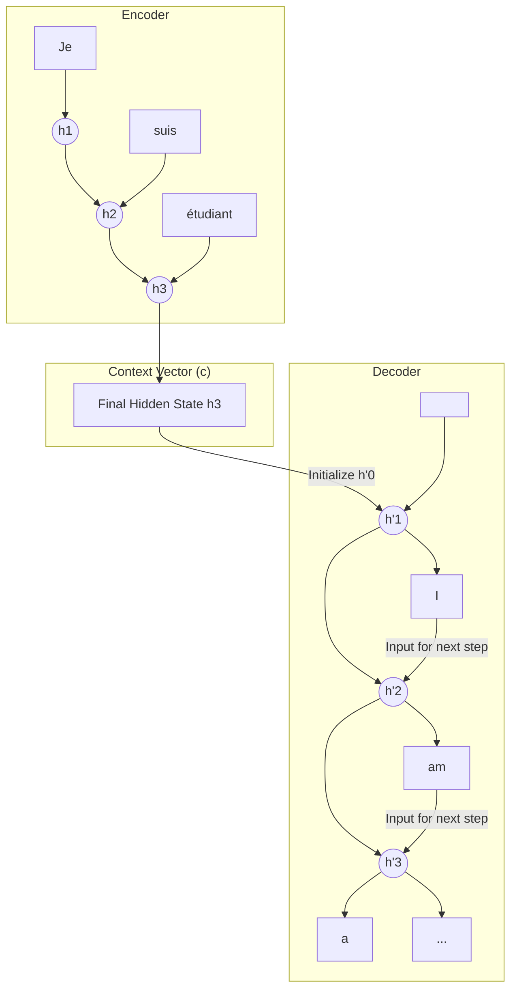

好的，我们已经深入探索了RNN家族（包括其强大的变体LSTM和GRU）如何通过引入“记忆”来解决序列建模的基本问题。我们赞叹于LSTM门控机制的精巧，它像一位外科医生一样精确地管理着信息的流动，极大地缓解了梯度消失问题，使得模型能够捕捉更长的依赖关系。

然而，正如我们在上一节结尾所预见的，即使是最强大的RNN，其固有的**线性、串行处理机制**也带来了新的挑战。它不仅限制了计算效率，更重要的是，当任务变得更加复杂时，一个全新的问题浮出水面：当我们需要处理的不再是单一序列，而是**一对序列**时，我们该怎么办？

思考一下**机器翻译**这个任务：
> 输入 (法语): "Je suis étudiant." (长度3)
> 输出 (英语): "I am a student." (长度4)

这里的输入和输出序列长度不同，词与词之间也不是简单的一一对应。一个简单的RNN，在每个时间步读取一个输入并产生一个输出，无法胜任这种“多对多”且长度不等的**序列到序列（Sequence-to-Sequence）**任务。

这要求我们必须对架构进行一次根本性的升级。我们需要一个系统，它能先“完整地理解”整个输入序列，形成一个抽象的“意义”，然后再基于这个“意义”去“创作”一个全新的、长度可能完全不同的输出序列。这个需求，催生了深度学习史上一个极其重要的架构——**编码器-解码器（Encoder-Decoder）**，也即我们今天要探讨的解决方案2.0。

---

## 4.3 解决方案2.0：编码器-解码器 (Seq2Seq) 与注意力机制 (Attention)

在这一节，我们将见证一次思维的飞跃。我们将从一个巧妙但有缺陷的架构开始，然后引入一个革命性的思想——**注意力（Attention）**，它不仅修复了这个缺陷，更彻底改变了我们对序列处理的认知，为通往现代NLP的巅峰之作Transformer铺平了最后的道路。

### 编码器-解码器架构 (Encoder-Decoder) - 跨越语言鸿沟的“信使”

**问题背景**：如何构建一个模型，使其能够处理输入和输出序列长度不匹配的任务，如机器翻译、文本摘要（长文章 -> 短摘要）、对话系统（问题 -> 回答）等？

**核心思想**：将任务分解为两个独立的阶段——**理解**和**生成**。我们使用两个RNN（通常是LSTM或GRU）来分别扮演这两个角色。

1.  **编码器 (Encoder)**：它的唯一职责是“阅读”和“理解”整个输入序列。
2.  **解码器 (Decoder)**：它的唯一职责是基于编码器的“理解”，来“创作”输出序列。

#### 类比：一位尽职的“外交信使”

想象一个场景：一位信使（**编码器**）需要将一份用法语写成的、篇幅不定的机密文件，传递给一位只会说英语的将军（**解码器**）。

*   **编码阶段**：信使逐字逐句地阅读整份法语文件。他不会在阅读的同时进行翻译。他的目标是消化所有信息，在脑海中形成一个对文件核心思想、意图、情感的**完整、浓缩的理解**。当他读完最后一个词时，这个最终的、高度抽象的“精神摘要”就形成了。
*   **传递阶段**：信使将这个“精神摘要”——我们称之为**上下文向量（Context Vector）**——完整地交给了将军。这是两者之间唯一的沟通桥梁。信使的任务到此结束。
*   **解码阶段**：将军（解码器）接收了这个“精神摘要”。现在，他需要基于这个核心思想，用他自己的语言（英语），从零开始，一个词一个词地组织和生成一份新的文件。他生成的第一个词会影响第二个词，第二个词会影响第三个词，直到他认为已经完整地表达了那个核心思想为止。

这个类比完美地映射了Encoder-Decoder架构的工作流程。

#### 拆解工作流程

1.  **编码器 (Encoder)**：
    *   它是一个RNN（例如LSTM）。在每个时间步 `t`，它接收输入序列的一个词 `x_t` 和前一个隐藏状态 `h_{t-1}`，然后计算出新的隐藏状态 `h_t`。
    *   我们**忽略**编码器在每个中间步骤的输出。我们唯一关心的，是当它处理完**整个输入序列**（例如，在读到 "étudiant." 之后）所产生的**最后一个隐藏状态**。
    *   这个最后的隐藏状态，就是我们梦寐以求的**上下文向量 `c`**（Context Vector）。理论上，它编码了整个输入序列的语义信息。它就是那位信使脑中的“精神摘要”。

2.  **解码器 (Decoder)**：
    *   它也是一个RNN（同样，通常是LSTM）。
    *   它的**初始隐藏状态**不再是零向量，而是被设置为编码器产生的**上下文向量 `c`**。这就像将军的大脑被信使的“精神摘要”所“初始化”。
    *   解码器开始生成过程。在第一个时间步，它接收一个特殊的起始符号（如 `<start>`）作为输入，并结合初始化的隐藏状态（即 `c`），生成第一个输出词（如 "I"）。
    *   在随后的每个时间步 `t`，它将**上一步生成的词 `y_{t-1}`** 作为**当前步的输入**，结合其内部的隐藏状态 `h'_{t-1}`，生成新的输出词 `y_t` 和新的隐藏状态 `h'_t`。这个过程被称为**自回归（Autoregressive）**。
    *   这个生成过程会一直持续，直到解码器生成一个特殊的结束符号（如 `<end>`），标志着输出序列的完成。

这个架构，通常被称为**Seq2Seq**，是处理序列到序列任务的第一次伟大尝试。它在2014年被提出后，迅速在机器翻译等领域取得了突破性进展。

### 信息瓶颈问题 (The Information Bottleneck)

Seq2Seq架构虽然巧妙，但它隐藏着一个巨大的、几乎是哲学性的缺陷。这个缺陷源于那个看似无所不能的**上下文向量 `c`**。

我们要求编码器将**任意长度**的输入序列，无论是一句简单的问候 "Hello."，还是一段陀思妥耶夫斯基式的、包含复杂从句的长句，都压缩成一个**固定大小**的向量 `c`。

**类比的延伸：不堪重负的信使**

*   如果法语文件只有一句话：“敌人将于黎明时分进攻。” 信使可以轻松地记住这个核心思想，并准确地传达给将军。
*   但如果法语文件是一份长达十页的、详细描述敌人兵力部署、补给线路、将领性格弱点的战略分析报告呢？信使在阅读到最后一页时，还能清晰地记得第一页提到的某个具体数字或人名吗？极有可能不能。他的“精神摘要”会变得模糊、笼统，丢失大量关键细节。

这就是**信息瓶颈**问题。一个固定长度的向量，其信息承载能力是有限的。当输入序列变得很长时，强行将其所有信息塞入这个小小的“瓶颈”中，必然会导致严重的信息损失。编码器在处理序列时，后面的输入会不断地冲刷、覆盖前面的信息，导致最终的上下文向量可能只保留了句子后半部分的信息，而遗忘了开头的重要内容。

这导致解码器就像一个只听到了一个模糊总结的将军，他可能能把握大意，但在翻译长句时，会频繁出错，遗漏细节，甚至产生与原文无关的“幻觉”。实践表明，当句子长度超过20或30个词时，标准Seq2Seq模型的性能会急剧下降。

### 注意力机制的核心思想 - 打破瓶颈，赋予“焦点”

**问题背景**：如何克服固定长度上下文向量的信息瓶颈？如何让解码器在生成长句时，能够访问到输入序列的所有细节，而不仅仅是一个模糊的总结？

**革命性思想**：我们不应该强迫编码器把所有信息都压缩进一个向量。**我们应该允许解码器，在生成输出的每一步，都能“回头看”一遍完整的输入序列，并自主决定当前最应该“关注”哪个部分。**

这个思想就是**注意力机制（Attention Mechanism）**。它彻底颠覆了之前“信使-将军”的模式。

#### 新类比：一位专业的同声传译员

想象一位在联合国工作的顶尖同声传译员。他面前放着演讲者的原始讲稿（**编码器的所有隐藏状态**）。

*   当他准备翻译第一个词时，他的目光可能会聚焦在讲稿的开头几个词上。
*   当他翻译到句中的一个技术术语时，他的目光会迅速扫视全文，找到那个术语在原文中的位置，并进行精确翻译。
*   当他翻译到句末的总结性陈述时，他的目光可能会再次回到句首，以确保主语和谓语的一致性。

这位传译员并没有试图把整篇讲稿背下来（一个固定的上下文向量）。相反，他在翻译的**每一步**，都动态地、有选择地将他的**注意力**分配到原始讲稿的不同部分。他有一个完整的、高保真的信息源（讲稿全文），并且拥有一种能力，可以根据当前的需求，从中提取最相关的信息。

注意力机制赋予了我们的模型同样的能力。它不再依赖于一个单一的、静态的上下文向量 `c`，而是在解码的**每一步**都计算一个**动态的、为当前步骤量身定制的上下文向量**。

### Bahdanau Attention拆解 - 让模型学会“聚焦”

2015年，Dzmitry Bahdanau等人在论文《Neural Machine Translation by Jointly Learning to Align and Translate》中提出了第一个真正意义上成功的注意力机制，现在我们称之为**Bahdanau Attention**或**加性注意力（Additive Attention）**。让我们来拆解这个天才般的设计是如何工作的。

假设我们的编码器已经处理完输入序列 "Je suis étudiant"，并为每个词生成了一个隐藏状态：`h_1` (对应"Je"), `h_2` (对应"suis"), `h_3` (对应"étudiant")。这些隐藏状态 `(h_1, h_2, h_3)` 就像是那份完整的“原始讲稿”，我们保留了所有中间步骤的信息。

现在，解码器准备生成第一个英语单词。它当前的隐藏状态是 `s_0`（由 `<start>` 符号和初始状态生成）。解码器需要回答一个问题：“为了生成下一个词，我应该多大程度上关注 `h_1`, `h_2`, `h_3`？”

这个过程分为四步：

1.  **计算对齐分数 (Alignment Score)**：
    解码器拿出它当前的“问题”（即它的隐藏状态 `s_{t-1}`），然后与“原始讲稿”中的每一个词的“笔记”（即编码器的每个隐藏状态 `h_j`）进行一次“相关性”比较。这个比较是通过一个小型的前馈神经网络（对齐模型 `a`）来完成的，它计算出一个分数 `e_{tj}`。
    `e_{tj} = a(s_{t-1}, h_j)`
    这个分数 `e_{tj}` 就代表了在解码的第 `t` 步，输出词与输入词 `j` 的对齐程度或相关性有多高。

2.  **Softmax归一化 -> 注意力权重 (Attention Weights)**：
    我们得到了一组原始的对齐分数 `(e_{t1}, e_{t2}, e_{t3})`。为了让它们更容易解释和使用，我们用 `softmax` 函数将它们归一化，变成一组和为1的概率分布，即**注意力权重 `α_{tj}`**。
    `α_{tj} = softmax(e_{tj})`
    例如，在生成 "I" 时，计算出的注意力权重可能是 `(0.9, 0.05, 0.05)`。这意味着模型有90%的注意力集中在 "Je" 上，而对 "suis" 和 "étudiant" 的关注度很低。

3.  **加权求和 -> 动态上下文向量 (Context Vector)**：
    现在，我们使用这些注意力权重，对编码器的所有隐藏状态进行**加权求和**，从而得到**当前时间步 `t` 的**上下文向量 `c_t`。
    `c_t = Σ (α_{tj} * h_j)`
    如果 `α` 是 `(0.9, 0.05, 0.05)`，那么 `c_t` 将会是 `0.9 * h_1 + 0.05 * h_2 + 0.05 * h_3`。这个 `c_t` 是一个为当前解码步骤“量身定制”的上下文向量，它主要包含了源序列中与当前任务最相关的信息（在这里是 "Je" 的信息）。

4.  **生成输出**：
    最后，解码器将这个动态的上下文向量 `c_t` 与它自己的隐藏状态 `s_{t-1}`（以及上一步的输出）结合起来，共同预测下一个词 `y_t`。

这个过程会在解码的**每一步**都重复一遍。当解码器准备生成 "am" 时，它会重新计算一套新的注意力权重，可能这次权重会更多地分配给 "suis"。当生成 "student" 时，权重又会转移到 "étudiant" 上。

### 典型任务：机器翻译中的“对齐”奇迹

注意力机制最直观的魅力，体现在它能让模型在没有任何明确指导的情况下，**自动学习到源语言和目标语言之间的词汇对齐关系**。

#### Case Study: 可视化注意力

我们可以将解码过程中每一步的注意力权重矩阵可视化出来。横轴是源语言句子，纵轴是模型生成的目标语言句子，每个像素的亮度代表注意力权重的大小。

**任务**: 翻译 "L'accord sur la zone économique européenne a été signé en août 1992." (关于欧洲经济区的协议于1992年8月签署。)

| (Generated) | L'accord | sur | la | zone | économique | européenne | a | été | signé | en | août | 1992 | . |
| :--- | :---: | :---: | :---: | :---: | :---: | :---: | :---: | :---: | :---: | :---: | :---: | :---: | :---: |
| The | ▓ | ░ | ░ | ░ | ░ | ░ | ░ | ░ | ░ | ░ | ░ | ░ | ░ |
| agreement | ▓ | ░ | ░ | ░ | ░ | ░ | ░ | ░ | ░ | ░ | ░ | ░ | ░ |
| on | ░ | ▓ | ░ | ░ | ░ | ░ | ░ | ░ | ░ | ░ | ░ | ░ | ░ |
| the | ░ | ░ | ▓ | ░ | ░ | ░ | ░ | ░ | ░ | ░ | ░ | ░ | ░ |
| European | ░ | ░ | ░ | ░ | ░ | ▓ | ░ | ░ | ░ | ░ | ░ | ░ | ░ |
| Economic | ░ | ░ | ░ | ░ | ▓ | ░ | ░ | ░ | ░ | ░ | ░ | ░ | ░ |
| Area | ░ | ░ | ░ | ▓ | ░ | ░ | ░ | ░ | ░ | ░ | ░ | ░ | ░ |
| was | ░ | ░ | ░ | ░ | ░ | ░ | ▓ | ░ | ░ | ░ | ░ | ░ | ░ |
| signed | ░ | ░ | ░ | ░ | ░ | ░ | ░ | ░ | ▓ | ░ | ░ | ░ | ░ |
| in | ░ | ░ | ░ | ░ | ░ | ░ | ░ | ░ | ░ | ▓ | ░ | ░ | ░ |
| August | ░ | ░ | ░ | ░ | ░ | ░ | ░ | ░ | ░ | ░ | ▓ | ░ | ░ |
| 1992 | ░ | ░ | ░ | ░ | ░ | ░ | ░ | ░ | ░ | ░ | ░ | ▓ | ░ |
| . | ░ | ░ | ░ | ░ | ░ | ░ | ░ | ░ | ░ | ░ | ░ | ░ | ▓ |

*(注：▓ 代表高注意力权重, ░ 代表低权重)*

这张图揭示了令人惊叹的现象：
*   **直接对齐**：大部分词汇都形成了清晰的对角线对齐，如 "agreement" 对应 "L'accord"，"signed" 对应 "signé"。
*   **语序反转**：注意到英语中的 "European Economic Area" 和法语中的 "zone économique européenne" 的语序是不同的。注意力模型完美地捕捉到了这一点！在生成 "European" 时，它的注意力集中在 "européenne" 上；生成 "Economic" 时，注意力转向 "économique"；生成 "Area" 时，又回到了 "zone"。

这证明了注意力机制不仅仅是一个“修复补丁”，它为模型提供了一种**解释性**。我们能够窥探模型的“内心世界”，理解它在做出决策时，究竟在“看”哪里。

### 总结与展望

在这一节，我们完成了一次从架构创新到思想革命的跨越。

*   **Encoder-Decoder (Seq2Seq)**：我们构建了一个优雅的“两段式”架构，通过编码器“理解”和解码器“生成”，首次解决了输入输出序列不等长的问题。
*   **信息瓶颈**：我们揭示了其核心缺陷——将无限可能的输入信息压缩到一个有限的、固定大小的上下文向量中，导致长序列信息丢失。
*   **注意力机制的诞生**：我们引入了革命性的注意力思想，打破了信息瓶颈。它允许解码器在生成的每一步，都动态地、选择性地关注输入序列的特定部分，就像一位专业的同声传译员。
*   **工作原理**：我们拆解了Bahdanau Attention的计算过程：**计算对齐分数 -> Softmax归一化 -> 加权求和生成动态上下文向量**。
*   **深远影响**：我们通过机器翻译的例子，看到了注意力机制不仅提升了性能，还带来了宝贵的可解释性，它能自动学习语言间的复杂对齐关系。

注意力机制的出现，是深度学习发展史上的一个分水岭。它所蕴含的核心思想——**为序列中的任意两个位置之间建立直接的、可学习的连接**——比它最初想要解决的Seq2Seq瓶颈问题要深远得多。

这不禁让我们思考一个更加颠覆性的问题：
我们最初使用RNN，是因为它那条贯穿始终的隐藏状态链条，似乎是捕捉序列顺序和依赖关系的唯一方法。但现在，注意力机制提供了一种全新的、可以跨越任意距离直接连接信息的方式。

那么，我们是否还**需要**RNN那套缓慢的、串行的循环结构呢？
如果注意力机制本身就足以建立序列内任意元素间的依赖关系，我们能否构建一个完全抛弃RNN，**纯粹基于注意力机制**的序列处理模型？一个能够并行处理所有输入，速度更快、能力更强的模型？

这个问题，正是通往我们下一章，也是现代NLP世界基石——**Transformer**架构的终极之问。注意力机制，这位曾经的“最佳配角”，即将登上舞台中央，成为绝对的主角。