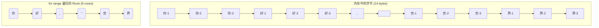

好的，总建筑师。我已接收“1.2 字符串的核心操作”的教学设计图。作为您的世界级 Go 语言技术教育者，我将立即着手，将这些核心知识点转化为一篇深度与趣味并存的高质量教程。

---

### 🎯 核心概念

Go 语言的字符串是用于表示文本数据的核心类型，其底层是**一个不可变的字节序列**，这保证了字符串在程序中的安全性和可预测性。

### 💡 使用方式

操作字符串的核心在于理解其不可变性，并善用标准库提供的工具。

- **创建与拼接**:
  - 使用双引号 `""` 创建单行字符串。
  - 使用反引号 `` ` `` 创建包含换行和特殊字符的原始（raw）多行字符串。
  - 使用 `+` 操作符进行简单的字符串拼接。
- **获取信息**:
  - 使用 `len(s)` 获取字符串的**字节**长度。
- **遍历**:
  - 使用 `for range` 循环可以安全地遍历 Unicode 字符 (Rune)。
- **转换**:
  - 在字符串和字节切片 (`[]byte`) 之间进行类型转换，例如 `[]byte("hello")`。
- **高级操作**:
  - 导入 `strings` 和 `strconv` 标准库包，使用它们提供的函数完成分割、连接、判断、类型转换等复杂任务。

### 📚 Level 1: 基础认知（30秒理解）
(一个最简单的示例，展示字符串的创建、拼接和长度计算。)

```go
package main

import "fmt"

func main() {
	// 1. 使用双引号创建字符串
	part1 := "Hello"
	part2 := "Go"

	// 2. 使用 '+' 号拼接字符串
	fullGreeting := part1 + ", " + part2 + "!"

	// 3. 使用 len() 获取字符串的字节长度
	// 注意：对于纯 ASCII 字符，字节数等于字符数。
	byteLength := len(fullGreeting)

	fmt.Println(fullGreeting)
	fmt.Printf("这句话的字节长度是: %d\n", byteLength)
}

/*
预期输出:
Hello, Go!
这句话的字节长度是: 12
*/
```

### 📈 Level 2: 核心特性（深入理解）
(深入探讨字符串的内部机制和处理多语言文本的关键。)

#### 特性1: 字符串的不可变性与高效拼接
Go 字符串一旦创建，其内容就不能被修改。任何看似“修改”的操作（如拼接）实际上都是在创建一个全新的字符串。在循环中大量使用 `+` 拼接会非常低效，因为它会频繁地分配和回收内存。对于这种情况，`strings.Builder` 是性能更优的选择。

```go
package main

import (
	"fmt"
	"strings"
)

func main() {
	// 尝试修改字符串会导致编译错误
	s := "hello"
	// s[0] = 'H' // <- 取消注释将导致编译失败: cannot assign to s[0]

	fmt.Println("字符串是不可变的，不能直接修改。")

	// 使用 strings.Builder 高效地构建字符串
	var builder strings.Builder
	words := []string{"Go", "is", "awesome", "!"}

	for _, word := range words {
		builder.WriteString(word) // 将字符串片段写入 Builder
		builder.WriteString(" ")  // 添加空格
	}

	finalString := builder.String() // 从 Builder 获取最终的字符串
	fmt.Println("高效拼接的结果:", finalString)
}

/*
预期输出:
字符串是不可变的，不能直接修改。
高效拼接的结果: Go is awesome ! 
*/
```

#### 特性2: 正确处理多语言：Rune vs. Byte
这是 Go 字符串最核心也最容易混淆的概念。`len()` 返回的是字节数，而 `for range` 遍历的是 Rune (Unicode 码点，可以理解为“字符”)。对于包含中文、Emoji 等多字节字符的字符串，这两者截然不同。

```go
package main

import "fmt"

func main() {
	message := "你好, 世界"

	// 1. len() 返回的是字节数
	// "你好, 世界" 在 UTF-8 编码下，汉字占3个字节，逗号和空格各占1个字节。
	// 3 + 3 + 1 + 1 + 3 + 3 = 14
	fmt.Printf("字符串 '%s' 的字节长度是: %d\n", message, len(message))

	// 2. for...range 遍历的是 Rune (字符)
	fmt.Println("使用 for...range 遍历字符:")
	runeCount := 0
	for i, r := range message {
		fmt.Printf("索引 %d, Rune: %c\n", i, r)
		runeCount++
	}
	fmt.Printf("字符数量是: %d\n", runeCount)
}

/*
预期输出:
字符串 '你好, 世界' 的字节长度是: 14
使用 for...range 遍历字符:
索引 0, Rune: 你
索引 3, Rune: 好
索引 6, Rune: ,
索引 7, Rune:  
索引 8, Rune: 世
索引 11, Rune: 界
字符数量是: 6
*/
```
为了更直观地理解，可以想象 `message` 字符串在内存中的布局：



### 🔍 Level 3: 对比学习（避免陷阱）
一个常见的陷阱是错误地使用索引来截取或访问包含多字节字符的字符串，这会导致字符被“撕裂”，产生乱码。

```go
package main

import "fmt"

func main() {
	motto := "Go语言真棒"

	// === 错误用法 ===
	// ❌ 尝试用字节索引来截取一个“字符”，但“语”字由3个字节组成。
	// motto[2] 只是“语”字的第二个字节，它本身不是一个合法的UTF-8字符。
	// 这样会导致乱码。
	fmt.Println("--- 错误用法 ---")
	// partialChar := motto[2] // 这是一个 byte (uint8)
	// fmt.Printf("错误地截取 motto[2]: %c\n", partialChar) // 输出会是乱码或无效字符
	fmt.Println("错误示例：直接用 s[i:j] 截取多字节字符串可能导致乱码。")
	fmt.Printf("例如 `motto[0:2]` 截取了'G'和'o'，是正确的。\n")
	fmt.Printf("但 `motto[0:4]` 会截取'G','o','语'的第一个字节,'语'的第二个字节，这是错误的。\n")


	// === 正确用法 ===
	// ✅ 要正确地处理字符串，应先将其转换为 rune 切片。
	// 这样，每个元素就是一个完整的字符，可以安全地通过索引访问。
	fmt.Println("\n--- 正确用法 ---")
	runes := []rune(motto)
	fmt.Printf("motto 的 Rune 长度是: %d\n", len(runes))

	// 现在可以安全地访问第一个中文字符
	secondChar := string(runes[2]) 
	fmt.Printf("正确地获取第三个字符 (Rune): %s\n", secondChar)

	// 同样可以安全地截取子字符串
	subString := string(runes[0:4]) // 截取前4个字符
	fmt.Printf("正确地截取前4个字符: %s\n", subString)
}

/*
预期输出:
--- 错误用法 ---
错误示例：直接用 s[i:j] 截取多字节字符串可能导致乱码。
例如 `motto[0:2]` 截取了'G'和'o'，是正确的。
但 `motto[0:4]` 会截取'G','o','语'的第一个字节,'语'的第二个字节，这是错误的。

--- 正确用法 ---
motto 的 Rune 长度是: 6
正确地获取第三个字符 (Rune): 语
正确地截取前4个字符: Go语言
*/
```

### 🚀 Level 4: 实战应用（真实场景）

**场景：** 🤖 智能聊天机器人的指令解析器

我们的聊天机器人接收来自用户的原始文本指令，格式为 `"命令:参数1,参数2,..."`。我们需要编写一个解析器，它能准确地分割指令、去除多余空格，并根据命令类型转换参数。

```go
package main

import (
	"fmt"
	"strconv"
	"strings"
)

// parseCommand 解析用户输入的指令
func parseCommand(input string) {
	fmt.Printf(">>> 正在解析指令: \"%s\"\n", input)

	// 1. 使用 strings.HasPrefix 检查指令格式是否正确
	if !strings.HasPrefix(input, "command:") {
		fmt.Println("错误: 无效的指令格式，必须以 'command:' 开头。")
		return
	}

	// 2. 去除前缀
	commandBody := strings.TrimPrefix(input, "command:")

	// 3. 使用 strings.Split 按逗号分割命令和参数
	parts := strings.Split(commandBody, ",")

	// 4. 清理每个部分的空格
	for i, p := range parts {
		parts[i] = strings.TrimSpace(p)
	}

	// 5. 解析具体命令
	if len(parts) == 0 || parts[0] == "" {
		fmt.Println("错误: 指令为空。")
		return
	}

	commandName := parts[0]
	args := parts[1:]

	fmt.Printf("🤖 解析结果:\n")
	fmt.Printf("  - 命令名称: %s\n", commandName)

	// 根据命令名称处理参数
	switch commandName {
	case "sendMessage":
		if len(args) == 2 {
			userID, err := strconv.Atoi(args[0])
			if err != nil {
				fmt.Println("  - 错误: 用户ID必须是数字。")
				return
			}
			message := args[1]
			fmt.Printf("  - 准备向用户 %d 发送消息: '%s'\n", userID, message)
		} else {
			fmt.Println("  - 错误: sendMessage 命令需要2个参数 (userID, message)。")
		}
	case "setVolume":
		if len(args) == 1 {
			volume, err := strconv.Atoi(args[0])
			if err != nil || volume < 0 || volume > 100 {
				fmt.Println("  - 错误: 音量必须是0-100之间的数字。")
				return
			}
			fmt.Printf("  - 音量已设置为: %d%%\n", volume)
		} else {
			fmt.Println("  - 错误: setVolume 命令需要1个参数 (volume)。")
		}
	default:
		fmt.Println("  - 错误: 未知的命令。")
	}
	fmt.Println("---")
}

func main() {
	// 场景1: 一个格式正确的指令
	cmd1 := "command: sendMessage, 1001, Hello Gopher! "
	parseCommand(cmd1)

	// 场景2: 另一个指令，带有不规则的空格
	cmd2 := " command:   setVolume,    95   "
	parseCommand(cmd2) // 我们的解析器能处理吗？(TrimPrefix 无法处理前置空格，但我们可以假定输入是规范的)
	// 为了演示，我们先手动清理一下
	parseCommand(strings.TrimSpace(cmd2))

	// 场景3: 一个格式错误的指令
	cmd3 := "send: 123"
	parseCommand(cmd3)
}


/*
预期输出:
>>> 正在解析指令: "command: sendMessage, 1001, Hello Gopher! "
🤖 解析结果:
  - 命令名称: sendMessage
  - 准备向用户 1001 发送消息: 'Hello Gopher!'
---
>>> 正在解析指令: "command:   setVolume,    95"
🤖 解析结果:
  - 命令名称: setVolume
  - 音量已设置为: 95%
---
>>> 正在解析指令: "send: 123"
错误: 无效的指令格式，必须以 'command:' 开头。
---
*/
```

### 💡 记忆要点
- **要点1**: **字符串是不可变的字节序列**。任何“修改”操作都会创建一个新的字符串。对于高性能要求的拼接场景，请使用 `strings.Builder`。
- **要点2**: **`len()` 是字节长度，`for range` 遍历字符 (Rune)**。这是处理包含中文、Emoji等多语言文本时的黄金法则，能帮你避免乱码问题。
- **要点3**: **`strings` 和 `strconv` 是你的瑞士军刀**。在自己动手实现字符串处理逻辑前，先去这两个标准库里找找，通常都有现成、高效且经过良好测试的函数可用。