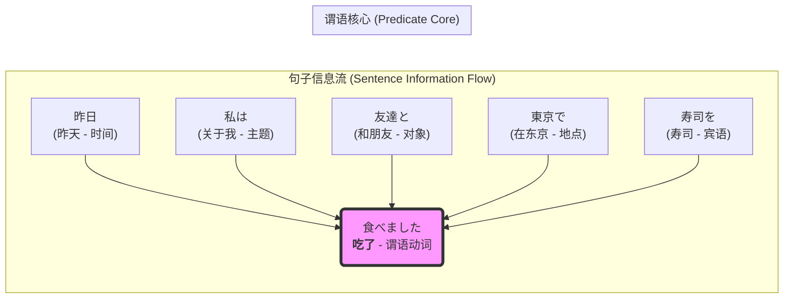

---

### **第一章：句子的蓝图 —— 如何搭建日语的基本骨架？**

#### **1.1 核心引擎：动词与句子的终点**

你好，未来的日语探索者。

欢迎来到这趟旅程的起点。在我们学习如何说、如何写、如何理解任何一句具体的日语之前，我们必须先做一件更重要的事情：**理解日语这门语言是如何“思考”的**。

许多初学者，尤其是以英语或其他SVO（主-谓-宾）语序为母语的人，在接触日语时，会立刻感受到一种强烈的“错位感”。句子似乎是“倒着说”的。例如，“我吃寿司”这句再简单不过的话，在日语中是「私は寿司を食べる。」（watashi wa sushi o taberu），直译过来便是“我 寿司 吃”。这种语序上的颠倒，常常被视为一个需要死记硬背的“规则”。

但今天，我希望你彻底抛弃“死记硬背”这个念头。因为这并非一个孤立的规则，而是通往日语世界底层逻辑的一扇大门。它背后隐藏着一种与SVO语言截然不同的信息组织哲学。理解了它，你就掌握了解锁整个日语语法的“第一性原理”（First Principle）。

***

##### **第一性原理：谓语中心——一场精心策划的“压轴大戏”**

让我们先忘掉“主语”、“宾语”这些术语，用一个更生动的比喻来思考。

想象一下，你正在观看一场精彩的侦探电影。电影从头到尾，不断地抛出线索：一个神秘的电话、一枚遗落的袖扣、一段模棱两可的证词……所有的信息碎片都在不断地积累、铺垫，你的大脑在紧张地处理着“谁（Who）”、“在哪里（Where）”、“对什么（What）”、“和谁一起（With whom）”、“用什么方式（How）”这些信息。你的好奇心和紧张感被推向了顶点。直到电影的最后一刻，侦探站在所有人面前，说出那个决定性的词：“犯人……就是你！”——这个最终的“行为”（Action）或“判断”（Judgement）一经揭晓，前面所有看似凌乱的线索瞬间被串联起来，整个故事的意义豁然开朗。

**日语的句子，就是这样一场精心策划的“压轴大戏”。**

它的核心设计哲学是**谓语中心主义**。这里的“谓语”，在初级阶段，你可以将其主要理解为**动词**（做了什么）或**形容词/名词+です**（是什么/怎么样）。在日语中，谓语是句子的绝对核心，是意义的最终归宿，是整场大戏的“压轴表演”。句子中的所有其他成分——主语、宾语、时间、地点、方式等等——都不过是为这个最终的“压轴表演”提供背景、舞台和道具的“线索”。

它们逐一登场，为你描绘出一幅越来越清晰的画面，但直到谓语这个“核心引擎”在句末出现之前，整个句子的性质（是肯定还是否定？是过去还是现在？是陈述还是疑问？）都是悬而未决的。

这种结构，我们称之为**SOV（主-宾-谓）语序**。

***

##### **核心结构：SVO vs. SOV —— 两种截然不同的叙事蓝图**

现在，让我们回到那个熟悉的例子，并将其与英语的SVO（主-谓-宾）结构进行一次深入的“蓝图对比”。

**英语 (SVO - Subject-Verb-Object): "I eat sushi."**

这个蓝图的特点是“开门见山”。

1.  **S (Subject - I):** 首先确立行动的主体——“我”。
2.  **V (Verb - eat):** 紧接着，毫不迟疑地抛出核心动作——“吃”。在句子的极早期，我们就知道了整个事件的核心性质。
3.  **O (Object - sushi):** 最后，补充这个动作所作用的对象——“寿司”。

SVO的思维模式是线性的、主动的，它优先回答“**谁做了什么？**”。就像一个高效的报告，先说结论，再补充细节。信息流是：**行动者 → 行为 → 行为对象**。

**日语 (SOV - Subject-Object-Verb): 「私は寿司を食べる。」** (watashi wa sushi o taberu)

这个蓝图的特点是“层层铺垫，最后揭晓”。

1.  **S (Subject - 私):** 同样，我们先引入一个话题或主体——“关于我”。（这里的助词「は」我们稍后会深入，现在先理解为它标记了句子谈论的“主题”）。
2.  **O (Object - 寿司):** 接下来，我们引入了动作将要涉及的对象——“寿司”。（助词「を」精确地标记出“寿司”是后续动作的直接承受者）。
3.  **V (Verb - 食べる):** 最后，在所有铺垫完成之后，谓语动词“吃”登场，为整个句子画上句号，赋予其最终的意义。

SOV的思维模式是归纳的、描述性的，它优先回答“**关于某个主题，发生了什么事？**”。它更像是在描绘一幅场景，先把场景中的元素（人、物）一一摆放好，最后才点明这些元素之间发生了什么互动。信息流是：**场景/主题设定 → 场景内元素 → 最终发生的事件**。

| 结构对比 | 英语 (SVO) | 日语 (SOV) |
| :--- | :--- | :--- |
| **蓝图** | 行动者 → 行为 → 对象 | 主题 → 对象 → 行为 |
| **思维焦点** | 谁**做了**什么？ (Actor-centric) | 关于谁，**发生了**什么事？ (Event-centric) |
| **信息节奏** | 快速揭晓核心动作 | 将核心动作保留到最后 |
| **例子** | I **eat** sushi. | 私は寿司を**食べる**。 |

这个结构差异并非偶然，它深刻地影响了两种语言的表达习惯和思维方式。

***

##### **思维模式转变：从“主动执行”到“事件描述”**

要真正内化SOV结构，你需要进行一次关键的思维模式转变。这不仅仅是调整词语的顺序，而是改变你看待和描述事件的视角。

**SVO视角：** 我 (主语) → [执行动作] → 吃 (谓语) → [作用于] → 寿司 (宾语)。
这是一个以“我”为绝对中心，向外辐射出动作的视角。它强调的是“我”的主动性和控制力。

**SOV视角：** 私は (关于我这个主题) → 寿司を (以寿司为对象) → 食べる (吃的这个行为发生了)。
这是一个更为客观、更为宏观的视角。它首先设定一个“关于我”的场景，然后在这个场景里，补充一个名为“寿司”的元素，最后陈述在这个场景中发生的事件是“吃”。

这种转变，从“**谁做了什么**”到“**关于谁，发生了什么事**”，看似微妙，却至关重要。它解释了为什么在日语中，主语（特别是“我”和“你”）经常被省略。因为如果谈话的语境已经明确了是在说“关于我”的事情，那么「私は」这个“舞台布景”就无需再次搭建，直接摆上道具、上演好戏即可。例如，朋友问你午饭吃了什么，你完全可以直接回答：「寿司を食べた。」（吃了寿司。）——因为“关于我”这个主题已经是双方的共识。

这种“事件中心”的思维模式，也为你未来理解日语中最著名的一对“冤家”——助词「は」(wa) 和「が」(ga)——埋下了至关重要的伏笔。简单来说，「は」倾向于设定一个场景或主题（“关于……”），而「が」则倾向于指出这个场景中某个新信息或具体执行者。这个话题我们将在后续章节中用一整节课的时间来攻克，但请记住，这一切的根源，都始于我们今天建立的这个“谓语中心”的第一性原理。

***

##### **可视化结构：百川归海——所有信息最终汇入“谓语”**

为了让你更直观地感受这种“万流归宗”的句子结构，让我们用一个流程图来描绘一个更复杂的日语句子是如何构建的。

想象一下，句子的谓语（动词）是浩瀚的大海，是所有信息的最终归宿。而句子中的其他成分，如时间、地点、人物、工具等，则是从四面八方奔流而来的江河。它们各自携带者特定的信息，由“助词”这个“河道标记”指引着方向，但无论它们在句中的位置如何变换（日语语序相对自由），它们的终点只有一个——句末的谓语动词。

**例句：**
「昨日、私は友達と東京で寿司を食べました。」
(kinō, watashi wa tomodachi to tōkyō de sushi o tabemashita.)
(昨天，我和朋友在东京吃了寿司。)

这个句子的信息流可以被可视化为：

**图解分析：**

1.  **五条支流 (Five Tributaries):**
    *   `昨日` (kinō): 时间信息，像一条标记着“昨天”的河流。
    *   `私は` (watashi wa): 主题信息，“关于我”这条主干河流。
    *   `友達と` (tomodachi to): 伴随者信息，“和朋友”这条河流。
    *   `東京で` (tōkyō de): 地点信息，“在东京”这条河流。
    *   `寿司を` (sushi o): 对象信息，“寿司”这条河流。

2.  **助词 (Particles):** 请注意 `は (wa)`, `と (to)`, `で (de)`, `を (o)` 这些小小的“尾巴”。它们就是我们之前提到的“河道标记”，精确地定义了每一条河流所携带的信息类型。它们是日语的灵魂，我们将在下一节课详细解构它们。

3.  **百川归海 (Converging to the Sea):** 所有的这些信息支流，无论其内部顺序如何（例如，`昨日`可以放在`私`后面），最终都必须汇入`食べました`（吃了）这个“大海”。这个动词不仅揭示了核心动作“吃”，它词尾的`ました` (mashita) 还同时承载了另外两个至关重要的信息：**过去时态**和**礼貌体**。

这个“百川归海”的模型揭示了日语的两个强大特性：

*   **语序的相对自由性：** 只要每个信息块（如`友達と`）和它的助词绑定在一起，这些“信息包”在动词之前的位置可以相对灵活地调换，而不影响基本含义。这为表达的语气和强调重点提供了丰富的可能性。例如，`昨日、私は友達と東京で寿司を食べました。` 与 `私は昨日、友達と東京で寿司を食べました。` 都是完全正确的句子，它们传达了相同的基础含义，仅在语流或强调重点上可能存在细微差异。
*   **信息的终点决定性：** 在听到`食べました`之前，你无法确定这件事是发生在过去、现在还是将来，也无法确定说话者是对你表示尊敬还是随意。所有的悬念都保留到了最后一刻。这要求听者必须保持耐心和专注，直到句子的终点。

***

##### **结论与展望：从“规则”到“世界观”**

今天，我们没有学习任何具体的单词或复杂的语法点。相反，我们做了一件更根本的事情：我们校准了我们的“世界观”。

我们确立了日语世界的第一性原理——**谓语中心主义**。在这个世界里，句子不是由主语驱动的线性叙事，而是一场所有线索都指向最终揭秘的、精心布局的戏剧。动词，这个句子的核心引擎，被战略性地放置在终点，如同火车末尾的动力车厢，推动着前面所有的信息车厢，共同抵达意义的终点站。

**要点回顾：**

*   **第一性原理：** 日语是“谓语中心”的语言。所有句子成分都为句末的谓语服务，而这个谓语（通常是动词、形容词或名词+です）决定了整句话的最终性质。
*   **核心结构：** 日语采用SOV（主-宾-谓）语序，与英语的SVO（主-谓-宾）形成鲜明对比。
*   **思维模式转变：** 从“谁做了什么”的行动者视角，转向“关于某事，发生了什么”的事件描述视角。
*   **可视化模型：** 日语句子如“百川归海”，所有信息成分（由助词标记）最终汇入句末的谓语动词。

现在，请带着这个全新的视角，思考一个问题：

如果说，动词是最终的“大戏”，那么连接各个“线索”（名词、代词等）与这场大戏的“逻辑链条”是什么？那些附着在名词后面的`は`、`を`、`で`、`と`，这些被称为“助词”的小小零件，它们究竟扮演着怎样至关重要的角色？它们是如何像精密的连接器一样，将句子的骨架严丝合缝地搭建起来的？

这，就是我们下一堂课将要探索的奇妙世界——**助词的宇宙**。准备好，我们将从句子的蓝图，深入到它的“钢筋骨架”。